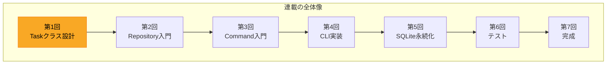
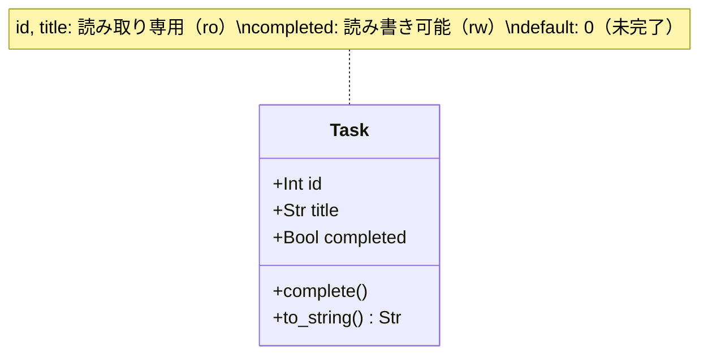

[@nqounet](https://x.com/nqounet)です。

新シリーズ「シンプルなTodo CLIアプリ」が始まります！

## 新シリーズのはじまり

全7回の連載で、実用的なTodo CLIアプリを作りながらデザインパターンを学んでいきます。



このシリーズで扱う主なトピックは以下のとおりです。

- Taskクラスの設計（今回）
- Repositoryパターン（データの永続化を抽象化）
- Commandパターン（操作のオブジェクト化）
- `Getopt::Long`を使ったCLIインターフェース
- SQLiteへの永続化

対象読者は、Perl入学式を卒業した程度の方、または前シリーズ「Mooで覚えるオブジェクト指向プログラミング」を読了した方を想定しています。

## 前シリーズの振り返りと本シリーズの位置づけ

### 前シリーズで学んだこと

前シリーズ「Mooで覚えるオブジェクト指向プログラミング」では、オブジェクト指向の基礎を掲示板アプリを題材に学んできました。



主に学んだ概念を振り返ってみましょう。

- `has`と`sub`でデータとロジックをまとめる
- `is => 'ro'`と`is => 'rw'`で読み書きを制御する
- `required`と`default`で必須・初期値を設定する
- `Moo::Role`と`with`でロールを活用する
- `handles`で委譲を行う
- `isa`と`Types::Standard`で型制約を設定する

特に最終回では、型制約を使ってバグを未然に防ぐ方法を学びました。



### 本シリーズで学ぶこと

本シリーズでは、前シリーズで学んだOOPの基礎を「実践」に活かします。題材を掲示板からTodo CLIアプリに変え、以下のデザインパターンを新たに学びます。

- **Repositoryパターン**: データの永続化を抽象化し、テスト可能な設計を実現する
- **Commandパターン**: 操作（add, list, done, delete）をオブジェクトとして扱い、拡張性を高める

これらのパターンを使うことで、保守しやすく、テストしやすいアプリケーションを構築できるようになります。

## Todoアプリの要件を整理しよう

### 必要な機能を洗い出す

Todoアプリに必要な基本操作を整理してみましょう。

- **add**: タスクを追加する
- **list**: タスクの一覧を表示する
- **done**: タスクを完了にする
- **delete**: タスクを削除する

これらの操作は、後の回でCommandパターンを使って実装します。今回はまず、操作の対象となる「タスク」そのものを定義することに集中しましょう。

### タスクが持つべきデータを考える

タスクにはどのような情報が必要でしょうか。シンプルに保つため、今回は3つの属性に絞ります。

- **id**: タスクを一意に識別するID（整数）
- **title**: タスクの内容（何をするか）
- **completed**: 完了したかどうか（真偽値）

将来的には期限や優先度を追加することもできますが、まずはシンプルに始めましょう。

## なぜオブジェクト指向で作るのか

### 手続き型で書いた場合の問題点

もしオブジェクト指向を使わずに、ハッシュの配列でタスクを管理するとどうなるでしょうか。

```perl
# ハッシュの配列でタスクを管理する例
my @tasks = (
    { id => 1, title => '買い物', completed => 0 },
    { id => 2, title => '掃除',   completed => 0 },
);

# 完了処理
$tasks[0]->{completed} = 1;

# 表示処理
for my $task (@tasks) {
    my $mark = $task->{completed} ? 'x' : ' ';
    print "[$mark] $task->{id}: $task->{title}\n";
}
```

このアプローチには以下の問題があります。

- 完了処理があちこちに散らばり、変更時の影響範囲が広い
- タスクの表示形式を変えたいときに、すべての表示箇所を修正する必要がある
- ハッシュのキー名を間違えてもエラーにならず、バグの原因になりやすい
- 単体テストがしづらい

### クラスにまとめるメリット

タスクをクラスとして定義することで、これらの問題を解決できます。

- データ（属性）とロジック（メソッド）が1箇所にまとまる
- 変更の影響範囲がクラス内に限定される
- 型制約でバグを未然に防げる
- クラス単位でテストできる

前シリーズで学んだ「データとロジックをまとめる」という考え方を、ここでも活かしていきましょう。

## Taskクラスを設計する

Taskクラスの全体像を先に確認しておきましょう。以下のクラス図は、今回設計するTaskクラスの属性とメソッドを示しています。



### 属性を定義する（id, title, completed）

それでは、Taskクラスの属性を設計していきます。

**id属性**:
- 読み取り専用（`is => 'ro'`）: 一度設定したら変更しない
- 必須（`required => 1`）: タスク作成時に必ず指定する
- 整数型（`isa => Int`）: 数値以外を拒否する

**title属性**:
- 読み取り専用（`is => 'ro'`）: タスクの内容は変更しない設計
- 必須（`required => 1`）: 内容のないタスクは無意味
- 文字列型（`isa => Str`）: 文字列のみを許可する

**completed属性**:
- 読み書き可能（`is => 'rw'`）: 完了状態は変更する
- デフォルト値0（`default => 0`）: 新規タスクは未完了
- 真偽値型（`isa => Bool`）: 0か1のみを許可する

前シリーズ第12回で学んだ型制約を活用して、不正な値の混入を防ぎます。

### コード例1: Taskクラスの実装

```perl
# Perl 5.36+, Moo 2.005+, Types::Standard 2.000+
# 依存: Moo, Types::Standard
package Task {
    use Moo;
    use Types::Standard qw(Int Str Bool);

    has id => (
        is       => 'ro',
        isa      => Int,
        required => 1,
    );

    has title => (
        is       => 'ro',
        isa      => Str,
        required => 1,
    );

    has completed => (
        is      => 'rw',
        isa     => Bool,
        default => 0,
    );
};
```

これで基本的なTaskクラスができました。

## Taskクラスにメソッドを追加する

### completeメソッドの実装

タスクを完了状態にするメソッドを追加しましょう。

```perl
sub complete {
    my $self = shift;
    $self->completed(1);
}
```

「セッターを直接呼び出せばいいのでは？」と思うかもしれません。しかし、メソッドにすることで以下のメリットがあります。

- 意図が明確になる（「完了にする」という操作であることが分かる）
- 将来の拡張が容易になる（完了時にログを出力する、通知を送るなど）

### to_stringメソッドの実装

タスクを文字列として表示するメソッドも追加します。

```perl
sub to_string {
    my $self = shift;
    my $mark = $self->completed ? 'x' : ' ';
    return sprintf "[%s] %d: %s", $mark, $self->id, $self->title;
}
```

完了状態に応じて「[x]」または「[ ]」を表示し、IDとタイトルを続けます。

### コード例2: メソッドを追加したTaskクラス

```perl
# Perl 5.36+, Moo 2.005+, Types::Standard 2.000+
# 依存: Moo, Types::Standard
package Task {
    use Moo;
    use Types::Standard qw(Int Str Bool);

    has id => (
        is       => 'ro',
        isa      => Int,
        required => 1,
    );

    has title => (
        is       => 'ro',
        isa      => Str,
        required => 1,
    );

    has completed => (
        is      => 'rw',
        isa     => Bool,
        default => 0,
    );

    sub complete {
        my $self = shift;
        $self->completed(1);
    }

    sub to_string {
        my $self = shift;
        my $mark = $self->completed ? 'x' : ' ';
        return sprintf "[%s] %d: %s", $mark, $self->id, $self->title;
    }
};

# 使用例
my $task = Task->new(id => 1, title => '買い物');
print $task->to_string . "\n";  # [ ] 1: 買い物
$task->complete;
print $task->to_string . "\n";  # [x] 1: 買い物
```

実行すると、以下のように表示されます。

```
[ ] 1: 買い物
[x] 1: 買い物
```

タスクを作成し、完了状態に変更できることが確認できました。

## まとめ

今回学んだことを振り返りましょう。

- Todoアプリの要件を整理し、必要な機能（add, list, done, delete）を洗い出した
- タスクが持つべきデータ（id, title, completed）を定義した
- 手続き型とオブジェクト指向の違いを確認し、クラス化のメリットを理解した
- Mooを使ってTaskクラスを設計・実装した
- `complete`メソッドと`to_string`メソッドを追加した

前シリーズで学んだ「データとロジックをまとめる」という考え方を、新しいアプリケーションで実践できました。

## 次回予告

次回は「Repositoryパターン入門」です。

今回作成したTaskを、どうやって保存・取得すればよいでしょうか？ファイルに書き込む？データベースに保存する？

「なぜ永続化を抽象化する必要があるのか」という問いから始めて、Repositoryパターンの考え方を学んでいきます。テスト可能な設計への第一歩をお楽しみに！
