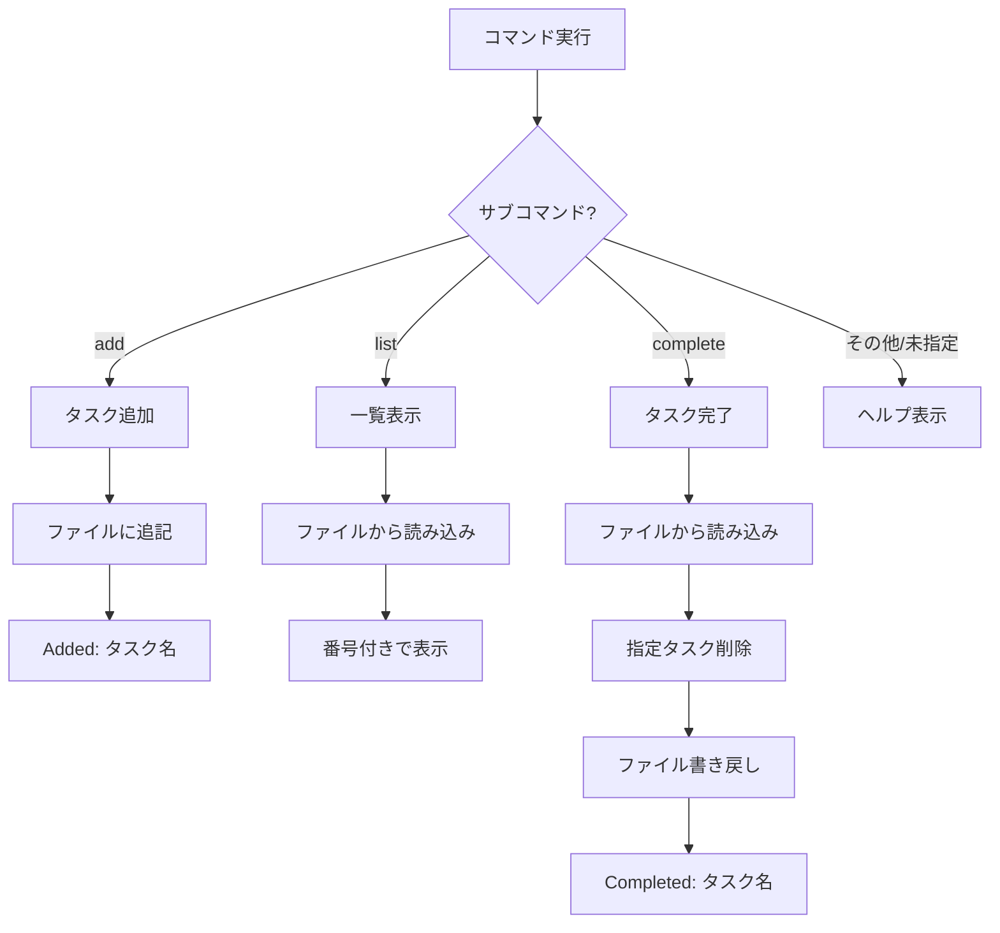

[@nqounet](https://x.com/nqounet)です。

新シリーズ「シンプルなTodo CLIアプリ」の第1回です。

## はじめに - Mooの次は実践アプリを作ろう

「Mooで覚えるオブジェクト指向プログラミング」シリーズを終えた方、お疲れ様でした！



Mooの基礎を身につけた今、次のステップとして実践的なアプリケーション開発に挑戦してみましょう。

このシリーズでは、Todo CLIアプリの開発を通じて、設計の考え方を学んでいきます。最初は素朴なコードから始め、徐々に改善を加えていくことで「なぜそうするのか」を体感できるようにします。

第1回の目標は、if-elsif分岐で動作する最もシンプルなTodo CLIアプリを作成することです。まずは動くものを作り、その限界を確認しましょう。

## 今回作るもの - 3つのコマンドを持つTodo CLI

### 完成イメージ

まず、今回作成するCLIアプリの処理フローを確認しましょう。



この図は、Todo CLIの処理フローを示しています。`@ARGV`からサブコマンドを取得し、if-elsif分岐で適切な処理に振り分けます。各処理は最終的にファイル操作を行い、結果をユーザーに表示します。

今回作るTodo CLIは、以下の3つのサブコマンドを持ちます。

```bash
$ perl todo.pl add "牛乳を買う"
Added: 牛乳を買う

$ perl todo.pl list
1. 牛乳を買う
2. メールを返信する

$ perl todo.pl complete 1
Completed: 牛乳を買う
```

- `todo add "タスク名"` でタスクを追加
- `todo list` でタスク一覧を表示
- `todo complete 番号` でタスクを完了（削除）

### 最小限の機能で始める

最初から完璧なものを目指す必要はありません。今回は「動くこと」を最優先にします。

- エラー処理は最小限
- 拡張性は考慮しない
- 1ファイルで完結

「なぜ改善が必要か」を後の回で実感するために、あえてシンプルに作ります。

## 環境の準備

### 必要なもの

- Perl 5.16以上（`//` 演算子を使用）
- テキストエディタ
- ターミナル

### ファイル構成

今回は1ファイルで完結します。

```
todo.pl     # メインスクリプト
todo.txt    # タスクの保存先（自動生成）
```

作業ディレクトリに `todo.pl` を作成してください。

## コマンドライン引数を受け取る

### @ARGVとは

Perlでは、コマンドライン引数は特殊変数 `@ARGV` に格納されます。

```bash
$ perl todo.pl add "牛乳を買う"
```

このコマンドを実行すると、`@ARGV` には以下の値が入ります。

```perl
@ARGV = ('add', '牛乳を買う');
```

- `$ARGV[0]` は `'add'`（サブコマンド）
- `$ARGV[1]` は `'牛乳を買う'`（引数）

### サブコマンドを取り出す

`shift` 関数を使って、`@ARGV` の先頭要素を取り出します。

```perl
my $command = shift @ARGV;  # 'add' を取得、@ARGVは ('牛乳を買う') になる
```

`shift` は配列の先頭要素を取り出し、配列から削除します。これにより、残りの `@ARGV` には追加の引数だけが残ります。

## if-elsif分岐でサブコマンドを実装する

### 基本構造

サブコマンドに応じて処理を分岐させます。

```perl
#!/usr/bin/env perl
use strict;
use warnings;
use utf8;

my $command = shift @ARGV // 'help';

if ($command eq 'add') {
    # タスク追加の処理
}
elsif ($command eq 'list') {
    # 一覧表示の処理
}
elsif ($command eq 'complete') {
    # 完了処理
}
else {
    # ヘルプ表示
}
```

`//` 演算子は「左辺が未定義ならば右辺を使う」という意味です。引数がない場合は `'help'` がデフォルトになります。

### なぜif-elsifから始めるのか

if-elsif分岐は最もシンプルで理解しやすい方法です。Perlを学んだばかりの方でもすぐに読めるでしょう。

しかし、この方法には問題もあります。それは後の回で体感しますが、今回はまず「動くもの」を作ることを優先します。

## 配列でタスクを管理する

### タスクの保存と読み込み

タスクはテキストファイルに1行1タスクで保存します。

```
牛乳を買う
メールを返信する
報告書を書く
```

プログラム起動時にファイルを読み込み、終了時に書き戻す方式です。

### ファイル操作の基本

Perlでファイルを操作するには `open` 関数を使います。

```perl
# 読み込みモード
open my $fh, '<', 'todo.txt' or die "Cannot open: $!";
my @lines = <$fh>;  # 全行を配列に読み込む
close $fh;

# 書き込みモード（上書き）
open my $fh, '>', 'todo.txt' or die "Cannot open: $!";
print $fh "内容\n";
close $fh;

# 追記モード
open my $fh, '>>', 'todo.txt' or die "Cannot open: $!";
print $fh "追加する行\n";
close $fh;
```

- `<` は読み込みモード
- `>` は書き込みモード（既存内容を上書き）
- `>>` は追記モード（既存内容の末尾に追加）

`$!` にはエラーメッセージが格納されます。

## add - タスクを追加する

### 引数からタスク内容を取得

サブコマンド `add` の後に続く引数がタスク内容です。

```perl
if ($command eq 'add') {
    my $task = shift @ARGV;
    die "Usage: $0 add <task>\n" unless defined $task && $task ne '';
    
    # 追加処理...
}
```

- `shift @ARGV` でタスク文字列を取得
- 空文字や未定義の場合はエラーで終了

### ファイルに追記する

タスクをファイルの末尾に追記します。

```perl
open my $fh, '>>', $file or die "Cannot open $file: $!";
print $fh "$task\n";
close $fh;

print "Added: $task\n";
```

`>>` モードで開くと、既存のタスクを消さずに末尾へ追加できます。

### 動作確認

```bash
$ perl todo.pl add "牛乳を買う"
Added: 牛乳を買う

$ perl todo.pl add "メールを返信する"
Added: メールを返信する

$ cat todo.txt
牛乳を買う
メールを返信する
```

## list - タスク一覧を表示する

### ファイルから読み込む

保存されているタスクを読み込んで表示します。

```perl
elsif ($command eq 'list') {
    unless (-e $file) {
        print "No tasks.\n";
        exit;
    }
    
    open my $fh, '<', $file or die "Cannot open $file: $!";
    my @tasks = <$fh>;
    close $fh;
    
    chomp @tasks;  # 各行の改行を削除
    # 表示処理...
}
```

- `-e $file` はファイルの存在確認
- `<$fh>` でリストコンテキストに置くと全行を配列に読み込む
- `chomp` で各行末の改行を削除

### 番号付きで表示する

ユーザーがタスクを指定しやすいよう、番号を付けて表示します。

```perl
my $i = 1;
for my $task (@tasks) {
    print "$i. $task\n";
    $i++;
}
```

### 動作確認

```bash
$ perl todo.pl list
1. 牛乳を買う
2. メールを返信する
```

## complete - タスクを完了する

### 番号でタスクを指定

完了するタスクは番号で指定します。

```perl
elsif ($command eq 'complete') {
    my $num = shift @ARGV;
    die "Usage: $0 complete <number>\n" unless defined $num && $num =~ /^\d+$/;
    
    # 完了処理...
}
```

- 正規表現 `^\d+$` で数値のみを許可

### 指定したタスクを削除

配列から指定番号のタスクを削除し、ファイルを書き直します。

```perl
open my $fh, '<', $file or die "Cannot open $file: $!";
my @tasks = <$fh>;
close $fh;

chomp @tasks;
my $index = $num - 1;  # 配列は0始まり
die "Task $num not found.\n" if $index < 0 || $index >= @tasks;

my $completed = splice @tasks, $index, 1;  # 指定位置の要素を削除

open $fh, '>', $file or die "Cannot open $file: $!";
print $fh "$_\n" for @tasks;
close $fh;

print "Completed: $completed\n";
```

- `splice @array, $index, 1` は配列から1要素を削除し、その要素を返す
- ファイルを `>` モードで開いて全タスクを書き直す

### 動作確認

```bash
$ perl todo.pl list
1. 牛乳を買う
2. メールを返信する

$ perl todo.pl complete 1
Completed: 牛乳を買う

$ perl todo.pl list
1. メールを返信する
```

## 完成コード - 全体を見てみよう

### todo.pl の全容

約50行のシンプルなスクリプトです。そのままコピーして動作確認できます。

```perl
#!/usr/bin/env perl
use strict;
use warnings;
use utf8;

my $file = 'todo.txt';
my $command = shift @ARGV // 'help';

if ($command eq 'add') {
    my $task = shift @ARGV;
    die "Usage: $0 add <task>\n" unless defined $task && $task ne '';
    
    open my $fh, '>>', $file or die "Cannot open $file: $!";
    print $fh "$task\n";
    close $fh;
    
    print "Added: $task\n";
}
elsif ($command eq 'list') {
    unless (-e $file) {
        print "No tasks.\n";
        exit;
    }
    
    open my $fh, '<', $file or die "Cannot open $file: $!";
    my @tasks = <$fh>;
    close $fh;
    
    chomp @tasks;
    my $i = 1;
    for my $task (@tasks) {
        print "$i. $task\n";
        $i++;
    }
}
elsif ($command eq 'complete') {
    my $num = shift @ARGV;
    die "Usage: $0 complete <number>\n" unless defined $num && $num =~ /^\d+$/;
    
    open my $fh, '<', $file or die "Cannot open $file: $!";
    my @tasks = <$fh>;
    close $fh;
    
    chomp @tasks;
    my $index = $num - 1;
    die "Task $num not found.\n" if $index < 0 || $index >= @tasks;
    
    my $completed = splice @tasks, $index, 1;
    
    open $fh, '>', $file or die "Cannot open $file: $!";
    print $fh "$_\n" for @tasks;
    close $fh;
    
    print "Completed: $completed\n";
}
else {
    print "Usage: $0 <command> [args]\n";
    print "Commands:\n";
    print "  add <task>      - Add a new task\n";
    print "  list            - List all tasks\n";
    print "  complete <num>  - Complete a task by number\n";
}
```

### 動かしてみよう

一連の操作を実行してみましょう。

```bash
$ perl todo.pl
Usage: todo.pl <command> [args]
Commands:
  add <task>      - Add a new task
  list            - List all tasks
  complete <num>  - Complete a task by number

$ perl todo.pl add "牛乳を買う"
Added: 牛乳を買う

$ perl todo.pl add "メールを返信する"
Added: メールを返信する

$ perl todo.pl add "報告書を書く"
Added: 報告書を書く

$ perl todo.pl list
1. 牛乳を買う
2. メールを返信する
3. 報告書を書く

$ perl todo.pl complete 2
Completed: メールを返信する

$ perl todo.pl list
1. 牛乳を買う
2. 報告書を書く
```

## このコードの問題点 - 拡張性の壁

動くTodoアプリが完成しました！しかし、このコードにはいくつかの問題があります。

### コマンドが増えたらどうなる？

新しいコマンド（例: `edit`, `priority`, `search`）を追加するたびに、if-elsif の条件分岐が長大化します。

```perl
if ($command eq 'add') {
    # ...
}
elsif ($command eq 'list') {
    # ...
}
elsif ($command eq 'complete') {
    # ...
}
elsif ($command eq 'edit') {      # 追加
    # ...
}
elsif ($command eq 'priority') {  # 追加
    # ...
}
elsif ($command eq 'search') {    # 追加
    # ...
}
# どんどん長くなる...
```

- 見通しが悪くなる
- 修正箇所が分かりにくくなる
- 同じパターンの繰り返しが増える

### テストが書きにくい

処理がスクリプト直下に直接書かれているため、単体テストが困難です。

- 「add機能だけをテストする」ができない
- ファイル操作と表示処理が混在している
- モック（テスト用の代替）を差し込む余地がない

### コードの重複

ファイル操作のコードが各所に散らばっています。

- `list` でファイルを読み込む処理
- `complete` でファイルを読み込む処理
- ほぼ同じコードが2箇所に存在

これはDRY原則（Don't Repeat Yourself）に反しています。ファイル形式を変更したくなったら、複数箇所を修正しなければなりません。

## 次回予告 - サブルーチンで整理する

今回の問題点を、次回はサブルーチンで解決します。

- 処理をサブルーチンに分割
- ファイル操作を共通化
- テスト可能な構造へ近づける

「動くコード」から「良いコード」への第一歩を踏み出しましょう。

## まとめ

今回は、if-elsif分岐で動くシンプルなTodo CLIを作成しました。

- `@ARGV` からコマンドライン引数を取得する方法を学習
- if-elsif分岐でサブコマンドを振り分け
- テキストファイルでタスクを永続化
- シンプルだが拡張性に課題があることを確認

まずは動くものを作る。その後で改善点を見つけて直していく。これがソフトウェア開発の自然な流れです。

次回は、このコードをサブルーチンで整理していきます。お楽しみに！
