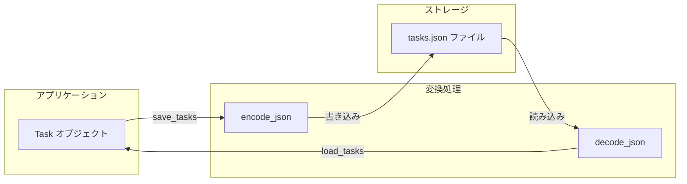

[@nqounet](https://x.com/nqounet)です。

シリーズ「シンプルなTodo CLIアプリ」の第3回です。

## 前回の振り返り

前回は、タスクをクラスにしてオブジェクト指向の力を借りました。

- `Task` クラスを Moo で定義
- `id`, `title`, `is_done` の3つの属性を保持
- `mark_done()` メソッドでタスクを完了状態にする
- タブ区切りのテキストファイルで保存

データと操作がまとまりましたが、保存形式に問題がありました。今回はより堅牢な JSON フォーマットで永続化します。

## タブ区切りの問題点

前回の保存形式を振り返りましょう。

```
1	牛乳を買う	0
2	メールを返信する	1
```

この形式には以下の問題があります。

### タブを含むタスク名に対応できない

タスク名に「買い物リスト（牛乳	卵	パン）」のようにタブが含まれると、正しくパースできません。

### 属性が増えると管理が大変

属性を追加するたびに、順番を覚えておく必要があります。

```
1	牛乳を買う	0	high	2026-01-15
#                   ↑       ↑
#                優先度    期限（新しく追加）
```

どの列が何の属性か分からなくなりがちです。

### 他のプログラムとの連携が難しい

独自形式のため、他のツールやプログラミング言語で読み込むのが面倒です。

## JSONとは

JSON永続化のデータフローを確認しましょう。



この図は、Taskオブジェクトとファイルの間でデータがどのように変換されるかを示しています。`encode_json`でPerlデータ構造をJSON文字列に変換し、`decode_json`でJSON文字列をPerlデータ構造に復元します。

### データ交換のための標準フォーマット

JSON（JavaScript Object Notation）は、データ交換のための軽量なフォーマットです。人間にも読みやすく、多くのプログラミング言語でサポートされています。

```json
{
  "id": 1,
  "title": "牛乳を買う",
  "is_done": false
}
```

- キーと値のペアで構成
- 文字列はダブルクォートで囲む
- 真偽値は `true` / `false`
- 配列は `[ ]` で囲む

### タスクリストのJSON表現

複数のタスクは配列として表現します。

```json
[
  { "id": 1, "title": "牛乳を買う", "is_done": false },
  { "id": 2, "title": "メールを返信する", "is_done": true }
]
```

属性名がデータに含まれているため、順番を気にする必要がありません。

## PerlでJSONを扱う

### JSONモジュール

PerlでJSONを扱うには `JSON` モジュールを使います。

```perl
use JSON;
```

`JSON` モジュールはCPANからインストールできます。

```bash
$ cpanm JSON
```

Perl 5.14以降であれば、Pure Perl実装の `JSON::PP` が標準で付属しています。

```perl
use JSON::PP;  # 標準モジュール
```

今回は広く使われている `JSON` モジュールを使用しますが、`JSON::PP` でも同様に動作します。

### encode_json - Perlデータ構造をJSONに変換

```perl
use JSON;

my $data = {
    id      => 1,
    title   => '牛乳を買う',
    is_done => 0,
};

my $json = encode_json($data);
print $json;
# {"id":1,"title":"牛乳を買う","is_done":0}
```

`encode_json` はPerlのハッシュや配列をJSON文字列に変換します。

### decode_json - JSONをPerlデータ構造に変換

```perl
use JSON;

my $json = '{"id":1,"title":"牛乳を買う","is_done":0}';
my $data = decode_json($json);

print $data->{title};  # 牛乳を買う
```

`decode_json` はJSON文字列をPerlのハッシュリファレンスや配列リファレンスに変換します。

## タスクをJSONで保存する

### 保存処理の実装

Taskオブジェクトの配列をJSONファイルに保存します。

```perl
use JSON;

sub save_tasks {
    my ($file, @tasks) = @_;
    
    my @data = map {
        {
            id      => $_->id,
            title   => $_->title,
            is_done => $_->is_done ? \1 : \0,
        }
    } @tasks;
    
    open my $fh, '>:encoding(UTF-8)', $file or die "Cannot open $file: $!";
    print $fh encode_json(\@data);
    close $fh;
}
```

ポイントを確認しましょう。

### map でオブジェクトをハッシュに変換

```perl
my @data = map {
    {
        id      => $_->id,
        title   => $_->title,
        is_done => $_->is_done ? \1 : \0,
    }
} @tasks;
```

`map` で各Taskオブジェクトをハッシュリファレンスに変換しています。

`is_done` は `\1` または `\0` としています。これはJSONの `true` / `false` に対応するPerlの書き方です。

### UTF-8エンコーディング

```perl
open my $fh, '>:encoding(UTF-8)', $file or die "Cannot open $file: $!";
```

日本語を正しく保存するため、UTF-8エンコーディングを指定しています。

## ファイルからタスクを読み込む

### 読み込み処理の実装

JSONファイルからTaskオブジェクトの配列を復元します。

```perl
use JSON;

sub load_tasks {
    my ($file) = @_;
    my @tasks;
    
    return @tasks unless -e $file;
    
    open my $fh, '<:encoding(UTF-8)', $file or die "Cannot open $file: $!";
    my $json = do { local $/; <$fh> };
    close $fh;
    
    my $data = decode_json($json);
    
    for my $item (@$data) {
        push @tasks, Task->new(
            id      => $item->{id},
            title   => $item->{title},
            is_done => $item->{is_done} ? 1 : 0,
        );
    }
    
    return @tasks;
}
```

### ファイル全体を一度に読み込む

```perl
my $json = do { local $/; <$fh> };
```

この慣用句は「スラープ（一気読み）」と呼ばれます。

- `local $/` で行区切り変数を一時的に未定義にする
- `<$fh>` でファイル全体を1つの文字列として読み込む

JSONは複数行にまたがることがあるため、一括で読み込む必要があります。

### JSONからTaskオブジェクトを生成

```perl
for my $item (@$data) {
    push @tasks, Task->new(
        id      => $item->{id},
        title   => $item->{title},
        is_done => $item->{is_done} ? 1 : 0,
    );
}
```

`decode_json` の結果は配列リファレンスなので、`@$data` でデリファレンスしてループ処理します。各要素はハッシュリファレンスで、Taskオブジェクトの生成に使用します。

## 修正後のtodo.pl

### ファイルの変更点

変更箇所を確認しましょう。

1. `use JSON;` を追加
2. ファイル名を `todo.txt` → `tasks.json` に変更
3. `load_tasks` と `save_tasks` をJSON対応に修正

### 完成コード

```perl
#!/usr/bin/env perl
use strict;
use warnings;
use utf8;
use JSON;

# === Taskクラスの定義 ===
package Task {
    use Moo;

    has id => (
        is       => 'rw',
        default  => sub { 0 },
    );

    has title => (
        is       => 'ro',
        required => 1,
    );

    has is_done => (
        is      => 'rw',
        default => sub { 0 },
    );

    sub mark_done {
        my $self = shift;
        $self->is_done(1);
    }
}

# === メイン処理 ===
package main;

my $file    = 'tasks.json';
my $command = shift @ARGV // 'help';

sub load_tasks {
    my ($file) = @_;
    my @tasks;
    
    return @tasks unless -e $file;
    
    open my $fh, '<:encoding(UTF-8)', $file or die "Cannot open $file: $!";
    my $json = do { local $/; <$fh> };
    close $fh;
    
    my $data = decode_json($json);
    
    for my $item (@$data) {
        push @tasks, Task->new(
            id      => $item->{id},
            title   => $item->{title},
            is_done => $item->{is_done} ? 1 : 0,
        );
    }
    
    return @tasks;
}

sub save_tasks {
    my ($file, @tasks) = @_;
    
    my @data = map {
        {
            id      => $_->id,
            title   => $_->title,
            is_done => $_->is_done ? \1 : \0,
        }
    } @tasks;
    
    open my $fh, '>:encoding(UTF-8)', $file or die "Cannot open $file: $!";
    print $fh encode_json(\@data);
    close $fh;
}

sub next_id {
    my @tasks = @_;
    my $max = 0;
    for my $task (@tasks) {
        $max = $task->id if $task->id > $max;
    }
    return $max + 1;
}

if ($command eq 'add') {
    my $title = shift @ARGV;
    die "Usage: $0 add <task>\n" unless defined $title && $title ne '';
    
    my @tasks = load_tasks($file);
    my $task = Task->new(
        id    => next_id(@tasks),
        title => $title,
    );
    push @tasks, $task;
    save_tasks($file, @tasks);
    
    print "Added: $title\n";
}
elsif ($command eq 'list') {
    my @tasks = load_tasks($file);
    
    if (@tasks == 0) {
        print "No tasks.\n";
        exit;
    }
    
    for my $task (@tasks) {
        my $status = $task->is_done ? '[x]' : '[ ]';
        printf "%d. %s %s\n", $task->id, $status, $task->title;
    }
}
elsif ($command eq 'complete') {
    my $id = shift @ARGV;
    die "Usage: $0 complete <id>\n" unless defined $id && $id =~ /^\d+$/;
    
    my @tasks = load_tasks($file);
    my $found = 0;
    
    for my $task (@tasks) {
        if ($task->id == $id) {
            $task->mark_done();
            $found = 1;
            print "Completed: " . $task->title . "\n";
            last;
        }
    }
    
    die "Task $id not found.\n" unless $found;
    save_tasks($file, @tasks);
}
else {
    print "Usage: $0 <command> [args]\n";
    print "Commands:\n";
    print "  add <task>      - Add a new task\n";
    print "  list            - List all tasks\n";
    print "  complete <id>   - Complete a task by ID\n";
}
```

### 動作確認

```bash
$ perl todo.pl add "牛乳を買う"
Added: 牛乳を買う

$ perl todo.pl add "メールを返信する"
Added: メールを返信する

$ perl todo.pl list
1. [ ] 牛乳を買う
2. [ ] メールを返信する

$ cat tasks.json
[{"id":1,"title":"牛乳を買う","is_done":false},{"id":2,"title":"メールを返信する","is_done":false}]
```

JSONフォーマットで保存されていることが確認できます。

### 整形されたJSONを出力する

`encode_json` の結果は1行になりますが、人間が読みやすい形式にしたい場合は `JSON` オブジェクトを使います。

```perl
my $json_obj = JSON->new->pretty->canonical;
print $fh $json_obj->encode(\@data);
```

出力結果:

```json
[
   {
      "id" : 1,
      "is_done" : false,
      "title" : "牛乳を買う"
   },
   {
      "id" : 2,
      "is_done" : false,
      "title" : "メールを返信する"
   }
]
```

- `pretty` : インデントと改行を追加
- `canonical` : キーをアルファベット順にソート

開発中は読みやすい形式、本番では1行形式というように使い分けることもできます。

## JSONで何が良くなったか

### 特殊文字の問題が解決

タブやダブルクォートを含むタスク名でも正しく保存できます。

```bash
$ perl todo.pl add '買い物リスト: "牛乳 卵 パン"'
Added: 買い物リスト: "牛乳 卵 パン"
$ perl todo.pl list
1. [ ] 買い物リスト: "牛乳 卵 パン"
```

JSONの仕様で特殊文字が適切にエスケープされます。

### 属性の追加が容易

属性名がデータに含まれているため、順番を気にする必要がありません。

```json
{
  "id": 1,
  "title": "牛乳を買う",
  "is_done": false,
  "priority": "high",
  "due_date": "2026-01-15"
}
```

新しい属性を追加しても、古いデータを読み込めます（存在しない属性はデフォルト値が使われる）。

### 他のツールとの連携が容易

JSONは標準的なフォーマットなので、他のプログラミング言語やツールで簡単に読み込めます。

```bash
# jqコマンドで整形表示
$ cat tasks.json | jq .
```

## 現在のコードの問題点

動作するTodoアプリが完成しましたが、まだ改善の余地があります。

### メイン処理に永続化ロジックが混在

`load_tasks` と `save_tasks` はメインスクリプトに直接書かれています。

```perl
if ($command eq 'add') {
    my @tasks = load_tasks($file);  # ← 永続化ロジック
    # ... ビジネスロジック ...
    save_tasks($file, @tasks);      # ← 永続化ロジック
}
```

- 保存形式を変更したい場合、複数箇所を修正する必要がある
- テストを書くときに、ファイルI/Oが邪魔になる

### 保存形式の変更が困難

JSON→SQLiteに変更したい場合、`load_tasks` と `save_tasks` を大幅に書き換える必要があります。

しかも、その変更がメイン処理に影響しないか確認が必要です。

## 次回予告 - Repositoryパターンで永続化を分離

次回は、Repositoryパターン を導入して永続化ロジックを分離します。

- TaskRepository::Role（インターフェース）の定義
- TaskRepository::File（JSON実装）の作成
- 保存形式の変更が容易になる設計

永続化処理を分離することで、テストしやすく、変更に強いコードになります。

## まとめ

今回は、JSONフォーマットでタスクを永続化しました。

- `JSON` モジュールで読み書き
- `encode_json` / `decode_json` の使い方を学習
- 特殊文字や属性追加の問題が解決
- 他のツールとの連携が容易になった

次回は、Repositoryパターンで永続化処理を分離します。「Mooで覚えるオブジェクト指向プログラミング」で学んだRoleの知識が再び活きてきますよ！



お楽しみに！
