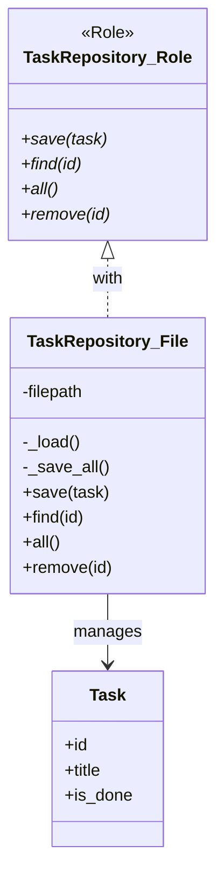

[@nqounet](https://x.com/nqounet)です。

シリーズ「シンプルなTodo CLIアプリ」の第4回です。

## 前回の振り返り

前回は、JSONフォーマットでタスクを永続化しました。

- `JSON` モジュールで読み書き
- タブ区切りの問題を解決
- 属性追加が容易になった

しかし、永続化ロジック（`load_tasks` と `save_tasks`）がメインスクリプトに直接書かれていました。今回は、この永続化処理を **Repositoryパターン** で分離します。

## なぜ永続化処理を分離するのか

### 現状の問題点

現在のコードを見てみましょう。

```perl
if ($command eq 'add') {
    my @tasks = load_tasks($file);  # ← 永続化
    my $task = Task->new(...);
    push @tasks, $task;
    save_tasks($file, @tasks);      # ← 永続化
}
elsif ($command eq 'list') {
    my @tasks = load_tasks($file);  # ← 永続化
    # ...
}
elsif ($command eq 'complete') {
    my @tasks = load_tasks($file);  # ← 永続化
    # ...
    save_tasks($file, @tasks);      # ← 永続化
}
```

各コマンドの処理に永続化ロジックが混在しています。

### 問題1: 保存形式を変更しにくい

JSON→SQLiteに変更したい場合、`load_tasks` と `save_tasks` を大幅に書き換える必要があります。しかも、メイン処理への影響がないか確認が必要です。

### 問題2: テストが書きにくい

テストを実行するたびに実際のファイルが作成・変更されます。

- テスト後のファイル削除が必要になる
- 並列テストで競合する可能性がある
- CI環境でのファイルパス問題が発生する可能性がある

### 問題3: ファイルパスがハードコード

`my $file = 'tasks.json';` がグローバルに定義されており、柔軟性がありません。

## Repositoryパターンとは

Repositoryパターンの構造を図で確認しましょう。



この図は、Repositoryパターンの基本構造を示しています。`TaskRepository::Role`がインターフェース（必須メソッド）を定義し、`TaskRepository::File`がそのインターフェースを実装します。メイン処理はRoleで定義されたメソッドを通じてタスクを操作するため、具体的な永続化方法を知る必要がありません。

### データアクセスを抽象化する

Repositoryパターンは、**データの保存・取得のロジックを一箇所にカプセル化する** デザインパターンです。

```
Before:
┌─────────────┐
│ メイン処理  │ ←→ ファイル操作コード ←→ ファイル
└─────────────┘

After:
┌─────────────┐     ┌──────────────┐
│ メイン処理  │ ←→ │ Repository   │ ←→ ファイル
└─────────────┘     └──────────────┘
```

メイン処理はRepositoryのメソッドを呼ぶだけ。ファイル操作の詳細を知る必要がありません。

### コレクションのように扱える

Repositoryは「タスクのコレクション」のように振る舞います。

```perl
# タスクを追加
$repository->save($task);

# IDでタスクを取得
my $task = $repository->find(1);

# 全タスクを取得
my @tasks = $repository->all;

# タスクを削除
$repository->remove(1);
```

内部でファイルを使っているか、データベースを使っているか、メモリに保存しているかは、呼び出し側は気にしません。

## Roleでインターフェースを定義する

### TaskRepository::Role

まず、Repositoryが持つべきメソッドを Moo::Role で定義します。

```perl
package TaskRepository::Role {
    use Moo::Role;

    requires 'save';    # タスクを保存（新規/更新）
    requires 'find';    # IDでタスクを取得
    requires 'all';     # 全タスクを取得
    requires 'remove';  # タスクを削除
}
```

`requires` で宣言されたメソッドは、このRoleを使うクラスが必ず実装しなければなりません。



### メソッドの役割

| メソッド | 役割 | 引数 | 戻り値 |
|---------|------|------|--------|
| `save($task)` | タスクを保存（新規追加または更新） | Taskオブジェクト | 保存したTaskオブジェクト |
| `find($id)` | IDでタスクを取得 | タスクID | Taskオブジェクトまたはundef |
| `all()` | 全タスクを取得 | なし | Taskオブジェクトのリスト |
| `remove($id)` | タスクを削除 | タスクID | 削除成功時は真 |

`save` メソッドは「upsert」のセマンティクスを持ちます。IDが未設定または存在しないIDの場合は新規追加、既存IDの場合は更新を行います。

## TaskRepository::Fileの実装

### クラスの定義

JSONファイルで永続化するRepositoryクラスを実装します。

```perl
package TaskRepository::File {
    use Moo;
    use JSON;

    with 'TaskRepository::Role';

    has filepath => (
        is      => 'ro',
        default => sub { 'tasks.json' },
    );

    # ... メソッドの実装
}
```

- `with 'TaskRepository::Role'` でRoleを適用
- `filepath` でファイルパスを設定可能に

### 内部メソッド: _load と _save_all

ファイル操作を内部メソッドとして実装します。

```perl
sub _load {
    my $self = shift;
    my @tasks;

    return @tasks unless -e $self->filepath;

    open my $fh, '<:encoding(UTF-8)', $self->filepath or die $!;
    my $json = do { local $/; <$fh> };
    close $fh;

    my $data = decode_json($json);

    for my $item (@$data) {
        push @tasks, Task->new(
            id      => $item->{id},
            title   => $item->{title},
            is_done => $item->{is_done} ? 1 : 0,
        );
    }

    return @tasks;
}

sub _save_all {
    my ($self, @tasks) = @_;

    my @data = map {
        {
            id      => $_->id,
            title   => $_->title,
            is_done => $_->is_done ? \1 : \0,
        }
    } @tasks;

    open my $fh, '>:encoding(UTF-8)', $self->filepath or die $!;
    print $fh encode_json(\@data);
    close $fh;
}
```

アンダースコア `_` で始まるメソッド名は「内部用」を意味する慣習です。外部から直接呼ばれることを想定していません。

### saveメソッド

```perl
sub save {
    my ($self, $task) = @_;
    my @tasks = $self->_load;

    if ($task->id && $task->id > 0) {
        # 既存タスクの更新
        my $found = 0;
        for my $t (@tasks) {
            if ($t->id == $task->id) {
                $t->is_done($task->is_done);
                $found = 1;
                last;
            }
        }
        push @tasks, $task unless $found;
    }
    else {
        # 新規タスクの追加
        my $max_id = 0;
        for my $t (@tasks) {
            $max_id = $t->id if $t->id > $max_id;
        }
        $task->id($max_id + 1);
        push @tasks, $task;
    }

    $self->_save_all(@tasks);
    return $task;
}
```

IDが設定されていれば更新、されていなければ新規追加として扱います。

### find / all / removeメソッド

```perl
sub find {
    my ($self, $id) = @_;
    my @tasks = $self->_load;

    for my $task (@tasks) {
        return $task if $task->id == $id;
    }
    return;
}

sub all {
    my $self = shift;
    return $self->_load;
}

sub remove {
    my ($self, $id) = @_;
    my @tasks = $self->_load;
    my $original_count = @tasks;

    @tasks = grep { $_->id != $id } @tasks;

    if (@tasks < $original_count) {
        $self->_save_all(@tasks);
        return 1;
    }
    return 0;
}
```

- `find` : 一致するIDのタスクを返す（なければundef）
- `all` : 全タスクのリストを返す
- `remove` : 指定IDのタスクを削除し、成功したら真を返す

## メイン処理をRepositoryで書き換える

### Repositoryを使った実装

```perl
my $repository = TaskRepository::File->new(filepath => 'tasks.json');
my $command = shift @ARGV // 'help';

if ($command eq 'add') {
    my $title = shift @ARGV;
    die "Usage: $0 add <task>\n" unless defined $title && $title ne '';

    my $task = Task->new(title => $title);
    $repository->save($task);

    print "Added: $title (ID: " . $task->id . ")\n";
}
elsif ($command eq 'list') {
    my @tasks = $repository->all;

    if (@tasks == 0) {
        print "No tasks.\n";
        exit;
    }

    for my $task (@tasks) {
        my $status = $task->is_done ? '[x]' : '[ ]';
        printf "%d. %s %s\n", $task->id, $status, $task->title;
    }
}
elsif ($command eq 'complete') {
    my $id = shift @ARGV;
    die "Usage: $0 complete <id>\n" unless defined $id && $id =~ /^\d+$/;

    my $task = $repository->find($id);
    die "Task $id not found.\n" unless $task;

    $task->mark_done();
    $repository->save($task);

    print "Completed: " . $task->title . "\n";
}
```

`load_tasks` と `save_tasks` の呼び出しが、`$repository->all` や `$repository->save` に置き換わりました。

## 完成コード

### todo.pl の全容

```perl
#!/usr/bin/env perl
use strict;
use warnings;
use utf8;
use JSON;

# === Taskクラスの定義 ===
package Task {
    use Moo;

    has id => (
        is       => 'rw',
        default  => sub { 0 },
    );

    has title => (
        is       => 'ro',
        required => 1,
    );

    has is_done => (
        is      => 'rw',
        default => sub { 0 },
    );

    sub mark_done {
        my $self = shift;
        $self->is_done(1);
    }
}

# === TaskRepository::Role ===
package TaskRepository::Role {
    use Moo::Role;

    requires 'save';
    requires 'find';
    requires 'all';
    requires 'remove';
}

# === TaskRepository::File ===
package TaskRepository::File {
    use Moo;
    use JSON;

    with 'TaskRepository::Role';

    has filepath => (
        is      => 'ro',
        default => sub { 'tasks.json' },
    );

    sub _load {
        my $self = shift;
        my @tasks;

        return @tasks unless -e $self->filepath;

        open my $fh, '<:encoding(UTF-8)', $self->filepath or die $!;
        my $json = do { local $/; <$fh> };
        close $fh;

        my $data = decode_json($json);

        for my $item (@$data) {
            push @tasks, Task->new(
                id      => $item->{id},
                title   => $item->{title},
                is_done => $item->{is_done} ? 1 : 0,
            );
        }

        return @tasks;
    }

    sub _save_all {
        my ($self, @tasks) = @_;

        my @data = map {
            {
                id      => $_->id,
                title   => $_->title,
                is_done => $_->is_done ? \1 : \0,
            }
        } @tasks;

        open my $fh, '>:encoding(UTF-8)', $self->filepath or die $!;
        print $fh encode_json(\@data);
        close $fh;
    }

    sub save {
        my ($self, $task) = @_;
        my @tasks = $self->_load;

        if ($task->id && $task->id > 0) {
            my $found = 0;
            for my $t (@tasks) {
                if ($t->id == $task->id) {
                    $t->is_done($task->is_done);
                    $found = 1;
                    last;
                }
            }
            push @tasks, $task unless $found;
        }
        else {
            my $max_id = 0;
            for my $t (@tasks) {
                $max_id = $t->id if $t->id > $max_id;
            }
            $task->id($max_id + 1);
            push @tasks, $task;
        }

        $self->_save_all(@tasks);
        return $task;
    }

    sub find {
        my ($self, $id) = @_;
        my @tasks = $self->_load;

        for my $task (@tasks) {
            return $task if $task->id == $id;
        }
        return;
    }

    sub all {
        my $self = shift;
        return $self->_load;
    }

    sub remove {
        my ($self, $id) = @_;
        my @tasks = $self->_load;
        my $original_count = @tasks;

        @tasks = grep { $_->id != $id } @tasks;

        if (@tasks < $original_count) {
            $self->_save_all(@tasks);
            return 1;
        }
        return 0;
    }
}

# === メイン処理 ===
package main;

my $repository = TaskRepository::File->new(filepath => 'tasks.json');
my $command = shift @ARGV // 'help';

if ($command eq 'add') {
    my $title = shift @ARGV;
    die "Usage: $0 add <task>\n" unless defined $title && $title ne '';

    my $task = Task->new(title => $title);
    $repository->save($task);

    print "Added: $title (ID: " . $task->id . ")\n";
}
elsif ($command eq 'list') {
    my @tasks = $repository->all;

    if (@tasks == 0) {
        print "No tasks.\n";
        exit;
    }

    for my $task (@tasks) {
        my $status = $task->is_done ? '[x]' : '[ ]';
        printf "%d. %s %s\n", $task->id, $status, $task->title;
    }
}
elsif ($command eq 'complete') {
    my $id = shift @ARGV;
    die "Usage: $0 complete <id>\n" unless defined $id && $id =~ /^\d+$/;

    my $task = $repository->find($id);
    die "Task $id not found.\n" unless $task;

    $task->mark_done();
    $repository->save($task);

    print "Completed: " . $task->title . "\n";
}
else {
    print "Usage: $0 <command> [args]\n";
    print "Commands:\n";
    print "  add <task>      - Add a new task\n";
    print "  list            - List all tasks\n";
    print "  complete <id>   - Complete a task by ID\n";
}
```

### 動作確認

```bash
$ perl todo.pl add "牛乳を買う"
Added: 牛乳を買う (ID: 1)

$ perl todo.pl add "メールを返信する"
Added: メールを返信する (ID: 2)

$ perl todo.pl list
1. [ ] 牛乳を買う
2. [ ] メールを返信する

$ perl todo.pl complete 1
Completed: 牛乳を買う

$ perl todo.pl list
1. [x] 牛乳を買う
2. [ ] メールを返信する
```

動作は変わりませんが、コードの構造が大きく改善されました。

## Repositoryパターンで何が良くなったか

### 永続化処理が1箇所にまとまった

ファイル操作のコードは `TaskRepository::File` の中だけにあります。

- ファイル形式を変更したい場合、このクラスだけを修正すればよい
- バグがあった場合、調査範囲が限定される

### メイン処理がシンプルになった

メイン処理は「何をするか」に集中できるようになりました。

```perl
# Before
my @tasks = load_tasks($file);
# ... 処理 ...
save_tasks($file, @tasks);

# After
my @tasks = $repository->all;
# ... 処理 ...
$repository->save($task);
```

### 保存先の変更が容易になった

別の保存先（SQLite、APIなど）に切り替えたい場合、同じインターフェースを持つ新しいRepositoryクラスを作るだけです。

```perl
# ファイル保存
my $repository = TaskRepository::File->new(filepath => 'tasks.json');

# 将来: SQLite保存
my $repository = TaskRepository::SQLite->new(dbfile => 'tasks.db');
```

メイン処理は変更不要！これがインターフェース（Role）の力です。

## 次回予告 - InMemoryRepositoryでテスト容易に

今回作成した `TaskRepository::File` は実際にファイルを読み書きします。これはテストの際に問題になります。

- テストごとにファイルが作成される
- テスト後のクリーンアップが必要
- CI環境でのパス問題

次回は、ファイルI/Oなしでテストできる **InMemoryRepository** を実装します。同じインターフェースで異なる実装を持つ、Repositoryパターンの真価を体感しましょう。

## まとめ

今回は、Repositoryパターンで永続化処理を分離しました。

- `TaskRepository::Role` でインターフェースを定義
- `TaskRepository::File` でJSON永続化を実装
- メイン処理がシンプルになった
- 保存先の変更が容易になった

「Mooで覚えるオブジェクト指向プログラミング」で学んだRoleの知識が、実践的なデザインパターンに活きてきましたね。

次回は、InMemoryRepositoryを実装してテスト容易性を高めます。お楽しみに！
