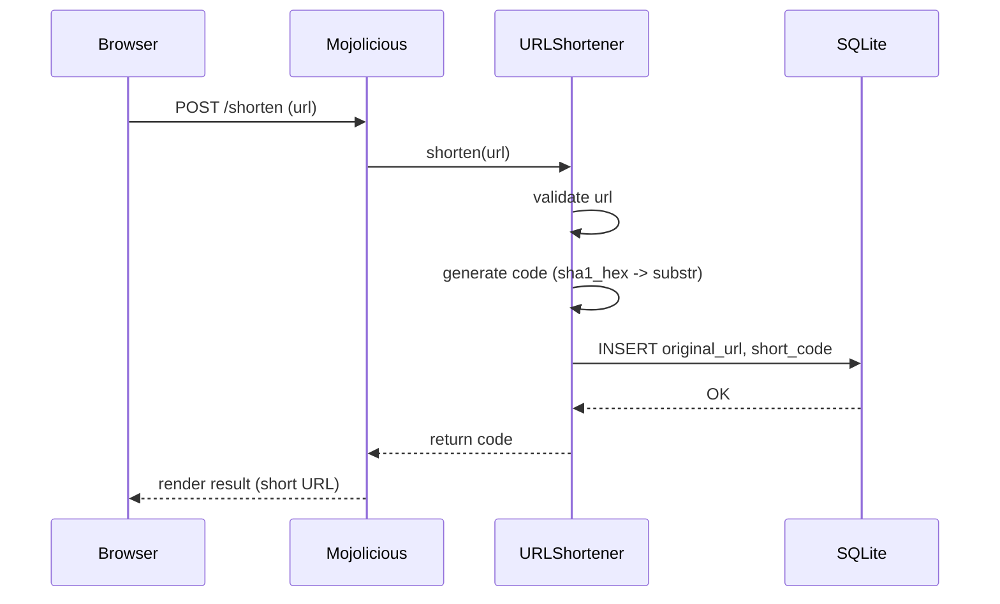

[@nqounet](https://x.com/nqounet)です。

連載「URL短縮サポーターを作ってみよう」の第7回です。

## 前回の振り返り

第6回では、URLを保存するためのテーブル構造を設計し、CREATE TABLE文で実際にテーブルを作成しました。

<!-- TODO: 公開時に第6回記事のリンクに置き換え -->

前回学んだ内容を簡単に振り返ります。

- テーブルはデータを表形式で管理する単位であり、カラムはデータの項目を表す
- URL短縮に必要なカラムはid、original_url、short_code、created_atの4つである
- `CREATE TABLE IF NOT EXISTS`で冪等なテーブル作成ができる
- `$dbh->do($sql)`でPerlからDDL（データ定義言語）を実行できる

今回は、いよいよ短縮URLをデータベースに保存する方法を学びます。

## 今回のゴール

第7回では、以下を達成することを目標とします。

- INSERT文でデータを登録する方法を理解する
- プレースホルダ（`?`）を使って安全にデータを挿入する
- 簡易バリデーション（空文字チェック）でエラーを防ぐ

## URLをデータベースに登録したい！

### タカシさんの期待

前回、テーブルを作成したタカシさん。次の疑問が湧いてきました。

「テーブルはできたけど、ここにURLを保存するにはどうすればいいの？」

データベースにデータを追加するには、INSERT文を使います。今回はこのINSERT文の書き方と、セキュリティを考慮した安全な実行方法を学びます。

### INSERT文の基本

INSERT文は、テーブルに新しいレコード（行）を追加するSQL文です。基本的な構文は以下のとおりです。

```sql
INSERT INTO テーブル名 (カラム名1, カラム名2, ...) VALUES (値1, 値2, ...)
```

今回作成した`urls`テーブルにデータを追加する場合、以下のようになります。

```sql
INSERT INTO urls (original_url, short_code) VALUES ('https://example.com', 'a1b2c3')
```

`id`と`created_at`は省略しています。`id`はINTEGER PRIMARY KEYなので自動採番され、`created_at`はDEFAULT CURRENT_TIMESTAMPなので現在日時が自動設定されるためです。

## プレースホルダで安全に実行する

### なぜプレースホルダが必要なのか

前回の`$dbh->do($sql)`を使えばINSERT文も実行できます。しかし、ユーザーからの入力をそのままSQL文に埋め込むのは危険です。

例えば、ユーザーが入力したURLをそのままSQL文に埋め込むコードを考えてみましょう。

```perl
# 危険な例（絶対にやってはいけない）
my $sql = "INSERT INTO urls (original_url, short_code) VALUES ('$url', '$code')";
$dbh->do($sql);
```

もしユーザーが`$url`に`'); DELETE FROM urls; --`のような悪意のある文字列を入力したらどうなるでしょうか。SQL文は以下のように解釈されてしまいます。

```sql
INSERT INTO urls (original_url, short_code) VALUES (''); DELETE FROM urls; --', 'a1b2c3')
```

これはSQLインジェクションと呼ばれる攻撃手法で、データベースの内容を改ざんしたり、削除したりされてしまう可能性があります。

### プレースホルダとは

プレースホルダ（`?`）を使うと、この問題を解決できます。プレースホルダは値の入る場所を示す記号で、実際の値は別途安全に渡されます。

```perl
# Perl: 5.10以上
# 依存: DBI, DBD::SQLite（cpanmでインストール）
my $sth = $dbh->prepare("INSERT INTO urls (original_url, short_code) VALUES (?, ?)");
```

このコードでは、2つの`?`がプレースホルダです。`prepare`メソッドはSQL文を解析してステートメントハンドル（`$sth`）を返します。この時点ではまだ値は設定されていません。

### executeで値を渡す

準備したステートメントに実際の値を渡して実行するには、`execute`メソッドを使います。

```perl
# Perl: 5.10以上
# 依存: DBI, DBD::SQLite（cpanmでインストール）
$sth->execute($url, $code);
```

`execute`の引数として渡された値は、DBIが自動的にエスケープ処理を行います。これにより、どんな文字列が入力されてもSQL文の構造が壊れることはありません。

プレースホルダを使う利点は以下のとおりです。

- SQLインジェクション攻撃を防げる
- 特殊文字（シングルクォートなど）を含む値も安全に扱える
- コードが読みやすくなる

## 簡易バリデーションを追加する

### 空のURLは拒否したい

データベースに保存する前に、入力値が適切かどうかをチェックすることも重要です。今回は最も基本的なバリデーションとして、空文字チェックを追加します。

```perl
if (!$url) {
    die "URLが入力されていません。\n";
}
```

この簡易バリデーションにより、空のURLが登録されることを防ぎます。より高度なバリデーション（URLの形式チェックなど）は、後の回で扱います。

## 実際のコードを見てみよう

### URLを登録するスクリプト

ここまでの内容を組み合わせた完全なスクリプトを見てみましょう。

```perl
#!/usr/bin/env perl
# insert_url.pl
# Perl: 5.10以上
# 依存: DBI, DBD::SQLite, Digest::SHA（cpanmでインストール）
use strict;
use warnings;
use DBI;
use Digest::SHA qw(sha1_hex);

# データベースに接続
my $dbh = DBI->connect(
    "dbi:SQLite:dbname=urls.db",
    "",
    "",
    { RaiseError => 1, AutoCommit => 1 }
);

# 登録するURL（実際のアプリではフォームから受け取る）
my $url = 'https://example.com/very-long-url-that-needs-shortening';

# 簡易バリデーション
if (!$url) {
    die "URLが入力されていません。\n";
}

# 短縮コードを生成
my $code = substr(sha1_hex($url), 0, 6);

# INSERT文を準備
my $sth = $dbh->prepare("INSERT INTO urls (original_url, short_code) VALUES (?, ?)");

# 値を渡して実行
$sth->execute($url, $code);

print "URLを登録しました！\n";
print "元のURL: $url\n";
print "短縮コード: $code\n";

# 切断
$dbh->disconnect;
```

コードの流れを解説します。



#### データベース接続

```perl
my $dbh = DBI->connect(
    "dbi:SQLite:dbname=urls.db",
    "",
    "",
    { RaiseError => 1, AutoCommit => 1 }
);
```

第5回で学んだ接続コードです。`urls.db`ファイルに接続します。

#### 簡易バリデーション

```perl
if (!$url) {
    die "URLが入力されていません。\n";
}
```

URLが空でないかをチェックします。空の場合はエラーメッセージを出力してスクリプトを終了します。

#### 短縮コード生成

```perl
my $code = substr(sha1_hex($url), 0, 6);
```

第4回で学んだハッシュ関数を使って、URLから6文字の短縮コードを生成します。

#### INSERT文の実行

```perl
my $sth = $dbh->prepare("INSERT INTO urls (original_url, short_code) VALUES (?, ?)");
$sth->execute($url, $code);
```

プレースホルダを使った安全なINSERT文の実行です。`prepare`でSQL文を準備し、`execute`で実際の値を渡して実行します。

## 動作確認

### スクリプトを実行する

上記のコードを`insert_url.pl`として保存し、ターミナルで実行してください。

```bash
perl insert_url.pl
```

以下のような出力が表示されれば成功です。

```
URLを登録しました！
元のURL: https://example.com/very-long-url-that-needs-shortening
短縮コード: xxxxxx
```

短縮コードは入力URLによって異なります。

### データベースの内容を確認する

SQLiteのコマンドラインツールでデータが登録されたことを確認できます。

```bash
sqlite3 urls.db "SELECT * FROM urls"
```

以下のような出力が表示されれば、データが正しく保存されています。

```
1|https://example.com/very-long-url-that-needs-shortening|xxxxxx|2025-01-01 12:00:00
```

`id`が自動採番され、`created_at`に現在日時が設定されていることがわかります。

## まとめ

### 今回学んだこと

第7回では、以下のことを学びました。

- INSERT文でテーブルにデータを追加できる
- プレースホルダ（`?`）を使うことでSQLインジェクション攻撃を防げる
- `$dbh->prepare($sql)`でステートメントを準備し、`$sth->execute($値1, $値2)`で実行する
- 簡易バリデーション（`if (!$url) { ... }`）で空文字入力を防げる

### 次回予告

次回は「短縮URLへアクセス！ — 動的ルーティング」をテーマに、`/:code`形式のURLでアクセスを受け付ける方法を学びます。Mojolicious::Liteのプレースホルダルーティングで動的なパスを処理する仕組みを理解しましょう。お楽しみに。
