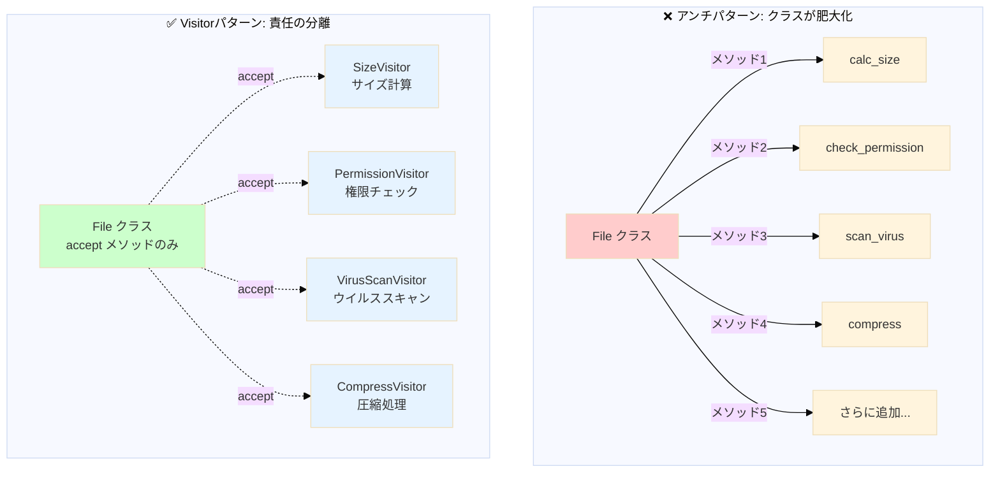
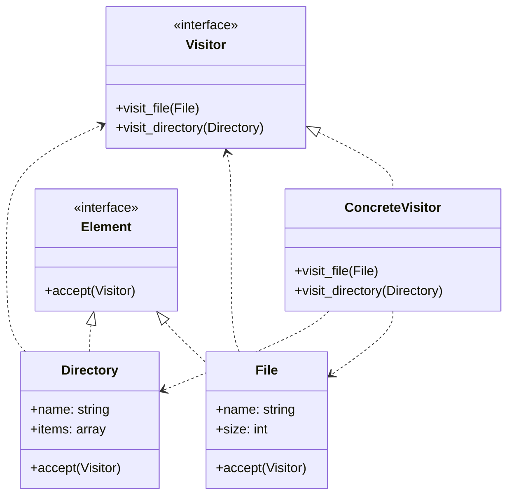
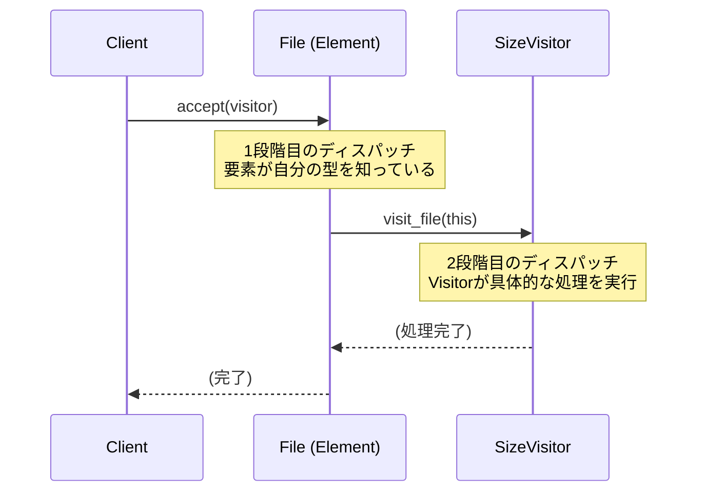
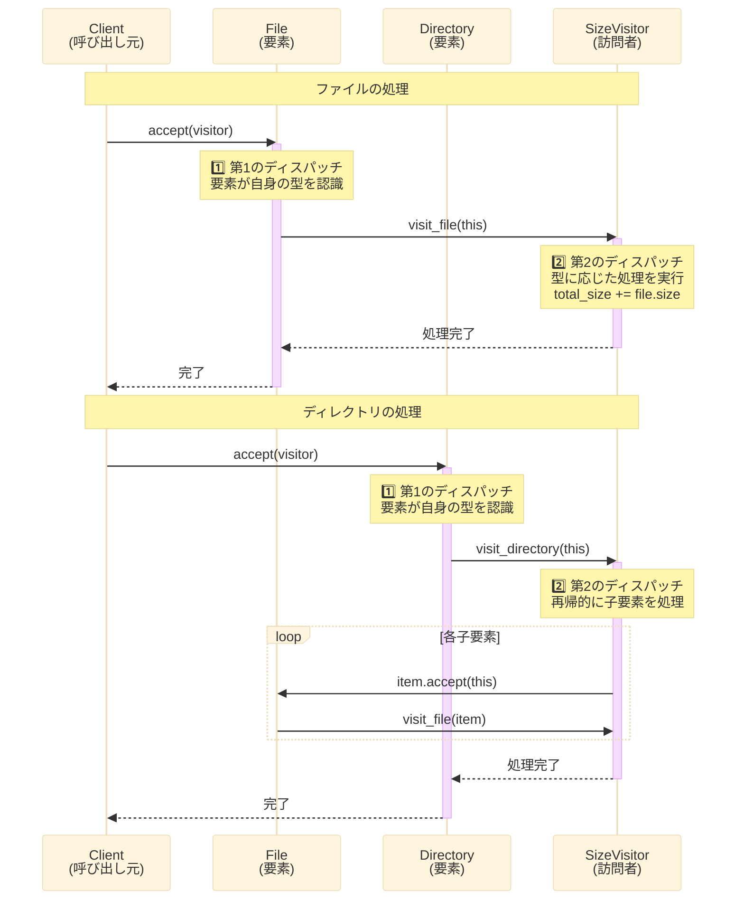
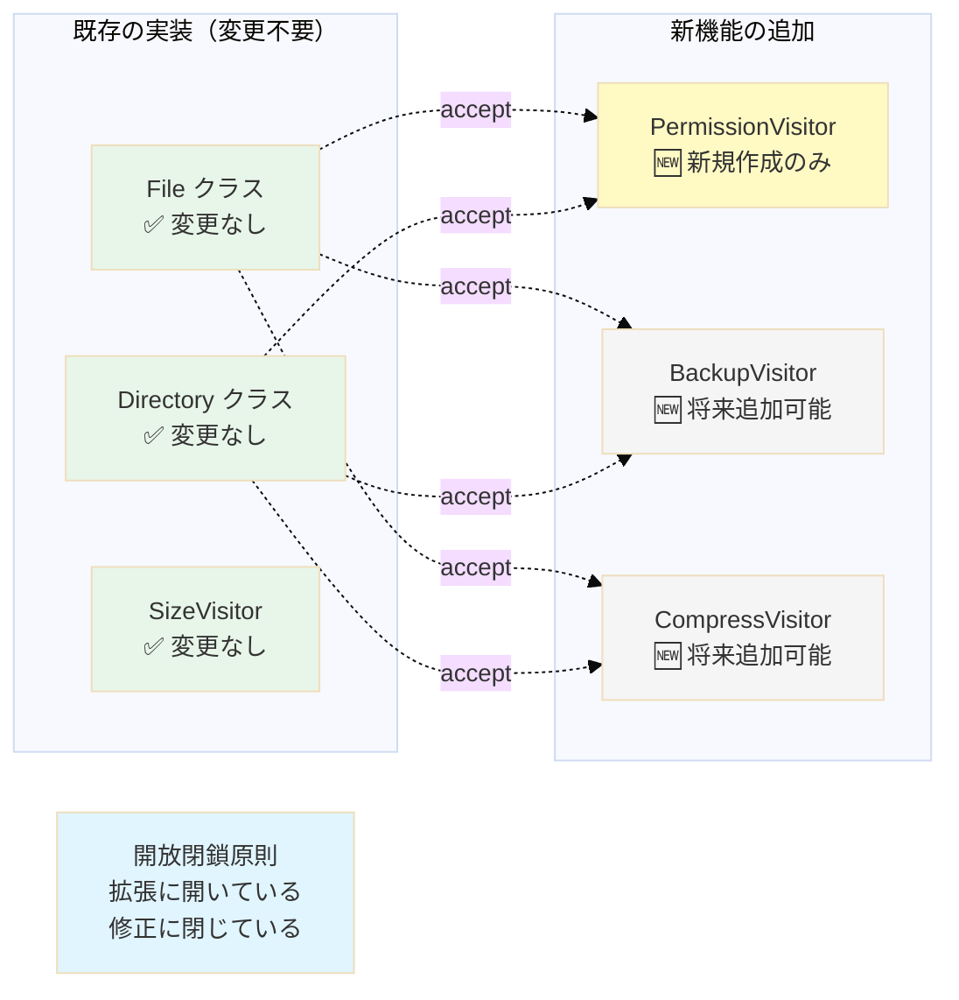
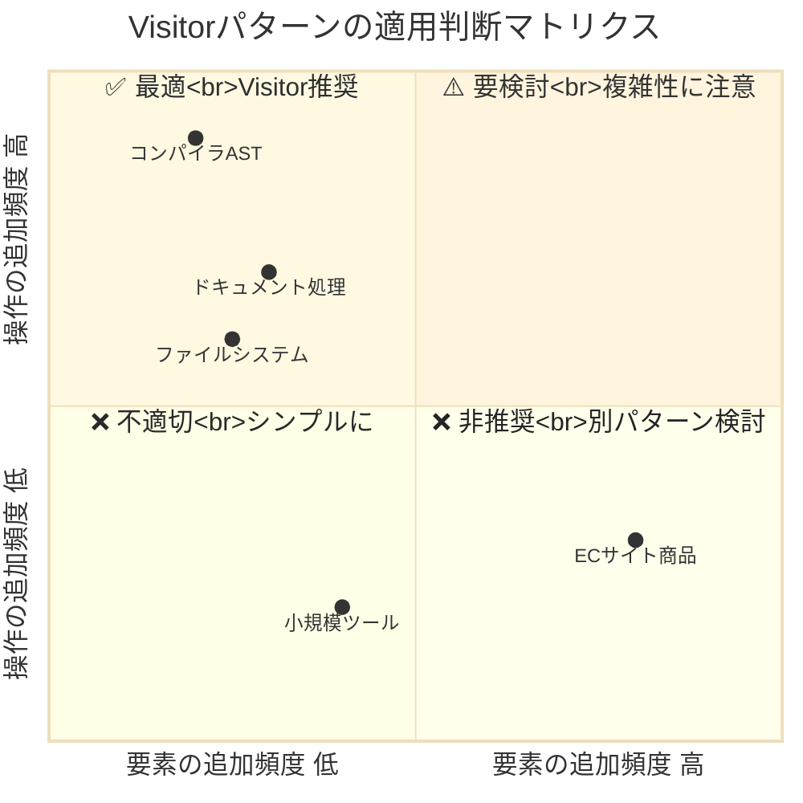
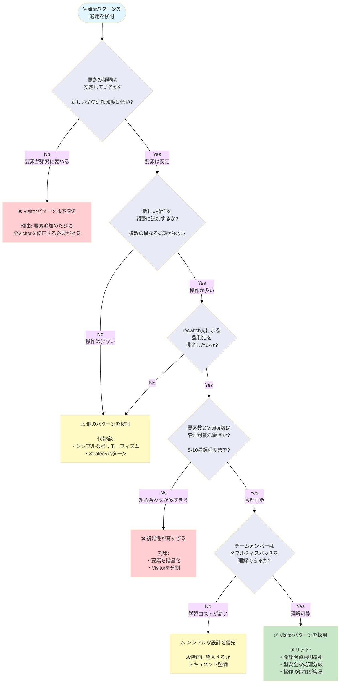
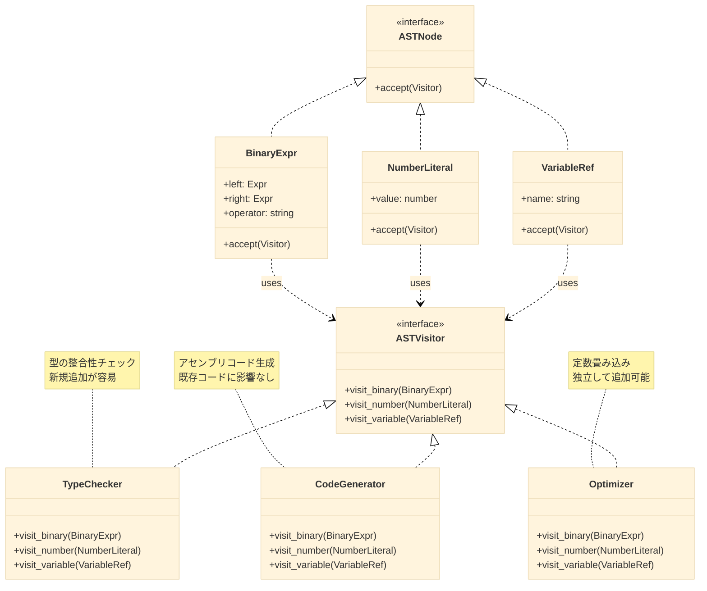
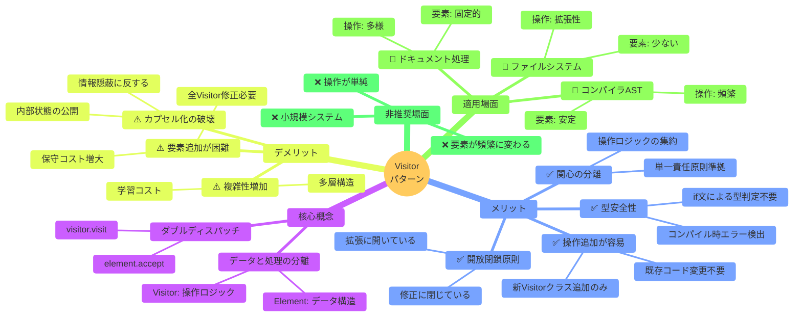

## Visitorパターンとは - GoF振る舞いパターンの概要

「新しい機能を追加したいけど、既存のクラスをいじりたくない」という経験はありませんか？

Visitorパターンは、**オブジェクト構造（データ）を変更せずに、新しい操作（処理）を追加できる**ようにする設計パターンです。GoF（Gang of Four）が提唱した23のデザインパターンのうち、「振る舞いに関するパターン（Behavioral Patterns）」に分類されます。

### Visitorパターンの目的

Visitorパターンの主な目的は以下の通りです。

- アルゴリズム（処理ロジック）とオブジェクト（データ構造）を分離する
- 開放閉鎖原則（OCP: Open/Closed Principle）に準拠する
- 新しい操作を既存クラスに影響を与えずに追加できる

たとえば、ファイルシステムを例に考えてみましょう。

```perl
# 従来の方法（アンチパターン）
package File;
sub calc_size { ... }          # サイズ計算
sub check_permission { ... }   # 権限チェック
sub scan_virus { ... }         # ウイルススキャン
sub compress { ... }           # 圧縮処理
# → クラスが肥大化し、責任が不明確になる

# または、型判定による分岐
sub process_element {
    my ($element) = @_;
    if ($element->isa('File')) {
        # File固有の処理
    } elsif ($element->isa('Directory')) {
        # Directory固有の処理
    }
    # → 新しい型を追加するたびに修正が必要
}
```

このアプローチには以下の問題があります。

- クラスが肥大化し、単一責任原則（SRP）に違反する
- if/switchによる型判定が増加し、可読性が低下する
- 新しい操作を追加するたびに既存クラスを修正する必要がある

Visitorパターンでは、これらの問題を解決できます。

```perl
# Visitorパターンでの解決
package SizeVisitor;         # サイズ計算を分離
package PermissionVisitor;   # 権限チェックを分離
package VirusScanVisitor;    # ウイルススキャンを分離

# 要素クラスはacceptメソッドだけを持つ
package File;
sub accept {
    my ($self, $visitor) = @_;
    $visitor->visit_file($self);
}
```

以下の図は、アンチパターン（従来の方法）とVisitorパターンの構造的な違いを示しています。





Visitorパターンは、同じ振る舞いパターンであるStrategyパターンと比較すると理解が深まります。Strategyパターンは「アルゴリズムの切り替え」に焦点を当てていますが、Visitorパターンは「複数の異なる型に対する操作の追加」に特化しています。

## Visitorパターンの基本構造

Visitorパターンは以下の5つの要素から構成されます。



| 要素名 | 役割 | 説明 |
|--------|------|------|
| **Visitor（訪問者）** | インターフェース | 各要素型ごとの訪問メソッド（visit）を定義 |
| **ConcreteVisitor（具体訪問者）** | 実装クラス | 実際の処理ロジックを実装 |
| **Element（要素）** | インターフェース | Visitorを受け入れる`accept(visitor)`メソッドを定義 |
| **ConcreteElement（具体要素）** | 実装クラス | 個々のデータ構造を表し、acceptメソッドで自分自身をVisitorに渡す |
| **ObjectStructure（オブジェクト構造）** | コレクション | Elementのコレクション（配列やツリー構造など） |

### ダブルディスパッチの仕組み

Visitorパターンの核心概念はダブルディスパッチ（Double Dispatch）です。これは、`element.accept(visitor)` → `visitor.visit(element)` という2段階の呼び出しにより、要素型（Element）とビジター型（Visitor）の両方に基づいて処理を決定する仕組みです。



このダブルディスパッチにより、if文やinstanceofによる型判定を排除し、型安全な処理分岐を実現できます。

以下の図は、ダブルディスパッチの呼び出しフローをより詳細に示しています。



## ファイルシステムでの実装例（Perl/Moo）

それでは、実際にPerlとMooを使ってVisitorパターンを実装してみましょう。今回は、ファイルシステムのサイズ計算を例にします。

**開発環境**:
- Perl: 5.30以上推奨
- Moo: 2.0以上
- Test2::V0: 0.000145以上（テスト用）



Perlでのオブジェクト指向プログラミングにはMooが便利です。Moo::Roleを使うことで、インターフェースに相当する仕組みを実現できます。

### ステップ1: ロール（インターフェース）の定義

まず、VisitorとElementのロールを定義します。

```perl
# lib/Visitor/Role.pm
package Visitor::Role;
use Moo::Role;

# すべてのVisitorが実装すべきメソッドを宣言
requires 'visit_file';
requires 'visit_directory';

1;
```

```perl
# lib/Element/Role.pm
package Element::Role;
use Moo::Role;

# すべてのElementが実装すべきメソッドを宣言
requires 'accept';

1;
```

### ステップ2: 具体的な要素（Element）の実装

次に、FileとDirectoryクラスを実装します。

```perl
# lib/File.pm
package File;
use Moo;
with 'Element::Role';

# 属性の定義
has name => (
    is       => 'ro',      # 読み取り専用
    required => 1,         # 必須
);

has size => (
    is       => 'ro',
    required => 1,
    isa      => sub { die "size must be >= 0" unless $_[0] >= 0 },
);

# Visitorを受け入れるメソッド
sub accept {
    my ($self, $visitor) = @_;
    # 自分自身（File）をVisitorに渡す
    $visitor->visit_file($self);
}

1;
```

```perl
# lib/Directory.pm
package Directory;
use Moo;
with 'Element::Role';

has name => (
    is       => 'ro',
    required => 1,
);

has items => (
    is      => 'ro',
    default => sub { [] },  # デフォルトは空配列
    isa     => sub { die "items must be arrayref" unless ref($_[0]) eq 'ARRAY' },
);

# Visitorを受け入れるメソッド
sub accept {
    my ($self, $visitor) = @_;
    # 自分自身（Directory）をVisitorに渡す
    $visitor->visit_directory($self);
}

1;
```

### ステップ3: 具体的なVisitorの実装

サイズ計算を行うSizeVisitorを実装します。

```perl
# lib/SizeVisitor.pm
package SizeVisitor;
use Moo;
with 'Visitor::Role';

# サイズの合計を保持する属性
has total_size => (
    is      => 'rw',      # 読み書き可能
    default => 0,
);

# ファイルを訪問したときの処理
sub visit_file {
    my ($self, $file) = @_;
    # ファイルサイズを合計に加算
    $self->total_size($self->total_size + $file->size);
}

# ディレクトリを訪問したときの処理
sub visit_directory {
    my ($self, $dir) = @_;
    # ディレクトリ内のすべてのアイテムを訪問
    for my $item (@{$dir->items}) {
        $item->accept($self);  # 再帰的に処理
    }
}

1;
```

### ステップ4: 使用例

```perl
# examples/size_calculation.pl
#!/usr/bin/env perl
use strict;
use warnings;
use lib 'lib';
use File;
use Directory;
use SizeVisitor;

# ファイルシステム構造を構築
my $file1 = File->new(name => 'readme.txt',  size => 100);
my $file2 = File->new(name => 'license.txt', size => 200);
my $file3 = File->new(name => 'main.pl',     size => 500);

my $subdir = Directory->new(
    name  => 'docs',
    items => [$file1, $file2],
);

my $root = Directory->new(
    name  => 'project',
    items => [$file3, $subdir],
);

# サイズ計算Visitorを作成して適用
my $visitor = SizeVisitor->new;
$root->accept($visitor);

printf "Total size: %d bytes\n", $visitor->total_size;  # Total size: 800 bytes
```

実行結果：

```
Total size: 800 bytes
```

以下の図は、上記のファイルシステム構造とSizeVisitorの処理フローを視覚化したものです。

```mermaid
%%{init: {'theme':'base', 'themeVariables': { 'fontSize':'14px'}}}%%
graph TD
    subgraph "ファイルシステム構造"
        Root[📁 project<br/>Directory]
        File3[📄 main.pl<br/>File: 500 bytes]
        Subdir[📁 docs<br/>Directory]
        File1[📄 readme.txt<br/>File: 100 bytes]
        File2[📄 license.txt<br/>File: 200 bytes]
        
        Root --> File3
        Root --> Subdir
        Subdir --> File1
        Subdir --> File2
    end
    
    subgraph "SizeVisitor の処理フロー"
        V1[visitor.total_size = 0]
        V2[root.accept]
        V3[visit_directory: project]
        V4[main.pl.accept]
        V5[visit_file: +500<br/>total = 500]
        V6[docs.accept]
        V7[visit_directory: docs]
        V8[readme.txt.accept]
        V9[visit_file: +100<br/>total = 600]
        V10[license.txt.accept]
        V11[visit_file: +200<br/>total = 800]
        V12[✅ 最終結果: 800 bytes]
        
        V1 --> V2
        V2 --> V3
        V3 --> V4
        V4 --> V5
        V5 --> V6
        V6 --> V7
        V7 --> V8
        V8 --> V9
        V9 --> V10
        V10 --> V11
        V11 --> V12
        
        style V12 fill:#90EE90
        style V5 fill:#ffe6e6
        style V9 fill:#ffe6e6
        style V11 fill:#ffe6e6
    end
```





Mooの詳細な設計手法については、こちらの記事も参考になります。

### テストコード

実装が正しく動作することを確認するテストコードも書きましょう。

```perl
# t/size_visitor.t
use strict;
use warnings;
use Test2::V0;
use lib 'lib';
use File;
use Directory;
use SizeVisitor;

subtest 'SizeVisitor calculates single file size' => sub {
    my $file = File->new(name => 'test.txt', size => 123);
    my $visitor = SizeVisitor->new;
    
    $file->accept($visitor);
    
    is $visitor->total_size, 123, 'Single file size is correct';
};

subtest 'SizeVisitor calculates directory size' => sub {
    my $file1 = File->new(name => 'file1.txt', size => 100);
    my $file2 = File->new(name => 'file2.txt', size => 200);
    my $dir = Directory->new(
        name  => 'testdir',
        items => [$file1, $file2],
    );
    
    my $visitor = SizeVisitor->new;
    $dir->accept($visitor);
    
    is $visitor->total_size, 300, 'Directory size is correct';
};

subtest 'SizeVisitor handles nested directories' => sub {
    my $file1 = File->new(name => 'a.txt', size => 10);
    my $file2 = File->new(name => 'b.txt', size => 20);
    my $file3 = File->new(name => 'c.txt', size => 30);
    
    my $subdir = Directory->new(
        name  => 'sub',
        items => [$file1, $file2],
    );
    
    my $root = Directory->new(
        name  => 'root',
        items => [$file3, $subdir],
    );
    
    my $visitor = SizeVisitor->new;
    $root->accept($visitor);
    
    is $visitor->total_size, 60, 'Nested directory size is correct';
};

subtest 'SizeVisitor can be reused' => sub {
    my $file1 = File->new(name => 'x.txt', size => 50);
    my $file2 = File->new(name => 'y.txt', size => 75);
    
    my $visitor = SizeVisitor->new;
    
    $file1->accept($visitor);
    is $visitor->total_size, 50, 'First file processed';
    
    $file2->accept($visitor);
    is $visitor->total_size, 125, 'Visitor accumulates size';
};

done_testing;
```

テストを実行：

```bash
prove -lv t/size_visitor.t
```

## 新機能追加の実演：PermissionVisitor

Visitorパターンの真価は、既存のコードを変更せずに新しい機能を追加できる点にあります。実際に、権限チェック機能を追加してみましょう。

### PermissionVisitorの実装

```perl
# lib/PermissionVisitor.pm
package PermissionVisitor;
use Moo;
with 'Visitor::Role';

# 権限エラーを格納する配列
has errors => (
    is      => 'rw',
    default => sub { [] },
);

# チェック対象の権限（例: 'read', 'write', 'execute'）
has required_permission => (
    is       => 'ro',
    required => 1,
);

# ファイルの権限チェック
sub visit_file {
    my ($self, $file) = @_;
    
    # ファイルに権限属性がある場合のみチェック
    if ($file->can('permissions')) {
        my $perms = $file->permissions;
        unless ($perms->{$self->required_permission}) {
            push @{$self->errors}, sprintf(
                "File '%s' lacks '%s' permission",
                $file->name,
                $self->required_permission
            );
        }
    }
}

# ディレクトリ内のすべてのアイテムをチェック
sub visit_directory {
    my ($self, $dir) = @_;
    
    # ディレクトリ自体の権限チェック
    if ($dir->can('permissions')) {
        my $perms = $dir->permissions;
        unless ($perms->{$self->required_permission}) {
            push @{$self->errors}, sprintf(
                "Directory '%s' lacks '%s' permission",
                $dir->name,
                $self->required_permission
            );
        }
    }
    
    # 中のアイテムを再帰的にチェック
    for my $item (@{$dir->items}) {
        $item->accept($self);
    }
}

# すべての権限チェックが通ったかどうか
sub is_valid {
    my ($self) = @_;
    return scalar(@{$self->errors}) == 0;
}

1;
```

### 権限属性を持つFileとDirectoryの拡張

既存のFileとDirectoryクラスに権限属性を追加します（実際の運用では、これも別のロールとして分離することが可能です）。

```perl
# lib/FileWithPermissions.pm
package FileWithPermissions;
use Moo;
extends 'File';

has permissions => (
    is      => 'ro',
    default => sub { +{ read => 1, write => 1, execute => 0 } },
);

1;
```

```perl
# lib/DirectoryWithPermissions.pm
package DirectoryWithPermissions;
use Moo;
extends 'Directory';

has permissions => (
    is      => 'ro',
    default => sub { +{ read => 1, write => 0, execute => 1 } },
);

1;
```

### PermissionVisitorの使用例

```perl
# examples/permission_check.pl
#!/usr/bin/env perl
use strict;
use warnings;
use lib 'lib';
use FileWithPermissions;
use DirectoryWithPermissions;
use PermissionVisitor;

# ファイルシステムを構築
my $readable_file = FileWithPermissions->new(
    name        => 'public.txt',
    size        => 100,
    permissions => { read => 1, write => 0, execute => 0 },
);

my $unreadable_file = FileWithPermissions->new(
    name        => 'secret.txt',
    size        => 200,
    permissions => { read => 0, write => 0, execute => 0 },
);

my $dir = DirectoryWithPermissions->new(
    name        => 'files',
    items       => [$readable_file, $unreadable_file],
    permissions => { read => 1, write => 1, execute => 1 },
);

# 読み取り権限のチェック
my $visitor = PermissionVisitor->new(required_permission => 'read');
$dir->accept($visitor);

if ($visitor->is_valid) {
    print "All files are readable!\n";
} else {
    print "Permission errors found:\n";
    for my $error (@{$visitor->errors}) {
        print "  - $error\n";
    }
}
```

実行結果：

```
Permission errors found:
  - File 'secret.txt' lacks 'read' permission
```

**ポイント**: SizeVisitorとPermissionVisitorは完全に独立しており、相互に影響を与えません。また、FileやDirectoryの`accept`メソッドも変更していません。これがVisitorパターンの強みです。

以下の図は、新しいVisitorを追加する際の影響範囲を示しています。Visitorパターンでは、既存のコードを変更せずに新機能を追加できることがわかります。



### テストコード

```perl
# t/permission_visitor.t
use strict;
use warnings;
use Test2::V0;
use lib 'lib';
use FileWithPermissions;
use DirectoryWithPermissions;
use PermissionVisitor;

subtest 'PermissionVisitor allows file with permission' => sub {
    my $file = FileWithPermissions->new(
        name        => 'test.txt',
        size        => 100,
        permissions => { read => 1, write => 1, execute => 0 },
    );
    
    my $visitor = PermissionVisitor->new(required_permission => 'read');
    $file->accept($visitor);
    
    ok $visitor->is_valid, 'File with read permission passes';
    is scalar(@{$visitor->errors}), 0, 'No errors';
};

subtest 'PermissionVisitor detects missing permission' => sub {
    my $file = FileWithPermissions->new(
        name        => 'secret.txt',
        size        => 100,
        permissions => { read => 0, write => 0, execute => 0 },
    );
    
    my $visitor = PermissionVisitor->new(required_permission => 'write');
    $file->accept($visitor);
    
    ok !$visitor->is_valid, 'File without write permission fails';
    is scalar(@{$visitor->errors}), 1, 'One error recorded';
    like $visitor->errors->[0], qr/lacks 'write' permission/, 'Error message is correct';
};

subtest 'PermissionVisitor checks nested directories' => sub {
    my $file1 = FileWithPermissions->new(
        name        => 'ok.txt',
        size        => 10,
        permissions => { read => 1, write => 1, execute => 0 },
    );
    my $file2 = FileWithPermissions->new(
        name        => 'ng.txt',
        size        => 20,
        permissions => { read => 0, write => 0, execute => 0 },
    );
    
    my $dir = DirectoryWithPermissions->new(
        name        => 'files',
        items       => [$file1, $file2],
        permissions => { read => 1, write => 1, execute => 1 },
    );
    
    my $visitor = PermissionVisitor->new(required_permission => 'read');
    $dir->accept($visitor);
    
    ok !$visitor->is_valid, 'Directory with problematic file fails';
    is scalar(@{$visitor->errors}), 1, 'One file lacks permission';
};

done_testing;
```

## メリットとデメリット

Visitorパターンには明確なメリットとデメリットがあります。適用前に必ず検討しましょう。

### メリット（Advantages）

| メリット | 説明 | 具体例 |
|---------|------|--------|
| **操作の追加が容易** | 既存の要素クラスを変更せず、新しいConcreteVisitorを追加するだけで新機能を実装可能 | SizeVisitor、PermissionVisitorを独立して追加 |
| **関心の分離** | 操作ロジックがVisitorに集約され、データ構造（Element）と処理（Visitor）が分離される | ファイル構造と計算ロジックの分離 |
| **開放閉鎖原則への準拠** | 拡張には開いており（新Visitor追加）、修正には閉じている（既存Element変更不要） | 既存コードに影響を与えず拡張可能 |
| **関連操作のグループ化** | 同じ目的の処理が1つのVisitorクラスにまとまる | サイズ計算ロジックがSizeVisitorに集約 |
| **型安全性の向上** | ダブルディスパッチにより、if/instanceofなどの型チェックが不要 | コンパイル時の型エラー検出（静的型付け言語の場合） |

```perl
# 新しい操作を追加する例
package BackupVisitor;
use Moo;
with 'Visitor::Role';

has backup_list => (is => 'rw', default => sub { [] });

sub visit_file {
    my ($self, $file) = @_;
    # バックアップ対象のファイルを収集
    push @{$self->backup_list}, $file->name;
}

sub visit_directory {
    my ($self, $dir) = @_;
    # ディレクトリ内を再帰的に処理
    for my $item (@{$dir->items}) {
        $item->accept($self);
    }
}

# 既存のFile、Directoryクラスは一切変更不要！
1;
```

### デメリット（Disadvantages）

| デメリット | 説明 | 影響 |
|----------|------|------|
| **要素の追加が困難** | 新しい要素型を追加すると、**すべてのVisitor**に新しいvisitメソッドを追加する必要がある | 保守コストの増大 |
| **カプセル化の破壊** | Visitorが要素の内部状態にアクセスする必要がある場合、privateフィールドの公開が必要になる | 情報隠蔽の原則に反する可能性 |
| **双方向依存** | ElementとVisitorが相互に依存する関係になる | 循環依存の発生 |
| **複雑性の増加** | Visitor、ConcreteVisitor、Element、ConcreteElementと多層化する | 小規模システムでは過剰設計 |
| **ダブルディスパッチの理解が必要** | accept → visitの2段階呼び出しを理解する必要がある | 学習コストの増加 |

```perl
# 要素の追加が困難な例
# 新しい要素型SymbolicLinkを追加する場合
package SymbolicLink;
use Moo;
with 'Element::Role';

sub accept {
    my ($self, $visitor) = @_;
    # 新メソッドvisit_symbolic_linkの呼び出し
    $visitor->visit_symbolic_link($self);
}

# 問題：すべての既存Visitorに修正が必要
package SizeVisitor;
# visit_symbolic_linkを追加する必要がある
sub visit_symbolic_link { ... }

package PermissionVisitor;
# visit_symbolic_linkを追加する必要がある
sub visit_symbolic_link { ... }

package BackupVisitor;
# visit_symbolic_linkを追加する必要がある
sub visit_symbolic_link { ... }

# → Visitorが多数ある場合、大規模な修正作業が発生
```

### トレードオフの考え方

Visitorパターンの採用は、以下のトレードオフを考慮する必要があります。



操作の追加頻度と要素の追加頻度の2軸で考えると、Visitorパターンは「操作追加が多く、要素追加が少ない」場合に最も効果的です。

**判断基準表**:

| 状況 | 操作追加頻度 | 要素追加頻度 | Visitor採用 | 理由 |
|------|------------|------------|------------|------|
| コンパイラAST処理 | 高（頻繁） | 低（安定） | ◎ 推奨 | 新しい最適化パスを継続的に追加 |
| ECサイトの商品管理 | 低（稀） | 高（頻繁） | × 非推奨 | 新商品カテゴリが頻繁に追加 |
| ドキュメント処理 | 中（定期） | 低（安定） | ○ 採用可 | レンダリング、統計、変換など操作追加 |
| 小規模ツール | 低（稀） | 低（安定） | △ 不要 | シンプルなポリモーフィズムで十分 |

## 適用判断とユースケース

### 適用すべき場面（When to Use）

Visitorパターンは以下のような場面で威力を発揮します。

1. **要素の型が安定しており、操作が頻繁に追加される場合**
   - オブジェクト構造（要素の種類）が固定的である
   - 新しい操作を継続的に追加する必要がある
   - 例：コンパイラ（ASTの構造は安定、新しい最適化パスを追加）

2. **複数の無関係な操作を一元管理したい場合**
   - 各操作のロジックを1箇所（Visitorクラス）に集約できる
   - オブジェクト構造の各要素に操作ロジックを分散させたくない

3. **if/switch文による型判定を排除したい場合**
   - ダブルディスパッチにより、型判定なしで適切なメソッドを呼び出せる
   - コードの可読性と保守性が向上する

4. **公開API設計で、ユーザーが振る舞いを拡張できるようにしたい場合**
   - コアコードを変更せずに新しい操作を追加可能
   - プラグイン機構として活用できる

**判断フローチャート**:



### 実際のユースケース

#### 1. コンパイラと抽象構文木（AST）処理

**最も典型的で成功している適用例**です。

- **問題**: ソースコードを解析してASTを構築し、複数の操作（型チェック、コード生成、最適化、評価など）を実行する必要がある
- **Visitorパターンの適用**:
  - `TypeCheckVisitor`: 型の整合性チェック
  - `CodeGenVisitor`: 中間コードやアセンブリの生成
  - `OptimizationVisitor`: 定数畳み込み、デッドコード削除
  - `EvaluationVisitor`: 式の評価

**実例**: Java Compiler（Eclipse JDT）、C++コンパイラフロントエンド、LLVM IR の変換パス

以下の図は、コンパイラでのVisitorパターン適用例を示しています。



#### 2. ドキュメント処理システム

- **問題**: ドキュメントは複数の要素（段落、テーブル、画像、リストなど）から構成され、各要素に対して複数の操作が必要
- **Visitorパターンの適用**:
  - `RenderVisitor`: HTML/PDF形式でレンダリング
  - `SpellCheckVisitor`: スペルチェック実行
  - `StatisticsVisitor`: 文字数・単語数などの統計情報収集

**実例**: Microsoft WordやGoogle Docsのような文書処理システム、LaTeX/Markdown処理エンジン

#### 3. ファイルシステム操作

- **問題**: ファイルとディレクトリから成る階層構造に対して、サイズ計算、権限チェック、バックアップなどの操作を追加したい
- **Visitorパターンの適用**:
  - `SizeCalculatorVisitor`: ファイル・ディレクトリのサイズ計算（本記事の例）
  - `PermissionCheckerVisitor`: アクセス権限の確認
  - `BackupVisitor`: バックアップ対象のファイル収集

#### 4. オンラインショッピング・金融システム

- **問題**: ショッピングカートに異なる種類の商品（Book、Electronics、Clothingなど）が混在し、価格計算、割引適用、配送料計算などの操作が必要
- **Visitorパターンの適用**:
  - `PriceCalculatorVisitor`: 合計金額計算
  - `DiscountVisitor`: 割引適用
  - `ShippingCostVisitor`: 配送料計算
  - `TaxCalculatorVisitor`: 税金計算

### 適用すべきでない場面（When NOT to Use）

以下のような場面では、Visitorパターンは避けるべきです。

1. **要素の型が頻繁に変更される場合**
   - 新しい要素型を追加するたびに、すべてのVisitorクラスを修正する必要がある
   - 保守コストが非常に高くなる

2. **操作が単純で、型ごとの処理分岐が少ない場合**
   - シンプルなポリモーフィズム（仮想関数）で十分
   - Visitorパターンは過剰設計（オーバーエンジニアリング）になる

3. **パターンマッチングや代数的データ型を持つ言語の場合**
   - Haskell、Scala、OCaml、Rust、最新のC#/F#など
   - これらの言語ではパターンマッチングでより簡潔に記述可能

4. **小規模システムで追加のレイヤーが負担になる場合**
   - Visitor、ConcreteVisitor、Element、ConcreteElement、ObjectStructureと多層化
   - システムの複雑性がメリットを上回る

## まとめと次のステップ

### まとめ

Visitorパターンは、オブジェクト構造を変更せずに新しい操作を追加できる強力な設計パターンです。

以下の図は、Visitorパターンの全体像とメリット・デメリットを視覚的にまとめたものです。



**重要なポイント**:

- ✅ ダブルディスパッチにより、型安全な処理分岐を実現
- ✅ 開放閉鎖原則（OCP）に準拠した設計が可能
- ✅ データ構造と操作ロジックを明確に分離
- ✅ コンパイラのAST処理など、要素が安定している場合に最適
- ⚠️ 要素の追加が困難になるため、要素が頻繁に変わる場合は不適切
- ⚠️ 小規模システムでは過剰設計になる可能性がある

### 適用チェックリスト

Visitorパターンの適用を検討する際は、以下のチェックリストを使用してください。

- [ ] 要素の型は安定しているか（新しい要素型の追加頻度が低い）
- [ ] 新しい操作を頻繁に追加する必要があるか
- [ ] 複数の無関係な操作を一元管理したいか
- [ ] if/switchによる型判定を排除したいか
- [ ] システムの規模は、追加のレイヤーを導入する価値があるか
- [ ] 要素とVisitorの数は管理可能な範囲内か

**3つ以上チェックがついた場合**、Visitorパターンの適用を検討する価値があります。

### 次のステップ

Visitorパターンを学んだ次は、以下のステップで理解を深めましょう。

1. **実装してみる**
   - 本記事のコード例を実際に動かしてみる
   - 独自のVisitorクラスを追加してみる（例：FilterVisitor、ValidationVisitorなど）

2. **他のパターンとの組み合わせを学ぶ**
   - Compositeパターン + Visitorパターン（ツリー構造の走査）
   - Iteratorパターン + Visitorパターン（コレクションの巡回）

3. **関連するGoFパターンを学ぶ**
   - Strategyパターン（アルゴリズムの切り替え）
   - Commandパターン（操作のオブジェクト化）
   - Interpreterパターン（言語の構文解析）

4. **実務での適用を検討する**
   - 自分のプロジェクトで「要素が安定し、操作が増える」部分を探す
   - 小さな範囲からVisitorパターンを試してみる

### 参考文献



GoFのデザインパターン原典。Visitorパターンの詳細な解説と理論的背景を学べます。



日本語で学べるデザインパターンの定番書。豊富な図解とサンプルコードで理解が深まります。

Happy coding with Visitor pattern in Perl! 🚀
