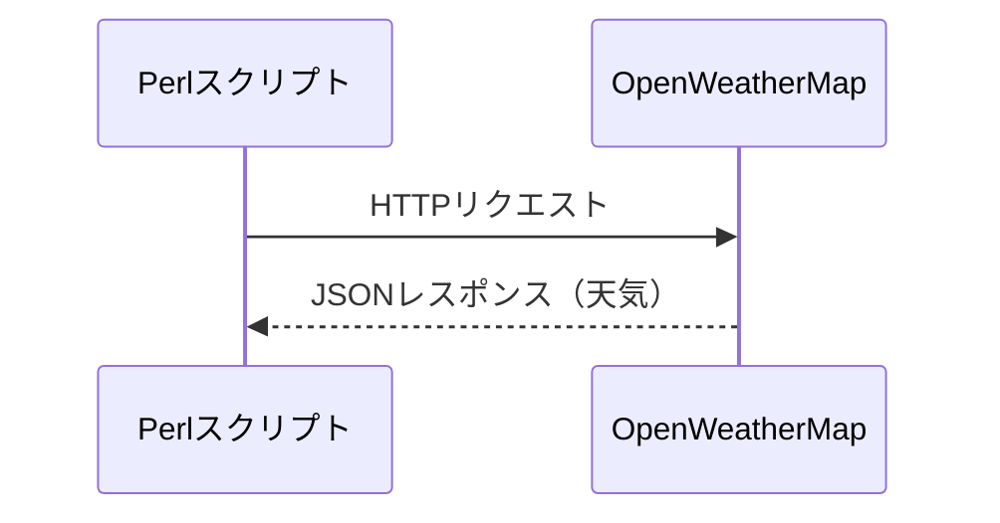

[@nqounet](https://x.com/nqounet)です。

前回までに、HTTP::TinyでHTTP通信を行い、JSON::PPでJSONを解析する方法を学びました。今回は、いよいよこの2つを組み合わせて **実際の天気情報** を取得します。



## 前回の振り返り

これまでのシリーズで学んだことを簡単に振り返ります。

- **第1回**: HTTP::TinyでWebからデータを取得する方法
- **第2回**: JSON::PPでJSONをPerlデータ構造に変換する方法

今回は、これらを組み合わせて **OpenWeatherMap API** から天気情報を取得します。

## OpenWeatherMap APIとは

### Web APIとは

**API（Application Programming Interface）** とは、あるプログラムの機能を外部から利用するための仕組みです。**Web API** は、HTTPを使ってインターネット経由で利用できるAPIのことです。



第1回でhttpbin.orgから「テストデータ」を取得しましたが、今回は「本物の天気情報」を取得します。

### OpenWeatherMapの特徴

**OpenWeatherMap** は、世界中の天気情報を提供する人気のWeb APIサービスです。

- 世界中の都市の現在の天気、予報、過去データを取得可能
- JSON形式でデータを返す
- 日本語での天気説明にも対応
- 無料プランでも十分に使える（60リクエスト/分）



### APIキーとは

OpenWeatherMap APIを使うには、**APIキー** が必要です。APIキーは、APIを利用するための「認証情報」のようなものです。

- 誰がAPIを利用しているかを識別する
- 利用量の制限や課金に使われる
- 他人に知られないように管理する必要がある

## APIキーを取得しよう

### 取得手順

OpenWeatherMapのAPIキーは、無料で取得できます。以下の手順に従ってください。

1. OpenWeatherMapの公式サイトにアクセス
2. 右上の「Sign In」をクリックし、「Create an Account」を選択
3. 必要な情報（メールアドレス、パスワード）を入力してアカウントを作成
4. 登録したメールアドレスに確認メールが届くので、リンクをクリック
5. ログイン後、「API keys」タブを開くと、デフォルトのAPIキーが表示される



**注意**: 新規作成したAPIキーが有効になるまで、最大で数時間かかる場合があります。

### APIキーの安全な管理

APIキーは、パスワードと同様に **秘密にすべき情報** です。コードに直接書き込むのは避け、**環境変数** を使って管理しましょう。

```shell
# シェルで環境変数を設定（一時的）
export OPENWEATHERMAP_API_KEY="あなたのAPIキー"

# 確認
echo $OPENWEATHERMAP_API_KEY
```

Perlスクリプト内では、以下のように環境変数からAPIキーを取得します。

```perl
my $api_key = $ENV{OPENWEATHERMAP_API_KEY}
    or die "環境変数 OPENWEATHERMAP_API_KEY を設定してください\n";
```

## 【コード例1】天気情報を取得してみよう

それでは、実際にOpenWeatherMap APIを呼び出してみましょう。第1回のHTTP::Tinyと第2回のJSON::PPを組み合わせます。

```perl
# Perl 5.14以降
# 外部依存: なし（HTTP::Tiny、JSON::PPはコアモジュール）

use strict;
use warnings;
use HTTP::Tiny;
use JSON::PP;

# 環境変数からAPIキーを取得
my $api_key = $ENV{OPENWEATHERMAP_API_KEY}
    or die "環境変数 OPENWEATHERMAP_API_KEY を設定してください\n";

# リクエストURL（東京の天気を取得、単位はメートル法、言語は日本語）
my $city = 'Tokyo';
my $url  = "https://api.openweathermap.org/data/2.5/weather?q=$city&appid=$api_key&units=metric&lang=ja";

# HTTPリクエストを送信
my $http = HTTP::Tiny->new(timeout => 10);
my $response = $http->get($url);

# エラーチェック
if (!$response->{success}) {
    die "HTTPエラー: $response->{status} $response->{reason}\n";
}

# JSONをPerlデータ構造に変換
my $data = decode_json($response->{content});

# 結果を確認（デバッグ用）
use Data::Dumper;
print Dumper($data);
```

このコードを`get_weather.pl`として保存し、実行してみてください。

```shell
export OPENWEATHERMAP_API_KEY="あなたのAPIキー"
perl get_weather.pl
```

成功すると、以下のようなデータ構造が表示されます。

```perl
$VAR1 = {
    'name' => 'Tokyo',
    'main' => {
        'temp' => 15.5,
        'humidity' => 60,
        ...
    },
    'weather' => [
        {
            'description' => '晴天',
            ...
        }
    ],
    ...
};
```

**コードのポイント**

- `timeout => 10` でタイムアウトを10秒に設定（ネットワークエラー対策）
- `units=metric` で気温を摂氏に設定（デフォルトはケルビン）
- `lang=ja` で天気説明を日本語に設定
- `$response->{success}` で成功/失敗を判定してからJSONを解析

## 【コード例2】取得した天気情報を表示しよう

デバッグ用の出力から、必要な情報だけを取り出して見やすく表示しましょう。

```perl
# Perl 5.14以降
# 外部依存: なし（HTTP::Tiny、JSON::PPはコアモジュール）

use strict;
use warnings;
use HTTP::Tiny;
use JSON::PP;

binmode STDOUT, ':utf8';

# 環境変数からAPIキーを取得
my $api_key = $ENV{OPENWEATHERMAP_API_KEY}
    or die "環境変数 OPENWEATHERMAP_API_KEY を設定してください\n";

# 取得する都市
my $city = 'Tokyo';

# リクエストURLを構築
my $url = "https://api.openweathermap.org/data/2.5/weather"
        . "?q=$city"
        . "&appid=$api_key"
        . "&units=metric"
        . "&lang=ja";

# HTTPリクエストを送信
my $http = HTTP::Tiny->new(timeout => 10);
my $response = $http->get($url);

# エラーチェック
if (!$response->{success}) {
    die "HTTPエラー: $response->{status} $response->{reason}\n";
}

# JSONをPerlデータ構造に変換
my $data = decode_json($response->{content});

# 必要なデータを取り出す
my $city_name   = $data->{name};
my $weather     = $data->{weather}[0]{description};
my $temp        = $data->{main}{temp};
my $humidity    = $data->{main}{humidity};

# 整形して表示
print "=" x 30, "\n";
print "  お天気チェッカー\n";
print "=" x 30, "\n";
print "都市: $city_name\n";
print "天気: $weather\n";
print "気温: ${temp}℃\n";
print "湿度: ${humidity}%\n";
print "=" x 30, "\n";
```

実行結果の例：

```text
==============================
  お天気チェッカー
==============================
都市: Tokyo
天気: 晴天
気温: 15.5℃
湿度: 60%
==============================
```

**ネストしたデータのアクセス方法（復習）**

第2回で学んだネストしたデータへのアクセス方法を使っています。

```perl
$data->{name}                    # 都市名（1階層目）
$data->{main}{temp}              # 気温（2階層目）
$data->{weather}[0]{description} # 天気説明（配列の0番目の中のハッシュ）
```

**URLの構築について**

コード例2では、URLを複数行に分けて構築しています。これはクエリパラメータが多い場合に読みやすくするためのテクニックです。

```perl
my $url = "https://api.openweathermap.org/data/2.5/weather"
        . "?q=$city"
        . "&appid=$api_key"
        . "&units=metric"
        . "&lang=ja";
```

Perlでは、文字列を `.` で連結できます。各パラメータが一目で分かるようになっています。

## まとめ

今回学んだことを振り返りましょう。

- **Web API** はHTTPを使ってインターネット経由で利用できるサービス
- **OpenWeatherMap** は天気情報を取得できる人気のAPI
- **APIキー** は環境変数で安全に管理する
- HTTP::TinyとJSON::PPを組み合わせてAPIから天気情報を取得できる
- `units=metric` で摂氏、`lang=ja` で日本語の天気説明を取得

### 次回予告

次回は、シリーズ最終回です。Mooシリーズで学んだオブジェクト指向を活かして **WeatherClientクラス** を実装し、お天気チェッカーを完成させます。`has`/`sub`、`required`/`default`、カプセル化、型制約を総動員します。お楽しみに！




