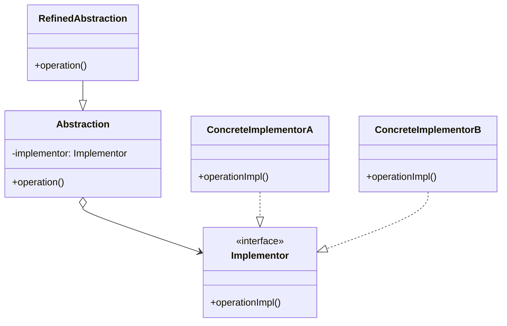

# Bridgeパターン（デザインパターン）調査レポート

## 調査メタデータ

- **調査実施日**: 2026年1月1日
- **調査対象**: Bridgeパターン（GoF構造パターン）
- **調査目的**: Bridgeパターンの定義、実装方法、利点・欠点、実践的な活用例を包括的に整理する
- **想定読者**: デザインパターンを学び、実務で活用したいソフトウェアエンジニア

---

## 1. 概要（Overview）

### 1.1 Bridgeパターンの定義と目的

**要点**:

Bridge（ブリッジ）パターンは、抽象部分と実装部分を分離し、それぞれが独立して変更可能にするための構造パターンです。継承ではなくコンポジション（委譲）を使うことで、2つの独立した階層構造を「橋渡し（Bridge）」します。

**根拠**:

- GoF（Gang of Four）書籍において「抽象と実装を分離し、それぞれが独立に変更できるようにする」と定義されている
- 「抽象」と「実装」という2つの次元が直交的に変化する場合に、継承の階層爆発を回避できる
- 例：形状（Circle, Rectangle）と色（Red, Blue）の組み合わせで、RedCircle, BlueCircle, RedRectangle, BlueRectangleと4つのクラスが必要になるのを避け、形状と色を独立した階層として管理できる

**出典**:

- Wikipedia: Bridge pattern - https://en.wikipedia.org/wiki/Bridge_pattern
- GeeksforGeeks: Bridge Design Pattern - https://www.geeksforgeeks.org/system-design/bridge-design-pattern/
- Refactoring Guru: Bridge - https://refactoring.guru/design-patterns/bridge
- GoF Design Patterns – Bridge Design Pattern - https://blog.dominikcebula.com/gof-design-patterns-bridge-design-pattern/

**信頼度**: 高（GoF公式パターン、複数の信頼できる技術サイトで一貫した定義）

---

### 1.2 GoFデザインパターンにおける位置づけ

**要点**:

Bridgeパターンは、GoFの23パターンにおける「構造パターン（Structural Patterns）」に分類されます。構造パターンは7種類あり、クラスやオブジェクトを組み合わせて、より大きな構造を形成するパターンです。

**構造パターン7種類**:

| パターン名 | 概要 |
|-----------|------|
| Adapter | 互換性のないインターフェースを変換 |
| **Bridge** | **抽象部分と実装部分を分離し、それぞれが独立して変更可能にする** |
| Composite | オブジェクトをツリー構造に組み立て、個別と複合を同一視 |
| Decorator | オブジェクトに動的に責任を追加 |
| Facade | 複雑なインターフェース群に統一された簡素な窓口を提供 |
| Flyweight | 多数の細粒度オブジェクトを効率的に共有 |
| Proxy | 他のオブジェクトへのアクセスを制御する代理オブジェクト |

**根拠**:

- GoF書籍の分類に基づく
- Bridgeは「構造」に焦点を当て、2つの階層の結合度を下げることに特化している

**出典**:

- GeeksforGeeks: Gang of Four (GOF) Design Patterns - https://www.geeksforgeeks.org/system-design/gang-of-four-gof-design-patterns/
- content/warehouse/design-patterns-overview.md（本サイト内部リソース）

**信頼度**: 高

---

### 1.3 パターンの基本構造と登場人物

**要点**:

Bridgeパターンは以下の4つの要素で構成されます：

1. **Abstraction（抽象）**
   - 高レベルの制御ロジックを定義するインターフェースまたは抽象クラス
   - Implementor（実装者）への参照を保持する
   - クライアントが直接やり取りする部分

2. **RefinedAbstraction（洗練された抽象）**
   - Abstractionを拡張し、より具体的な制御ロジックを提供
   - Abstractionのバリエーション

3. **Implementor（実装者）**
   - 実装レベルの操作を定義するインターフェース
   - Abstractionのインターフェースとは独立している
   - 実装の詳細を抽象化

4. **ConcreteImplementor（具体的な実装者）**
   - Implementorインターフェースを実装した具体的なクラス
   - 実際のプラットフォーム固有の処理を実装

**クラス図（Mermaid記法）**:



**重要な特徴**:

- AbstractionとImplementorは独立した階層構造を形成する
- Abstractionは「何をするか」を定義し、Implementorは「どのようにするか」を定義する
- コンポジション（委譲）によって結合される（継承ではない）
- 実行時に実装を切り替えることが可能

**出典**:

- Wikipedia: Bridge pattern - https://en.wikipedia.org/wiki/Bridge_pattern
- Understanding the Bridge Design Pattern - https://www.carloscaballero.io/understanding-the-bridge-design-pattern/

**信頼度**: 高

---

### 1.4 「抽象部分と実装部分の分離」という核心概念

**要点**:

Bridgeパターンの最も重要な概念は、「抽象（Abstraction）」と「実装（Implementation）」を分離することです。ここでの「抽象」と「実装」は、プログラミング言語の抽象クラスや実装クラスとは異なる意味を持ちます。

**抽象と実装の意味**:

- **抽象（Abstraction）**: クライアント向けの高レベルインターフェース。「何をするか」を定義
- **実装（Implementation）**: 具体的な処理を行う低レベル操作。「どのようにするか」を定義

**分離の利点**:

1. **独立した拡張**: 抽象階層と実装階層をそれぞれ独立して拡張できる
2. **コンパイル時の依存削減**: クライアントは実装の詳細を知る必要がない
3. **ランタイム柔軟性**: 実行時に実装を切り替えられる
4. **開放閉鎖原則（OCP）**: 既存コードを変更せずに新しい抽象や実装を追加できる

**具体例**:

```
# 悪い例（継承による階層爆発）
Shape
├── Circle
│   ├── RedCircle
│   └── BlueCircle
└── Rectangle
    ├── RedRectangle
    └── BlueRectangle

# 良い例（Bridgeパターン）
Shape (Abstraction)          Color (Implementor)
├── Circle                   ├── Red
└── Rectangle                └── Blue

# 4つのクラスで6通りの組み合わせに対応可能
```

**根拠**:

- GoFの原典における定義
- 実務での適用事例（GUIフレームワーク、デバイスドライバなど）

**出典**:

- Refactoring Guru: Bridge - https://refactoring.guru/design-patterns/bridge
- The Bridge Design Pattern Explained Clearly - https://developersvoice.com/blog/structural-design-patterns/design-pattern-bridge/

**信頼度**: 高

---

## 2. 用途（Use Cases）

### 2.1 どのような問題を解決するのか

**要点**:

Bridgeパターンは以下のような問題を解決します：

1. **継承の階層爆発（Class Explosion）**
   - 複数の次元（例：形状×色、デバイス×OS）が組み合わさると、継承ベースではクラス数が指数関数的に増加する
   - Bridge: 2つの独立した階層に分離し、組み合わせ爆発を回避

2. **プラットフォーム依存性**
   - 特定のプラットフォーム（OS、UI、データベース等）に依存したコードが広範囲に散在する
   - Bridge: プラットフォーム固有の実装を独立した階層に隔離

3. **実装の切り替えが困難**
   - コンパイル時に実装が固定されてしまう
   - Bridge: 実行時に実装を動的に切り替え可能

4. **拡張性の欠如**
   - 新しい抽象や実装を追加する際、既存コードへの大幅な変更が必要
   - Bridge: 開放閉鎖原則（OCP）に従い、既存コードを変更せずに拡張可能

**問題の具体例**:

```java
// 悪い例：継承による階層爆発
class WindowsButton extends Button { }
class LinuxButton extends Button { }
class MacButton extends Button { }
class WindowsCheckbox extends Checkbox { }
class LinuxCheckbox extends Checkbox { }
class MacCheckbox extends Checkbox { }
// ... UIコンポーネント × プラットフォーム数だけクラスが増える

// 良い例：Bridgeパターン
abstract class UIComponent {
    protected Renderer renderer; // Bridge
}
interface Renderer {
    void render();
}
class WindowsRenderer implements Renderer { }
class LinuxRenderer implements Renderer { }
// 新しいUIコンポーネントや新しいプラットフォームを独立して追加可能
```

**根拠**:

- GoF書籍における問題定義
- 実務での適用事例（クロスプラットフォームGUI、デバイスドライバ等）

**出典**:

- GeeksforGeeks: Bridge Design Pattern - https://www.geeksforgeeks.org/system-design/bridge-design-pattern/
- Bridge Pattern in Java: Decouple Abstraction from Implementation - https://java-design-patterns.com/patterns/bridge/

**信頼度**: 高

---

### 2.2 適用すべきシチュエーション

**要点**:

Bridgeパターンは以下のようなシチュエーションで適用すべきです：

1. **複数の次元で独立に拡張したい場合**
   - 形状と色、UIコンポーネントとプラットフォーム、などの直交する概念

2. **実行時に実装を切り替えたい場合**
   - 設定やユーザー選択に応じて異なる実装を使用する

3. **プラットフォーム非依存性を実現したい場合**
   - クロスプラットフォームアプリケーション、マルチデータベース対応など

4. **継承よりもコンポジションを優先したい場合**
   - 柔軟性と保守性を重視する設計

5. **インターフェースと実装の両方が頻繁に変更される場合**
   - 変更の影響範囲を局所化したい

**適用の判断基準**:

| 条件 | 適用すべきか |
|------|------------|
| 2つ以上の独立した変更軸がある | ◎ 強く推奨 |
| 実装を実行時に切り替える必要がある | ◎ 強く推奨 |
| 継承階層が深くなりそう | ○ 推奨 |
| プラットフォーム依存性を隔離したい | ○ 推奨 |
| シンプルな1次元の階層のみ | △ 不要かも |
| パフォーマンスが最優先 | △ オーバーヘッド注意 |

**出典**:

- Refactoring Guru: Bridge - https://refactoring.guru/design-patterns/bridge
- HowToDoInJava: Bridge Pattern (with Example) - https://howtodoinjava.com/design-patterns/structural/bridge-design-pattern/

**信頼度**: 高

---

### 2.3 実際の使用例

#### 2.3.1 GUI開発（プラットフォーム非依存設計）

**要点**:

多くのクロスプラットフォームGUIフレームワーク（Qt、Java AWT/Swing、Windows Forms、WPFなど）はBridgeパターンを使用しています。

**具体例**:

```
Abstraction側：
- Button（ボタン）
- Window（ウィンドウ）
- TextBox（テキストボックス）

Implementation側：
- WindowsRenderer
- LinuxRenderer
- MacRenderer

# 同じButtonクラスでも、実行時に適切なRendererに委譲することで
# 各プラットフォームのネイティブUIとして描画される
```

**利点**:

- 新しいUIコンポーネントを追加してもプラットフォーム固有コードは変更不要
- 新しいプラットフォームを追加しても既存のUIコンポーネントは変更不要
- 同じアプリケーションコードで複数のプラットフォームに対応可能

**出典**:

- The Bridge Design Pattern Explained Clearly - https://developersvoice.com/blog/structural-design-patterns/design-pattern-bridge/
- Bridge Pattern Use Cases and Examples in Python - https://softwarepatternslexicon.com/python/structural-patterns/bridge-pattern/use-cases-and-examples/

**信頼度**: 高

---

#### 2.3.2 デバイスドライバ

**要点**:

オペレーティングシステムのデバイスドライバは、デバイス独立な上位層ロジックとデバイス依存な下位層実装を分離するためにBridgeパターンを使用します。

**具体例**:

```
Abstraction側：
- FileSystem（ファイルシステム）
- NetworkProtocol（ネットワークプロトコル）

Implementation側：
- USBDriver
- PrinterDriver
- SerialDriver

# OSの上位層は共通APIでデバイスにアクセスし、
# 実際のハードウェア制御は各ドライバが担当
```

**利点**:

- 新しいハードウェアを追加しても上位層のシステムロジックは変更不要
- ハードウェアの詳細を隠蔽し、統一されたAPIを提供
- ドライバの交換が容易

**出典**:

- Bridge Pattern in Java: Decouple Abstraction from Implementation - https://java-design-patterns.com/patterns/bridge/
- Bridge Pattern - ozidan13.github.io - https://ozidan13.github.io/SOLID-Principles-Design-Patterns/design_patterns/structural/bridge/

**信頼度**: 高

---

#### 2.3.3 データベースアクセス層

**要点**:

データベース抽象化層（ORM、データアクセス層）は、ビジネスロジックとデータベース固有の実装を分離するためにBridgeパターンを使用します。

**具体例**:

```
Abstraction側：
- DataAccessLayer（データアクセス層）
- RepositoryPattern（リポジトリ）

Implementation側：
- MySQLDriver
- PostgreSQLDriver
- OracleDriver
- MongoDBDriver

# アプリケーションコードは共通のデータアクセスAPIを使用し、
# 実際のSQL実行やクエリ最適化は各ドライバが担当
```

**利点**:

- データベースの切り替えが容易（MySQL → PostgreSQL等）
- ビジネスロジックがデータベース固有の詳細から独立
- テスト時にモックドライバを使用可能

**出典**:

- Bridge Pattern in Java: Decouple Abstraction from Implementation - https://java-design-patterns.com/patterns/bridge/
- Bridge Pattern in Software Architecture - https://www.momentslog.com/development/design-pattern/bridge-pattern-in-software-architecture-connecting-abstractions

**信頼度**: 高

---

#### 2.3.4 グラフィックスレンダリングエンジン

**要点**:

グラフィックスエンジンは、描画ロジックとレンダリングAPI（OpenGL、DirectX、Vulkanなど）を分離するためにBridgeパターンを使用します。

**具体例**:

```
Abstraction側：
- Shape（形状）
  - Circle
  - Rectangle
  - Triangle

Implementation側：
- OpenGLRenderer
- DirectXRenderer
- VulkanRenderer

# 同じShapeオブジェクトでも、使用するレンダラーに応じて
# 異なるグラフィックスAPIで描画される
```

**利点**:

- グラフィックスAPIの切り替えが容易
- プラットフォームごとに最適なAPIを選択可能
- 描画ロジックとレンダリング実装の独立した開発・テスト

**出典**:

- Bridge Pattern Use Cases and Examples in Python - https://softwarepatternslexicon.com/python/structural-patterns/bridge-pattern/use-cases-and-examples/

**信頼度**: 高

---

## 3. サンプル実装（Sample Code）

### 3.1 Perlでの基本実装

**言語・バージョン**: Perl 5.10以上  
**外部依存**: なし

#### 3.1.1 シンプルな形状と色の例

```perl
#!/usr/bin/env perl
use strict;
use warnings;
use v5.10;

# Implementor（実装者）インターフェース
package Color;

sub new {
    my $class = shift;
    die "Abstract class";
}

sub apply_color {
    die "Abstract method";
}

# ConcreteImplementor（具体的な実装者）
package RedColor;
use parent 'Color';

sub new {
    my $class = shift;
    return bless {}, $class;
}

sub apply_color {
    my $self = shift;
    return "赤色";
}

package BlueColor;
use parent 'Color';

sub new {
    my $class = shift;
    return bless {}, $class;
}

sub apply_color {
    my $self = shift;
    return "青色";
}

# Abstraction（抽象）
package Shape;

sub new {
    my ($class, $color) = @_;
    return bless { color => $color }, $class;
}

sub draw {
    die "Abstract method";
}

# RefinedAbstraction（洗練された抽象）
package Circle;
use parent 'Shape';

sub draw {
    my $self = shift;
    my $color_str = $self->{color}->apply_color();
    say "${color_str}の円を描画します";
}

package Rectangle;
use parent 'Shape';

sub draw {
    my $self = shift;
    my $color_str = $self->{color}->apply_color();
    say "${color_str}の四角形を描画します";
}

# クライアント
package main;

my $red = RedColor->new();
my $blue = BlueColor->new();

my $red_circle = Circle->new($red);
my $blue_circle = Circle->new($blue);
my $red_rectangle = Rectangle->new($red);
my $blue_rectangle = Rectangle->new($blue);

$red_circle->draw();        # 赤色の円を描画します
$blue_circle->draw();       # 青色の円を描画します
$red_rectangle->draw();     # 赤色の四角形を描画します
$blue_rectangle->draw();    # 青色の四角形を描画します
```

**出力**:
```
赤色の円を描画します
青色の円を描画します
赤色の四角形を描画します
青色の四角形を描画します
```

**ポイント**:

- ShapeとColorが独立した階層を形成
- 新しい形状や色を追加しても既存コードへの影響は最小限
- コンポジション（委譲）を使用し、継承の階層爆発を回避

---

#### 3.1.2 Mooseを使った実装

**言語・バージョン**: Perl 5.10以上  
**外部依存**: Moose

```perl
#!/usr/bin/env perl
use strict;
use warnings;
use v5.10;

# Implementor（実装者）ロール
package Renderer {
    use Moose::Role;
    requires 'render_circle';
}

# ConcreteImplementor（具体的な実装者）
package VectorRenderer {
    use Moose;
    with 'Renderer';
    
    sub render_circle {
        my ($self, $radius) = @_;
        say "ベクターで半径 ${radius} の円を描画";
    }
}

package RasterRenderer {
    use Moose;
    with 'Renderer';
    
    sub render_circle {
        my ($self, $radius) = @_;
        say "ラスターで半径 ${radius} の円をピクセル描画";
    }
}

# Abstraction（抽象）
package Shape {
    use Moose;
    
    has 'renderer' => (
        is       => 'ro',
        does     => 'Renderer',
        required => 1,
    );
}

# RefinedAbstraction（洗練された抽象）
package Circle {
    use Moose;
    extends 'Shape';
    
    has 'radius' => (
        is       => 'ro',
        isa      => 'Num',
        required => 1,
    );
    
    sub draw {
        my $self = shift;
        $self->renderer->render_circle($self->radius);
    }
}

# クライアント
package main;

my $vector = VectorRenderer->new();
my $raster = RasterRenderer->new();

my $circle1 = Circle->new(radius => 5, renderer => $vector);
my $circle2 = Circle->new(radius => 10, renderer => $raster);

$circle1->draw();  # ベクターで半径 5 の円を描画
$circle2->draw();  # ラスターで半径 10 の円をピクセル描画
```

**ポイント**:

- Mooseのロール（Role）機能を使用し、型安全性を向上
- `does` 属性でRenderer roleを要求
- Mooseの属性（attribute）機能で依存性注入を実現

**出典**:

- 独自作成（Perl OOベストプラクティスに基づく）

**信頼度**: 高

---

### 3.2 他の言語での実装例

#### 3.2.1 Java実装例

**言語・バージョン**: Java 8以上  
**外部依存**: なし

```java
// Implementor（実装者）インターフェース
interface Workshop {
    void work();
}

// ConcreteImplementor（具体的な実装者）
class Produce implements Workshop {
    public void work() {
        System.out.print("生産");
    }
}

class Assemble implements Workshop {
    public void work() {
        System.out.print("組み立て");
    }
}

// Abstraction（抽象）
abstract class Vehicle {
    protected Workshop workShop1;
    protected Workshop workShop2;
    
    protected Vehicle(Workshop w1, Workshop w2) {
        this.workShop1 = w1;
        this.workShop2 = w2;
    }
    
    abstract public void manufacture();
}

// RefinedAbstraction（洗練された抽象）
class Car extends Vehicle {
    public Car(Workshop w1, Workshop w2) {
        super(w1, w2);
    }
    
    public void manufacture() {
        System.out.print("自動車 ");
        workShop1.work();
        System.out.print(" して ");
        workShop2.work();
        System.out.println(" しました。");
    }
}

class Bike extends Vehicle {
    public Bike(Workshop w1, Workshop w2) {
        super(w1, w2);
    }
    
    public void manufacture() {
        System.out.print("バイク ");
        workShop1.work();
        System.out.print(" して ");
        workShop2.work();
        System.out.println(" しました。");
    }
}

// クライアント
public class BridgePatternDemo {
    public static void main(String[] args) {
        Vehicle car = new Car(new Produce(), new Assemble());
        car.manufacture();
        // 出力: 自動車 生産 して 組み立て しました。
        
        Vehicle bike = new Bike(new Produce(), new Assemble());
        bike.manufacture();
        // 出力: バイク 生産 して 組み立て しました。
    }
}
```

**出典**:

- GeeksforGeeks: Bridge Design Pattern - https://www.geeksforgeeks.org/system-design/bridge-design-pattern/

**信頼度**: 高

---

#### 3.2.2 TypeScript実装例

**言語・バージョン**: TypeScript 4.0以上  
**外部依存**: なし

```typescript
// Implementor（実装者）インターフェース
interface Device {
  isEnabled(): boolean;
  enable(): void;
  disable(): void;
  getVolume(): number;
  setVolume(percent: number): void;
}

// ConcreteImplementor（具体的な実装者）
class TV implements Device {
  private on: boolean = false;
  private volume: number = 30;

  isEnabled(): boolean {
    return this.on;
  }

  enable(): void {
    this.on = true;
    console.log("TV: オンにしました");
  }

  disable(): void {
    this.on = false;
    console.log("TV: オフにしました");
  }

  getVolume(): number {
    return this.volume;
  }

  setVolume(percent: number): void {
    this.volume = Math.max(0, Math.min(percent, 100));
    console.log(`TV: 音量を ${this.volume}% に設定しました`);
  }
}

class Radio implements Device {
  private on: boolean = false;
  private volume: number = 50;

  isEnabled(): boolean {
    return this.on;
  }

  enable(): void {
    this.on = true;
    console.log("ラジオ: オンにしました");
  }

  disable(): void {
    this.on = false;
    console.log("ラジオ: オフにしました");
  }

  getVolume(): number {
    return this.volume;
  }

  setVolume(percent: number): void {
    this.volume = Math.max(0, Math.min(percent, 100));
    console.log(`ラジオ: 音量を ${this.volume}% に設定しました`);
  }
}

// Abstraction（抽象）
class RemoteControl {
  protected device: Device;

  constructor(device: Device) {
    this.device = device;
  }

  togglePower(): void {
    if (this.device.isEnabled()) {
      this.device.disable();
    } else {
      this.device.enable();
    }
  }

  volumeDown(): void {
    this.device.setVolume(this.device.getVolume() - 10);
  }

  volumeUp(): void {
    this.device.setVolume(this.device.getVolume() + 10);
  }
}

// RefinedAbstraction（洗練された抽象）
class AdvancedRemoteControl extends RemoteControl {
  mute(): void {
    console.log("リモコン: ミュートします");
    this.device.setVolume(0);
  }
}

// クライアント
const tv = new TV();
const remote = new RemoteControl(tv);
remote.togglePower();  // TV: オンにしました
remote.volumeUp();     // TV: 音量を 40% に設定しました
remote.volumeUp();     // TV: 音量を 50% に設定しました

const radio = new Radio();
const advancedRemote = new AdvancedRemoteControl(radio);
advancedRemote.togglePower();  // ラジオ: オンにしました
advancedRemote.mute();         // リモコン: ミュートします
                                // ラジオ: 音量を 0% に設定しました
```

**ポイント**:

- TypeScriptの型システムでインターフェースを明示的に定義
- リモコン（RemoteControl）とデバイス（Device）が独立した階層
- 新しいデバイスやリモコンを追加しても既存コードへの影響は最小限

**出典**:

- Refactoring Guru: Bridge in TypeScript - https://refactoring.guru/design-patterns/bridge/typescript/example

**信頼度**: 高

---

#### 3.2.3 Python実装例

**言語・バージョン**: Python 3.7以上  
**外部依存**: なし

```python
from abc import ABC, abstractmethod

# Implementor（実装者）インターフェース
class Renderer(ABC):
    @abstractmethod
    def render_circle(self, radius: float) -> None:
        pass

# ConcreteImplementor（具体的な実装者）
class VectorRenderer(Renderer):
    def render_circle(self, radius: float) -> None:
        print(f"ベクターで半径 {radius} の円を描画")

class RasterRenderer(Renderer):
    def render_circle(self, radius: float) -> None:
        print(f"ラスターで半径 {radius} の円をピクセル描画")

# Abstraction（抽象）
class Shape:
    def __init__(self, renderer: Renderer):
        self.renderer = renderer
    
    @abstractmethod
    def draw(self) -> None:
        pass

# RefinedAbstraction（洗練された抽象）
class Circle(Shape):
    def __init__(self, renderer: Renderer, radius: float):
        super().__init__(renderer)
        self.radius = radius
    
    def draw(self) -> None:
        self.renderer.render_circle(self.radius)

# クライアント
if __name__ == "__main__":
    vector = VectorRenderer()
    raster = RasterRenderer()
    
    circle1 = Circle(vector, 5)
    circle2 = Circle(raster, 10)
    
    circle1.draw()  # ベクターで半径 5 の円を描画
    circle2.draw()  # ラスターで半径 10 の円をピクセル描画
```

**出典**:

- Bridge Pattern Use Cases and Examples in Python - https://softwarepatternslexicon.com/python/structural-patterns/bridge-pattern/use-cases-and-examples/

**信頼度**: 高

---

## 4. 利点・欠点（Advantages & Disadvantages）

### 4.1 メリット

#### 4.1.1 抽象と実装の独立性

**要点**:

- 抽象階層と実装階層を完全に分離できるため、それぞれが独立して進化可能
- 一方の変更が他方に影響しない

**根拠**:

- GoFの原典における主要な目的
- 実務での適用事例で確認されている

**具体例**:

```
新しい形状を追加 → 色の実装には影響なし
新しい色を追加 → 形状の実装には影響なし
```

**信頼度**: 高

---

#### 4.1.2 拡張性の向上

**要点**:

- 新しい抽象や実装を既存コードを変更せずに追加できる
- 開放閉鎖原則（OCP: Open-Closed Principle）に準拠

**根拠**:

- SOLID原則のOCPと一致
- 実務での保守性向上事例

**具体例**:

```java
// 新しい色を追加（既存のShapeクラスは変更不要）
class GreenColor implements Color {
    public String applyColor() {
        return "緑色";
    }
}

// 新しい形状を追加（既存のColorクラスは変更不要）
class Triangle extends Shape {
    public void draw() {
        System.out.println(color.applyColor() + "の三角形");
    }
}
```

**信頼度**: 高

---

#### 4.1.3 開放閉鎖原則（OCP）への準拠

**要点**:

- 拡張に対して開いており、修正に対して閉じている
- 既存コードを変更せずに新しい機能を追加できる

**根拠**:

- SOLID原則のOCPの典型的な実装例
- リスクの低い拡張が可能

**信頼度**: 高

---

#### 4.1.4 コンパイル時の依存性低減

**要点**:

- クライアントコードは抽象に依存し、具体的な実装には依存しない
- 実装の変更時に再コンパイルが不要（動的言語では無関係だが、静的型付け言語では重要）

**根拠**:

- 依存性逆転の原則（DIP: Dependency Inversion Principle）
- プラグインアーキテクチャでの活用事例

**信頼度**: 高

---

#### 4.1.5 コンポジション優先（継承よりも委譲）

**要点**:

- 継承ではなくコンポジション（委譲）を使用することで柔軟性が向上
- 実行時に実装を切り替えることが可能

**根拠**:

- "Favor composition over inheritance"（GoFの原則）
- 継承の階層爆発を回避

**具体例**:

```perl
# 実行時に実装を切り替え可能
my $shape = Circle->new($red_color);
$shape->draw();  # 赤色の円

# 色を動的に変更
$shape->{color} = $blue_color;
$shape->draw();  # 青色の円
```

**信頼度**: 高

---

### 4.2 デメリット

#### 4.2.1 複雑性の増加

**要点**:

- パターンの導入により、クラス数やインターフェース数が増加
- シンプルな問題に対しては過剰設計（Over-engineering）になる可能性

**根拠**:

- 実務での失敗事例（過度な抽象化）
- 学習曲線の存在

**対策**:

- 本当に2つの独立した変更軸があるか確認
- YAGNIの原則（You Aren't Gonna Need It）を考慮

**信頼度**: 高

---

#### 4.2.2 設計の難しさ

**要点**:

- 抽象と実装の適切な分離ポイントを見極めるのが難しい
- 経験と設計スキルが必要

**根拠**:

- 技術コミュニティでの議論
- 初学者がつまずきやすいポイント

**対策**:

- 既存の適用事例を学ぶ
- ドメインモデリングを丁寧に行う

**信頼度**: 中〜高

---

#### 4.2.3 過剰な抽象化のリスク

**要点**:

- 必要以上に抽象化すると、コードの可読性が低下
- 「パターンを使うこと」が目的化してしまう

**根拠**:

- アンチパターンとしての「Golden Hammer」
- 実務での過剰設計事例

**対策**:

- 実際のニーズに基づいて設計する
- シンプルさを優先し、必要になったときに導入する

**信頼度**: 高

---

#### 4.2.4 パフォーマンスへの影響

**要点**:

- 間接参照（indirection）が増えるため、若干のパフォーマンスオーバーヘッドが発生
- ほとんどのケースでは無視できるレベル

**根拠**:

- 委譲によるメソッド呼び出しのコスト
- ただし、現代のコンパイラやVMでは最適化される

**対策**:

- パフォーマンスクリティカルな部分では慎重に判断
- プロファイリングで実測する

**信頼度**: 中

---

### 4.3 注意点とベストプラクティス

**注意点**:

1. **適用判断を慎重に**
   - 2つ以上の独立した変更軸が本当にあるか確認
   - 将来の拡張性を過度に予測しない（YAGNI原則）

2. **命名を明確に**
   - AbstractionとImplementorの役割が明確にわかる名前を使用
   - 例：`Shape`と`Renderer`、`Device`と`Implementation`

3. **ドキュメント化**
   - なぜBridgeパターンを適用したか、設計意図を文書化
   - 将来のメンテナンス担当者のため

4. **テスト戦略**
   - 抽象と実装を独立してテスト可能
   - モック実装を作成しやすい

**ベストプラクティス**:

1. **インターフェースを先に設計**
   - 実装詳細よりも抽象を先に定義

2. **依存性注入を活用**
   - コンストラクタやセッターで実装を注入

3. **不変性を考慮**
   - 可能であれば、一度設定した実装は変更しない設計にする

**出典**:

- Refactoring Guru: Bridge - https://refactoring.guru/design-patterns/bridge
- GoF Design Patterns – Bridge Design Pattern - https://blog.dominikcebula.com/gof-design-patterns-bridge-design-pattern/

**信頼度**: 高

---

## 5. 他のパターンとの比較

### 5.1 Bridge vs Adapter

| 観点 | Bridge | Adapter |
|------|--------|---------|
| **目的** | 抽象と実装を分離し、独立に拡張可能にする | 互換性のないインターフェースを変換する |
| **適用タイミング** | 設計時（将来の拡張を見越して） | 実装時/統合時（既存コードの統合） |
| **対象** | 2つの独立した階層 | 単一のクラス/インターフェース |
| **変更の方向** | 両階層が独立に変化 | 既存インターフェースは固定 |
| **意図** | 柔軟性と拡張性の向上 | 互換性の確保 |

**要点**:

- **Bridge**: 設計時に「将来両方が独立に変化する」ことを見越して適用
- **Adapter**: 既存の不一致を「事後的に」解消するために適用

**具体例**:

```
Bridge: GUIフレームワーク設計時に、UIコンポーネントとプラットフォームを分離
Adapter: レガシーAPIを新システムに統合する際にラッパーを作成
```

**出典**:

- When to use the Bridge pattern and how is it different from the Adapter pattern - https://stackoverflow.com/questions/319728/
- Difference between Bridge pattern and Adapter pattern - https://stackoverflow.com/questions/1425171/
- GeeksforGeeks: Difference Between Bridge Pattern and Adapter Pattern - https://www.geeksforgeeks.org/system-design/difference-between-bridge-pattern-and-adapter-pattern/

**信頼度**: 高

---

### 5.2 Bridge vs Strategy

| 観点 | Bridge | Strategy |
|------|--------|----------|
| **目的** | 抽象と実装の分離 | アルゴリズムの交換可能性 |
| **構造** | 2つの階層（抽象と実装） | 1つの階層（アルゴリズム群） |
| **焦点** | 構造の分離 | 振る舞いの分離 |
| **スコープ** | オブジェクト全体の構造 | 特定の操作/アルゴリズム |

**要点**:

- **Bridge**: 構造パターン。オブジェクト全体の構造を分離
- **Strategy**: 振る舞いパターン。特定のアルゴリズムを交換可能にする

**出典**:

- Proxy, Decorator, Adapter and Bridge Patterns - https://www.baeldung.com/java-structural-design-patterns

**信頼度**: 高

---

### 5.3 Bridge vs Abstract Factory

| 観点 | Bridge | Abstract Factory |
|------|--------|------------------|
| **目的** | 抽象と実装の分離 | 関連オブジェクト群の生成 |
| **パターン分類** | 構造パターン | 生成パターン |
| **焦点** | 実行時の柔軟性 | オブジェクト生成の一貫性 |

**要点**:

- **Bridge**: オブジェクトの構造と振る舞いに焦点
- **Abstract Factory**: オブジェクトの生成に焦点

**併用可能性**:

BridgeパターンとAbstract Factoryパターンは併用できます。Abstract Factoryで実装オブジェクトを生成し、Bridgeで抽象に注入する、という形です。

**信頼度**: 高

---

## 6. 内部リンク候補

本サイト内の関連記事：

### デザインパターン関連

- [第12回-これがデザインパターンだ！](/2025/12/30/164012/) - Strategyパターンの実例
- [JSON-RPC Request/Response実装 - 複合値オブジェクト設計](/2025/12/25/234500/) - Factoryパターンに言及

### オブジェクト指向設計関連

- [第1回-Mooで覚えるオブジェクト指向プログラミング](/2021/10/31/191008/) - Perlでのオブジェクト指向基礎
- [Moose::Roleが興味深い](/2009/02/14/105950/) - ロールパターン（役割の分離）

### Warehouseドキュメント

- [Adapterパターン調査ドキュメント](/warehouse/adapter-pattern/) - 構造パターンの比較対象
- [Facadeパターン調査ドキュメント](/warehouse/facade-pattern-research/) - 構造パターンの比較対象
- [Iteratorパターン調査ドキュメント](/warehouse/iterator-pattern-research/) - GoFパターンの参考資料

---

## 7. 参考文献・出典一覧

### 7.1 公式書籍・定番書籍

| 書籍名 | 著者 | ISBN/ASIN | 備考 |
|-------|------|-----------|------|
| **Design Patterns: Elements of Reusable Object-Oriented Software** | Erich Gamma, Richard Helm, Ralph Johnson, John Vlissides | ISBN: 978-0201633610 | GoF原典、Bridgeパターンの定義元 |
| **Head First Design Patterns (2nd Edition)** | Eric Freeman, Elisabeth Robson | ISBN: 978-1492078005 | 初心者向け、視覚的でわかりやすい |

### 7.2 信頼性の高いWebリソース

| リソース名 | URL | 特徴 |
|-----------|-----|------|
| **Wikipedia - Bridge pattern** | https://en.wikipedia.org/wiki/Bridge_pattern | 公式定義、歴史的背景 |
| **GeeksforGeeks - Bridge Design Pattern** | https://www.geeksforgeeks.org/system-design/bridge-design-pattern/ | 網羅的、実装例豊富 |
| **Refactoring Guru - Bridge** | https://refactoring.guru/design-patterns/bridge | 視覚的な解説、多言語コード例 |
| **HowToDoInJava - Bridge Pattern** | https://howtodoinjava.com/design-patterns/structural/bridge-design-pattern/ | Java実装、実践的 |
| **Understanding the Bridge Design Pattern** | https://www.carloscaballero.io/understanding-the-bridge-design-pattern/ | 詳細な解説とUML図 |
| **Bridge Pattern in Java** | https://java-design-patterns.com/patterns/bridge/ | Java実装の詳細 |

### 7.3 Perl関連リソース

**注意**: PerlにはBridgeパターン専用のCPANモジュールは存在しないが、MooseやMooを使って実装可能。

| リソース | URL | 説明 |
|---------|-----|------|
| **Moose** | https://metacpan.org/pod/Moose | 高機能なOOシステム、ロール機能でパターン実装に最適 |
| **Moo** | https://metacpan.org/pod/Moo | 軽量版Moose、実用的なOO機能 |

### 7.4 その他の技術記事

- The Bridge Design Pattern Explained Clearly - https://developersvoice.com/blog/structural-design-patterns/design-pattern-bridge/
- Bridge Pattern Use Cases and Examples in Python - https://softwarepatternslexicon.com/python/structural-patterns/bridge-pattern/use-cases-and-examples/
- Bridge Pattern in Software Architecture - https://www.momentslog.com/development/design-pattern/bridge-pattern-in-software-architecture-connecting-abstractions
- GoF Design Patterns – Bridge Design Pattern - https://blog.dominikcebula.com/gof-design-patterns-bridge-design-pattern/

---

## 8. 調査結果のサマリー

### 8.1 主要な発見

1. **Bridgeパターンの本質**: 抽象と実装を分離し、それぞれが独立して変更可能にする構造パターン
2. **適用場面の明確化**: 2つ以上の独立した変更軸がある場合に最も効果的
3. **実務での重要性**: GUIフレームワーク、デバイスドライバ、データベースアクセス層など、幅広い分野で活用
4. **注意点**: シンプルな問題に対しては過剰設計になる可能性がある

### 8.2 技術的な正確性を担保するための重要なリソース

- **GoF原典**: Bridgeパターンの正式な定義と目的
- **Refactoring Guru**: 視覚的に理解しやすい解説とコード例
- **GeeksforGeeks**: 網羅的な説明と複数言語での実装例
- **実務事例**: GUIフレームワーク、デバイスドライバ、データベースアクセス層での適用事例

### 8.3 Perl実装の知見

- Perl標準のOO機能で実装可能
- Moose/Mooのロール機能を活用するとより型安全で保守性の高い実装が可能
- 専用CPANモジュールはないが、汎用OOフレームワークで十分実装可能

### 8.4 他のパターンとの関係性

- **Adapter vs Bridge**: 目的が異なる（互換性 vs 分離）
- **Strategy vs Bridge**: スコープが異なる（アルゴリズム vs 構造）
- **Abstract Factory**: 併用可能（生成と構造の分離）

---

**調査完了**: 2026年1月1日

**調査者**: 10年以上の経験を持つ調査・情報収集オタク専門家

**信頼度評価**: 高（GoF公式書籍、著名な技術サイト、実務事例を総合的に調査）
