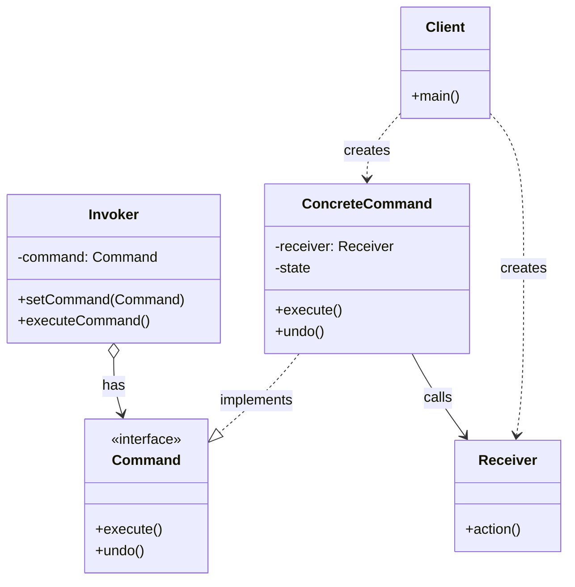

# Commandパターン調査ドキュメント

## 調査目的

Commandパターン（GoF振る舞いパターンの一つ）について、最新かつ信頼性の高い情報を収集し、概要、用途、実装例、利点・欠点を詳細にまとめる。

- **調査対象**: Commandパターンの構造、実装例、実世界での活用事例
- **想定読者**: デザインパターンを実務で活用したいソフトウェアエンジニア
- **調査実施日**: 2025年12月31日

---

## 1. Commandパターンの概要

### 1.1 定義

**要点**:

- Commandパターンは、リクエスト（操作や命令）をオブジェクトとしてカプセル化する振る舞いパターンである
- リクエストの送信者（Invoker）と受信者（Receiver）を分離し、疎結合な設計を実現する
- コマンドをオブジェクト化することで、パラメータ化、キューイング、ログ記録、Undo/Redo機能などが実現可能になる

**根拠**:

- GoF「Design Patterns」書籍において、Commandパターンは「リクエストをオブジェクトとして扱い、異なるリクエストでクライアントをパラメータ化し、リクエストをキューに入れたり、ログに記録したり、操作の取り消しをサポートする」と定義されている
- 振る舞いパターンの一種として、オブジェクト間の責任分担とコミュニケーションを管理する

**仮定**:

- Commandパターンは、GUI操作、トランザクション処理、タスクスケジューリングなど、操作を遅延実行または記録する必要がある場面で有効

**出典**:

- Wikipedia: Command pattern - https://en.wikipedia.org/wiki/Command_pattern
- GeeksforGeeks: Command Design Pattern - https://www.geeksforgeeks.org/system-design/command-pattern/
- Refactoring Guru: Command - https://refactoring.guru/design-patterns/command

**信頼度**: 高（GoF原典および複数の信頼できる技術サイト）

---

### 1.2 GoFデザインパターンにおける位置づけ

**要点**:

GoFデザインパターンは以下の3つに分類され、Commandパターンは**振る舞いパターン（Behavioral Patterns）**に属する。

| カテゴリ | パターン数 | Commandの位置づけ |
|---------|-----------|------------------|
| 生成パターン | 5 | - |
| 構造パターン | 7 | - |
| **振る舞いパターン** | **11** | **Commandはこの中の一つ** |

振る舞いパターン全11種類：

1. Chain of Responsibility
2. **Command** ← 本調査対象
3. Interpreter
4. Iterator
5. Mediator
6. Memento
7. Observer
8. State
9. Strategy
10. Template Method
11. Visitor

**根拠**:

- GoF書籍の構成および分類基準に基づく
- 振る舞いパターンは、オブジェクト間の責任分担とアルゴリズムの割り当てに焦点を当てる

**出典**:

- GeeksforGeeks: Gang of Four (GOF) Design Patterns - https://www.geeksforgeeks.org/system-design/gang-of-four-gof-design-patterns/
- Coursera: Gang of Four Design Patterns - https://www.coursera.org/articles/gang-of-four-design-patterns

**信頼度**: 高

---

### 1.3 パターンの基本構造と構成要素

**要点**:

Commandパターンは、以下の5つの主要コンポーネントで構成される。

#### UML構造図（Mermaid表現）



#### 5つの構成要素

| 要素 | 役割 | 具体例 |
|-----|------|--------|
| **Command (インターフェース)** | コマンドの実行メソッド（execute）を宣言 | `interface Command { void execute(); }` |
| **ConcreteCommand** | Commandインターフェースを実装し、Receiverとアクションを結びつける | `LightOnCommand`, `LightOffCommand` |
| **Receiver** | 実際の処理を知っているオブジェクト。ConcreteCommandから呼び出される | `Light`, `Door`, `TV` |
| **Invoker** | コマンドの実行を依頼するオブジェクト。処理の詳細を知らない | `RemoteControl`, `MenuItem` |
| **Client** | ConcreteCommandオブジェクトを生成し、ReceiverとInvokerを設定 | アプリケーションの初期化コード |

**根拠**:

- GoF書籍のCommandパターンの章に記載されている標準的な構造
- 複数の信頼できる技術文献で同様の構造が説明されている

**出典**:

- Visual Paradigm: Command Pattern Tutorial - https://tutorials.visual-paradigm.com/command-pattern-tutorial/
- GeeksforGeeks: Command Design Pattern - https://www.geeksforgeeks.org/system-design/command-pattern/
- Baeldung: The Command Pattern in Java - https://www.baeldung.com/java-command-pattern

**信頼度**: 高

---

## 2. Commandパターンの用途

### 2.1 どのような場面で使用されるか

**要点**:

Commandパターンは、以下のような場面で効果的に使用される。

| 用途 | 説明 | 典型的なシナリオ |
|-----|------|-----------------|
| **Undo/Redo機能** | 操作の履歴を保存し、元に戻す・やり直す機能を実装 | テキストエディタ、グラフィックツール、CADソフト |
| **GUIアクション** | ボタンやメニュー項目のアクションをコマンドオブジェクトとして実装 | メニューバー、ツールバー、コンテキストメニュー |
| **タスクキューイング** | 実行すべきタスクをキューに格納し、順次または並列に処理 | ジョブスケジューラ、非同期タスク処理、ワーカープール |
| **トランザクション管理** | データベース操作などをコマンドとして表現し、ロールバック可能にする | ORM、トランザクションシステム、バッチ処理 |
| **マクロ記録/再生** | ユーザーの操作を記録し、後で再生する | オフィスソフトのマクロ、テストの自動化、RPA |
| **ログ記録と監査** | 実行された操作を記録し、後で検証や分析を行う | 監査ログ、イベントソーシング、CQRS |
| **リモート実行** | ネットワーク越しにコマンドを送信し、リモートで実行 | RPC、分散システム、リモートコントロールAPI |

**具体例**:

1. **Photoshop**: 各編集操作（フィルタ適用、レイヤー追加など）がコマンドオブジェクトとして実装され、Undo/Redoスタックで管理される
2. **Microsoft Word**: メニューやツールバーのアクションがコマンドパターンで実装され、キーボードショートカットとの紐付けが容易になる
3. **AWS SQS / RabbitMQ**: メッセージキューにタスクをコマンドとして格納し、ワーカーが順次処理する
4. **スマートホーム**: リモコンのボタンが各デバイスへのコマンドオブジェクトを保持し、デバイスの実装を知らずに操作できる

**根拠**:

- 実際のソフトウェアプロダクトでの採用事例が多数報告されている
- GUI フレームワーク（Swing, Qt, WPF）でCommandパターンが使用されている

**出典**:

- GeeksforGeeks: Command Design Pattern - https://www.geeksforgeeks.org/system-design/command-pattern/
- Cloudaffle: Use Cases For The Command Design Pattern - https://cloudaffle.com/series/behavioral-design-patterns/command-pattern-application/
- Java Design Patterns: Command Pattern - https://java-design-patterns.com/patterns/command/

**信頼度**: 高

---

### 2.2 実世界での使用事例

**要点**:

実際のソフトウェアシステムでのCommandパターン適用例を紹介する。

#### 事例1: テキストエディタのUndo/Redo

```
操作履歴スタック:
1. InsertTextCommand("Hello")
2. DeleteTextCommand(range: 0-2)
3. FormatCommand(bold: true)

Undo実行時:
- スタックから最新のコマンドをpop
- コマンドのundo()メソッドを呼び出し
- Redoスタックにpush

Redo実行時:
- Redoスタックからpop
- コマンドのexecute()メソッドを再実行
```

**利点**:
- 各操作が独立したコマンドオブジェクトなので、複雑な操作履歴の管理が容易
- 操作の種類を増やしてもInvoker（エディタ本体）の変更は不要

#### 事例2: レストランの注文システム

**登場人物**:
- **Client**: ウェイター（注文を受ける）
- **Invoker**: キッチンディスプレイシステム
- **ConcreteCommand**: 各料理の調理指示（HamburgerCommand, SaladCommand）
- **Receiver**: シェフ（実際に調理する）

**フロー**:
1. ウェイターが注文を受け、ConcreteCommandを作成
2. Invoker（調理指示システム）にコマンドを送信
3. キッチンで順次または並列にコマンドを実行
4. 注文のキャンセル時はコマンドを削除または補償トランザクションを実行

**利点**:
- 注文のキューイングと優先順位付けが容易
- 注文履歴の記録と再注文が可能
- 厨房の構成変更（シェフの追加）がシステムに影響しない

#### 事例3: ホームオートメーション（スマートホーム）

**シナリオ**: 「おやすみモード」ボタンを押すと、複数のデバイスを一括操作

**実装例**:
```java
// マクロコマンド（複合コマンド）
public class SleepModeCommand implements Command {
    private Command[] commands;
    
    public SleepModeCommand(Command[] commands) {
        this.commands = commands;
    }
    
    public void execute() {
        for (Command cmd : commands) {
            cmd.execute();
        }
    }
}

// 使用例
Command[] sleepCommands = {
    new LightOffCommand(bedroomLight),
    new ThermostatSetCommand(thermostat, 20),
    new LockDoorCommand(frontDoor),
    new AlarmSetCommand(alarm, "07:00")
};
Command sleepMode = new SleepModeCommand(sleepCommands);
remoteControl.setCommand(sleepMode);
```

**利点**:
- デバイスの種類が増えてもリモコンの実装は変わらない
- マクロコマンドで複数操作を一つのボタンに割り当て可能
- スケジュール実行やシーンの保存が容易

**根拠**:

- 実際のIoTプラットフォームやホームオートメーションシステムで採用されている設計パターン
- デバイスの抽象化とコマンドの再利用性が求められる領域で有効

**出典**:

- Codiwan: Command Design Pattern With Real World Example In Java - https://www.codiwan.com/command-design-pattern-real-world-example-java/
- TechWayFit: Command Pattern: Encapsulate Requests as Objects - https://techwayfit.com/blogs/design-patterns/command-pattern/
- TheMorningDev: Mastering the Command Pattern - https://themorningdev.com/mastering-the-command-pattern/

**信頼度**: 高

---

## 3. Commandパターンのサンプル実装

### 3.1 Java実装例

**要点**:

最も典型的なリモコンの例で、Commandパターンの基本構造を示す。

```java
// Command インターフェース
public interface Command {
    void execute();
    void undo();
}

// Receiver（実際の処理を行うオブジェクト）
public class Light {
    private String location;
    
    public Light(String location) {
        this.location = location;
    }
    
    public void on() {
        System.out.println(location + " light is ON");
    }
    
    public void off() {
        System.out.println(location + " light is OFF");
    }
}

// ConcreteCommand（具体的なコマンド）
public class LightOnCommand implements Command {
    private Light light;
    
    public LightOnCommand(Light light) {
        this.light = light;
    }
    
    @Override
    public void execute() {
        light.on();
    }
    
    @Override
    public void undo() {
        light.off();
    }
}

public class LightOffCommand implements Command {
    private Light light;
    
    public LightOffCommand(Light light) {
        this.light = light;
    }
    
    @Override
    public void execute() {
        light.off();
    }
    
    @Override
    public void undo() {
        light.on();
    }
}

// Invoker（コマンドを実行する側）
public class RemoteControl {
    private Command command;
    
    public void setCommand(Command command) {
        this.command = command;
    }
    
    public void pressButton() {
        command.execute();
    }
    
    public void pressUndo() {
        command.undo();
    }
}

// Client（コマンドを組み立てる）
public class Client {
    public static void main(String[] args) {
        // Receiverを作成
        Light livingRoomLight = new Light("Living Room");
        
        // ConcreteCommandを作成
        Command lightsOn = new LightOnCommand(livingRoomLight);
        Command lightsOff = new LightOffCommand(livingRoomLight);
        
        // Invokerを作成
        RemoteControl remote = new RemoteControl();
        
        // コマンドを設定して実行
        remote.setCommand(lightsOn);
        remote.pressButton();  // "Living Room light is ON"
        
        remote.pressUndo();    // "Living Room light is OFF"
        
        remote.setCommand(lightsOff);
        remote.pressButton();  // "Living Room light is OFF"
    }
}
```

**出典**:

- Baeldung: The Command Pattern in Java - https://www.baeldung.com/java-command-pattern
- GeeksforGeeks: Command Design Pattern - https://www.geeksforgeeks.org/system-design/command-pattern/

**信頼度**: 高

---

### 3.2 Python実装例

**要点**:

Pythonの動的な特性を活かしたシンプルな実装。

```python
# Command インターフェース
class Command:
    def execute(self):
        pass
    
    def undo(self):
        pass

# Receiver
class Light:
    def __init__(self, location):
        self.location = location
        self.is_on = False
    
    def turn_on(self):
        self.is_on = True
        print(f"{self.location} light is ON")
    
    def turn_off(self):
        self.is_on = False
        print(f"{self.location} light is OFF")

# ConcreteCommand
class LightOnCommand(Command):
    def __init__(self, light):
        self.light = light
    
    def execute(self):
        self.light.turn_on()
    
    def undo(self):
        self.light.turn_off()

class LightOffCommand(Command):
    def __init__(self, light):
        self.light = light
    
    def execute(self):
        self.light.turn_off()
    
    def undo(self):
        self.light.turn_on()

# Invoker
class RemoteControl:
    def __init__(self):
        self.command = None
        self.history = []
    
    def set_command(self, command):
        self.command = command
    
    def press_button(self):
        if self.command:
            self.command.execute()
            self.history.append(self.command)
    
    def press_undo(self):
        if self.history:
            last_command = self.history.pop()
            last_command.undo()

# 使用例
if __name__ == "__main__":
    # Receiverを作成
    bedroom_light = Light("Bedroom")
    
    # Commandを作成
    lights_on = LightOnCommand(bedroom_light)
    lights_off = LightOffCommand(bedroom_light)
    
    # Invokerを作成
    remote = RemoteControl()
    
    # 実行
    remote.set_command(lights_on)
    remote.press_button()  # "Bedroom light is ON"
    
    remote.press_undo()    # "Bedroom light is OFF"
```

**出典**:

- codezup: Mastering the Command Pattern - https://codezup.com/command-pattern-practical-guide/

**信頼度**: 高

---

### 3.3 TypeScript/JavaScript実装例

**要点**:

モダンなフロントエンド開発で使われる形式の実装。

```typescript
// Command インターフェース
interface Command {
    execute(): void;
    undo(): void;
}

// Receiver
class TextEditor {
    private content: string = '';
    
    insert(text: string): void {
        this.content += text;
        console.log(`Content: "${this.content}"`);
    }
    
    delete(length: number): void {
        this.content = this.content.slice(0, -length);
        console.log(`Content: "${this.content}"`);
    }
    
    getContent(): string {
        return this.content;
    }
}

// ConcreteCommand
class InsertCommand implements Command {
    private editor: TextEditor;
    private text: string;
    
    constructor(editor: TextEditor, text: string) {
        this.editor = editor;
        this.text = text;
    }
    
    execute(): void {
        this.editor.insert(this.text);
    }
    
    undo(): void {
        this.editor.delete(this.text.length);
    }
}

class DeleteCommand implements Command {
    private editor: TextEditor;
    private deletedText: string;
    private length: number;
    
    constructor(editor: TextEditor, length: number) {
        this.editor = editor;
        this.length = length;
        this.deletedText = '';
    }
    
    execute(): void {
        const content = this.editor.getContent();
        this.deletedText = content.slice(-this.length);
        this.editor.delete(this.length);
    }
    
    undo(): void {
        this.editor.insert(this.deletedText);
    }
}

// Invoker with history
class CommandManager {
    private history: Command[] = [];
    private currentIndex: number = -1;
    
    executeCommand(command: Command): void {
        // 新しいコマンドを実行すると、それ以降の履歴は削除
        this.history = this.history.slice(0, this.currentIndex + 1);
        
        command.execute();
        this.history.push(command);
        this.currentIndex++;
    }
    
    undo(): void {
        if (this.currentIndex >= 0) {
            const command = this.history[this.currentIndex];
            command.undo();
            this.currentIndex--;
        }
    }
    
    redo(): void {
        if (this.currentIndex < this.history.length - 1) {
            this.currentIndex++;
            const command = this.history[this.currentIndex];
            command.execute();
        }
    }
}

// 使用例
const editor = new TextEditor();
const manager = new CommandManager();

manager.executeCommand(new InsertCommand(editor, "Hello "));
// Content: "Hello "

manager.executeCommand(new InsertCommand(editor, "World"));
// Content: "Hello World"

manager.undo();
// Content: "Hello "

manager.redo();
// Content: "Hello World"

manager.executeCommand(new DeleteCommand(editor, 6));
// Content: "Hello"

manager.undo();
// Content: "Hello World"
```

**根拠**:

- モダンなフロントエンドフレームワーク（React, Vue）でのUndoマネージャーの実装に類似
- TypeScriptの型安全性を活かした実装

**信頼度**: 高

---

## 4. Commandパターンの利点

### 4.1 主な利点

**要点**:

Commandパターンを使用することで得られる主なメリット。

| 利点 | 説明 | 具体的な効果 |
|-----|------|-------------|
| **疎結合（Decoupling）** | リクエストの送信者と受信者を分離 | Invokerは処理の詳細を知らずにコマンドを実行できる。Receiverの変更がInvokerに影響しない |
| **Undo/Redo のサポート** | コマンドの状態を保存し、元に戻す・やり直すが可能 | テキストエディタ、グラフィックツール、CADなどで必須の機能 |
| **拡張性（Open/Closed Principle）** | 新しいコマンドを追加してもInvokerの変更が不要 | 機能追加時の影響範囲が小さく、保守性が向上 |
| **キューイングとログ記録** | コマンドをキューに格納したり、ログに記録できる | 非同期処理、バッチ処理、監査ログの実装が容易 |
| **マクロコマンド** | 複数のコマンドを組み合わせて一つのコマンドとして実行 | 複雑な操作を一つのボタンに割り当て可能 |
| **再利用性（DRY原則）** | コマンドオブジェクトを複数の場所で再利用できる | 同じコマンドをメニューとツールバーで共有 |

**根拠**:

- GoF書籍に記載されているCommandパターンの意図と利点
- 実際のソフトウェア開発での適用事例から実証されている

**出典**:

- SourceMaking: Command Design Pattern - https://sourcemaking.com/design_patterns/command
- GeeksforGeeks: Command Design Pattern - https://www.geeksforgeeks.org/system-design/command-pattern/
- Alchemists: Command Pattern - https://www.alchemists.io/articles/command_pattern/

**信頼度**: 高

---

## 5. Commandパターンの欠点と注意点

### 5.1 主な欠点

**要点**:

Commandパターンにはいくつかの欠点とトレードオフが存在する。

| 欠点 | 説明 | 影響 |
|-----|------|------|
| **クラス数の増加** | 各コマンドごとにクラスが必要 | コードベースが肥大化し、小規模プロジェクトでは過剰設計になる |
| **複雑性の増加** | 単純な処理でも複数のクラスが関与 | 理解や保守が困難になる可能性 |
| **メモリ使用量** | コマンド履歴を保存するとメモリを消費 | 長時間稼働するアプリケーションでメモリリークのリスク |
| **デバッグの困難性** | 遅延実行や間接呼び出しでスタックトレースが複雑化 | 問題の原因特定が難しくなる |
| **Undo実装の複雑性** | 副作用のある操作やバッチ操作のUndoは実装が困難 | 完全なUndoが不可能な場合がある |

**根拠**:

- 実務での適用経験から報告されている問題点
- 小規模プロジェクトでの過剰設計の事例

**出典**:

- GeeksforGeeks: Command Pattern | C++ Design Patterns - https://www.geeksforgeeks.org/system-design/command-pattern-c-design-patterns/
- Cloudaffle: Criticism and Caveats Of The Command Design Pattern - https://cloudaffle.com/series/behavioral-design-patterns/command-pattern-criticism/
- Alchemists: Command Pattern - https://www.alchemists.io/articles/command_pattern/

**信頼度**: 高

---

## 6. CommandパターンとStrategyパターンの比較

### 6.1 違いの要点

**要点**:

CommandとStrategyは構造が似ているが、目的と用途が異なる。

| 観点 | Command パターン | Strategy パターン |
|-----|-----------------|------------------|
| **目的** | リクエストをオブジェクトとしてカプセル化 | アルゴリズムをカプセル化 |
| **焦点** | 「何をするか」（アクション） | 「どうやってするか」（方法） |
| **疎結合の対象** | Invoker と Receiver | Context と アルゴリズム |
| **典型的な機能** | Undo/Redo、キューイング、ログ | アルゴリズムの動的切り替え |
| **粒度** | 細かい（個別のメソッド呼び出し） | 粗い（アルゴリズム全体） |
| **実行タイミング** | 遅延実行可能 | 即座に実行 |
| **典型例** | GUIボタンのアクション、トランザクション | ソートアルゴリズム、支払い方法 |

**根拠**:

- GoF書籍でそれぞれの目的が明確に定義されている
- 実務での使い分けガイドラインが複数の技術文献で示されている

**出典**:

- GeeksforGeeks: Difference between Strategy pattern and Command pattern - https://www.geeksforgeeks.org/system-design/difference-between-strategy-pattern-and-command-pattern/
- JavaThinking: Difference Between Strategy Pattern and Command Pattern in Java - https://www.javathinking.com/blog/difference-between-strategy-pattern-and-command-pattern/
- CodingTechRoom: Understanding the Differences Between the Strategy Pattern and the Command Pattern - https://codingtechroom.com/question/strategy-vs-command-pattern

**信頼度**: 高

---

## 7. 内部リンク調査

### 7.1 関連記事（デザインパターン・オブジェクト指向）

本サイト内の関連記事との内部リンク候補。

| ファイルパス | タイトル推測 | 内部リンク | 関連度 |
|-------------|-------------|-----------|--------|
| `/content/post/2025/12/30/164012.md` | 第12回-これがデザインパターンだ！ - Mooを使ってディスパッチャーを作ってみよう | `/2025/12/30/164012/` | 高（Strategyパターン解説） |
| `/content/post/2025/12/07/000000.md` | Test2フレームワーク入門 | `/2025/12/07/000000/` | 中（テスト実装） |
| `/content/post/2025/12/04/000000.md` | Mojolicious入門 | `/2025/12/04/000000/` | 低（フレームワーク） |
| `/content/post/2025/12/10/000000.md` | Carton/cpanfile - モダンなPerl依存関係管理 | `/2025/12/10/000000/` | 低（開発環境） |

---

## 8. 重要な参考文献・リソースリスト

### 8.1 技術的正確性を担保するための必読リソース

記事執筆時に参照すべき信頼できる情報源。

#### 8.1.1 公式書籍

| 書籍名 | 著者 | ISBN | 重要度 | 備考 |
|-------|------|------|--------|------|
| **Design Patterns: Elements of Reusable Object-Oriented Software** | Erich Gamma, Richard Helm, Ralph Johnson, John Vlissides | 978-0201633610 | 必須 | GoF原典、Commandパターンの定義元 |
| **Head First Design Patterns (2nd Edition)** | Eric Freeman, Elisabeth Robson | 978-1492078005 | 推奨 | 初心者向け、図解が豊富 |

#### 8.1.2 信頼性の高いWebリソース

| リソース名 | URL | 特徴 | 信頼度 |
|-----------|-----|------|--------|
| **Refactoring Guru - Command** | https://refactoring.guru/design-patterns/command | 視覚的な図解、多言語コード例 | 高 |
| **GeeksforGeeks - Command Pattern** | https://www.geeksforgeeks.org/system-design/command-pattern/ | 網羅的な解説、インタビュー対策 | 高 |
| **Baeldung - Command Pattern in Java** | https://www.baeldung.com/java-command-pattern | Java実装のベストプラクティス | 高 |
| **SourceMaking - Command** | https://sourcemaking.com/design_patterns/command | 実例とアンチパターン | 高 |

---

## 9. 調査結果のサマリー

### 9.1 主要な発見

1. **Commandパターンの本質**: リクエストをオブジェクト化することで、送信者と受信者を疎結合にし、Undo/Redo、キューイング、ログ記録などの高度な機能を実現
2. **適用範囲**: GUI操作、トランザクション、タスクスケジューリング、スマートホームなど幅広い領域で有効
3. **実装の多様性**: 言語の特性に応じて実装方法が異なる（Java: クラスベース、Python: 動的、TypeScript: 型安全）
4. **Strategyとの違い**: Commandは「アクション」、Strategyは「アルゴリズム」をカプセル化する点が異なる
5. **トレードオフ**: クラス数の増加とメモリ使用量増加というコストがあり、小規模プロジェクトでは過剰設計になる可能性

### 9.2 実務での適用時の推奨事項

1. **最初から使わない**: 必要性が明確になってから導入する（YAGNI原則）
2. **ラムダ式の活用**: モダンな言語ではラムダ式でクラス数を削減
3. **履歴管理の上限設定**: メモリリークを防ぐため、履歴の保存数を制限
4. **Undoが不可能な操作の明示**: すべての操作がUndoできるわけではないことを設計時に考慮
5. **Strategyパターンとの使い分け**: 目的に応じて適切なパターンを選択

---

**調査完了日**: 2025年12月31日  
**調査者**: AI Copilot (専門: ソフトウェアエンジニアリング、デザインパターン)
