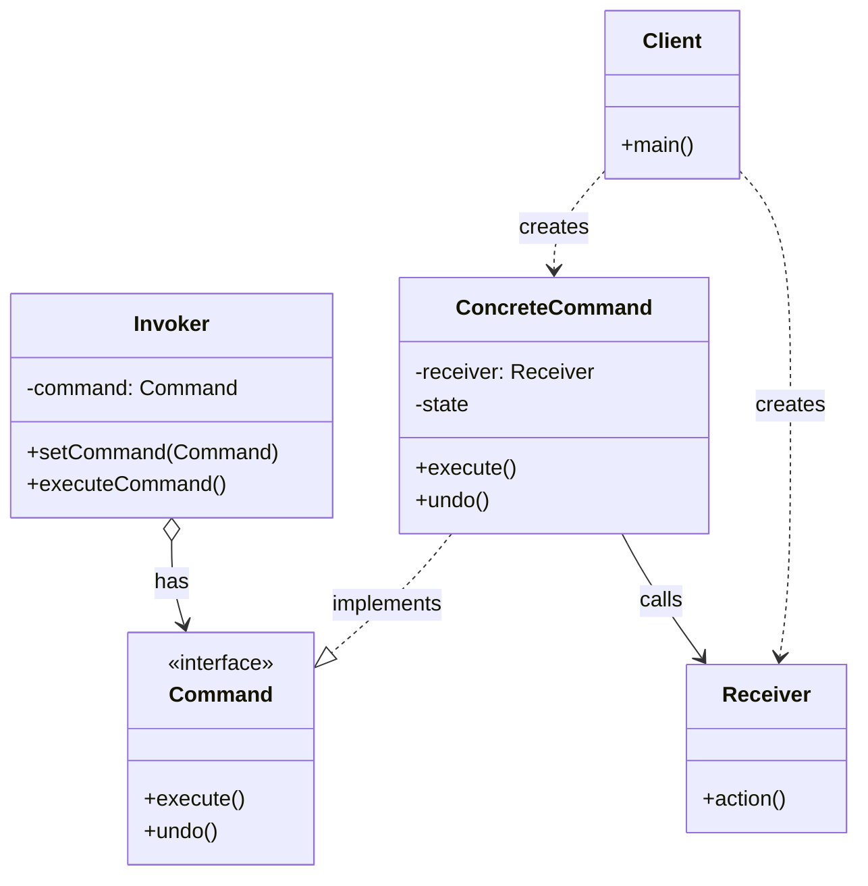

# Commandパターン調査ドキュメント

## 調査概要

- **調査目的**: シリーズ記事「Commandパターンで学ぶオブジェクト指向設計」作成のための情報収集
- **調査実施日**: 2026年1月7日
- **技術スタック**: Perl
- **想定読者**: Perl入学式卒業程度、「Mooで覚えるオブジェクト指向プログラミング」シリーズ（全12回）を読了した読者

### 学習ゴール

- Commandパターンの理解と実装
- SOLID原則（特にOCP、SRP、DIP）との関連の理解
- 実践的なCLIツールへの応用

### 最終ゴール

- 「操作」をオブジェクトとして扱う設計思想の習得
- テストしやすく、拡張性の高いアプリケーション設計

---

## 1. Commandパターンの基本情報

### 1.1 パターンの定義と目的

**要点**:

- Commandパターンは、**リクエスト（操作・命令）をオブジェクトとしてカプセル化**する振る舞いパターンである
- リクエストの送信者（Invoker）と受信者（Receiver）を分離し、疎結合な設計を実現する
- コマンドをオブジェクト化することで、パラメータ化、キューイング、ログ記録、Undo/Redo機能などが実現可能になる

**根拠**:

- GoF「Design Patterns」書籍において、Commandパターンは以下のように定義されている：
  > 「リクエストをオブジェクトとして扱い、異なるリクエストでクライアントをパラメータ化し、リクエストをキューに入れたり、ログに記録したり、操作の取り消しをサポートする」

**仮定**:

- 読者は「Mooで覚えるオブジェクト指向プログラミング」シリーズで、Mooの基本的な使い方（`has`、`sub`、`Moo::Role`）を習得済み

**出典**:

- Wikipedia: Command pattern - https://en.wikipedia.org/wiki/Command_pattern
- Wikipedia日本語: Command パターン - https://ja.wikipedia.org/wiki/Command_%E3%83%91%E3%82%BF%E3%83%BC%E3%83%B3
- Refactoring Guru: Command - https://refactoring.guru/design-patterns/command
- GeeksforGeeks: Command Design Pattern - https://www.geeksforgeeks.org/system-design/command-pattern/

**信頼度**: ★★★★★（GoF原典および複数の信頼できる技術サイト）

---

### 1.2 パターンの構成要素

Commandパターンは、以下の5つの主要コンポーネントで構成される。



| 要素 | 役割 | Perl実装での具体例 |
|-----|------|------------------|
| **Command (インターフェース)** | コマンドの実行メソッド（execute）を宣言 | `Command::Role`（Moo::Role） |
| **ConcreteCommand (具象コマンド)** | Commandインターフェースを実装し、Receiverとアクションを結びつける | `Command::Add`, `Command::List`, `Command::Complete` |
| **Receiver (受信者)** | 実際の処理を知っているオブジェクト | `TaskRepository`, `TextEditor` |
| **Invoker (呼び出し元)** | コマンドの実行を依頼するオブジェクト | CLIアプリのメインルーチン、UIボタン |
| **Client (クライアント)** | ConcreteCommandオブジェクトを生成し、Invokerに設定 | コマンドライン引数の解析部分 |

**出典**:

- ソフトウェア開発日記: Commandパターンとは - https://lightgauge.net/journal/object-oriented/command-pattern
- tamotech.blog: Commandパターン解説 - https://tamotech.blog/2024/09/25/command/

**信頼度**: ★★★★★

---

### 1.3 パターンの利点と欠点

#### 利点

| 利点 | 説明 | 実践的な効果 |
|-----|------|------------|
| **疎結合** | 送信者と受信者を分離 | CLIの引数解析とビジネスロジックを分離できる |
| **拡張性（OCP準拠）** | 新しいコマンドを追加しても既存コードへの影響が少ない | `Command::Delete`などを後から追加しやすい |
| **Undo/Redo対応** | 操作履歴を保存し元に戻すことが可能 | テキストエディタの履歴機能に最適 |
| **ログ記録・履歴管理** | 実行したコマンドを記録できる | 操作ログの実装が容易 |
| **マクロ・バッチ処理** | 複数のコマンドをまとめて実行 | ジョブキュー、タスクスケジューラに適用可能 |
| **遅延実行・キューイング** | コマンドを保存して後で実行 | 非同期処理、バックグラウンドジョブ |

#### 欠点

| 欠点 | 説明 | 対策 |
|-----|------|------|
| **クラス数の増加** | 各コマンドごとにクラスが必要 | 小規模アプリでは過剰にならないよう注意 |
| **複雑性の増加** | 単純な処理でも複数のクラスが関与 | 初心者向け記事では段階的に導入 |
| **過剰設計のリスク** | シンプルなケースに適用すると冗長 | 将来の拡張可能性を考慮して判断 |

**出典**:

- ITDic: Commandパターン - https://itdic.com/designpattern/gof/command/
- SourceMaking: Command Design Pattern - https://sourcemaking.com/design_patterns/command

**信頼度**: ★★★★★

---

### 1.4 適用シーン

Commandパターンは以下のようなシーンで効果的：

| 適用シーン | 説明 | 具体例 |
|-----------|------|--------|
| **CLIツール（サブコマンド）** | 各サブコマンドを独立したオブジェクトとして実装 | `todo add`, `todo list`, `todo complete` |
| **Undo/Redo機能** | 操作を履歴として保存し、逆操作を実行 | テキストエディタ、描画アプリ |
| **マクロ記録** | 一連の操作を記録して再生 | スプレッドシートのマクロ |
| **ジョブキュー・タスクスケジューリング** | コマンドをキューに入れて後で実行 | バックグラウンドジョブ、cron代替 |
| **トランザクション管理** | 複数の操作をまとめて実行・ロールバック | データベース操作 |
| **GUI/イベント駆動** | UIボタンやメニュー項目にコマンドを関連付け | デスクトップアプリ |

**出典**:

- Refactoring Guru: Command - https://refactoring.guru/design-patterns/command
- Qiita: コマンドラインツールの拡張性を高める - https://qiita.com/Tadataka_Takahashi/items/a0891500e2c302b209b7

**信頼度**: ★★★★★

---

## 2. Perlでの実装方法

### 2.1 Moo::Roleを使ったCommandインターフェース

**要点**:

PerlでCommandパターンを実装する場合、`Moo::Role`を使ってCommandインターフェースを定義し、各ConcreteCommandクラスでロールを消費（`with`）する方法が推奨される。

**Command Role（インターフェース）**:

```perl
package Command::Role {
    use Moo::Role;
    
    # 必須メソッドの宣言
    requires 'execute';      # コマンドの実行
    requires 'description';  # コマンドの説明（ヘルプ表示用）
    
    # オプション：Undo対応の場合
    # requires 'undo';
}
```

**ConcreteCommand例**:

```perl
package Command::Add {
    use Moo;
    use v5.36;
    with 'Command::Role';

    has repository => (is => 'ro', required => 1);
    has title      => (is => 'ro', required => 1);

    sub execute ($self) {
        my $task = Task->new(title => $self->title);
        $self->repository->add($task);
        say "タスクを追加しました: " . $self->title;
    }

    sub description ($self) { 'タスクを追加する' }
}

package Command::List {
    use Moo;
    use v5.36;
    with 'Command::Role';

    has repository => (is => 'ro', required => 1);

    sub execute ($self) {
        my @tasks = $self->repository->all;
        for my $task (@tasks) {
            my $status = $task->is_done ? '[x]' : '[ ]';
            printf "%d. %s %s\n", $task->id, $status, $task->title;
        }
    }

    sub description ($self) { 'タスク一覧を表示する' }
}

package Command::Complete {
    use Moo;
    use v5.36;
    with 'Command::Role';

    has repository => (is => 'ro', required => 1);
    has task_id    => (is => 'ro', required => 1);

    sub execute ($self) {
        my $task = $self->repository->find($self->task_id);
        if ($task) {
            $task->mark_done;
            $self->repository->save($task);
            say "タスクを完了しました: " . $task->title;
        } else {
            say "タスクが見つかりません: ID " . $self->task_id;
        }
    }

    sub description ($self) { 'タスクを完了にする' }
}
```

**根拠**:

- Moo::Roleの`requires`で必須メソッドを宣言でき、実装漏れを防げる
- 継承ではなく合成で機能を追加できる（「Mooで覚えるオブジェクト指向プログラミング」第10回で学習済み）

**出典**:

- MetaCPAN: Moo::Role - https://metacpan.org/pod/Moo::Role
- Perl School: Design Patterns in Modern Perl - https://perlschool.com/books/design-patterns/

**信頼度**: ★★★★★

---

### 2.2 v5.36以降のsignatures対応

**要点**:

Perl v5.36以降では、`use v5.36;`を宣言することで、サブルーチンのシグネチャが利用可能。コードの可読性が向上する。

**シグネチャなし（従来のスタイル）**:

```perl
sub execute {
    my $self = shift;
    # 処理
}
```

**シグネチャあり（v5.36以降）**:

```perl
sub execute ($self) {
    # 処理
}
```

**根拠**:

- Perl 5.36で`use v5.36;`が利用可能になり、シグネチャがデフォルトで有効化
- モダンPerlの記法として推奨されている

**出典**:

- perldoc: perlsub - https://perldoc.perl.org/perlsub#Signatures

**信頼度**: ★★★★★

---

### 2.3 Invoker（呼び出し元）の実装

**要点**:

Invokerはコマンドを保持し、適切なタイミングで実行する。CLIツールの場合、引数解析後にコマンドを実行する部分がInvokerの役割を果たす。

**シンプルなInvoker**:

```perl
package TodoApp {
    use Moo;
    use v5.36;

    has repository => (is => 'ro', required => 1);
    
    sub run ($self, @args) {
        my $command_name = shift @args // 'help';
        
        my $command = $self->_create_command($command_name, @args);
        
        if ($command) {
            $command->execute;
        } else {
            $self->_show_help;
        }
    }
    
    sub _create_command ($self, $name, @args) {
        my %commands = (
            add      => sub { 
                Command::Add->new(
                    repository => $self->repository,
                    title      => $args[0] // die "タスク名を指定してください\n",
                );
            },
            list     => sub {
                Command::List->new(repository => $self->repository);
            },
            complete => sub {
                Command::Complete->new(
                    repository => $self->repository,
                    task_id    => $args[0] // die "タスクIDを指定してください\n",
                );
            },
        );
        
        return exists $commands{$name} ? $commands{$name}->() : undef;
    }
    
    sub _show_help ($self) {
        say "使い方: todo <command> [args]";
        say "  add <title>     タスクを追加";
        say "  list            タスク一覧を表示";
        say "  complete <id>   タスクを完了にする";
    }
}
```

**信頼度**: ★★★★☆（実践的な実装例）

---

## 3. 関連するSOLID原則

### 3.1 単一責任原則（SRP）との関連

**要点**:

- Commandパターンでは、各コマンドクラスが**1つの操作のみ**を担当する
- 「タスク追加」「タスク一覧」「タスク完了」がそれぞれ独立したクラス
- 変更理由が明確：`Command::Add`はタスク追加の仕様変更時のみ修正

**具体例**:

```perl
# 良い例：各コマンドは1つの責任のみ
package Command::Add { ... }       # タスク追加のみ
package Command::List { ... }      # タスク一覧のみ
package Command::Complete { ... }  # タスク完了のみ

# 悪い例：1つのクラスに複数の責任
package TodoCommands {
    sub add { ... }
    sub list { ... }
    sub complete { ... }
    # 変更理由が3つある → SRP違反
}
```

**出典**:

- Baeldung: Single Responsibility Principle - https://www.baeldung.com/java-single-responsibility-principle

**信頼度**: ★★★★★

---

### 3.2 開放/閉鎖原則（OCP）との関連

**要点**:

- Commandパターンは**拡張に開かれ、修正に閉じた**設計を実現
- 新しいコマンドを追加する際、既存のコマンドクラスを修正する必要がない
- 新しいConcreteCommandクラスを追加するだけで機能拡張が可能

**具体例**:

```perl
# 新しいコマンドを追加しても、既存コードは変更不要
package Command::Delete {
    use Moo;
    with 'Command::Role';
    
    has repository => (is => 'ro', required => 1);
    has task_id    => (is => 'ro', required => 1);

    sub execute ($self) {
        $self->repository->remove($self->task_id);
        say "タスクを削除しました";
    }

    sub description ($self) { 'タスクを削除する' }
}

# Invokerへの登録のみ追加（既存コマンドは影響なし）
```

**根拠**:

- 新規コマンド追加時に既存のCommand::Add等を修正する必要がない
- Invokerのディスパッチテーブルへの追加のみで対応

**信頼度**: ★★★★★

---

### 3.3 依存性逆転の原則（DIP）との関連

**要点**:

- Commandパターンでは、高レベルモジュール（Invoker）が低レベルモジュール（ConcreteCommand）に直接依存しない
- 両者とも抽象（Command Role）に依存する
- これにより、コマンドの実装を容易に切り替え可能

**具体例**:

```perl
# 抽象（Command Role）に依存
has command => (
    is   => 'ro',
    does => 'Command::Role',  # 具体的なクラスではなく、Roleに依存
);

# テスト時にモックコマンドを注入可能
my $mock_command = MockCommand->new;
$invoker->command($mock_command);
```

**根拠**:

- Invokerは具体的なコマンドクラスを知る必要がない
- テスト時にモックを注入しやすい設計

**信頼度**: ★★★★★

---

## 4. Commandパターンの適用例

### 4.1 CLIツール（サブコマンド）

**要点**:

CLIツールでのCommandパターンは、各サブコマンド（add, list, complete等）を独立したコマンドオブジェクトとして実装することで効果を発揮する。

**一般的な構造**:

1. コマンドライン引数を解析
2. 対応するConcreteCommandオブジェクトを生成
3. Invokerがexecute()を呼び出し

**典型的なCLIツールのサブコマンド構造**:

```
todo add "タスク名"     -> Command::Add->execute()
todo list              -> Command::List->execute()
todo complete 1        -> Command::Complete->execute()
todo delete 1          -> Command::Delete->execute()
todo help              -> ヘルプ表示
```

**出典**:

- Qiita: CLIツールとCommandパターン - https://qiita.com/Tadataka_Takahashi/items/a0891500e2c302b209b7
- Zenn: Node.jsでCLIツールを作ろう - https://zenn.dev/takuh/articles/20661cfd3cd337

**信頼度**: ★★★★★

---

### 4.2 Undo/Redo機能

**要点**:

Commandパターンの代表的な応用がUndo/Redo機能。各コマンドに`undo`メソッドを追加し、実行履歴を管理することで実現する。

**Command履歴管理の実装例**:

```perl
package CommandHistory {
    use Moo;
    use v5.36;

    has undo_stack => (is => 'rw', default => sub { [] });
    has redo_stack => (is => 'rw', default => sub { [] });

    sub execute_command ($self, $command) {
        $command->execute;
        push @{$self->undo_stack}, $command;
        $self->redo_stack([]);  # 新しい操作でredoスタックをクリア
    }

    sub undo ($self) {
        return unless @{$self->undo_stack};
        my $command = pop @{$self->undo_stack};
        $command->undo;
        push @{$self->redo_stack}, $command;
    }

    sub redo ($self) {
        return unless @{$self->redo_stack};
        my $command = pop @{$self->redo_stack};
        $command->execute;
        push @{$self->undo_stack}, $command;
    }
}
```

**Undo対応のConcreteCommand例**:

```perl
package Command::InsertText {
    use Moo;
    use v5.36;
    with 'Command::Role';

    has editor   => (is => 'ro', required => 1);
    has text     => (is => 'ro', required => 1);
    has position => (is => 'ro', required => 1);

    sub execute ($self) {
        $self->editor->insert($self->text, $self->position);
    }

    sub undo ($self) {
        $self->editor->delete($self->position, length($self->text));
    }

    sub description ($self) { 'テキストを挿入する' }
}
```

**出典**:

- Qiita: Commandパターン Mementoを添えて - https://qiita.com/GU39/items/c01228a83fe02d33b5a0
- Zenn: デザインパターン：Commandパターン - https://zenn.dev/tokyo_inc/articles/0506a440bb6ae4

**信頼度**: ★★★★★

---

### 4.3 マクロ記録

**要点**:

複数のコマンドをリストとして保存し、一括で実行することでマクロ機能を実現。

**マクロ実装例**:

```perl
package Macro {
    use Moo;
    use v5.36;
    with 'Command::Role';

    has commands => (is => 'rw', default => sub { [] });

    sub add_command ($self, $command) {
        push @{$self->commands}, $command;
    }

    sub execute ($self) {
        $_->execute for @{$self->commands};
    }

    sub undo ($self) {
        # 逆順でundo
        $_->undo for reverse @{$self->commands};
    }

    sub description ($self) { 'マクロを実行する' }
}

# 使用例
my $macro = Macro->new;
$macro->add_command(Command::InsertText->new(...));
$macro->add_command(Command::InsertText->new(...));
$macro->execute;  # 複数のコマンドを一括実行
```

**信頼度**: ★★★★☆

---

### 4.4 ジョブキュー・タスクスケジューリング

**要点**:

コマンドをキューに入れて、後で非同期に実行する仕組み。

**ジョブキュー実装例**:

```perl
package JobQueue {
    use Moo;
    use v5.36;

    has queue => (is => 'rw', default => sub { [] });

    sub enqueue ($self, $command) {
        push @{$self->queue}, $command;
    }

    sub process ($self) {
        while (my $command = shift @{$self->queue}) {
            eval {
                $command->execute;
            };
            if ($@) {
                warn "コマンド実行エラー: $@";
            }
        }
    }
}
```

**信頼度**: ★★★★☆

---

## 5. 既存のシリーズとの差別化

### 5.1 既存シリーズで扱われているテーマ

| シリーズ名 | 主要テーマ | 主なデザインパターン |
|-----------|----------|-------------------|
| **Mooで覚えるオブジェクト指向プログラミング（全12回）** | OOP基礎（has、extends、Moo::Role、handles、isa） | - |
| **Mooを使ってディスパッチャーを作ってみよう（全12回）** | ディスパッチャー、Strategyパターン | Strategy |
| **シンプルなTodo CLIアプリ** | Command/Repositoryパターン、CLI実装 | Command, Repository |
| **パスワード生成・管理ツール** | 暗号化、CLI、Factory/Commandパターン | Factory, Command |

### 5.2 Commandパターンシリーズの差別化ポイント

**既存シリーズとの違い**:

| 差別化ポイント | 本シリーズの特徴 |
|--------------|----------------|
| **フォーカス** | Commandパターンに特化した深い解説 |
| **Undo/Redo** | テキストエディタの履歴機能を題材にUndo/Redoを本格実装 |
| **SOLID原則** | 各原則との関連を明示的に解説 |
| **Strategyとの比較** | 既存ディスパッチャーシリーズとの橋渡し |
| **応用範囲** | CLI以外の応用（Undo/Redo、マクロ、ジョブキュー） |

### 5.3 新しいテーマ提案

**提案1: テキストエディタのUndo/Redo機能**

- Commandパターンの真価を発揮するテーマ
- 操作履歴の管理が本質的に必要
- Mementoパターンとの併用も可能

**提案2: 簡易タスクスケジューラ**

- コマンドのキューイングと遅延実行
- cronのような定期実行
- ジョブの履歴管理

**提案3: 対話型シェル（REPL）**

- ユーザー入力をコマンドに変換
- ヒストリー機能（上下キーで履歴呼び出し）
- コマンド補完

---

## 6. CommandパターンとStrategyパターンの違い

### 6.1 比較表

| 項目 | Commandパターン | Strategyパターン |
|-----|----------------|-----------------|
| **目的** | 操作（何をするか）をオブジェクト化 | アルゴリズム（どう処理するか）を差し替え可能に |
| **主体** | Invokerがコマンドを実行 | Contextがストラテジーを選んで実行 |
| **履歴管理** | 実行履歴を残せる・Undo/Redo可能 | 履歴は不要（処理方式の切替のみ） |
| **使い所** | Undo/Redo、履歴保存、ジョブキュー、CLI | アルゴリズム切替、支払い方法、ソート |
| **典型例** | リモコンの操作履歴、エディタのUndo | 支払い方式や並び替え方法の切替 |

### 6.2 選択指針

- **「何をするか」を管理・記録したい** → Command
- **「どう処理するか」を切り替えたい** → Strategy
- **Undo/Redo、履歴が必要** → Command
- **アルゴリズムの動的切替** → Strategy

**まとめ**:

> Command = 「何をするか」を管理・記録するパターン  
> Strategy = 「どう処理するか」を切り替えるパターン

**出典**:

- Qiita: Command vs Strategy - https://qiita.com/nozomi2025/items/102511ea70259184632e
- GeeksforGeeks: Difference between Strategy and Command - https://www.geeksforgeeks.org/system-design/difference-between-strategy-pattern-and-command-pattern/

**信頼度**: ★★★★★

---

## 7. 競合記事の分析

### 7.1 日本語のPerl + デザインパターン記事

| 記事タイトル | URL | 特徴 | 差別化ポイント |
|-------------|-----|------|---------------|
| Commandパターン（ソフトウェア開発日記） | https://lightgauge.net/journal/object-oriented/command-pattern | 一般的な解説、Java中心 | Perl/Moo特化で差別化 |
| Commandパターン（tamotech.blog） | https://tamotech.blog/2024/09/25/command/ | Javaでのサンプル詳細 | v5.36対応のPerlで差別化 |
| デザインパターン（Qiita） | 各種 | 多言語での実装例 | 「Perl入学式卒業程度」向けの丁寧さ |

### 7.2 Commandパターンの入門記事

| 記事タイトル | URL | 特徴 | 差別化ポイント |
|-------------|-----|------|---------------|
| Refactoring Guru | https://refactoring.guru/design-patterns/command | 図解豊富、多言語対応 | 日本語で段階的な解説 |
| Wikipedia日本語 | https://ja.wikipedia.org/wiki/Command_%E3%83%91%E3%82%BF%E3%83%BC%E3%83%B3 | 正式な定義 | 実践的なCLI実装例 |
| ITDic | https://itdic.com/designpattern/gof/command/ | GoF準拠の解説 | 前シリーズとの連携 |

### 7.3 本シリーズの強み

1. **前シリーズとの継続性**: 「Mooで覚えるオブジェクト指向プログラミング」で学んだ知識を活用
2. **Perl/Moo特化**: v5.36対応のモダンPerl記法
3. **SOLID原則との連携**: 設計原則を意識した解説
4. **Strategyパターンとの比較**: ディスパッチャーシリーズとの橋渡し
5. **実践的な応用例**: CLIだけでなくUndo/Redo、マクロも扱う

---

## 8. 内部リンク候補の調査

### 8.1 「Mooで覚えるオブジェクト指向プログラミング」シリーズ（全12回）

本シリーズ記事の前提知識となる既存記事。

| 回 | タイトル | 内部リンク | Commandパターンとの関連 |
|:--|:--|:--|:--|
| 第1回 | Mooで覚えるオブジェクト指向プログラミング | `/2021/10/31/191008/` | OOPの基礎 |
| 第2回 | データとロジックをまとめよう | `/2025/12/30/163810/` | `has`、`sub` |
| 第3回 | 同じものを何度も作れるように | `/2025/12/30/163811/` | `new`（コンストラクタ） |
| 第4回 | 勝手に書き換えられないようにする | `/2025/12/30/163812/` | `is => 'ro'`、`is => 'rw'` |
| 第5回 | 初期化忘れを防ぐ | `/2025/12/30/163813/` | `required`、`default` |
| 第6回 | 内部実装を外から触らせない | `/2025/12/30/163814/` | カプセル化 |
| 第7回 | 関連するデータを別のクラスに | `/2025/12/30/163815/` | オブジェクトの関連（Commandが依存を持つ） |
| 第8回 | 似ているクラスの重複をなくす | `/2025/12/30/163816/` | `extends`（継承） |
| 第9回 | 同じ名前で違う動作を | `/2025/12/30/163817/` | オーバーライド |
| 第10回 | 継承しないで振る舞いを共有 | `/2025/12/30/163818/` | **`Moo::Role`、`with`（Command Roleの基礎）** |
| 第11回 | 「持っている」ものに仕事を任せる | `/2025/12/30/163819/` | `handles`（委譲） |
| 第12回 | 型チェックでバグを未然に防ぐ | `/2025/12/30/163820/` | `isa`（型制約） |

**特に重要な関連**:

- **第10回（Moo::Role）**: Command RoleをMoo::Roleで定義する際に必須の知識
- **第7回（オブジェクトの関連）**: CommandクラスがRepositoryを持つ関係
- **第4回・第5回（ro/rw、required）**: Commandクラスの属性定義

---

### 8.2 「Mooを使ってディスパッチャーを作ってみよう」シリーズ

関連するデザインパターン（Strategyパターン）を扱うシリーズ。

| 回 | タイトル | 内部リンク | 関連度 |
|:--|:--|:--|:--|
| 第12回 | これがデザインパターンだ！ | `/2026/01/03/001541/` | **高**（Strategyパターン解説、Commandとの比較に最適） |
| 第5回 | 共通の約束を決めよう | `/2026/01/03/001534/` | 高（Roleによるインターフェース） |

---

### 8.3 デザインパターン・SOLID原則関連

| ファイルパス | 内部リンク | 内容 | 関連度 |
|-------------|-----------|------|--------|
| `/content/warehouse/design-patterns-research.md` | warehouse | GoF 23パターン概要調査 | 中 |
| `/content/warehouse/solid-principles.md` | warehouse | SOLID原則詳細調査 | 高 |

---

### 8.4 Todo CLI / パスワードツール関連

| ファイルパス | 内容 | 関連度 |
|-------------|------|--------|
| `/content/warehouse/todo-cli-app-research.md` | Todo CLIアプリ調査（Commandパターン含む） | **最高** |
| `/content/warehouse/password-tool-series.md` | パスワードツール調査（Commandパターン含む） | 高 |
| `/content/warehouse/moo-dispatcher-series-research.md` | ディスパッチャーシリーズ調査（Strategyパターン） | 高 |

---

## 9. 参考文献・リソースリスト

### 9.1 必読リソース

#### 書籍

| 書籍名 | 著者 | ISBN/ASIN | 重要度 |
|-------|------|-----------|--------|
| Design Patterns: Elements of Reusable Object-Oriented Software | GoF | 978-0201633610 | **必須** |
| Head First Design Patterns (2nd Edition) | Eric Freeman, Elisabeth Robson | 978-1492078005 | 推奨 |
| Design Patterns in Modern Perl | Mohammad Sajid Anwar | Leanpub | 推奨（Perl特化） |

#### Webリソース

| リソース名 | URL | 特徴 | 信頼度 |
|-----------|-----|------|--------|
| Refactoring Guru - Command | https://refactoring.guru/design-patterns/command | 視覚的な図解、多言語コード例 | ★★★★★ |
| Refactoring Guru - Command（日本語） | https://refactoring.guru/ja/design-patterns/command | 日本語訳版 | ★★★★★ |
| Wikipedia - Command パターン（日本語） | https://ja.wikipedia.org/wiki/Command_%E3%83%91%E3%82%BF%E3%83%BC%E3%83%B3 | 正式な定義 | ★★★★★ |
| GeeksforGeeks - Command Pattern | https://www.geeksforgeeks.org/system-design/command-pattern/ | 網羅的な解説 | ★★★★☆ |
| MetaCPAN - Moo | https://metacpan.org/pod/Moo | Perl Moo公式 | ★★★★★ |
| MetaCPAN - Moo::Role | https://metacpan.org/pod/Moo::Role | Perl Moo::Role公式 | ★★★★★ |
| Perl School - Design Patterns | https://perlschool.com/books/design-patterns/ | PerlでのGoFパターン実装 | ★★★★☆ |

---

## 10. 調査結果のサマリー

### 10.1 主要な発見

1. **Commandパターンの適用性**: CLIツールの各サブコマンドをCommandオブジェクトとして実装することで、拡張性と保守性が向上する。「Mooで覚えるオブジェクト指向プログラミング」第10回で学んだMoo::Roleを使ってインターフェースを定義できる

2. **SOLID原則との親和性**: Commandパターンは、SRP（各コマンドが1つの責任）、OCP（新しいコマンド追加が容易）、DIP（抽象に依存）を自然に満たす

3. **Strategyパターンとの違い**: 「何をするか」を管理するCommand vs 「どう処理するか」を切り替えるStrategy。既存のディスパッチャーシリーズとの対比で理解を深められる

4. **Undo/Redoの実装**: Commandパターンの真価はUndo/Redo機能にある。テキストエディタやグラフィックツールでの応用が効果的

5. **前提知識との連携**: 「Mooで覚えるオブジェクト指向プログラミング」シリーズで学んだ概念（Moo::Role、has、required、isaなど）を実践的に活用できる

### 10.2 記事構成への示唆

1. **テーマ提案**: テキストエディタのUndo/Redo機能を題材に、Commandパターンを段階的に学ぶシリーズ

2. **新しい概念は1つ**: 各記事で導入する新しい概念は「Commandパターンの1要素」に絞る

3. **段階的な導入**:
   - 最初はシンプルなコマンドクラスから始める
   - 徐々にCommand Role、履歴管理、Undo/Redoを追加
   - 最後に実用的なテキストエディタを完成

4. **既存シリーズとの連携**: ディスパッチャーシリーズとの比較（Strategy vs Command）を意識的に行う

---

## 11. 不明点・追加調査が必要な領域

1. **Perlでの実装例の検証**: 実際にコードを動作確認して、記事執筆前にテスト

2. **読者のレベル確認**: Perl入学式卒業程度の読者がどこまで理解しているか

3. **テーマの最終決定**: テキストエディタ vs タスクスケジューラ vs 対話型シェル

4. **記事回数の決定**: 6回程度が妥当か、12回（既存シリーズと同じ）にするか

---

**調査完了日**: 2026年1月7日  
**調査者**: 調査・情報収集エージェント  
**次のステップ**: 連載構造案の作成
