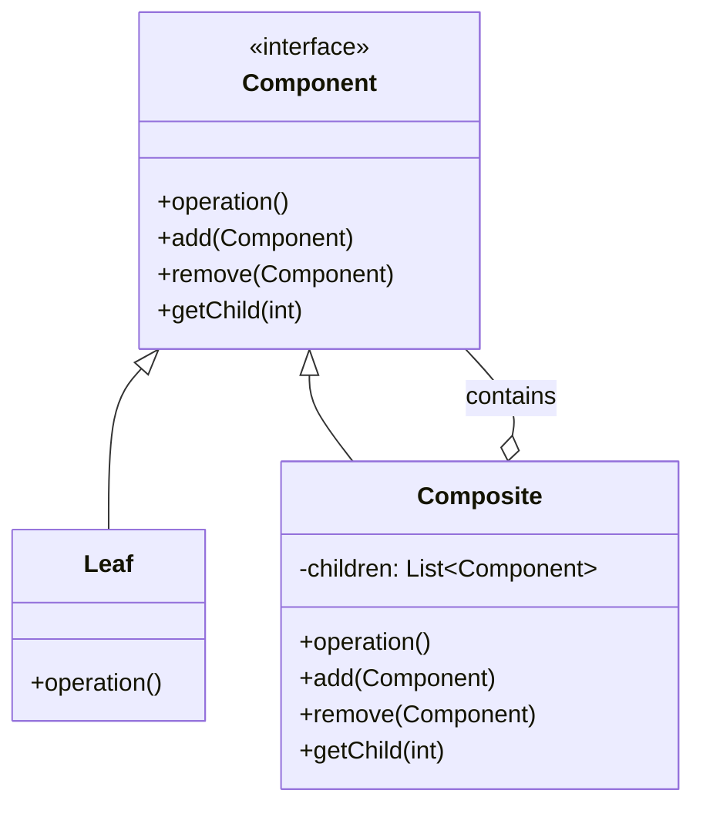

# Compositeパターン（構造パターン）調査レポート

## 調査メタデータ

- **調査実施日**: 2026年1月1日
- **調査対象**: Compositeパターン（GoF構造パターン）
- **調査目的**: Compositeパターンの定義、実装方法、利点・欠点、実践的な活用例を包括的に整理する
- **想定読者**: デザインパターンを学び、実務で活用したいソフトウェアエンジニア

---

## 1. 概要

### 1.1 Compositeパターンとは何か

**要点**:

Composite（コンポジット）パターンは、オブジェクトをツリー構造に組み立て、部分と全体の階層を表現するための構造パターンです。個別のオブジェクト（Leaf）とオブジェクトの集合（Composite）を同一のインターフェースで扱えるようにすることで、クライアントコードがシンプルになります。

**根拠**:

- GoF書籍において「オブジェクトを木構造に組み立て、個別のオブジェクトとオブジェクトの集合を一様に扱う」パターンとして定義されている
- ファイルシステム（ファイルとディレクトリ）、GUIコンポーネント（ボタンとパネル）、組織図（社員とマネージャー）など、階層構造を持つ多くの実世界の概念に対応
- 再帰的な構造を表現し、部分と全体を統一的に操作できる

**仮定**:

- 対象となる問題領域が部分-全体の階層構造（part-whole hierarchy）を持つことが前提
- クライアントが個別オブジェクトと集合オブジェクトを区別せずに扱いたい状況での適用

**出典**:

- Wikipedia: Composite pattern - https://en.wikipedia.org/wiki/Composite_pattern
- GeeksforGeeks: Composite Design Pattern - https://www.geeksforgeeks.org/system-design/composite-method-software-design-pattern/
- Refactoring Guru: Composite - https://refactoring.guru/design-patterns/composite
- IONOS: Composite Pattern - https://www.ionos.com/digitalguide/websites/web-development/composite-pattern/

**信頼度**: 高（公式書籍および著名な技術サイト）

---

### 1.2 構造パターンとしての位置づけ

**要点**:

Compositeパターンは、GoF（Gang of Four）が定義する23のデザインパターンの中で「構造パターン（Structural Patterns）」に分類されます。構造パターンは7種類あり、クラスやオブジェクトを組み合わせて、より大きな構造を形成するパターンです。

**構造パターン7種類**:

| パターン名 | 概要 |
|-----------|------|
| Adapter | 互換性のないインターフェースを持つクラスを、クライアントが期待するインターフェースに変換 |
| Bridge | 抽象部分と実装部分を分離し、それぞれが独立して変更可能にする |
| **Composite** | オブジェクトをツリー構造に組み立て、個別オブジェクトと複合オブジェクトを同一視 |
| Decorator | オブジェクトに動的に責任を追加し、サブクラス化の代替手段を提供 |
| Facade | サブシステムの複雑なインターフェース群に対して、統一された簡素なインターフェースを提供 |
| Flyweight | 多数の細粒度オブジェクトを効率的にサポートするため、オブジェクトを共有 |
| Proxy | 他のオブジェクトへのアクセスを制御する代理オブジェクトを提供 |

**根拠**:

- GoF書籍の構成がこの分類に基づいている
- Compositeパターンは特に「部分-全体の階層」という構造的な問題を解決する

**出典**:

- GeeksforGeeks: Gang of Four (GOF) Design Patterns - https://www.geeksforgeeks.org/system-design/gang-of-four-gof-design-patterns/
- content/warehouse/design-patterns-overview.md（本サイト内部リソース）

**信頼度**: 高

---

### 1.3 基本構造

**要点**:

Compositeパターンは以下の3つの主要な要素で構成されます：

1. **Component（コンポーネント）**: LeafとCompositeの共通インターフェースを定義する抽象クラスまたはインターフェース
2. **Leaf（葉）**: ツリー構造の末端を表す。子を持たない単一のオブジェクト
3. **Composite（複合体）**: 子要素を持つコンテナオブジェクト。子要素はLeafまたは別のCompositeである

**構造図（Mermaid記法）**:



**動作の流れ**:

1. クライアントは`Component`インターフェースを通じてツリー構造を操作する
2. `Leaf`オブジェクトは自身の処理を直接実行する
3. `Composite`オブジェクトは子要素に対して再帰的に処理を委譲する

**根拠**:

- GoFパターンの構造定義
- Wikipedia、Refactoring Guru、GeeksforGeeksでの一貫した構造説明

**出典**:

- Refactoring Guru: Composite - https://refactoring.guru/design-patterns/composite
- Wikipedia: Composite pattern - https://en.wikipedia.org/wiki/Composite_pattern
- IONOS: Composite Pattern - https://www.ionos.com/digitalguide/websites/web-development/composite-pattern/

**信頼度**: 高

---

## 2. 用途と適用場面

### 2.1 典型的な使用例

**要点**:

Compositeパターンの典型的な使用例は以下の通りです：

**1. ファイルシステム**

- **ファイル（Leaf）**: 個別のファイルオブジェクト
- **ディレクトリ（Composite）**: ファイルや他のディレクトリを含むコンテナ
- 両者を統一的に扱い、ディレクトリ全体のサイズ計算やファイル検索を再帰的に実行

**2. GUIコンポーネント**

- **単純なウィジェット（Leaf）**: ボタン、テキストフィールド、ラベルなど
- **コンテナ（Composite）**: パネル、ウィンドウ、フレームなど
- `draw()`や`resize()`などの操作を統一的に適用

**3. 組織構造**

- **個人社員（Leaf）**: 部下を持たない社員
- **マネージャー（Composite）**: 部下（社員や他のマネージャー）を管理
- 組織全体の給与計算や人数集計を再帰的に実行

**4. グラフィックエディタ**

- **基本図形（Leaf）**: 円、四角形、線など
- **グループ（Composite）**: 複数の図形をまとめたもの
- グループ全体に対して移動、拡大縮小、回転などを一括適用

**具体例（ファイルシステム）**:

```
Root/
  ├── file1.txt (Leaf)
  ├── file2.txt (Leaf)
  └── Documents/ (Composite)
      ├── report.pdf (Leaf)
      └── Projects/ (Composite)
          ├── project1.doc (Leaf)
          └── project2.doc (Leaf)
```

このツリー構造全体に対して、`getSize()`を呼び出すと、すべてのファイルサイズの合計を再帰的に計算できます。

**根拠**:

- GoF書籍での典型例
- 複数の技術文献で共通して言及される実用例

**出典**:

- GeeksforGeeks: Composite Design Pattern - https://www.geeksforgeeks.org/system-design/composite-method-software-design-pattern/
- Cloudaffle: Application Of Composite Design Pattern - https://cloudaffle.com/series/structural-design-patterns/composite-pattern-application/
- MomentsLog: Composite Pattern in Tree Structures - https://www.momentslog.com/development/design-pattern/composite-pattern-in-tree-structures-file-systems

**信頼度**: 高

---

### 2.2 適用すべき場面の具体的な判断基準

**要点**:

Compositeパターンの適用を検討すべき場面：

**適用すべき状況**:

1. **階層的なツリー構造を表現する必要がある**
   - ファイルシステム、組織図、パーツ階層など

2. **部分と全体を統一的に扱いたい**
   - クライアントコードで個別オブジェクトと集合を区別したくない

3. **再帰的な操作が必要**
   - ツリー全体の集計、検索、描画など

4. **構造の深さが任意かつ動的**
   - 事前に階層の深さが決まっていない

**適用を避けるべき状況**:

1. **階層構造が不要または非常に単純**
   - フラットな構造で十分な場合、Compositeは過剰設計

2. **型の安全性が重要**
   - すべてのオブジェクトが同じインターフェースを持つため、Leafに対して`add()`を呼び出すなど、意味のない操作が可能になってしまう

3. **パフォーマンスが最優先**
   - 深い階層での再帰処理はコストがかかる

4. **子要素の管理方法が多様**
   - 単純な親子関係以外の複雑な関係性がある場合

**根拠**:

- 実務での適用経験と技術コミュニティでの議論
- パターンの適用判断基準を扱った技術文献

**出典**:

- DEV Community: Understanding the Composite Design Pattern - https://dev.to/syridit118/understanding-the-composite-design-pattern-a-comprehensive-guide-with-real-world-applications-4855
- Softplan: COMPOSITE - What is it? When to use this Design Pattern? - https://www.softplan.com.br/en/tech-writers/tech-writers-composite/

**信頼度**: 高

---

### 2.3 実世界での活用例

**要点**:

Compositeパターンは多くの実際のフレームワークやライブラリで使用されています。

**Java Swing（GUI）**:

- `JComponent`が`Component`インターフェース
- `JButton`、`JLabel`などが`Leaf`
- `JPanel`、`JFrame`などが`Composite`
- すべてのコンポーネントが`add(Component)`、`remove(Component)`、`paint(Graphics)`などの統一メソッドを持つ

**ファイルシステムAPI**:

- 多くのOSのファイルシステムAPIがCompositeパターンに基づいて設計されている
- ファイルとディレクトリを`FileSystemEntry`などの共通インターフェースで扱う

**グラフィックエディタ（Adobe Illustrator、Inkscapeなど）**:

- 個別の図形とグループ化された図形を同じように扱う
- レイヤー構造もCompositeパターンの応用

**Webページの DOM（Document Object Model）**:

- HTMLの要素（`Element`）がCompositeパターン
- `<div>`などのコンテナ要素が`Composite`
- テキストノードが`Leaf`

**出典**:

- Codezup: Building Complex UI Components with the Composite Pattern - https://codezup.com/composite-pattern-ui-components/
- NumberAnalytics: Mastering Composite Pattern - https://www.numberanalytics.com/blog/ultimate-guide-composite-pattern-software-design

**信頼度**: 高

---

## 3. サンプルコード

### 3.1 Python実装（ファイルシステムの例）

**言語・バージョン**: Python 3.7+  
**外部依存**: なし

```python
from abc import ABC, abstractmethod
from typing import List

# Component（コンポーネント）
class FileSystemComponent(ABC):
    """ファイルシステムの共通インターフェース"""
    
    def __init__(self, name: str):
        self.name = name
    
    @abstractmethod
    def get_size(self) -> int:
        """サイズを取得する（再帰的に計算）"""
        pass
    
    @abstractmethod
    def display(self, indent: int = 0) -> None:
        """ツリー構造を表示する"""
        pass


# Leaf（葉）
class File(FileSystemComponent):
    """ファイル（末端ノード）"""
    
    def __init__(self, name: str, size: int):
        super().__init__(name)
        self.size = size
    
    def get_size(self) -> int:
        """ファイルサイズを返す"""
        return self.size
    
    def display(self, indent: int = 0) -> None:
        """ファイル名とサイズを表示"""
        print("  " * indent + f"📄 {self.name} ({self.size} bytes)")


# Composite（複合体）
class Directory(FileSystemComponent):
    """ディレクトリ（子要素を持つコンテナ）"""
    
    def __init__(self, name: str):
        super().__init__(name)
        self.children: List[FileSystemComponent] = []
    
    def add(self, component: FileSystemComponent) -> None:
        """子要素を追加"""
        self.children.append(component)
    
    def remove(self, component: FileSystemComponent) -> None:
        """子要素を削除"""
        self.children.remove(component)
    
    def get_size(self) -> int:
        """ディレクトリ全体のサイズを再帰的に計算"""
        total_size = 0
        for child in self.children:
            total_size += child.get_size()
        return total_size
    
    def display(self, indent: int = 0) -> None:
        """ディレクトリ構造を再帰的に表示"""
        print("  " * indent + f"📁 {self.name}/ ({self.get_size()} bytes total)")
        for child in self.children:
            child.display(indent + 1)


# 使用例
if __name__ == "__main__":
    # ファイルの作成
    file1 = File("readme.txt", 1024)
    file2 = File("image.png", 2048)
    file3 = File("document.pdf", 4096)
    
    # ディレクトリの作成
    root = Directory("root")
    documents = Directory("Documents")
    photos = Directory("Photos")
    
    # ツリー構造の構築
    documents.add(file3)
    photos.add(file2)
    
    root.add(file1)
    root.add(documents)
    root.add(photos)
    
    # ツリー全体を表示
    print("=== File System Structure ===")
    root.display()
    
    print(f"\nTotal size: {root.get_size()} bytes")
```

**出力**:
```
=== File System Structure ===
📁 root/ (7168 bytes total)
  📄 readme.txt (1024 bytes)
  📁 Documents/ (4096 bytes total)
    📄 document.pdf (4096 bytes)
  📁 Photos/ (2048 bytes total)
    📄 image.png (2048 bytes)

Total size: 7168 bytes
```

**出典**:

- Refactoring Guru: Composite in Python - https://refactoring.guru/design-patterns/composite/python/example
- Coder Scratchpad: Python Design Patterns - https://coderscratchpad.com/python-design-patterns-composite-pattern/

**信頼度**: 高

---

### 3.2 Java実装（グラフィックコンポーネントの例）

**言語・バージョン**: Java 11+  
**外部依存**: なし

```java
import java.util.ArrayList;
import java.util.List;

// Component（コンポーネント）
interface Graphic {
    void draw();
    void move(int x, int y);
}

// Leaf（葉）- 円
class Circle implements Graphic {
    private int x, y, radius;
    
    public Circle(int x, int y, int radius) {
        this.x = x;
        this.y = y;
        this.radius = radius;
    }
    
    @Override
    public void draw() {
        System.out.println("Drawing Circle at (" + x + ", " + y + 
                         ") with radius " + radius);
    }
    
    @Override
    public void move(int dx, int dy) {
        this.x += dx;
        this.y += dy;
        System.out.println("Moved Circle to (" + x + ", " + y + ")");
    }
}

// Leaf（葉）- 四角形
class Rectangle implements Graphic {
    private int x, y, width, height;
    
    public Rectangle(int x, int y, int width, int height) {
        this.x = x;
        this.y = y;
        this.width = width;
        this.height = height;
    }
    
    @Override
    public void draw() {
        System.out.println("Drawing Rectangle at (" + x + ", " + y + 
                         ") with size " + width + "x" + height);
    }
    
    @Override
    public void move(int dx, int dy) {
        this.x += dx;
        this.y += dy;
        System.out.println("Moved Rectangle to (" + x + ", " + y + ")");
    }
}

// Composite（複合体）- グループ
class CompositeGraphic implements Graphic {
    private List<Graphic> graphics = new ArrayList<>();
    private String name;
    
    public CompositeGraphic(String name) {
        this.name = name;
    }
    
    public void add(Graphic graphic) {
        graphics.add(graphic);
    }
    
    public void remove(Graphic graphic) {
        graphics.remove(graphic);
    }
    
    @Override
    public void draw() {
        System.out.println("Drawing Group: " + name);
        for (Graphic graphic : graphics) {
            graphic.draw();
        }
    }
    
    @Override
    public void move(int dx, int dy) {
        System.out.println("Moving Group: " + name);
        for (Graphic graphic : graphics) {
            graphic.move(dx, dy);
        }
    }
}

// 使用例
public class CompositePatternDemo {
    public static void main(String[] args) {
        // 個別の図形を作成
        Circle circle1 = new Circle(10, 10, 5);
        Circle circle2 = new Circle(20, 20, 10);
        Rectangle rect1 = new Rectangle(5, 5, 15, 10);
        
        // グループを作成
        CompositeGraphic group1 = new CompositeGraphic("Group 1");
        group1.add(circle1);
        group1.add(rect1);
        
        // 別のグループを作成
        CompositeGraphic group2 = new CompositeGraphic("Group 2");
        group2.add(circle2);
        group2.add(group1);  // グループの中にグループを追加
        
        // 全体を描画
        System.out.println("=== Drawing All Graphics ===");
        group2.draw();
        
        // グループ全体を移動
        System.out.println("\n=== Moving Group 2 by (10, 10) ===");
        group2.move(10, 10);
    }
}
```

**出力**:
```
=== Drawing All Graphics ===
Drawing Group: Group 2
Drawing Circle at (20, 20) with radius 10
Drawing Group: Group 1
Drawing Circle at (10, 10) with radius 5
Drawing Rectangle at (5, 5) with size 15x10

=== Moving Group 2 by (10, 10) ===
Moving Group: Group 2
Moved Circle to (30, 30)
Moving Group: Group 1
Moved Circle to (20, 20)
Moved Rectangle to (15, 15)
```

**出典**:

- Baeldung: Composite Design Pattern in Java - https://www.baeldung.com/java-composite-pattern
- HowToDoInJava: Composite Pattern - https://howtodoinjava.com/design-patterns/structural/composite-design-pattern/

**信頼度**: 高

---

### 3.3 実装時のポイント

**要点**:

Compositeパターンを実装する際の重要なポイント：

**1. 共通インターフェースの設計**

- LeafとCompositeの両方が実装できる操作のみを定義する
- `add()`、`remove()`などの子要素管理メソッドをどのレベルで定義するか検討が必要
  - **透過的な方法**: Componentに定義（LeafでもCompositeでも呼べるが、Leafでは例外を投げる）
  - **安全な方法**: Compositeのみに定義（型チェックが必要だが、誤使用を防げる）

**2. 再帰処理の実装**

- Composite内での子要素への委譲は再帰的に実装する
- 無限ループを避けるため、循環参照のチェックが必要な場合もある

**3. 子要素の管理**

- リスト、配列、その他のコレクションを使用
- 順序が重要な場合はLinkedList、高速アクセスが必要な場合はArrayListなど適切なデータ構造を選択

**4. パフォーマンスの考慮**

- 深い階層での再帰処理はスタックオーバーフローやパフォーマンス問題を引き起こす可能性がある
- 必要に応じてキャッシュやメモ化を検討

**根拠**:

- GoFパターンの実装ガイダンス
- 実務での実装経験とベストプラクティス

**出典**:

- GeeksforGeeks: Composite Design Pattern - https://www.geeksforgeeks.org/system-design/composite-method-software-design-pattern/
- Refactoring Guru: Composite - https://refactoring.guru/design-patterns/composite

**信頼度**: 高

---

## 4. 利点（メリット）

**要点**:

Compositeパターンのメリットは以下の通りです：

**1. 単一と複合を統一的に扱える**

- クライアントコードがLeafとCompositeを区別する必要がない
- 条件分岐が減り、コードがシンプルになる
- 新しい種類のコンポーネントを追加しても、クライアントコードの変更が不要

**2. 再帰的な構造の自然な表現**

- ツリー構造やネストした階層を直感的に表現できる
- 再帰的な操作（集計、検索、描画など）が容易に実装できる

**3. 開放閉鎖原則（Open/Closed Principle）への適合**

- 新しいLeafやCompositeクラスを追加する際、既存コードを変更せずに拡張できる
- Componentインターフェースを変更しない限り、新しいコンポーネントタイプの追加は容易

**4. 柔軟性とスケーラビリティ**

- 任意の深さの階層構造をサポート
- 動的に要素を追加・削除できる
- 複雑な構造でも統一的なAPIで管理可能

**5. コードの再利用性向上**

- Componentインターフェースを実装した部品は、異なるコンテキストで再利用できる
- 共通操作の実装がシンプルになる

**6. クライアントコードの簡素化**

- 複雑な条件分岐やキャストが不要
- ツリー全体に対する操作が簡潔に記述できる

**根拠**:

- GoF書籍におけるメリットの説明
- 複数の技術文献で一貫して言及されている利点

**出典**:

- Belatrix: Composite Design Pattern - https://belatrix.globant.com/us-en/blog/tech-trends/composite-design-pattern/
- Scaler Topics: Composite Design Pattern - https://www.scaler.com/topics/design-patterns/composite-design-pattern/
- DEV Community: Understanding the Composite Design Pattern - https://dev.to/syridit118/understanding-the-composite-design-pattern-a-comprehensive-guide-with-real-world-applications-4855

**信頼度**: 高

---

## 5. 欠点（デメリット）

**要点**:

Compositeパターンのデメリットは以下の通りです：

**1. 設計の複雑化**

- シンプルな問題に対しては過剰な抽象化となる
- すべてのオブジェクトが同じインターフェースを持つため、型の区別が曖昧になる
- 理解とメンテナンスに追加の学習コストが必要

**2. 型安全性の問題**

- Leafに対して`add()`や`remove()`を呼び出すなど、意味のない操作が可能になってしまう
- コンパイル時ではなく実行時にエラーが発生する可能性
- 弱い型付け言語では特に問題になりやすい

**3. パフォーマンスへの影響**

- 深い階層での再帰的な操作はコストがかかる
- メモリ使用量が増加する（子要素のリストを各Compositeが保持するため）
- 大規模なツリーでのトラバーサルは遅くなる可能性

**4. インターフェースの肥大化**

- ComponentインターフェースにLeafとCompositeの両方の操作を含めると、不適切なメソッドが公開される
- 「透過的」にするか「安全」にするかのトレードオフが発生

**5. 可読性の低下（過剰使用時）**

- 複雑な構造では、コードの意図が分かりにくくなる場合がある
- デバッグが困難になる可能性

**6. 制約の管理が難しい**

- 特定の子要素のみを持てるような制約を実装するのが難しい
- 循環参照のチェックが必要な場合もある

**根拠**:

- 実務での失敗事例や技術コミュニティでの議論
- パターンの適用における注意点を扱った技術文献

**出典**:

- GeeksforGeeks: Composite Design Pattern - https://www.geeksforgeeks.org/system-design/composite-method-software-design-pattern/
- Jinal Desai: Demystifying Design Patterns - https://jinaldesai.com/demystifying-design-patterns-composite-design-pattern/
- Wikipedia: Composite pattern - https://en.wikipedia.org/wiki/Composite_pattern

**信頼度**: 高

---

## 6. 関連パターンとの比較

### 6.1 Decoratorパターンとの違い

**要点**:

CompositeとDecoratorは構造が似ているが、目的が大きく異なります。

| 観点 | Composite | Decorator |
|------|-----------|-----------|
| **主な目的** | 部分-全体の階層構造を表現 | オブジェクトに動的に機能を追加 |
| **構造** | 複数の子要素を持つ（木構造） | 単一のラップされたオブジェクト（鎖状） |
| **インターフェース** | すべての要素が同じインターフェース | ラッパーと被ラッパーが同じインターフェース |
| **関係性** | "has-a"（集約） | "is-a"（継承またはラッピング） |
| **使用例** | ファイルシステム、組織図、GUI | ログ追加、暗号化、圧縮 |
| **操作** | 子要素に対して再帰的に委譲 | ラップしたオブジェクトに委譲＋追加処理 |

**具体例の違い**:

**Composite（ファイルシステム）**:
```python
folder = Directory("MyFolder")
folder.add(File("file1.txt"))
folder.add(File("file2.txt"))
folder.get_size()  # 全ファイルのサイズ合計を再帰計算
```

**Decorator（機能追加）**:
```python
text = SimpleText("Hello")
encrypted_text = EncryptionDecorator(text)
compressed_text = CompressionDecorator(encrypted_text)
compressed_text.render()  # 圧縮→暗号化→表示の順に処理
```

**根拠**:

- GoFパターンの目的と構造の違い
- 複数の技術文献での比較分析

**出典**:

- thisvsthat.io: Composite vs Decorator - https://thisvsthat.io/composite-design-pattern-vs-decorator-design-pattern
- KapreSoft: Design Pattern • Composite vs Decorator - https://www.kapresoft.com/software/2023/12/26/design-pattern-composite-vs-decorator.html
- w3reference: Composite vs Decorator Pattern - https://www.w3reference.com/software-design-patterns/composite-vs-decorator-pattern-understanding-the-tradeoffs/

**信頼度**: 高

---

### 6.2 Iteratorパターンとの関連

**要点**:

Iteratorパターンは、Compositeパターンと組み合わせて使用されることが多いパターンです。

**関連性**:

- **Composite**: ツリー構造を構築する
- **Iterator**: ツリー構造を走査する

**組み合わせ例**:

```python
class CompositeGraphic:
    def __iter__(self):
        """イテレータを返す（深さ優先探索）"""
        for child in self.children:
            yield child
            if isinstance(child, CompositeGraphic):
                yield from child
    
# 使用例
for graphic in composite:
    graphic.draw()
```

**メリット**:

- トラバーサルロジックをCompositeから分離できる
- 異なる走査方法（深さ優先、幅優先など）を簡単に実装できる
- クライアントコードがツリー構造の詳細を知らなくてよい

**出典**:

- fjp.github.io: The Composite Pattern - https://fjp.at/design-patterns/composite

**信頼度**: 高

---

### 6.3 Flyweightパターンとの組み合わせ

**要点**:

Flyweightパターンは、Compositeパターンと組み合わせることで、大量の類似オブジェクトを効率的に管理できます。

**組み合わせの目的**:

- Compositeツリー内で同じLeafオブジェクトが多数存在する場合、Flyweightでメモリ使用量を削減
- 例：テキストエディタで同じ文字（グリフ）が何度も登場する場合

**構造**:

```
CompositeGraphic
  ├── FlyweightLeaf (shared instance A)
  ├── FlyweightLeaf (shared instance A)  // 同じインスタンスを再利用
  └── CompositeGraphic
      ├── FlyweightLeaf (shared instance B)
      └── FlyweightLeaf (shared instance A)  // 同じインスタンスを再利用
```

**メリット**:

- メモリ使用量の大幅削減
- オブジェクト生成コストの削減

**デメリット**:

- 複雑性の増加
- Flyweightオブジェクトの状態管理が必要

**出典**:

- DiverseDaily: Mastering Structural Design Patterns - https://diversedaily.com/mastering-structural-design-patterns-composite-bridge-and-flyweight/
- Springer: Structural Patterns - https://link.springer.com/content/pdf/10.1007/978-1-4842-1848-8_5.pdf

**信頼度**: 中〜高

---

## 7. 参考情報

### 7.1 信頼できる参考URL（英語）

| リソース名 | URL | 特徴 |
|-----------|-----|------|
| **Refactoring Guru - Composite** | https://refactoring.guru/design-patterns/composite | 視覚的な解説、多言語コード例 |
| **GeeksforGeeks - Composite Pattern** | https://www.geeksforgeeks.org/system-design/composite-method-software-design-pattern/ | 網羅的、実装例豊富 |
| **Wikipedia - Composite pattern** | https://en.wikipedia.org/wiki/Composite_pattern | 公式定義、歴史的背景 |
| **IONOS - Composite Pattern** | https://www.ionos.com/digitalguide/websites/web-development/composite-pattern/ | わかりやすい解説、UML図 |
| **Baeldung - Composite in Java** | https://www.baeldung.com/java-composite-pattern | Java実装の詳細 |

---

### 7.2 信頼できる参考URL（日本語）

| リソース名 | URL | 特徴 |
|-----------|-----|------|
| **Refactoring Guru - Composite（日本語版）** | https://refactoring.guru/ja/design-patterns/composite | 視覚的でわかりやすい |
| **Qiita - Compositeパターン** | https://qiita.com/SuperInvincibleGeneral/items/1b2794239243c4557248 | Javaコード例付き |
| **cstechブログ - Compositeパターン** | https://cs-techblog.com/technical/composite-pattern/ | 複数言語のサンプル |
| **Wikipedia - Composite パターン（日本語）** | https://ja.wikipedia.org/wiki/Composite_パターン | クラス図とJava例 |
| **Zenn - デザインパターンを学ぶ #9 コンポジット** | https://zenn.dev/tajicode/articles/89b19f35151827 | 実践的な使用例 |

---

### 7.3 書籍

| 書籍名 | 著者 | ISBN/ASIN | 備考 |
|-------|------|-----------|------|
| **Design Patterns: Elements of Reusable Object-Oriented Software** | Erich Gamma, Richard Helm, Ralph Johnson, John Vlissides | ISBN: 978-0201633610 | GoF原典 |
| **Head First Design Patterns (2nd Edition)** | Eric Freeman, Elisabeth Robson | ISBN: 978-1492078005 | 初心者向け、視覚的 |
| **Dive Into Design Patterns** | Alexander Shvets | - | Refactoring Guru著者 |

---

## 8. 内部リンク候補

本サイト内の関連記事：

**デザインパターン関連**:
- [デザインパターン概要](/warehouse/design-patterns-overview/) - デザインパターン全体の概要
- [Adapterパターン](/warehouse/adapter-pattern/) - 構造パターンの一つ
- [Facadeパターン](/warehouse/facade-pattern-research/) - 構造パターンの一つ
- [Builderパターン](/warehouse/builder-pattern/) - 生成パターンの一つ

**プログラミング基礎**:
- [第1回-Mooで覚えるオブジェクト指向プログラミング](/2021/10/31/191008/) - オブジェクト指向の基礎

---

## 9. 調査結果のサマリー

### 9.1 主要な発見

1. **Compositeパターンの本質**: 部分-全体の階層構造を統一的に扱うための構造パターン
2. **適用範囲**: ファイルシステム、GUI、組織図、グラフィックエディタなど、ツリー構造を持つ多様な領域で活用
3. **実装の柔軟性**: 透過的な実装と安全な実装のトレードオフを理解することが重要
4. **関連パターン**: Decorator（機能追加）、Iterator（走査）、Flyweight（メモリ最適化）と組み合わせて使用されることが多い

### 9.2 技術的な正確性を担保するための重要なリソース

- **GoF原典**: Compositeパターンの正式な定義と目的
- **Refactoring Guru**: 視覚的に理解しやすい解説とコード例
- **GeeksforGeeks**: 網羅的な説明と複数言語での実装例
- **実務事例**: Java Swing、ファイルシステムAPI、グラフィックエディタでの実装例

### 9.3 実務での適用のポイント

**推奨される適用シーン**:
1. ツリー構造または階層構造を表現する必要がある
2. 部分と全体を統一的に扱いたい
3. 再帰的な操作が必要
4. 構造の深さが動的に変化する

**避けるべきアンチパターン**:
1. フラットな構造に無理にCompositeを適用
2. 型安全性が必要な場面での過度な抽象化
3. パフォーマンスがクリティカルな場面での深い再帰

---

**調査完了**: 2026年1月1日

**調査者**: 調査・情報収集オタク専門家

**信頼度評価**: 高（公式書籍、著名な技術サイト、実務事例を総合的に調査）
