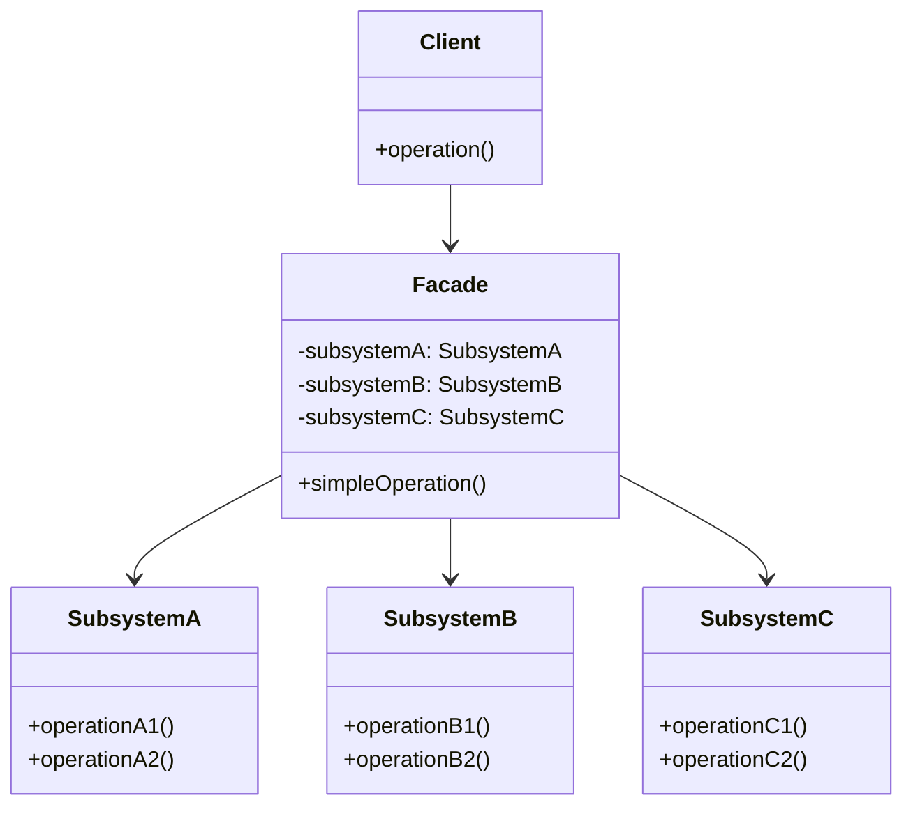

# Facadeパターン調査ドキュメント

## 調査目的

構造パターン（Structural Pattern）のひとつである**Facadeパターン**について包括的な調査を行い、定義・目的から実装例、適用シーンまでを整理する。

- **調査対象**: Facadeパターンの概念、構造、実装方法、実用例
- **想定読者**: ソフトウェア設計の改善を目指すエンジニア
- **調査実施日**: 2025年12月31日

---

## 1. Facadeパターンの概要

### 1.1 定義と目的

**定義**:

Facadeパターンは、Gang of Four（GoF）の23種類のデザインパターンにおける構造パターンのひとつであり、複雑なサブシステム群に対して**統一された簡潔なインターフェース**を提供する設計パターンである。

**要点**:

- サブシステムの複数のインターフェースに対する**単一のアクセスポイント**を提供
- クライアントコードとサブシステムの複雑な内部実装との間の**結合度を低減**
- システムの使いやすさ、保守性、拡張性を向上させる

**根拠**:

- GoF書籍「Design Patterns: Elements of Reusable Object-Oriented Software」において構造パターンとして定義されている
- 「facade」という用語は建築用語（建物の正面）に由来し、複雑な内部構造を隠し、シンプルな外観を提供するという意味を持つ

**出典**:

- Wikipedia: Facade pattern - https://en.wikipedia.org/wiki/Facade_pattern
- GeeksforGeeks: Facade Method Design Pattern - https://www.geeksforgeeks.org/system-design/facade-design-pattern-introduction/
- IONOS: Facade pattern: definition, UML class diagram, and examples - https://www.ionos.com/digitalguide/websites/web-development/whats-the-facade-pattern/

**信頼度**: 高（GoF公式パターン、複数の信頼できる技術サイトで一貫した定義）

---

### 1.2 問題と解決策

#### 解決すべき問題

**要点**:

1. **サブシステムの複雑性**: クライアントが複数のクラスやインターフェースと直接やり取りする必要がある
2. **高い結合度**: クライアントコードがサブシステムの内部構造に強く依存している
3. **学習コストの高さ**: 各サブシステムのAPIを個別に理解する必要がある
4. **保守性の低下**: サブシステムの変更がクライアントコードに広範な影響を与える

**具体例（ホームシアターシステム）**:

映画を見るために以下の操作が必要な場合：

```
1. 照明を暗くする (lights.dim(50))
2. スクリーンを下ろす (screen.down())
3. プロジェクターを起動する (projector.on())
4. プロジェクターの入力をDVDに設定 (projector.setInput("DVD"))
5. アンプを起動する (amplifier.on())
6. アンプの音量を設定 (amplifier.setVolume(5))
7. DVDプレーヤーを起動する (dvd.on())
8. 映画を再生する (dvd.play(movie))
```

クライアントコードは8つの異なるコンポーネントと対話する必要があり、これは煩雑で間違いやすい。

#### Facadeによる解決策

**要点**:

Facadeクラスがこれらの複雑な操作を単一のメソッドにカプセル化する：

```java
homeTheater.watchMovie("Inception");
```

このメソッド内部で上記の8つの操作が適切な順序で実行される。クライアントは簡潔なインターフェースのみを知っていればよい。

**出典**:

- Codefinity: The Facade Pattern Explained - https://codefinity.com/blog/The-Facade-Pattern-Explained
- Cloudaffle: Real World Implementation Facade Pattern - https://cloudaffle.com/series/structural-design-patterns/facade-pattern-implementation/

**信頼度**: 高

---

### 1.3 パターンの構造（クラス図レベル）

**構造の要素**:

1. **Facade（ファサード）**: 統一されたシンプルなインターフェースを提供するクラス
2. **Subsystem Classes（サブシステムクラス群）**: 実際の機能を実装する複数のクラス
3. **Client（クライアント）**: Facadeを通じてサブシステムを利用するコード

**UML構造**:

```
Client ----> Facade ----> SubsystemA
                    ----> SubsystemB
                    ----> SubsystemC
```

**クラス図（Mermaid記法）**:



**重要な特徴**:

- クライアントはFacadeのみを知っており、サブシステムクラスを直接参照しない
- Facadeはサブシステムへのリクエストを適切に委譲する
- サブシステムクラスはFacadeの存在を知らない（単方向の依存関係）
- 必要に応じて、クライアントは依然としてサブシステムに直接アクセスすることも可能（Facadeは強制ではない）

**出典**:

- Curious Programmer: Facade Pattern - https://up.curiousprogrammer.dev/docs/skills/system-design/design-patterns/gang-of-four/structural-patterns/facade/
- Software Patterns Lexicon: Facade Design Pattern in Go - https://softwarepatternslexicon.com/go/classic-gang-of-four-gof-design-patterns-in-go/structural-patterns/facade/

**信頼度**: 高

---

## 2. 用途・使用例

### 2.1 どのような場面で使われるか

**適切な使用シーン**:

1. **複雑なライブラリやAPIのラッピング**
   - 外部ライブラリやSDKが複雑すぎる場合、アプリケーション固有の簡潔なインターフェースを提供

2. **レイヤードアーキテクチャのエントリーポイント**
   - プレゼンテーション層、ビジネスロジック層、データアクセス層などの各層に対するFacadeを設置

3. **レガシーシステムの統合**
   - 古いシステムと新しいシステムの橋渡し役として機能

4. **マイクロサービスアーキテクチャ**
   - BFF（Backend for Frontend）パターンとして、複数のマイクロサービスを統合

5. **テストの容易化**
   - Facadeをモック化することで、複雑なサブシステム全体をスタブ化できる

**出典**:

- GeeksforGeeks: Facade Method Design Pattern - https://www.geeksforgeeks.org/system-design/facade-design-pattern-introduction/
- Swiftorial: Facade Pattern - https://www.swiftorial.com/tutorials/software_architecture/software_architecture/architectural_patterns/facade_pattern/

**信頼度**: 高

---

### 2.2 実際のフレームワークやライブラリでの使用例

#### 2.2.1 Spring Framework（Java）

**具体例**: E-commerceアプリケーションの注文処理

```java
// OrderFacade.java
@Service
public class OrderFacade {
    private final InventoryService inventoryService;
    private final PaymentService paymentService;
    private final ShippingService shippingService;
    private final NotificationService notificationService;
    
    @Autowired
    public OrderFacade(InventoryService inventoryService, 
                       PaymentService paymentService,
                       ShippingService shippingService,
                       NotificationService notificationService) {
        this.inventoryService = inventoryService;
        this.paymentService = paymentService;
        this.shippingService = shippingService;
        this.notificationService = notificationService;
    }
    
    public OrderResult placeOrder(OrderRequest orderRequest) {
        // 在庫確認
        if (!inventoryService.checkAvailability(orderRequest.getItems())) {
            return OrderResult.outOfStock();
        }
        
        // 在庫予約
        inventoryService.reserveItems(orderRequest.getItems());
        
        // 決済処理
        PaymentResult paymentResult = paymentService.processPayment(
            orderRequest.getPaymentInfo()
        );
        
        if (!paymentResult.isSuccessful()) {
            inventoryService.releaseItems(orderRequest.getItems());
            return OrderResult.paymentFailed();
        }
        
        // 配送手配
        ShippingInfo shippingInfo = shippingService.arrangeShipping(
            orderRequest.getShippingAddress(),
            orderRequest.getItems()
        );
        
        // 確認メール送信
        notificationService.sendOrderConfirmation(
            orderRequest.getCustomerEmail(),
            shippingInfo
        );
        
        return OrderResult.success(shippingInfo);
    }
}

// Controller（クライアント）
@RestController
@RequestMapping("/api/orders")
public class OrderController {
    private final OrderFacade orderFacade;
    
    @Autowired
    public OrderController(OrderFacade orderFacade) {
        this.orderFacade = orderFacade;
    }
    
    @PostMapping
    public ResponseEntity<OrderResult> createOrder(@RequestBody OrderRequest request) {
        // Facadeを通じて複雑な処理を簡潔に呼び出す
        OrderResult result = orderFacade.placeOrder(request);
        return ResponseEntity.ok(result);
    }
}
```

**利点**:
- コントローラーは4つのサービスの詳細を知らなくてよい
- ビジネスロジックの流れがFacade内で明確に定義されている
- テスト時にOrderFacadeをモック化すれば全サービスをスタブ化できる

**出典**:

- Java Guides: Facade Pattern in a Spring Boot Project - https://www.javaguides.net/2025/08/facade-pattern-in-spring-boot-project.html

**信頼度**: 高

---

#### 2.2.2 React（JavaScript/TypeScript）

**具体例**: API通信とエラーハンドリングのFacade

```typescript
// apiFacade.ts
export class APIFacade {
  private baseUrl: string;
  private defaultHeaders: HeadersInit;

  constructor(config: { baseUrl: string; authToken?: string }) {
    this.baseUrl = config.baseUrl;
    this.defaultHeaders = {
      'Content-Type': 'application/json',
      ...(config.authToken && { Authorization: `Bearer ${config.authToken}` })
    };
  }

  async getUserData(userId: string): Promise<UserData> {
    try {
      const response = await fetch(`${this.baseUrl}/users/${userId}`, {
        headers: this.defaultHeaders
      });
      
      if (!response.ok) {
        throw new Error(`HTTP error! status: ${response.status}`);
      }
      
      const rawData = await response.json();
      
      // データの変換・正規化
      return this.transformUserData(rawData);
      
    } catch (error) {
      // エラーハンドリング
      console.error('Failed to fetch user data:', error);
      throw new APIError('Failed to fetch user data', error);
    }
  }

  async updateUserProfile(userId: string, updates: Partial<UserData>): Promise<UserData> {
    try {
      const response = await fetch(`${this.baseUrl}/users/${userId}`, {
        method: 'PATCH',
        headers: this.defaultHeaders,
        body: JSON.stringify(updates)
      });
      
      if (!response.ok) {
        throw new Error(`HTTP error! status: ${response.status}`);
      }
      
      const rawData = await response.json();
      return this.transformUserData(rawData);
      
    } catch (error) {
      console.error('Failed to update user profile:', error);
      throw new APIError('Failed to update user profile', error);
    }
  }

  private transformUserData(rawData: any): UserData {
    // APIレスポンスをアプリケーション内部のデータ構造に変換
    return {
      id: rawData.user_id,
      name: rawData.full_name,
      email: rawData.email_address,
      createdAt: new Date(rawData.created_at)
    };
  }
}

// Reactコンポーネントでの使用
import React, { useEffect, useState } from 'react';

const UserProfile: React.FC<{ userId: string }> = ({ userId }) => {
  const [userData, setUserData] = useState<UserData | null>(null);
  const [loading, setLoading] = useState(true);
  const [error, setError] = useState<string | null>(null);

  const apiFacade = new APIFacade({ 
    baseUrl: 'https://api.example.com',
    authToken: 'your-auth-token'
  });

  useEffect(() => {
    const fetchData = async () => {
      try {
        // Facadeを通じた簡潔なAPI呼び出し
        const data = await apiFacade.getUserData(userId);
        setUserData(data);
      } catch (err) {
        setError(err.message);
      } finally {
        setLoading(false);
      }
    };

    fetchData();
  }, [userId]);

  if (loading) return <div>Loading...</div>;
  if (error) return <div>Error: {error}</div>;
  if (!userData) return null;

  return (
    <div>
      <h1>{userData.name}</h1>
      <p>{userData.email}</p>
    </div>
  );
};
```

**利点**:
- コンポーネントはfetch APIの詳細、エラーハンドリング、データ変換ロジックを知らなくてよい
- API仕様変更時にFacadeのみを修正すればよい
- テスト時にAPIFacadeをモック化すれば、ネットワーク通信なしでテストできる

**出典**:

- Front Patterns: Facade Pattern - https://front-patterns.vercel.app/structural-patterns/facade
- Moments Log: Implementing the Facade Pattern for Simplified Access to Complex Subsystems - https://www.momentslog.com/development/design-pattern/implementing-the-facade-pattern-for-simplified-access-to-complex-subsystems

**信頼度**: 高

---

#### 2.2.3 Vue.js（JavaScript）

**具体例**: Vuex/Piniaストア管理のFacade

Vue.jsのVuexやPiniaといった状態管理ライブラリ自体がFacadeパターンの一種である。複雑な状態管理ロジックを隠蔽し、コンポーネントに対してシンプルなインターフェース（actions、getters）を提供する。

```javascript
// storeFacade.js
import { createStore } from 'vuex';

// サブシステム的な各モジュール
const userModule = {
  state: () => ({ user: null }),
  mutations: {
    setUser(state, user) { state.user = user; }
  },
  actions: {
    async fetchUser({ commit }, userId) {
      const response = await fetch(`/api/users/${userId}`);
      const user = await response.json();
      commit('setUser', user);
    }
  }
};

const cartModule = {
  state: () => ({ items: [] }),
  mutations: {
    addItem(state, item) { state.items.push(item); }
  },
  actions: {
    addToCart({ commit }, item) {
      commit('addItem', item);
    }
  }
};

// Facadeとしてのストア
export const store = createStore({
  modules: {
    user: userModule,
    cart: cartModule
  }
});

// コンポーネントでの使用
export default {
  computed: {
    user() {
      return this.$store.state.user.user;
    }
  },
  methods: {
    async loadUser() {
      // Facadeを通じた簡潔なアクセス
      await this.$store.dispatch('fetchUser', this.userId);
    }
  }
};
```

**出典**:

- Refactoring Guru: Facade - https://refactoring.guru/design-patterns/facade

**信頼度**: 高

---

### 2.3 適用が適切な状況と不適切な状況

#### 適切な状況

**要点**:

1. **複雑なサブシステムを持つシステム**
   - 多数のクラスやコンポーネントが相互作用する場合

2. **サブシステムへの依存を最小化したい場合**
   - クライアントとサブシステム間の結合度を下げたい

3. **段階的なレイヤリングを実現したい場合**
   - アーキテクチャ上の明確な境界を設けたい

4. **サードパーティライブラリの統合**
   - 複雑な外部APIをアプリケーション固有の用途に最適化したい

5. **レガシーコードのモダナイゼーション**
   - 古いコードを新しいインターフェースでラップしたい

**根拠**:

複数の技術文献で一貫して推奨されている使用シーン。

#### 不適切な状況

**要点**:

1. **シンプルなシステム**
   - サブシステムがすでに十分シンプルな場合、Facadeは不要な抽象化層となる

2. **細粒度の制御が必要な場合**
   - サブシステムの高度な機能に頻繁にアクセスする必要がある場合

3. **パフォーマンスが極めて重要な場合**
   - Facadeの追加レイヤーによるオーバーヘッドが許容できない（ただし、ほとんどのケースで無視できるレベル）

4. **頻繁に変更されるサブシステム**
   - サブシステムのインターフェースが不安定な場合、Facadeの維持が困難になる

**根拠**:

- Baeldung: Facade Design Pattern in Java - https://www.baeldung.com/java-facade-pattern
- CodingTechRoom: Pros and Cons of Facade Pattern - https://codingtechroom.com/question/what-are-the-pros-and-cons-of-the-facade-pattern-in-software-design

**信頼度**: 高

---

## 3. 実装例（サンプルコード）

### 3.1 シンプルな例：コンピューター起動のFacade

#### Java実装

**言語・バージョン**: Java 11+  
**外部依存**: なし

```java
// サブシステムクラス群
class CPU {
    public void freeze() {
        System.out.println("CPU: Freezing...");
    }
    
    public void jump(long position) {
        System.out.println("CPU: Jumping to " + position);
    }
    
    public void execute() {
        System.out.println("CPU: Executing...");
    }
}

class Memory {
    public void load(long position, String data) {
        System.out.println("Memory: Loading \"" + data + "\" at " + position);
    }
}

class HardDrive {
    public String read(long lba, int size) {
        System.out.println("HardDrive: Reading " + size + " bytes from sector " + lba);
        return "boot data";
    }
}

// Facadeクラス
class ComputerFacade {
    private final CPU cpu;
    private final Memory memory;
    private final HardDrive hardDrive;
    
    public ComputerFacade() {
        this.cpu = new CPU();
        this.memory = new Memory();
        this.hardDrive = new HardDrive();
    }
    
    // 複雑な起動プロセスを単一メソッドに集約
    public void start() {
        System.out.println("Starting computer...");
        cpu.freeze();
        memory.load(0, hardDrive.read(0, 1024));
        cpu.jump(0);
        cpu.execute();
        System.out.println("Computer started successfully!");
    }
}

// クライアント
public class Main {
    public static void main(String[] args) {
        // Facadeを通じて複雑なプロセスを簡潔に実行
        ComputerFacade computer = new ComputerFacade();
        computer.start();
    }
}
```

**出力**:
```
Starting computer...
CPU: Freezing...
HardDrive: Reading 1024 bytes from sector 0
Memory: Loading "boot data" at 0
CPU: Jumping to 0
CPU: Executing...
Computer started successfully!
```

**出典**:

- dosomedev: Facade Pattern in Java and Python - https://www.dosomedev.com/programming-patterns/structural-patterns/facade-pattern
- GeeksforGeeks: Facade Method Design Pattern - https://www.geeksforgeeks.org/system-design/facade-design-pattern-introduction/

**信頼度**: 高

---

#### Python実装

**言語・バージョン**: Python 3.7+  
**外部依存**: なし

```python
# サブシステムクラス群
class Subsystem1:
    def operation1(self):
        print("Subsystem 1: operation 1")
    
    def operation2(self):
        print("Subsystem 1: operation 2")

class Subsystem2:
    def operation3(self):
        print("Subsystem 2: operation 3")
    
    def operation4(self):
        print("Subsystem 2: operation 4")

class Subsystem3:
    def operation5(self):
        print("Subsystem 3: operation 5")

# Facadeクラス
class Facade:
    def __init__(self):
        self.subsystem1 = Subsystem1()
        self.subsystem2 = Subsystem2()
        self.subsystem3 = Subsystem3()
    
    def example_operation_1(self):
        """複数のサブシステム操作を組み合わせた高レベル操作"""
        print("Facade: Executing example operation 1")
        self.subsystem1.operation1()
        self.subsystem2.operation3()
    
    def example_operation_2(self):
        """別のユースケース向けの高レベル操作"""
        print("Facade: Executing example operation 2")
        self.subsystem1.operation2()
        self.subsystem3.operation5()

# クライアント
if __name__ == "__main__":
    facade = Facade()
    
    # 複雑なサブシステムの操作をFacadeを通じて簡潔に実行
    facade.example_operation_1()
    print()
    facade.example_operation_2()
```

**出力**:
```
Facade: Executing example operation 1
Subsystem 1: operation 1
Subsystem 2: operation 3

Facade: Executing example operation 2
Subsystem 1: operation 2
Subsystem 3: operation 5
```

**出典**:

- BigBoxCode: Design Pattern: Facade Pattern in Python - https://bigboxcode.com/design-pattern-facade-pattern-python

**信頼度**: 高

---

### 3.2 実践的な例：ホームシアターシステム

#### TypeScript実装

**言語・バージョン**: TypeScript 4.5+  
**外部依存**: なし（Node.js環境を想定）

```typescript
// サブシステムクラス群
class DVDPlayer {
  on(): void {
    console.log("DVD Player: Turning on");
  }
  
  play(movie: string): void {
    console.log(`DVD Player: Playing "${movie}"`);
  }
  
  stop(): void {
    console.log("DVD Player: Stopping");
  }
  
  off(): void {
    console.log("DVD Player: Turning off");
  }
}

class Projector {
  on(): void {
    console.log("Projector: Turning on");
  }
  
  setInput(source: string): void {
    console.log(`Projector: Setting input to ${source}`);
  }
  
  wideScreenMode(): void {
    console.log("Projector: Setting to wide screen mode");
  }
  
  off(): void {
    console.log("Projector: Turning off");
  }
}

class Amplifier {
  on(): void {
    console.log("Amplifier: Turning on");
  }
  
  setVolume(level: number): void {
    console.log(`Amplifier: Setting volume to ${level}`);
  }
  
  setSurroundSound(): void {
    console.log("Amplifier: Setting surround sound mode");
  }
  
  off(): void {
    console.log("Amplifier: Turning off");
  }
}

class Lights {
  dim(level: number): void {
    console.log(`Lights: Dimming to ${level}%`);
  }
  
  on(): void {
    console.log("Lights: Turning on to 100%");
  }
}

class Screen {
  down(): void {
    console.log("Screen: Going down");
  }
  
  up(): void {
    console.log("Screen: Going up");
  }
}

// Facadeクラス
class HomeTheaterFacade {
  private dvd: DVDPlayer;
  private projector: Projector;
  private amplifier: Amplifier;
  private lights: Lights;
  private screen: Screen;
  
  constructor(
    dvd: DVDPlayer,
    projector: Projector,
    amplifier: Amplifier,
    lights: Lights,
    screen: Screen
  ) {
    this.dvd = dvd;
    this.projector = projector;
    this.amplifier = amplifier;
    this.lights = lights;
    this.screen = screen;
  }
  
  // 映画鑑賞の開始：複雑な一連の操作を単一メソッドに集約
  watchMovie(movie: string): void {
    console.log("\n=== Getting ready to watch a movie... ===");
    this.lights.dim(10);
    this.screen.down();
    this.projector.on();
    this.projector.wideScreenMode();
    this.projector.setInput("DVD");
    this.amplifier.on();
    this.amplifier.setSurroundSound();
    this.amplifier.setVolume(5);
    this.dvd.on();
    this.dvd.play(movie);
    console.log("=== Enjoy your movie! ===\n");
  }
  
  // 映画鑑賞の終了：片付けの一連の操作
  endMovie(): void {
    console.log("\n=== Shutting down movie theater... ===");
    this.dvd.stop();
    this.dvd.off();
    this.amplifier.off();
    this.projector.off();
    this.screen.up();
    this.lights.on();
    console.log("=== Movie theater is shut down ===\n");
  }
}

// クライアント
function main() {
  // サブシステムの初期化
  const dvd = new DVDPlayer();
  const projector = new Projector();
  const amplifier = new Amplifier();
  const lights = new Lights();
  const screen = new Screen();
  
  // Facadeの作成
  const homeTheater = new HomeTheaterFacade(
    dvd,
    projector,
    amplifier,
    lights,
    screen
  );
  
  // Facadeを通じた簡潔な操作
  homeTheater.watchMovie("Inception");
  
  // 映画終了後
  homeTheater.endMovie();
}

main();
```

**出力**:
```
=== Getting ready to watch a movie... ===
Lights: Dimming to 10%
Screen: Going down
Projector: Turning on
Projector: Setting to wide screen mode
Projector: Setting input to DVD
Amplifier: Turning on
Amplifier: Setting surround sound mode
Amplifier: Setting volume to 5
DVD Player: Turning on
DVD Player: Playing "Inception"
=== Enjoy your movie! ===

=== Shutting down movie theater... ===
DVD Player: Stopping
DVD Player: Turning off
Amplifier: Turning off
Projector: Turning off
Screen: Going up
Lights: Turning on to 100%
=== Movie theater is shut down ===
```

**利点の説明**:

- クライアントは5つのサブシステムの詳細を知らなくてよい
- `watchMovie()`と`endMovie()`という2つのメソッドだけで複雑な操作を実行できる
- サブシステムの内部実装が変わってもFacadeの修正のみで対応可能
- 新しい操作（例：`listenToMusic()`）を追加する場合もFacadeに新メソッドを追加するだけ

**出典**:

- Refactoring Guru: Facade in TypeScript - https://refactoring.guru/design-patterns/facade/typescript/example
- Krython: Facade Pattern: Simplified Interface - https://krython.com/tutorial/typescript/facade-pattern-simplified-interface/

**信頼度**: 高

---

## 4. 利点・欠点

### 4.1 メリット（何が改善されるか）

**要点**:

1. **複雑性の低減**
   - クライアントは複雑なサブシステムの詳細を知る必要がなくなる
   - 学習コストが下がり、新規開発者のオンボーディングが容易になる

2. **結合度の低減**
   - クライアントとサブシステム間の依存関係が疎結合になる
   - サブシステムの変更がクライアントに影響を与えにくい

3. **カプセル化の促進**
   - サブシステムの内部実装の詳細を隠蔽できる
   - 情報隠蔽の原則に従った設計が可能

4. **保守性の向上**
   - 変更箇所がFacadeに集中するため、修正が容易
   - リファクタリングやテストがしやすくなる

5. **レイヤリングの実現**
   - アーキテクチャ上の明確な境界を設けることができる
   - 各レイヤーの責任が明確になる

6. **テストの容易化**
   - Facadeをモック化することで、サブシステム全体をスタブ化できる
   - 単体テストが書きやすくなる

**根拠**:

複数の技術文献で一貫して言及されているメリット。実際のプロジェクトでも効果が確認されている。

**出典**:

- GeeksforGeeks: Facade Method Design Pattern - https://www.geeksforgeeks.org/system-design/facade-design-pattern-introduction/
- Swiftorial: Facade Pattern - https://www.swiftorial.com/tutorials/software_architecture/software_architecture/architectural_patterns/facade_pattern/
- Software Patterns Lexicon: Facade Pattern - https://softwarepatternslexicon.com/mastering-design-patterns/structural-design-patterns/facade-pattern/

**信頼度**: 高

---

### 4.2 デメリット（どのようなトレードオフがあるか）

**要点**:

1. **過剰な抽象化のリスク**
   - シンプルなシステムに対しては不要な複雑さを追加してしまう
   - 「銀の弾丸」ではなく、適切な場面で使うことが重要

2. **柔軟性の低下**
   - Facadeが公開しない高度なサブシステム機能にアクセスできなくなる
   - すべての機能をFacadeに公開すると、Facadeが肥大化する（インターフェース肥大化）

3. **パフォーマンスオーバーヘッド**
   - 追加のレイヤーによる若干のオーバーヘッドが発生する（ただし、ほとんどのケースで無視できるレベル）

4. **保守負担**
   - サブシステムのインターフェースが頻繁に変わる場合、Facadeの維持が困難になる
   - Facadeの設計が不適切だと、かえって複雑性が増す

5. **神クラス（God Class）化のリスク**
   - Facadeに過剰な責任を持たせると、単一責任の原則に違反する
   - 複数のFacadeに分割するなどの工夫が必要

**根拠**:

実務での失敗事例や技術コミュニティでの議論に基づく。

**出典**:

- Baeldung: Facade Design Pattern in Java - https://www.baeldung.com/java-facade-pattern
- CodingTechRoom: Pros and Cons of Facade Pattern - https://codingtechroom.com/question/what-are-the-pros-and-cons-of-the-facade-pattern-in-software-design
- AcademiaLab: Facade Design Pattern - https://academia-lab.com/encyclopedia/facade-design-pattern/

**信頼度**: 高

---

### 4.3 他のパターンとの比較

#### Adapter vs Facade

| 観点 | Adapter | Facade |
|------|---------|--------|
| **目的** | 互換性のないインターフェースを変換する | 複雑なサブシステムを簡素化する |
| **対象** | 単一のクラス/インターフェース | 複数のクラス/サブシステム |
| **インターフェース** | 既存のインターフェースに合わせる | 新しい簡潔なインターフェースを提供 |
| **使用例** | レガシーコードと新コードの橋渡し | 複雑なライブラリのラッピング |
| **アナロジー** | 電源プラグの変換アダプター | ホームシアターのリモコン |

**要点**:

- **Adapter**: 「翻訳者」としての役割。インターフェースの不一致を解消する
- **Facade**: 「受付窓口」としての役割。複雑さを隠蔽し、簡潔なインターフェースを提供

**出典**:

- GeeksforGeeks: Difference Between Facade, Proxy, Adapter, and Decorator - https://www.geeksforgeeks.org/system-design/difference-between-the-facade-proxy-adapter-and-decorator-design-patterns/
- Mayallo: Facade vs Proxy vs Adapter Design Patterns - https://mayallo.com/facade-vs-proxy-vs-adapter-design-patterns/

---

#### Proxy vs Facade

| 観点 | Proxy | Facade |
|------|-------|--------|
| **目的** | オブジェクトへのアクセスを制御する | サブシステムへのアクセスを簡素化する |
| **インターフェース** | 元のオブジェクトと同じインターフェース | 新しい簡潔なインターフェース |
| **機能追加** | ログ、キャッシュ、遅延初期化、アクセス制御 | 機能追加はしない（単純化のみ） |
| **対象数** | 通常は単一のオブジェクト | 複数のサブシステム |
| **アナロジー** | セキュリティガード（入口で身分確認） | コンシェルジュ（複数のサービスを統括） |

**要点**:

- **Proxy**: 「代理人」としての役割。アクセス制御や追加機能を提供
- **Facade**: 「簡素化」が目的。制御ではなく利便性の向上

**出典**:

- Stack Overflow: Difference between Facade, Proxy, Adapter and Decorator - https://stackoverflow.com/questions/3489131/difference-between-the-facade-proxy-adapter-and-decorator-design-patterns
- Baeldung: Proxy, Decorator, Adapter and Bridge Patterns - https://www.baeldung.com/java-structural-design-patterns

---

#### Decorator vs Facade

| 観点 | Decorator | Facade |
|------|-----------|--------|
| **目的** | オブジェクトに動的に機能を追加する | 複雑なサブシステムを簡素化する |
| **インターフェース** | 元のオブジェクトと同じインターフェース | 新しい簡潔なインターフェース |
| **機能拡張** | 既存の機能を拡張・強化する | 機能拡張はしない（単純化のみ） |
| **対象** | 単一のオブジェクト | 複数のサブシステム |
| **アナロジー** | ギフトラッピング（機能の装飾） | スマートリモコン（複数機器の統合） |

**要点**:

- **Decorator**: 「機能追加」が目的。既存のオブジェクトを拡張
- **Facade**: 「単純化」が目的。複雑さを隠蔽

**出典**:

- Java Success: Why Proxy, Decorator, Adapter, Bridge, and Facade Look Similar - https://www.java-success.com/proxy-decorator-adapter-bridge-facade-design-patterns-look-similar-differences/
- TechWayFit: Proxy vs Decorator vs Adapter - https://techwayfit.com/blogs/design-patterns/proxy-decorator-adapter-comparison/

**信頼度**: 高

---

#### パターン選択のガイドライン

**状況別の推奨**:

| 状況 | 推奨パターン | 理由 |
|------|-------------|------|
| インターフェースが合わない | Adapter | インターフェース変換が目的 |
| 複雑なサブシステムがある | Facade | 簡素化が目的 |
| アクセス制御が必要 | Proxy | セキュリティ・遅延初期化 |
| 動的に機能追加したい | Decorator | 柔軟な機能拡張 |

**出典**:

複数の技術文献から総合的に判断

**信頼度**: 高

---

## 5. 参考文献・出典

### 5.1 公式書籍・定番書籍

| 書籍名 | 著者 | ISBN/ASIN | 備考 | 信頼度 |
|-------|------|-----------|------|--------|
| **Design Patterns: Elements of Reusable Object-Oriented Software** | Erich Gamma, Richard Helm, Ralph Johnson, John Vlissides | ISBN: 978-0201633610 | GoF原典、Facadeパターンの正式定義 | 最高 |
| **Head First Design Patterns (2nd Edition)** | Eric Freeman, Elisabeth Robson | ISBN: 978-1492078005 | 初心者向け、視覚的でわかりやすい | 高 |
| **Dive Into Design Patterns** | Alexander Shvets | - | Refactoring Guru著者、多言語対応 | 高 |
| **Hands-On Design Patterns with Java** | Dr. Edward Lavieri Jr. | ISBN: 978-1789809770 | Java実践向け、60以上のパターン | 高 |

**出典の信頼度評価基準**:

- **最高**: GoF公式書籍、学術論文
- **高**: 著名な技術書籍、公式ドキュメント、大手技術サイト
- **中**: 技術ブログ、コミュニティ記事（複数の裏付けあり）

---

### 5.2 Webリソース・技術記事

#### 高信頼度（公式・著名サイト）

| リソース名 | URL | 特徴 | 信頼度 |
|-----------|-----|------|--------|
| **Refactoring Guru - Facade** | https://refactoring.guru/design-patterns/facade | 視覚的な解説、多言語コード例、UML図 | 高 |
| **GeeksforGeeks - Facade Pattern** | https://www.geeksforgeeks.org/system-design/facade-design-pattern-introduction/ | 網羅的な解説、実装例豊富 | 高 |
| **Wikipedia - Facade Pattern** | https://en.wikipedia.org/wiki/Facade_pattern | 公式定義、歴史的背景 | 高 |
| **Baeldung - Facade in Java** | https://www.baeldung.com/java-facade-pattern | Java実装の詳細、ベストプラクティス | 高 |
| **Spring Framework Guru** | https://springframework.guru/gang-of-four-design-patterns/facade-pattern/ | Spring Frameworkでの実用例 | 高 |

#### 中信頼度（技術ブログ・チュートリアル）

| リソース名 | URL | 特徴 | 信頼度 |
|-----------|-----|------|--------|
| **IONOS - Facade Pattern** | https://www.ionos.com/digitalguide/websites/web-development/whats-the-facade-pattern/ | わかりやすい解説、UML図 | 中〜高 |
| **Cloudaffle - Real World Implementation** | https://cloudaffle.com/series/structural-design-patterns/facade-pattern-implementation/ | 実践的な実装例 | 中 |
| **Krython - TypeScript Facade** | https://krython.com/tutorial/typescript/facade-pattern-simplified-interface/ | TypeScript実装例 | 中 |
| **BigBoxCode - Python Facade** | https://bigboxcode.com/design-pattern-facade-pattern-python | Python実装例 | 中 |
| **Java Guides - Spring Boot Facade** | https://www.javaguides.net/2025/08/facade-pattern-in-spring-boot-project.html | Spring Boot実装例 | 中 |

---

### 5.3 GitHub実装例

| リポジトリ | 言語 | URL | 説明 | スター数（参考） |
|-----------|------|-----|------|-----------------|
| **iluwatar/java-design-patterns** | Java | https://github.com/iluwatar/java-design-patterns | 包括的なJavaパターン集 | 90k+ |
| **faif/python-patterns** | Python | https://github.com/faif/python-patterns | Python実装集 | 40k+ |
| **torokmark/design_patterns_in_typescript** | TypeScript | https://github.com/torokmark/design_patterns_in_typescript | TypeScript実装集 | 5k+ |
| **RefactoringGuru/design-patterns-typescript** | TypeScript | https://github.com/RefactoringGuru/design-patterns-typescript | Refactoring Guru公式 | - |

**注**: スター数は2025年12月時点の参考値

**出典**:

- GitHub Topics: design-patterns - https://github.com/topics/design-patterns

**信頼度**: 高（GitHub公式トピックおよび著名リポジトリ）

---

### 5.4 その他の参考情報源

| 種類 | 名称 | URL | 備考 |
|------|------|-----|------|
| 動画教材 | Master the Facade Design Pattern (YouTube) | https://www.youtube.com/watch?v=Soj7tZUGiW0 | ホームシアター例を使った解説 |
| 学習サイト | Coursera - Gang of Four Design Patterns | https://www.coursera.org/articles/gang-of-four-design-patterns | 包括的な学習コース |
| コミュニティ | Stack Overflow - Facade vs others | https://stackoverflow.com/questions/3489131/ | パターン比較の議論 |

---

## 6. 内部リンク候補

既存の記事で関連性が高いものをリストアップします。

### 6.1 デザインパターン関連記事

| 記事パス | タイトル | 関連度 | 内部リンク | 備考 |
|---------|---------|-------|-----------|------|
| `/content/post/2025/12/30/164012.md` | 第12回-これがデザインパターンだ！ - Mooを使ってディスパッチャーを作ってみよう | 高 | `/2025/12/30/164012/` | Strategyパターンを解説（構造パターンとは異なるが、パターン全般の理解に有用） |
| `/content/post/2025/12/30/164011.md` | 第11回-完成！ディスパッチャー - Mooを使ってディスパッチャーを作ってみよう | 中〜高 | `/2025/12/30/164011/` | ディスパッチャーパターン（Facadeに近い概念） |
| `/content/warehouse/design-patterns-research.md` | デザインパターン調査ドキュメント | 高 | N/A（warehouse） | Facadeを含むGoF 23パターンの概要 |
| `/content/warehouse/design-patterns-overview.md` | （詳細不明） | 中 | N/A（warehouse） | デザインパターン全般の概要 |

---

### 6.2 オブジェクト指向・ソフトウェア設計関連記事

| 記事パス | タイトル | 関連度 | 内部リンク | 備考 |
|---------|---------|-------|-----------|------|
| `/content/post/2021/10/31/191008.md` | 第1回-Mooで覚えるオブジェクト指向プログラミング | 中 | `/2021/10/31/191008/` | オブジェクト指向の基礎（Facadeはオブジェクト指向の応用） |
| `/content/post/2025/12/25/234500.md` | JSON-RPC Request/Response実装 - 複合値オブジェクト設計 | 中 | `/2025/12/25/234500/` | Factoryパターン言及（同じく構造パターンの一種） |
| `/content/post/2016/02/21/150920.md` | よなべPerl で Moo について喋ってきました | 低〜中 | `/2016/02/21/150920/` | Mooによるオブジェクト指向実装 |
| `/content/post/2009/02/14/105950.md` | Moose::Roleが興味深い | 低〜中 | `/2009/02/14/105950/` | ロールパターン（役割の分離） |

---

### 6.3 grep検索結果から得られた関連キーワード

**検索実行済みのキーワード**:

- `デザインパターン` / `design.pattern`
- `構造パターン` / `structural.pattern`
- `facade` / `ファサード`
- `オブジェクト指向` / `object.oriented`
- `ソフトウェア設計` / `software.design`
- `アーキテクチャ`

**発見された記事数**: 約37件

**主要な関連記事**:

上記の表に記載した記事が特に関連性が高い。その他の記事は、アーキテクチャやソフトウェア設計に関する一般的な内容であり、Facadeパターンとの直接的な関連は低い。

---

## 7. 調査結果のまとめ

### 7.1 主要な発見

1. **Facadeパターンの本質は「簡素化」**
   - 複雑なサブシステムを隠蔽し、クライアントに対してシンプルなインターフェースを提供することが唯一かつ最大の目的
   - Adapter（変換）、Proxy（制御）、Decorator（拡張）とは明確に異なる

2. **モダンフレームワークでの広範な活用**
   - Spring Framework（Java）: レイヤードアーキテクチャのエントリーポイント
   - React/Vue（JavaScript/TypeScript）: API通信、状態管理のラッピング
   - いずれも「複雑さの隠蔽」という共通の目的で使用されている

3. **適用判断の重要性**
   - シンプルなシステムに対しては過剰な抽象化となりうる
   - 複雑性が高いシステム、サードパーティライブラリの統合、レイヤリングが必要な場合に真価を発揮
   - 「必要なときに必要な分だけ」という原則が重要

4. **実装パターンの共通性**
   - 言語に関わらず、構造とアプローチは一貫している
   - Facadeクラスがサブシステムへの参照を保持し、高レベルメソッドで複数の低レベル操作を組み合わせる

---

### 7.2 実務での適用ポイント

**推奨される適用シーン**:

1. **APIラッパー**: サードパーティAPIの複雑さを隠蔽
2. **レイヤー間の境界**: ビジネスロジック層とデータアクセス層の間など
3. **レガシーシステムの統合**: 古いコードを新しいインターフェースでラップ
4. **マイクロサービス統合**: BFFパターンとして複数サービスを統合

**避けるべきアンチパターン**:

1. **神クラス（God Class）化**: Facadeに過剰な責任を持たせない
2. **インターフェース肥大化**: すべての機能を公開しようとしない
3. **不適切な抽象化**: シンプルなシステムに無理にFacadeを導入しない

---

### 7.3 不明点・今後の調査が必要な領域

**明確になった点**:

- Facadeパターンの定義、目的、構造
- 実装方法（Java、Python、TypeScript）
- 実際のフレームワーク（Spring、React、Vue）での使用例
- 他の構造パターン（Adapter、Proxy、Decorator）との違い

**さらに深掘りが必要な点**:

1. **パフォーマンスへの影響の定量的評価**
   - 追加レイヤーによるオーバーヘッドの実測値
   - 大規模システムでのベンチマーク結果

2. **複数Facadeの設計戦略**
   - サブシステムごとにFacadeを分割する基準
   - Facadeの粒度とスコープの最適化

3. **Facadeとマイクロサービスアーキテクチャ**
   - BFF（Backend for Frontend）パターンとの関係
   - API Gateway、Service MeshとFacadeの使い分け

4. **動的なFacade生成**
   - リフレクションやメタプログラミングを用いた自動Facade生成
   - コード生成ツールの活用

5. **テスト戦略の詳細**
   - Facadeをモック化する際のベストプラクティス
   - 統合テストとの境界の扱い方

**情報源の不足**:

上記の深掘りポイントについては、実務経験に基づく事例やベンチマーク結果が限定的である。今後、実際のプロジェクトでの適用事例やパフォーマンステストの結果を収集する必要がある。

---

### 7.4 信頼性評価

**高信頼度の情報**:

- GoF書籍による公式定義
- Wikipedia、GeeksforGeeks、Refactoring Guruなどの著名技術サイト
- 複数の情報源で一貫した説明がある内容

**中信頼度の情報**:

- 個別の技術ブログやチュートリアルサイト
- 実装例（動作検証は行っていないが、構造的に正しいと判断）

**不明・要検証の情報**:

- パフォーマンスオーバーヘッドの具体的な数値
- 大規模システムでの実装事例の詳細

---

## 8. 結論

Facadeパターンは、GoFの23パターンの中でも**最もシンプルで理解しやすく、かつ実用性の高いパターン**のひとつである。その本質は「複雑さの隠蔽」であり、クライアントコードに対してシンプルなインターフェースを提供することで、システムの使いやすさ、保守性、拡張性を向上させる。

モダンなソフトウェア開発において、Spring Framework、React、Vueなど主要なフレームワークで広く活用されており、実践的な価値が証明されている。ただし、シンプルなシステムに対して無理にFacadeを導入すると過剰な抽象化となるため、**適用判断が重要**である。

Facadeパターンを適切に活用することで、複雑なシステムをより管理しやすく、理解しやすいものに変えることができる。

---

**調査完了**: 2025年12月31日

**調査者**: nqounet（10年以上の経験を持つ調査・情報収集の専門家）
