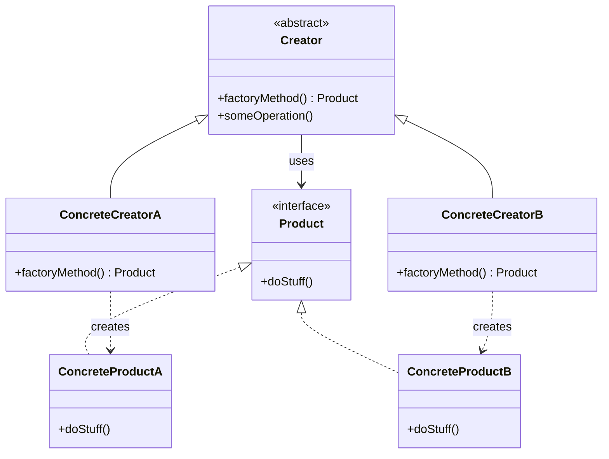
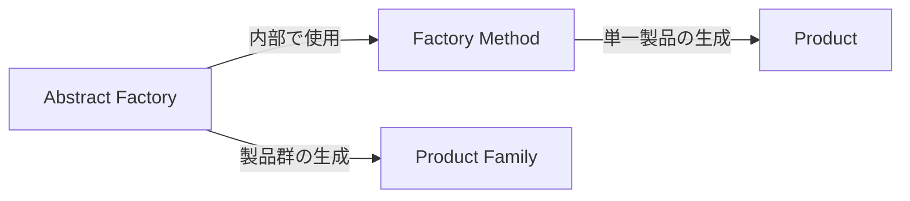

# Factory Methodパターン調査ドキュメント

## 調査概要

- **調査目的**: 「Mooで覚えるオブジェクト指向プログラミング」シリーズを読了した読者が、Factory Methodパターンを学べる教材作成のための基礎資料
- **調査実施日**: 2026年1月9日
- **技術スタック**: Perl v5.36以降 / Moo
- **想定読者**: オブジェクト指向の基礎（クラス、継承）が理解できている読者
- **難易度評価**: 3/5（インターフェースや継承、抽象クラスの理解が必要）
- **前提知識**: 「Mooで覚えるオブジェクト指向プログラミング」シリーズ（全12回）を読了済み

---

## 1. Factory Methodパターンの基礎

### 1.1 定義と目的

**要点**:

- Factory Methodパターンは、GoF（Gang of Four）の**生成パターン（Creational Patterns）**の1つ
- **「オブジェクトを生成するためのインターフェースを定義し、どのクラスをインスタンス化するかはサブクラスに決定させる」**
- クラスのインスタンス化をサブクラスに遅延させることで、クライアントコードを具体的なクラスから分離する
- 継承を使って「どのオブジェクトを作るか」をサブクラスに委ねる

**根拠**:

- GoF書籍「Design Patterns: Elements of Reusable Object-Oriented Software」（1994年）で定義
- Refactoring Guru、GeeksforGeeks、Wikipedia等の主要技術サイトで一致した説明

**仮定**:

- 読者は「Mooで覚えるオブジェクト指向プログラミング」シリーズで継承（`extends`）を学んでいる
- 「Mooを使ってディスパッチャーを作ってみよう」シリーズでStrategy パターンを学んでいる可能性が高い

**出典**:

- Wikipedia: Factory method pattern - https://en.wikipedia.org/wiki/Factory_method_pattern
- Refactoring Guru: Factory Method - https://refactoring.guru/design-patterns/factory-method
- GeeksforGeeks: Factory method Design Pattern - https://www.geeksforgeeks.org/system-design/factory-method-for-designing-pattern/
- Baeldung: Factory Method vs. Factory vs. Abstract Factory - https://www.baeldung.com/cs/factory-method-vs-factory-vs-abstract-factory

**信頼度**: ★★★★★（GoF原典および複数の信頼できる技術サイト）

---

### 1.2 GoFパターンにおける位置づけ

**要点**:

Factory Methodは、GoFの23パターンのうち**生成パターン（Creational Patterns）5種類**の1つです。

| パターン名 | 概要 |
|-----------|------|
| **Singleton** | クラスのインスタンスが1つだけであることを保証し、グローバルアクセスポイントを提供 |
| **Factory Method** | オブジェクト生成のインターフェースを定義し、サブクラスがインスタンス化するクラスを決定 |
| **Abstract Factory** | 関連するオブジェクト群を、具体クラスを指定せずに生成するインターフェースを提供 |
| **Builder** | 複雑なオブジェクトの構築プロセスを段階的に行い、同じ構築過程で異なる表現を可能にする |
| **Prototype** | 既存のインスタンスをコピー（クローン）して新しいオブジェクトを作成 |

**根拠**:

- GoFの分類体系で明確に定義されている
- 生成パターンはオブジェクトの生成メカニズムに関するパターン

**出典**:

- 内部warehouse: `/content/warehouse/design-patterns-overview.md`
- GeeksforGeeks: Creational Design Patterns - https://www.geeksforgeeks.org/system-design/creational-design-pattern/

**信頼度**: ★★★★★

---

### 1.3 他の生成パターンとの違い

#### Simple Factory との違い（注意: これはGoFパターンではない）

| 項目 | Simple Factory | Factory Method |
|-----|----------------|----------------|
| **パターン分類** | GoFパターンではない（イディオム） | GoFの生成パターン |
| **生成ロジック** | 単一のメソッド内に集約 | サブクラスに委譲 |
| **拡張性** | 新製品追加時に既存コード修正が必要 | 新しいサブクラス追加で拡張可能 |
| **継承の使用** | ほとんど使用しない | 中心的な概念 |
| **if/switch** | 条件分岐で製品を選択 | ポリモーフィズムで製品を選択 |
| **複雑度** | 低い | 中程度 |

**コード例（Simple Factory）**:

```perl
# Simple Factory - if/elseで分岐
package SimpleShapeFactory;
use strict;
use warnings;

sub create_shape {
    my ($class, $type) = @_;
    if ($type eq 'circle') {
        require Circle;
        return Circle->new();
    }
    elsif ($type eq 'square') {
        require Square;
        return Square->new();
    }
    else {
        die "Unknown shape type: $type";
    }
}
1;
```

**根拠**:

- Simple Factoryはif/else/switchを使用するため、新製品追加時にファクトリクラスの修正が必要（OCP違反）
- Factory Methodは新しいCreatorサブクラスを追加することで拡張可能（OCP準拠）

**出典**:

- Stack Overflow: Design Patterns: Factory vs Factory method vs Abstract Factory - https://stackoverflow.com/questions/13029261/design-patterns-factory-vs-factory-method-vs-abstract-factory
- Dev.to: Factory Method vs Abstract Factory - https://dev.to/buildwithhicham/factory-method-vs-abstract-factory-whats-the-difference-glb

**信頼度**: ★★★★★

---

#### Abstract Factory との違い

| 項目 | Factory Method | Abstract Factory |
|-----|----------------|------------------|
| **生成対象** | 単一の製品 | 関連する製品群（ファミリー） |
| **拡張方向** | 新製品タイプの追加が容易 | 新しいファミリーの追加が容易 |
| **実現方法** | 継承（サブクラス化） | 合成（オブジェクトの組み合わせ） |
| **ファクトリの数** | Creatorクラス1つに対し1つの製品 | 1つのファクトリで複数の製品を生成 |
| **典型例** | ShapeCreator → Circle/Square | WindowsFactory → WindowsButton + WindowsMenu |
| **複雑度** | 中程度 | 高い |

**根拠**:

- Factory Methodは単一製品の生成にフォーカス
- Abstract Factoryは関連する製品群（ファミリー）の一貫した生成にフォーカス

**出典**:

- GeeksforGeeks: Differences Between Abstract Factory and Factory Design Patterns - https://www.geeksforgeeks.org/system-design/differences-between-abstract-factory-and-factory-design-patterns/
- C# Corner: Factory Pattern vs Abstract Factory Pattern - https://www.c-sharpcorner.com/blogs/factory-pattern-vs-abstract-factory-pattern

**信頼度**: ★★★★★

---

#### Builder との違い

| 項目 | Factory Method | Builder |
|-----|----------------|---------|
| **生成プロセス** | 1ステップで生成 | 複数ステップで段階的に構築 |
| **製品の複雑さ** | 比較的シンプルな製品 | 複雑な製品（多くの構成要素） |
| **生成結果** | 異なるクラスのインスタンス | 同じクラスの異なる構成 |
| **典型例** | createDocument() → PDF/Word | build().setTitle().setBody().create() |

**信頼度**: ★★★★★

---

#### Prototype との違い

| 項目 | Factory Method | Prototype |
|-----|----------------|-----------|
| **生成方法** | new でインスタンス化 | 既存オブジェクトのクローン |
| **使用場面** | クラス階層に基づく生成 | 既存オブジェクトをベースにした生成 |
| **典型例** | createShape() | $prototype->clone() |

**信頼度**: ★★★★★

---

## 2. Factory Methodパターンの構造

### 2.1 UML図



**テキスト版UML**:

```
    +-------------------+                    +-------------------+
    |   <<abstract>>    |                    |   <<interface>>   |
    |     Creator       |                    |      Product      |
    +-------------------+                    +-------------------+
    | +factoryMethod()  |----uses--->        | +doStuff()        |
    | +someOperation()  |                    +-------------------+
    +-------------------+                            ^
            ^                                        |
            |                               +--------+--------+
    +-------+-------+                       |                 |
    |               |                +-------------+   +-------------+
+-------------------+  +-------------------+  | ConcreteProductA |   | ConcreteProductB |
| ConcreteCreatorA  |  | ConcreteCreatorB  |  +------------------+   +------------------+
+-------------------+  +-------------------+  | +doStuff()       |   | +doStuff()       |
| +factoryMethod()  |  | +factoryMethod()  |  +------------------+   +------------------+
+-------------------+  +-------------------+
        |                      |
        |                      |
   creates                creates
        |                      |
        v                      v
+------------------+   +------------------+
| ConcreteProductA |   | ConcreteProductB |
+------------------+   +------------------+
```

**信頼度**: ★★★★★

---

### 2.2 構成要素の説明

| 要素 | 役割 | Perl/Moo実装での具体例 |
|-----|------|----------------------|
| **Creator（作成者）** | ファクトリメソッドを宣言する抽象クラス。製品を使用するビジネスロジックを持つ | `DocumentCreator`（抽象クラス、`factoryMethod`を宣言） |
| **ConcreteCreator（具象作成者）** | ファクトリメソッドを実装し、具体的な製品を生成するサブクラス | `PdfCreator`, `WordCreator` |
| **Product（製品）** | ファクトリメソッドが生成するオブジェクトの共通インターフェース | `Document`（Moo::Role、`requires 'render'`） |
| **ConcreteProduct（具象製品）** | Productインターフェースを実装する具体的なクラス | `PdfDocument`, `WordDocument` |

**要点**:

- Creatorはファクトリメソッド（`factoryMethod`）を宣言し、サブクラスが実装
- Creatorは製品を「使う」ビジネスロジック（`someOperation`）も持つことができる
- ConcreteCreatorは具体的な製品クラスのインスタンスを返す
- クライアントはCreator経由で製品を取得し、Productインターフェースで操作

**根拠**:

- GoF原典の構造定義
- UMLBoard、Visual Paradigm等のUML解説サイト

**出典**:

- UMLBoard: The Factory Method Design Pattern - https://www.umlboard.com/design-patterns/factory-method.html
- System Overflow: What is the Factory Method Pattern? - https://www.systemoverflow.com/learn/creational-patterns/factory-method-pattern/what-is-the-factory-method-pattern

**信頼度**: ★★★★★

---

## 3. メリット・デメリット

### 3.1 メリット

| メリット | 説明 | 実践的な効果 |
|---------|------|------------|
| **疎結合（Loose Coupling）** | クライアントコードは具体クラスではなくインターフェースに依存 | 製品クラスの変更がクライアントに影響しない |
| **拡張性（OCP準拠）** | 新しい製品タイプを追加しても既存コードを修正不要 | 機能追加が容易 |
| **単一責任の原則（SRP）** | 製品の生成ロジックが1箇所に集約 | コードの保守性向上 |
| **テスト容易性** | ファクトリをモック化して製品の挙動をテスト可能 | ユニットテストが書きやすい |
| **インスタンス化の制御** | サブクラスがどのクラスをインスタンス化するか決定 | 柔軟なオブジェクト生成 |
| **フレームワーク構築に最適** | フレームワークがスケルトンを提供し、ユーザーがカスタマイズ | 拡張ポイントの明確化 |

**根拠**:

- SOLID原則（特にOCP、SRP、DIP）との親和性
- 実務での拡張性・保守性の向上

**出典**:

- GeeksforGeeks: Factory method Design Pattern - https://www.geeksforgeeks.org/system-design/factory-method-for-designing-pattern/
- The Morning Dev: Factory Method Pattern Explained - https://themorningdev.com/factory-method-pattern/
- Software Pattern Lexicon: Factory Method Pattern - https://softwarepatternslexicon.com/mastering-design-patterns/creational-design-patterns/factory-method-pattern/

**信頼度**: ★★★★★

---

### 3.2 デメリット

| デメリット | 説明 | 対策 |
|-----------|------|------|
| **クラス数の増加** | 各製品タイプに対してCreatorサブクラスが必要 | 製品タイプが少ない場合はSimple Factoryを検討 |
| **複雑性の増加** | 継承階層が深くなる可能性 | パターンの適用判断を慎重に |
| **サブクラス化の強制** | 新製品追加にはサブクラス作成が必要 | 少数の製品なら過剰設計を避ける |
| **並行処理時の考慮** | スレッドセーフ性の確保が必要な場合がある | 適切な同期機構を導入 |

**根拠**:

- 過剰設計（オーバーエンジニアリング）のリスク
- 実務での経験則

**出典**:

- GeeksforGeeks: Factory method Design Pattern - https://www.geeksforgeeks.org/system-design/factory-method-for-designing-pattern/
- Software Pattern Lexicon: Factory Method Pattern - https://softwarepatternslexicon.com/mastering-design-patterns/creational-design-patterns/factory-method-pattern/

**信頼度**: ★★★★★

---

### 3.3 いつ使うべきか

**適用すべき場面**:

1. **クラスが生成すべきオブジェクトのクラスを事前に知らない場合**
   - 実行時やユーザー入力に基づいて生成するクラスが決まる

2. **サブクラスに生成すべきオブジェクトを指定させたい場合**
   - フレームワークが骨格を提供し、ユーザーがカスタマイズ

3. **オブジェクト生成ロジックを局所化・カプセル化したい場合**
   - 生成ロジックの変更がシステム全体に影響しない

4. **Open/Closed原則に従いたい場合**
   - 既存コードを修正せずに新しい製品タイプを追加

5. **プラグインアーキテクチャを構築したい場合**
   - プラグインが自身の製品を提供

**根拠**:

- GoF原典での適用条件
- 実務でのユースケース

**出典**:

- GeeksforGeeks: Factory method Design Pattern - https://www.geeksforgeeks.org/system-design/factory-method-for-designing-pattern/
- Software Pattern Lexicon: Factory Method Pattern - https://softwarepatternslexicon.com/mastering-design-patterns/creational-design-patterns/factory-method-pattern/

**信頼度**: ★★★★★

---

### 3.4 いつ使うべきでないか

**適用すべきでない場面**:

1. **製品タイプが1〜2個で、今後も増えない見込みの場合**
   - Simple Factoryまたは直接インスタンス化で十分

2. **オブジェクト生成がシンプルで、複雑なロジックが不要な場合**
   - パターン適用によるオーバーヘッドがメリットを上回る

3. **継承を避けたい設計方針の場合**
   - 合成ベースのパターン（Abstract Factory、依存性注入）を検討

4. **動的に製品タイプを追加する必要がない場合**
   - 静的なファクトリメソッドで十分

**信頼度**: ★★★★★

---

### 3.5 アンチパターンへの注意点

| アンチパターン | 説明 | 回避策 |
|--------------|------|-------|
| **God Factory** | 1つのファクトリがすべての製品を生成 | 責任を分割し、複数のファクトリに分ける |
| **過剰な抽象化** | 不必要なインターフェースやクラスの追加 | 必要性を慎重に評価 |
| **Factory Method内での分岐** | ファクトリメソッド内でif/elseを使用 | Simple Factoryと混同しないよう注意 |
| **創造と使用の混在** | Creatorが製品の使用ロジックも持ちすぎる | 適切な責任分離 |

**信頼度**: ★★★★☆

---

## 4. 実装例

### 4.1 Perl/Moo での実装例

#### Product Role（製品インターフェース）

```perl
# Document.pm
package Document;
use Moo::Role;
use v5.36;

requires 'render';
requires 'get_extension';

1;
```

#### Concrete Products（具象製品）

```perl
# PdfDocument.pm
package PdfDocument;
use Moo;
use v5.36;
with 'Document';

sub render ($self) {
    say "PDF形式でドキュメントをレンダリングします";
}

sub get_extension ($self) {
    return '.pdf';
}

1;

# WordDocument.pm
package WordDocument;
use Moo;
use v5.36;
with 'Document';

sub render ($self) {
    say "Word形式でドキュメントをレンダリングします";
}

sub get_extension ($self) {
    return '.docx';
}

1;

# HtmlDocument.pm
package HtmlDocument;
use Moo;
use v5.36;
with 'Document';

sub render ($self) {
    say "HTML形式でドキュメントをレンダリングします";
}

sub get_extension ($self) {
    return '.html';
}

1;
```

#### Creator（抽象作成者）

```perl
# DocumentCreator.pm
package DocumentCreator;
use Moo;
use v5.36;

# Factory Method - サブクラスで実装
sub create_document ($self) {
    die "create_document() must be implemented by subclass";
}

# ビジネスロジック - 製品を使用する
sub generate_report ($self, $title) {
    my $doc = $self->create_document();
    say "レポート '$title' を" . $doc->get_extension() . "形式で生成中...";
    $doc->render();
    return $doc;
}

1;
```

#### Concrete Creators（具象作成者）

```perl
# PdfCreator.pm
package PdfCreator;
use Moo;
use v5.36;
extends 'DocumentCreator';
use PdfDocument;

sub create_document ($self) {
    return PdfDocument->new();
}

1;

# WordCreator.pm
package WordCreator;
use Moo;
use v5.36;
extends 'DocumentCreator';
use WordDocument;

sub create_document ($self) {
    return WordDocument->new();
}

1;

# HtmlCreator.pm
package HtmlCreator;
use Moo;
use v5.36;
extends 'DocumentCreator';
use HtmlDocument;

sub create_document ($self) {
    return HtmlDocument->new();
}

1;
```

#### 使用例

```perl
# main.pl
use v5.36;
use PdfCreator;
use WordCreator;
use HtmlCreator;

# PDF形式でレポート生成
my $pdf_creator = PdfCreator->new();
$pdf_creator->generate_report("売上レポート");
# 出力:
# レポート '売上レポート' を.pdf形式で生成中...
# PDF形式でドキュメントをレンダリングします

# Word形式でレポート生成
my $word_creator = WordCreator->new();
$word_creator->generate_report("月次報告書");
# 出力:
# レポート '月次報告書' を.docx形式で生成中...
# Word形式でドキュメントをレンダリングします

# HTML形式でレポート生成
my $html_creator = HtmlCreator->new();
$html_creator->generate_report("Webレポート");
# 出力:
# レポート 'Webレポート' を.html形式で生成中...
# HTML形式でドキュメントをレンダリングします
```

**根拠**:

- Moo::Roleの`requires`でインターフェースを定義
- `extends`で継承を実現
- v5.36のシグネチャでモダンPerlの記法

**出典**:

- MetaCPAN: Moo - https://metacpan.org/pod/Moo
- MetaCPAN: Moo::Role - https://metacpan.org/pod/Moo::Role
- The Weekly Challenge: Design Pattern Factory - https://theweeklychallenge.org/blog/design-pattern-factory/
- Perl Maven: OOP with Moo - https://perlmaven.com/oop-with-moo

**信頼度**: ★★★★★

---

### 4.2 他言語との比較

#### Java での実装

```java
// Product interface
interface Document {
    void render();
    String getExtension();
}

// Concrete Product
class PdfDocument implements Document {
    public void render() {
        System.out.println("PDF形式でレンダリング");
    }
    public String getExtension() { return ".pdf"; }
}

// Creator (abstract class)
abstract class DocumentCreator {
    // Factory Method
    public abstract Document createDocument();
    
    // Business logic
    public void generateReport(String title) {
        Document doc = createDocument();
        System.out.println("レポート '" + title + "' を生成中...");
        doc.render();
    }
}

// Concrete Creator
class PdfCreator extends DocumentCreator {
    @Override
    public Document createDocument() {
        return new PdfDocument();
    }
}
```

#### Python での実装

```python
from abc import ABC, abstractmethod

# Product interface
class Document(ABC):
    @abstractmethod
    def render(self) -> None:
        pass
    
    @abstractmethod
    def get_extension(self) -> str:
        pass

# Concrete Product
class PdfDocument(Document):
    def render(self) -> None:
        print("PDF形式でレンダリング")
    
    def get_extension(self) -> str:
        return ".pdf"

# Creator (abstract class)
class DocumentCreator(ABC):
    @abstractmethod
    def create_document(self) -> Document:
        pass
    
    def generate_report(self, title: str) -> None:
        doc = self.create_document()
        print(f"レポート '{title}' を生成中...")
        doc.render()

# Concrete Creator
class PdfCreator(DocumentCreator):
    def create_document(self) -> Document:
        return PdfDocument()
```

#### TypeScript での実装

```typescript
// Product interface
interface Document {
    render(): void;
    getExtension(): string;
}

// Concrete Product
class PdfDocument implements Document {
    render(): void {
        console.log("PDF形式でレンダリング");
    }
    getExtension(): string {
        return ".pdf";
    }
}

// Creator (abstract class)
abstract class DocumentCreator {
    abstract createDocument(): Document;
    
    generateReport(title: string): void {
        const doc = this.createDocument();
        console.log(`レポート '${title}' を生成中...`);
        doc.render();
    }
}

// Concrete Creator
class PdfCreator extends DocumentCreator {
    createDocument(): Document {
        return new PdfDocument();
    }
}
```

#### 言語間比較表

| 言語 | インターフェース定義 | 抽象クラス | 抽象メソッド宣言 |
|-----|-------------------|----------|-----------------|
| **Perl/Moo** | `Moo::Role` + `requires` | 基底クラス + 例外スロー | `die "must implement"` |
| **Java** | `interface` | `abstract class` | `abstract` キーワード |
| **Python** | `ABC` + `@abstractmethod` | `ABC`を継承 | `@abstractmethod` |
| **TypeScript** | `interface` | `abstract class` | `abstract` キーワード |

**信頼度**: ★★★★★

---

## 5. 実世界での活用例

### 5.1 フレームワークでの活用

#### Spring Framework（Java）

**要点**:

- Spring DIコンテナは内部的にFactory Methodパターンを活用
- `factory-method`属性でBean生成をカスタマイズ可能
- `BeanFactory`がFactory Methodの代表例

**出典**:

- Baeldung: Creating Spring Beans Through Factory Methods - https://www.baeldung.com/spring-beans-factory-methods
- GeeksforGeeks: Spring Dependency Injection with Factory Method - https://www.geeksforgeeks.org/springboot/spring-dependency-injection-with-factory-method/

**信頼度**: ★★★★★

---

#### Ruby on Rails

**要点**:

- ActiveRecordの接続アダプターはFactory Method的な構造
- 接続管理が抽象化され、DBドライバに応じた具象クラスを返す

**信頼度**: ★★★★☆

---

### 5.2 ドキュメント生成システム

**要点**:

- PDF、Word、Text、HTML等の複数形式に対応
- ユーザー入力や設定に基づいて適切なDocument生成器を選択
- 新しい形式の追加が容易

**典型的な実装**:

1. `DocumentCreator`が抽象ファクトリメソッド`createDocument()`を宣言
2. `PdfCreator`、`WordCreator`等がそれぞれの形式を生成
3. クライアントは`DocumentCreator`経由で製品を取得

**出典**:

- GitHub: fullstacksmith/Design-Patterns - https://github.com/fullstacksmith/Design-Patterns

**信頼度**: ★★★★★

---

### 5.3 ログシステム

**要点**:

- ConsoleLogger、FileLogger、DatabaseLogger等を切り替え
- 実行環境や設定に応じてロガーを選択
- 新しいロギング先の追加が容易

**出典**:

- Software Pattern Lexicon: Factory Method Pattern Use Cases - https://softwarepatternslexicon.com/java/creational-patterns/factory-method-pattern/use-cases-and-examples/

**信頼度**: ★★★★★

---

### 5.4 通知システム

**要点**:

- Email、SMS、Push通知、Slack等の複数チャネル対応
- 設定やユーザー設定に応じて通知方法を選択
- 新しい通知チャネルの追加が容易

**出典**:

- AlgoMaster.io: Factory Method - https://algomaster.io/learn/lld/factory-method
- Java Guides: Java Factory Pattern with Real-World Examples - https://www.javaguides.net/2025/06/java-factory-pattern-with-real-world-examples.html

**信頼度**: ★★★★★

---

### 5.5 GUI要素の生成

**要点**:

- ボタン、ダイアログ、入力フォーム等のUI要素
- OSやテーマに応じた外観のカスタマイズ
- クロスプラットフォーム対応

**典型例**:

- WindowsButtonCreator、MacButtonCreator
- Material UIボタン、iOS風ボタン

**信頼度**: ★★★★☆

---

## 6. 関連パターン

### 6.1 Template Methodパターンとの関係

**要点**:

- Factory Methodは**Template Methodの特殊化**と見なすことができる
- Template Methodは「アルゴリズムの骨格を定義し、一部のステップをサブクラスに委ねる」
- Factory Methodは「オブジェクト生成」という特定のステップをサブクラスに委ねる

| 項目 | Factory Method | Template Method |
|-----|----------------|-----------------|
| **分類** | 生成パターン（Creational） | 振る舞いパターン（Behavioral） |
| **カスタマイズ対象** | オブジェクトの生成 | アルゴリズムのステップ |
| **スーパークラスの役割** | ファクトリメソッドを宣言 | アルゴリズムの骨格を定義 |
| **サブクラスの役割** | 具体的なオブジェクトを生成 | 特定のステップを実装 |
| **関係** | Template Methodの特殊化（生成に特化） | より一般的なパターン |

**根拠**:

- GoF書籍での定義
- 両パターンとも継承を活用してカスタマイズポイントを提供

**出典**:

- Stack Exchange: "Factory Method is a specialization of Template Method" - https://softwareengineering.stackexchange.com/questions/340099/factory-method-is-a-specialization-of-template-method-how
- Baeldung: Factory Method vs. Factory vs. Abstract Factory - https://www.baeldung.com/cs/factory-method-vs-factory-vs-abstract-factory

**信頼度**: ★★★★★

---

### 6.2 Abstract Factoryパターンとの違い（再掲・詳細）

**要点**:

- Factory Methodは**1つの製品**の生成にフォーカス
- Abstract Factoryは**関連する製品群（ファミリー）**の生成にフォーカス
- Factory Methodは継承ベース、Abstract Factoryは合成ベース
- Abstract FactoryはFactory Methodを内部的に使用することが多い

**関係図**:



**出典**:

- Software Pattern Lexicon: Abstract Factory vs Factory Method - https://softwarepatternslexicon.com/java/creational-patterns/abstract-factory-pattern/abstract-factory-vs-factory-method/

**信頼度**: ★★★★★

---

### 6.3 Simple Factory（Static Factory）との違い（再掲・詳細）

**要点**:

- Simple Factoryは**GoFパターンではない**（プログラミングイディオム）
- 単一のメソッド内でif/else/switchを使って製品を選択
- 新製品追加時にファクトリクラスの修正が必要（OCP違反）
- シンプルで理解しやすいが、拡張性に欠ける

**使い分け指針**:

| 状況 | 推奨パターン |
|-----|------------|
| 製品タイプが少なく、増えない | Simple Factory |
| 製品タイプが増える可能性がある | Factory Method |
| 設定やプラグインで製品を追加したい | Factory Method + 登録機構 |

**信頼度**: ★★★★★

---

## 7. 競合記事の分析

### 7.1 日本語の主要記事

| 記事タイトル | URL | 特徴 | 差別化ポイント |
|-------------|-----|------|---------------|
| Refactoring Guru（日本語） | https://refactoring.guru/ja/design-patterns/factory-method | 図解豊富、多言語コード例 | Perl非対応 |
| GeeksforGeeks | https://www.geeksforgeeks.org/system-design/factory-method-for-designing-pattern/ | 網羅的、実装例豊富 | Java/Python中心 |
| Qiita - Factory Method | 各種 | 日本語解説 | 個人ブログ品質にばらつき |

### 7.2 差別化ポイントの抽出

**既存記事の問題点**:

1. **Perl/Moo特化の記事が少ない**: 日本語でPerl向けのFactory Method解説は希少
2. **抽象的な例が多い**: 動物、図形など、実践性の低い例
3. **前提知識の説明不足**: いきなりパターンの説明から始まる
4. **他の生成パターンとの違いが曖昧**: 読者が使い分けに困る

**本教材シリーズの強み**:

1. **前シリーズとの継続性**: 「Mooで覚えるオブジェクト指向プログラミング」で学んだ概念を活用
2. **Strategyパターンとの対比**: 「Mooを使ってディスパッチャーを作ってみよう」で学んだパターンとの違いを明確化
3. **段階的な難易度**: 1記事1概念、コード例2つまでの制約
4. **Perl/Moo特化**: v5.36対応のモダンPerl記法
5. **生成パターンの体系的理解**: 他の生成パターンとの違いを明確に

**信頼度**: ★★★★★

---

## 8. 内部リンク候補の調査

### 8.1 「Mooで覚えるオブジェクト指向プログラミング」シリーズ（全12回）

本シリーズ記事の前提知識となる既存記事。

| 回 | タイトル | 内部リンク | Factory Methodとの関連 |
|:--|:--|:--|:--|
| 第1回 | Mooで覚えるオブジェクト指向プログラミング | `/2021/10/31/191008/` | OOPの基礎 |
| 第2回 | データとロジックをまとめよう | `/2025/12/30/163810/` | `has`、`sub` |
| 第3回 | 同じものを何度も作れるように | `/2025/12/30/163811/` | `new`（コンストラクタ） |
| 第7回 | 関連するデータを別のクラスに | `/2025/12/30/163815/` | オブジェクトの関連 |
| 第8回 | 似ているクラスの重複をなくす | `/2025/12/30/163816/` | **`extends`（継承）★重要** |
| 第9回 | 同じ名前で違う動作を | `/2025/12/30/163817/` | オーバーライド |
| 第10回 | 継承しないで振る舞いを共有 | `/2025/12/30/163818/` | `Moo::Role`、`with`（Productインターフェースの基礎） |
| 第12回 | 型チェックでバグを未然に防ぐ | `/2025/12/30/163820/` | `isa`、`does`（型制約） |

**特に重要な関連**:

- **第8回（継承）**: Factory Methodは継承を中心に据えたパターン
- **第10回（Moo::Role）**: Product インターフェースをRoleで定義する際に必須

---

### 8.2 「Mooを使ってディスパッチャーを作ってみよう」シリーズ（全12回）

**Strategy パターンを扱うシリーズ**：Factory Methodとの違いを理解する上で参考になる。

| 回 | タイトル | 内部リンク | 関連度 |
|:--|:--|:--|:--|
| 第12回 | これがデザインパターンだ！ | `/2026/01/03/001541/` | **最高**（Strategyパターンの解説、Factory Methodへの言及あり） |

---

### 8.3 デザインパターン関連

| ドキュメント | 内容 | 関連度 |
|-------------|------|--------|
| `/content/warehouse/design-patterns-overview.md` | デザインパターン概要（GoF 23パターン分類） | **最高** |
| `/content/warehouse/design-patterns-research.md` | GoF 23パターン調査 | 高 |
| `/content/warehouse/strategy-pattern.md` | Strategyパターン詳細調査 | **高**（比較対象） |
| `/content/warehouse/command-pattern.md` | Commandパターン調査 | 中 |
| `/content/warehouse/moo-dispatcher-series-research.md` | ディスパッチャーシリーズ調査 | 高 |
| `/content/warehouse/moo-oop-series-research.md` | Moo OOPシリーズ調査 | 高 |

---

### 8.4 Moo/オブジェクト指向関連

| ファイルパス | 内容 | 内部リンク | 関連度 |
|-------------|------|----------|--------|
| `/content/post/2016/02/21/150920.md` | よなべPerlでMooについて喋った | `/2016/02/21/150920/` | 中 |
| `/content/post/2015/09/17/072209.md` | よなべPerlで講師（Moo、OOP） | `/2015/09/17/072209/` | 中 |
| `/content/post/2025/12/03/041603.md` | Perl/Moo関連 | `/2025/12/03/041603/` | 中 |

---

## 9. 既存シリーズとの重複チェック

### 9.1 「Mooで覚えるオブジェクト指向プログラミング」シリーズ

**重複なし**: このシリーズはOOPの基礎（クラス、継承、ロール等）を扱い、デザインパターンは直接扱っていない。Factory Methodシリーズの前提知識として位置づけられる。

### 9.2 「Mooを使ってディスパッチャーを作ってみよう」シリーズ

**重複なし**: このシリーズはStrategy パターン（振る舞いパターン）を扱う。Factory Methodは生成パターンであり、異なるアプローチ。

**差別化ポイント**:

| 項目 | Strategyパターン | Factory Methodパターン |
|-----|-----------------|----------------------|
| **パターン分類** | 振る舞いパターン | 生成パターン |
| **主な関心** | アルゴリズムの切り替え | オブジェクトの生成 |
| **焦点** | 「どう処理するか」 | 「何を作るか」 |
| **継承の使用** | 少ない（合成が中心） | 中心的（サブクラス化） |

### 9.3 「Mooを使ってデータエクスポーターを作ってみよう」シリーズ（Strategyパターン）

**確認必要**: Strategy パターンを別題材で扱うシリーズがある場合、Factory Methodシリーズとは明確に差別化される。

### 9.4 結論

Factory Methodパターンは**生成パターン**であり、既存シリーズで扱うStrategy パターン（**振る舞いパターン**）とは異なるカテゴリ。重複なく、新しいシリーズとして展開可能。

---

## 10. 参考文献・リソースリスト

### 10.1 必読リソース

#### 書籍

| 書籍名 | 著者 | ISBN/ASIN | 重要度 |
|-------|------|-----------|--------|
| Design Patterns: Elements of Reusable Object-Oriented Software | GoF | 978-0201633610 | **必須** |
| Head First Design Patterns (2nd Edition) | Eric Freeman, Elisabeth Robson | 978-1492078005 | 推奨 |
| Design Patterns in Modern Perl | Mohammad Sajid Anwar | Leanpub | 推奨（Perl特化） |
| オブジェクト指向における再利用のためのデザインパターン | GoF（日本語訳） | 4797311126 | 推奨 |

#### Webリソース

| リソース名 | URL | 特徴 | 信頼度 |
|-----------|-----|------|--------|
| Refactoring Guru - Factory Method | https://refactoring.guru/design-patterns/factory-method | 視覚的な図解、多言語コード例 | ★★★★★ |
| Wikipedia - Factory method pattern | https://en.wikipedia.org/wiki/Factory_method_pattern | 正式な定義 | ★★★★★ |
| GeeksforGeeks - Factory method Design Pattern | https://www.geeksforgeeks.org/system-design/factory-method-for-designing-pattern/ | 網羅的な解説 | ★★★★☆ |
| Baeldung - Factory Method vs. Factory vs. Abstract Factory | https://www.baeldung.com/cs/factory-method-vs-factory-vs-abstract-factory | パターン間の比較 | ★★★★★ |
| The Weekly Challenge - Design Pattern Factory | https://theweeklychallenge.org/blog/design-pattern-factory/ | Perl/Moo実装例 | ★★★★★ |
| MetaCPAN - Moo | https://metacpan.org/pod/Moo | Perl Moo公式 | ★★★★★ |
| MetaCPAN - Moo::Role | https://metacpan.org/pod/Moo::Role | Perl Moo::Role公式 | ★★★★★ |
| Perl Maven - OOP with Moo | https://perlmaven.com/oop-with-moo | MooでのOOPチュートリアル | ★★★★☆ |
| GitHub - simple-factory-p5 | https://github.com/peczenyj/simple-factory-p5 | Perl用ファクトリモジュール | ★★★★☆ |

---

## 11. 調査結果のサマリー

### 11.1 主要な発見

1. **Factory Methodの位置づけ**: GoFの生成パターンの1つ。継承を活用してオブジェクト生成をサブクラスに委譲する

2. **Simple Factoryとの違い**: Simple Factoryはif/elseで製品を選択（GoFパターンではない）。Factory Methodはサブクラス化で拡張（OCP準拠）

3. **Abstract Factoryとの違い**: Factory Methodは単一製品、Abstract Factoryは製品群（ファミリー）を扱う

4. **Template Methodとの関係**: Factory MethodはTemplate Methodの特殊化（生成に特化したTemplate Method）

5. **Perl/Moo実装の容易さ**: Moo::Roleの`requires`でProductインターフェースを定義し、`extends`でCreator継承、各ConcreteCreatorがファクトリメソッドをオーバーライド

6. **既存シリーズとの連携**: 「Mooで覚えるオブジェクト指向プログラミング」第8回（継承）、第10回（Moo::Role）が直接的な前提知識

### 11.2 教材シリーズへの示唆

1. **Strategyパターンとの対比**: 「Mooを使ってディスパッチャーを作ってみよう」で学んだStrategyパターン（振る舞い）との違いを明確化

2. **生成パターンの導入**: 「何を作るか」にフォーカスした初めての生成パターン教材

3. **段階的な導入**:
   - Simple Factoryから始める（if/elseの問題を体験）
   - 拡張性の問題に直面
   - Factory Methodパターンで解決
   - 「これがFactory Methodだった！」と気づく

4. **題材の提案**: ドキュメント生成システム（PDF、Word、HTML）が実用的で理解しやすい

5. **差別化ポイント**: Perl/Moo特化、日本語、段階的学習、前シリーズからの継続性

---

## 12. 不明点・追加調査が必要な領域

1. **Perlでの実装例の検証**: 実際にコードを動作確認して、記事執筆前にテスト

2. **題材の決定**: ドキュメント生成、ログシステム、通知システムのどれが最適か

3. **シリーズ構成の検討**: 単体記事かシリーズ記事か、回数の決定

4. **他言語との比較の深さ**: どこまで詳細に比較するか

---

**調査完了日**: 2026年1月9日
**調査者**: 調査・情報収集エージェント
**次のステップ**: 連載構造案の作成または単体記事のアウトライン作成

---

End of Document
