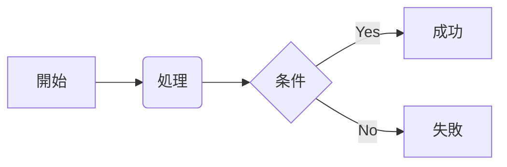
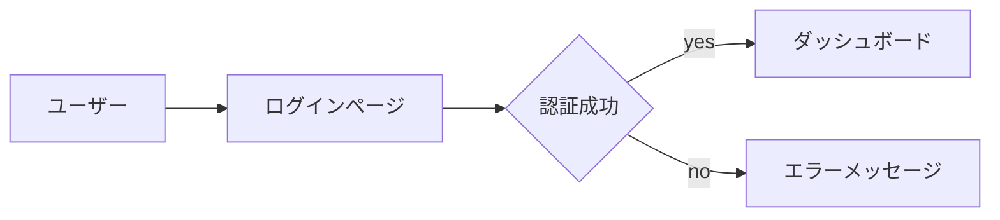
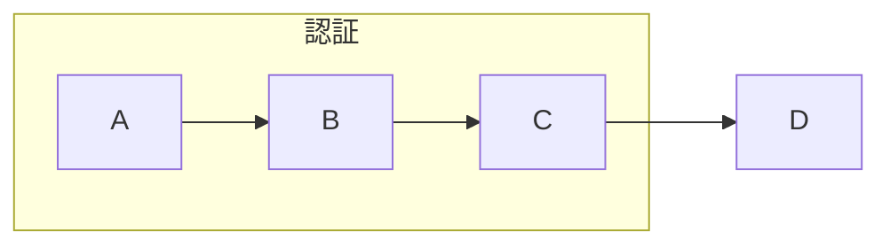
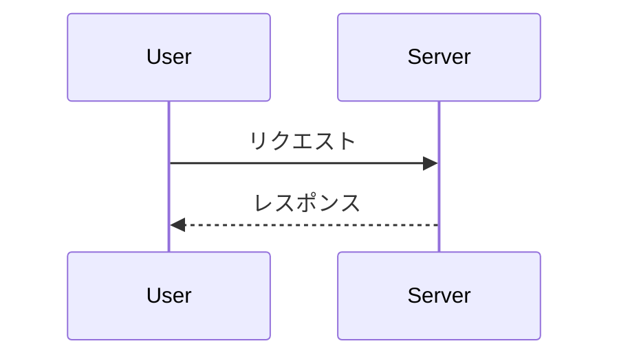
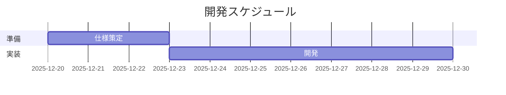
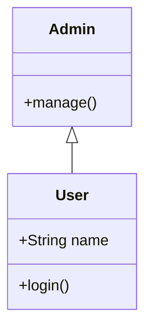
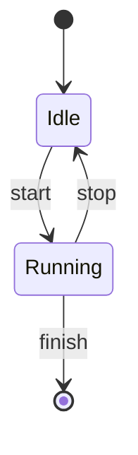
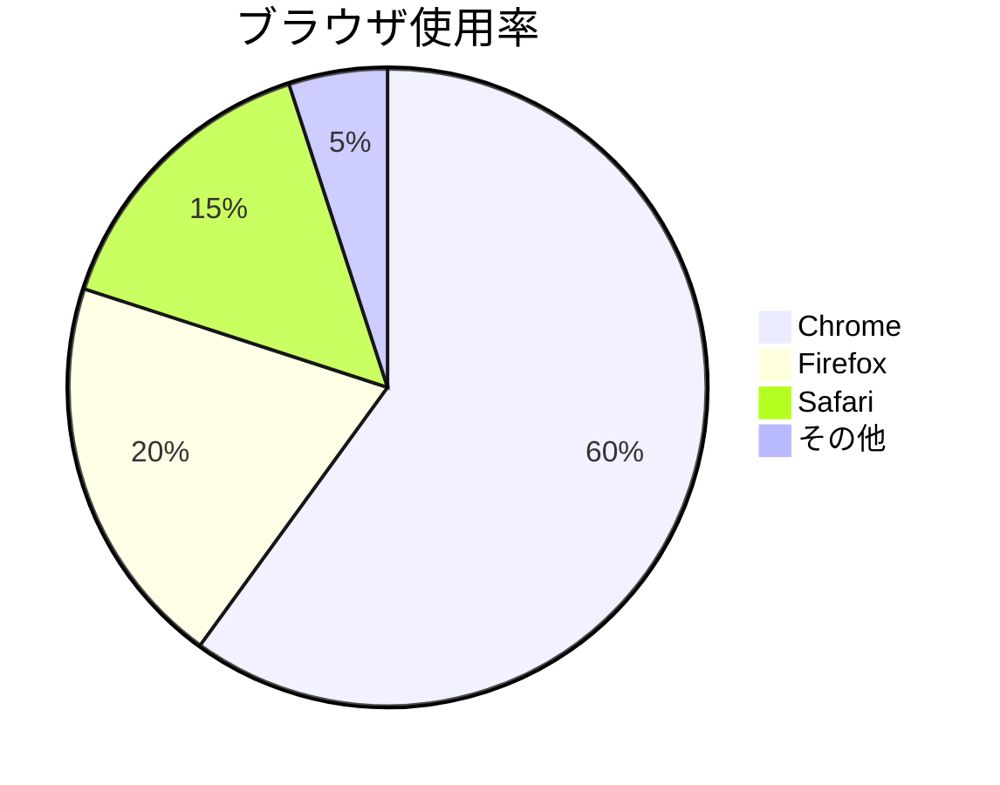

## 調査目的

Mermaid記法（Mermaid.js）を使ってMarkdown/Hugo上で図を描けるようにするため、基本構文・代表的な図種・埋め込み手順・開発ツールをまとめる。

## 実施日

2025-12-19

## 使用したコマンド / ツール

- ブラウザ: Mermaid公式ドキュメント、Mermaid Live Editor
- VSCode拡張: `mermaid-js.mermaid-vscode`（推奨）
- CDN: `https://cdn.jsdelivr.net/npm/mermaid@10/dist/mermaid.min.js`

## 概要

Mermaidはテキストベースで図を定義できるライブラリ。主な図種: フローチャート、シーケンス図、ガントチャート、クラス図、ステート図、円グラフなど。Markdownのフェンスコードブロックに `mermaid` と指定すると多くのレンダラーや拡張で表示できる。

公式ドキュメント: https://mermaid-js.github.io/mermaid/#/

## 基本構文（共通）

- フェンスコードブロックで開始: ```mermaid
- 図の種類と方向（例: `graph LR` は左→右）
- 行末のセミコロンは省略可だが、複雑な式では使うと読みやすい

例（最小）:



## 代表例と説明

### フローチャート (flowchart)

基本: `graph LR`（LR, RL, TB, BT の方向指定が可能）



サブグラフ:



### シーケンス図 (sequence)



### ガントチャート (gantt)



### クラス図 (classDiagram)



### ステート図 (stateDiagram)



### 円グラフ (pie)



## Markdown / Hugo での埋め込み方法

1. シンプル（多くのレンダラー・拡張が対応）

   - Markdownにそのままフェンスブロックを置く:

   ```markdown
   ```mermaid
   graph LR
     A-->B
   ```
   ```

   - VSCodeのMermaid拡張や静的サイトでのプレビューが可能

2. Hugoでブラウザ側でレンダリングする方法（CDN利用）

   - `layouts/partials/head.html` またはテーマの適切な場所に以下を追加:

   ```html
   <script src="https://cdn.jsdelivr.net/npm/mermaid@10/dist/mermaid.min.js"></script>
   <script>
     if (typeof mermaid !== 'undefined') {
       mermaid.initialize({ startOnLoad: true });
     }
   </script>
   ```

   - これにより、ページ読み込み時に `mermaid` のフェンスコードが自動レンダリングされる。

3. サーバー側で事前レンダリングしたい場合

   - MermaidをサーバーでSVG化するツール（mermaid-cli）を使ってビルド時に画像を生成する方法があるが、CIやローカルにNode環境が必要になる。

## VSCodeとオンラインツール

- 推奨拡張: `mermaid-js.mermaid-vscode`（Mermaid公式のVSCode拡張）
  - 機能: Markdown内のMermaidプレビュー、独立したMermaidファイルのプレビュー
- オンラインエディタ: https://mermaid.live/ （リアルタイム編集・共有）
- 公式ドキュメント: https://mermaid-js.github.io/mermaid/#/

## 注意点・コツ

- バージョン差異に注意: Mermaidの構文はメジャーバージョンで変わることがある。
- 複雑な図は適宜 `class`/`style` 指定で見やすくする。
- Markdown内で日本語や括弧を使う際はエスケープが不要な場合が多いが、問題が出るときはノード名を `"..."` で括る。
- Hugoのテーマや他のJSライブラリと衝突する場合があるので、mermaidの初期化オプションを調整する（例: `startOnLoad:false` にして手動初期化する）

## 参考リンク

- Mermaid公式: https://mermaid-js.github.io/mermaid/#/
- Mermaid Live Editor: https://mermaid.live/
- CDN（jsDelivr）: https://cdn.jsdelivr.net/npm/mermaid

## 発見・結論

- MermaidはMarkdownに自然に組み込めるため、記事やドキュメントに図を入れるのに有用
- HugoではCDNを使ってクライアント側でレンダリングするのが手軽で設定も少ない

## 次のステップ（提案）

- サイトに組み込むなら [layouts/partials/head.html](layouts/partials/head.html) に上記スクリプトを追加して、既存のページで表示を確認
- VSCodeで `mermaid-js.mermaid-vscode` をインストールして、手元でサンプルを編集・プレビュー

---

**調査ログ**

- 2025-12-19: ドキュメント作成。主要図種のサンプルを収集・記載。
