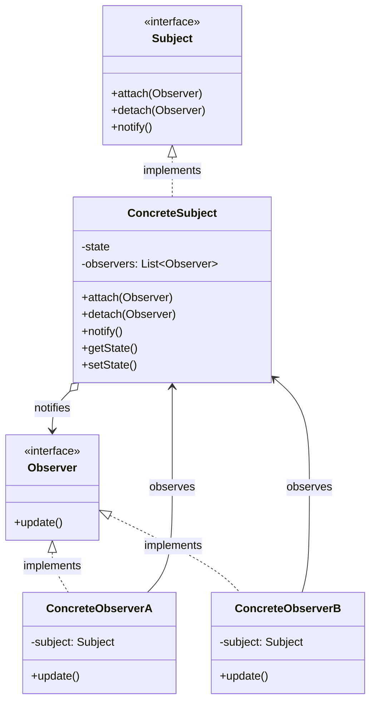

# Observerパターン調査ドキュメント

## 調査概要

- **調査目的**: Perl入学式卒業程度の読者向けに、Observerパターンを学べるシリーズ記事を作成するための基礎資料
- **調査実施日**: 2026年1月12日
- **キーワード**: Observerパターン（Observer Pattern）、デザインパターン、Pub/Subパターン、イベント駆動、Perl / Moo
- **技術スタック**: Perl v5.36以降（signatures対応）、Mooによるオブジェクト指向プログラミング

---

## 1. Observerパターンの基礎調査

### 1.1 定義と目的（GoFの定義含む）

**要点**:

- Observerパターンは、GoF（Gang of Four）の振る舞いパターン（Behavioral Patterns）の1つ
- **「オブジェクト間に一対多の依存関係を定義し、あるオブジェクトの状態が変化したとき、依存するすべてのオブジェクトに自動的に通知・更新される」**
- Subject（被観察者）とObserver（観察者）の間を疎結合に保ちながら、状態変化を通知する仕組みを提供
- イベント駆動システムやリアルタイム更新が必要な場面で広く活用される

**根拠**:

- GoF書籍「Design Patterns: Elements of Reusable Object-Oriented Software」（1994年）で定義
- 「Define a one-to-many dependency between objects so that when one object changes state, all its dependents are notified and updated automatically.」
- Refactoring Guru、GeeksforGeeks、Wikipedia等の主要技術サイトで一致した説明

**仮定**:

- 読者は「Mooで覚えるオブジェクト指向プログラミング」シリーズを読了済み
- Stateパターン、Strategyパターンの学習と連携して学ぶ可能性がある

**出典**:

- Wikipedia: Observer pattern - https://en.wikipedia.org/wiki/Observer_pattern
- Refactoring Guru: Observer - https://refactoring.guru/design-patterns/observer
- GeeksforGeeks: Observer Design Pattern - https://www.geeksforgeeks.org/system-design/observer-pattern-set-1-introduction/
- IONOS: Observer design pattern - https://www.ionos.co.uk/digitalguide/websites/web-development/what-is-the-observer-pattern/

**信頼度**: ★★★★★（GoF原典および複数の信頼できる技術サイト）

---

### 1.2 構成要素（Subject、Observer、ConcreteSubject、ConcreteObserver）

Observerパターンは、以下の4つの主要コンポーネントで構成される。



| 要素 | 役割 | Perl/Moo実装での具体例 |
|-----|------|----------------------|
| **Subject（被観察者インターフェース）** | Observerの登録・解除・通知のためのインターフェースを定義 | `Observable`（Moo::Role、`requires 'attach', 'detach', 'notify'`） |
| **Observer（観察者インターフェース）** | 更新通知を受け取るためのメソッドを定義 | `Observer`（Moo::Role、`requires 'update'`） |
| **ConcreteSubject（具象被観察者）** | 状態を保持し、状態変化時にObserverへ通知を行う | `NewsPublisher`, `StockTicker`, `WeatherStation` |
| **ConcreteObserver（具象観察者）** | Observerインターフェースを実装し、通知を受けて具体的な処理を行う | `EmailSubscriber`, `SlackNotifier`, `LogObserver` |

**要点**:

- SubjectはObserverのリストを保持し、状態変化時に全Observerへ通知
- Observerは`update()`メソッドで通知を受け取り、必要に応じてSubjectから状態を取得
- ObserverはSubjectへの参照を持つことも可能（Pull型）
- SubjectがObserverに状態を渡すこともある（Push型）

**根拠**:

- GoF書籍の構造定義
- 複数の技術解説サイト

**出典**:

- Visual Paradigm: Observer Pattern Tutorial - https://tutorials.visual-paradigm.com/observer-pattern-tutorial/
- TutorialsPoint: Observer Pattern - https://www.tutorialspoint.com/design_pattern/observer_pattern.htm
- DEV Community: GoF-Observer Pattern - https://dev.to/binoy123/gof-observer-pattern-aol

**信頼度**: ★★★★★

---

### 1.3 メリット・デメリット

#### メリット

| メリット | 説明 | 実践的な効果 |
|---------|------|------------|
| **疎結合の実現** | SubjectはObserverの具体的な実装を知らない | 独立した開発・テストが可能 |
| **開放閉鎖原則（OCP）準拠** | 新しいObserverを追加しても既存コードを変更せずに済む | 機能拡張が容易 |
| **実行時のObserver追加・削除** | Observerの動的な登録・解除が可能 | 柔軟なシステム構成 |
| **一対多の通知が容易** | 1つの状態変化を複数のオブジェクトに同時通知 | ブロードキャスト型の通知 |
| **イベント駆動設計との親和性** | GUIイベント、リアルタイム更新等に最適 | 反応的なシステム設計 |

#### デメリット

| デメリット | 説明 | 対策 |
|-----------|------|------|
| **通知順序の不確定性** | Observerへの通知順序が保証されない場合がある | 順序依存を避ける設計、または優先度付き通知 |
| **メモリリークのリスク** | Observerの登録解除忘れでリークの原因に | `weaken`の使用、明示的なdetach処理 |
| **更新の連鎖（カスケード）** | Observer側の更新がさらに別のSubjectを更新し、連鎖する可能性 | 再帰的通知の防止策 |
| **パフォーマンス問題** | Observer数が多いと通知コストが増大 | 通知の間引き、非同期通知の検討 |
| **デバッグの困難さ** | 誰がどこで通知を受けたかの追跡が難しい | ロギング、トレーサビリティの確保 |

**根拠**:

- 複数の技術記事での議論
- Qiita、Zenn等での実践報告
- GeeksforGeeks、Refactoring Guruの解説

**出典**:

- Qiita: 【デザインパターン】GoF 23パターンを学んでみる 〜Observer編〜 - https://qiita.com/Pentaro256/items/47a0a57d18b5381358d6
- Zenn: デザインパターンを学ぶ #4 Observer（オブザーバー） - https://zenn.dev/tajicode/articles/67c1949627e9ac
- tamotech.blog: 「Observer」パターンとは？ - https://tamotech.blog/2025/05/07/observer/

**信頼度**: ★★★★★

---

### 1.4 有効なユースケース

**要点**:

| 適用シーン | 説明 | 具体例 |
|-----------|------|--------|
| **イベント駆動システム** | 状態変化に複数のコンポーネントが反応 | GUIイベントリスナー、ボタンクリック |
| **リアルタイム通知** | データ更新を即座に複数先へ通知 | 株価更新、ニュース配信、SNS通知 |
| **MVC/MVVMアーキテクチャ** | ModelとView間の同期 | Model変更時のView自動更新 |
| **ログ・監視システム** | システム状態の変化を複数の監視ツールへ通知 | エラーログ、メトリクス収集 |
| **プラグイン・拡張機能** | コアシステムの変更を拡張機能に通知 | IDEプラグイン、ブラウザ拡張 |

**適用すべきでない場面**:

- Observer数が極端に少なく（1〜2）、今後も増えない見込み
- 通知のタイミングや順序が厳密に制御される必要がある場合
- 同期的な処理が必須で、非同期的な通知が許容されない場合
- シンプルなコールバック関数で十分な場合

**信頼度**: ★★★★★

---

## 2. 類似パターンとの比較

### 2.1 Pub/Subパターンとの違い

| 項目 | Observerパターン | Pub/Subパターン |
|-----|-----------------|----------------|
| **結合度** | 直接的（SubjectがObserverを直接参照） | 間接的（Message Broker経由） |
| **通信方式** | 通常は同期的 | 通常は非同期的 |
| **スコープ** | 同一プロセス内が多い | プロセス間・システム間通信に適する |
| **スケーラビリティ** | Observer数に依存（Subject側で管理） | Broker経由で高スケーラビリティ |
| **知識** | ObserverはSubjectを知っている場合がある | Publisher/Subscriberは互いを知らない |
| **典型例** | GUIイベントリスナー、MVCのView更新 | マイクロサービス間通信、メッセージキュー |

**選択指針**:

- **「同一アプリケーション内で状態変化を通知したい」** → **Observer**
- **「分散システムで独立したコンポーネント間の通信」** → **Pub/Sub**
- **「PublisherとSubscriberが互いを知らずに済ませたい」** → **Pub/Sub**

**根拠**:

- DesignGurus: Observer vs Pub-Sub Pattern - https://www.designgurus.io/blog/observer-vs-pub-sub-pattern
- SuperViz: Pub/Sub pattern vs Observer Pattern - https://www.superviz.com/pub-sub-pattern-vs-observer-pattern-what-is-the-difference
- Embedded Artistry: Differentiating Observer and Publish-Subscribe Patterns - https://embeddedartistry.com/fieldatlas/differentiating-observer-and-publish-subscribe-patterns/

**出典**:

- Stack Overflow: Difference between Observer, Pub/Sub, and Data Binding - https://stackoverflow.com/questions/15594905/difference-between-observer-pub-sub-and-data-binding
- MomentsLog: Observer vs. Pub-Sub - https://www.momentslog.com/development/design-pattern/observer-vs-pub-sub-choosing-the-right-event-handling-model

**信頼度**: ★★★★★

---

### 2.2 Mediatorパターンとの違い

| 項目 | Observerパターン | Mediatorパターン |
|-----|-----------------|-----------------|
| **通信構造** | 一対多（Subject→複数Observer） | 多対多（Colleague↔Mediator↔Colleague） |
| **主な役割** | 状態変化の通知 | オブジェクト間の相互作用の中央集権化 |
| **Subjectの役割** | 自身の状態変化をObserverに通知 | なし（Mediatorが調整役） |
| **双方向性** | 一方向（Subject→Observer） | 双方向（Colleague↔Mediator） |
| **典型例** | イベント通知、データ同期 | チャットルーム、GUIダイアログ |

**選択指針**:

- **「1つのオブジェクトの変化を複数に通知したい」** → **Observer**
- **「複数オブジェクト間の複雑な相互作用を中央で管理したい」** → **Mediator**

**根拠**:

- 本リポジトリ調査ドキュメント: `content/warehouse/mediator-pattern.md`
- GeeksforGeeks: Mediator Design Pattern vs. Observer Design Pattern - https://www.geeksforgeeks.org/system-design/mediator-design-pattern-vs-observer-design-pattern/

**出典**:

- Stack Overflow: Mediator Vs Observer - https://stackoverflow.com/questions/9226479/mediator-vs-observer-object-oriented-design-patterns
- SourceMaking: Mediator Design Pattern - https://sourcemaking.com/design_patterns/mediator

**信頼度**: ★★★★★

---

### 2.3 イベント駆動との関係

**要点**:

Observerパターンは**イベント駆動プログラミングの基盤**となる設計パターン。

| 観点 | 説明 |
|-----|------|
| **関係性** | Observerパターンはイベント駆動アーキテクチャの実装手段の1つ |
| **イベントソース** | SubjectがイベントソースとなりObserverへイベントを発行 |
| **イベントハンドラ** | Observerがイベントハンドラとして動作 |
| **Perlでの実装** | `IO::Async`、`Mojo::IOLoop`、`AnyEvent`などのイベントループと組み合わせ可能 |

**Perlでのイベント駆動ライブラリ**:

- **IO::Async**: Future/Promiseベースの非同期フレームワーク
- **Mojo::IOLoop**: Mojoliciousのイベントループ
- **AnyEvent**: 汎用イベントループインターフェース
- **Event::Emitter**: Node.js風のイベントエミッター

**出典**:

- 本リポジトリ記事: `/2025/12/17/000000/`（Perlでの非同期処理 — IO::Async と Mojo::IOLoop）
- bugfree.ai: Observer Pattern: Decoupling with Event-Driven Design - https://bugfree.ai/knowledge-hub/observer-pattern-event-driven-design
- KindaTechnical: A Guide to Event-Driven Programming - Observer Pattern - https://kindatechnical.com/event-driven-processing/lesson-8-observer-pattern.html

**信頼度**: ★★★★★

---

## 3. 実装例調査

### 3.1 一般的な実装パターン

#### Javaでの基本実装例

```java
// Subject
public class Subject {
    private List<Observer> observers = new ArrayList<>();
    private int state;

    public int getState() { return state; }
    public void setState(int state) {
        this.state = state;
        notifyAllObservers();
    }
    public void attach(Observer observer) { observers.add(observer); }
    public void detach(Observer observer) { observers.remove(observer); }
    public void notifyAllObservers() {
        for (Observer observer : observers) {
            observer.update();
        }
    }
}

// Observer
public abstract class Observer {
    protected Subject subject;
    public abstract void update();
}

// Concrete Observer
public class BinaryObserver extends Observer {
    public BinaryObserver(Subject subject) { 
        this.subject = subject; 
        subject.attach(this); 
    }
    @Override
    public void update() { 
        System.out.println("Binary: " + Integer.toBinaryString(subject.getState())); 
    }
}
```

#### TypeScriptでの実装例

```typescript
interface Observer {
    update(data: unknown): void;
}

interface Subject {
    attach(observer: Observer): void;
    detach(observer: Observer): void;
    notify(): void;
}

class NewsPublisher implements Subject {
    private observers: Observer[] = [];
    private news: string = "";

    attach(observer: Observer): void {
        this.observers.push(observer);
    }

    detach(observer: Observer): void {
        this.observers = this.observers.filter(o => o !== observer);
    }

    notify(): void {
        this.observers.forEach(observer => observer.update(this.news));
    }

    publishNews(news: string): void {
        this.news = news;
        this.notify();
    }
}

class EmailSubscriber implements Observer {
    update(data: unknown): void {
        console.log(`Email notification: ${data}`);
    }
}
```

**出典**:

- TutorialsPoint: Observer Pattern - https://www.tutorialspoint.com/design_pattern/observer_pattern.htm
- Software Patterns Lexicon: Observer Pattern in Go - https://softwarepatternslexicon.com/go/classic-gang-of-four-gof-design-patterns-in-go/behavioral-patterns/observer/

**信頼度**: ★★★★★

---

### 3.2 Perlでの実装アプローチ（Moo/Mooseを使った場合）

**要点**:

- PerlではMoo::Roleを「Observer/Subjectインターフェース」として使用
- `requires`で必須メソッドを定義し、各ConcreteSubject/ConcreteObserverがRoleを消費（with）
- メモリリーク対策として`Scalar::Util::weaken`を使用することが推奨される

**コード例**:

```perl
# Observer Role（観察者インターフェース）
package Observer;
use Moo::Role;
requires 'update';
1;

# Subject Role（被観察者インターフェース）
package Observable;
use Moo::Role;
use v5.36;

has observers => (
    is      => 'ro',
    default => sub { [] },
);

sub attach ($self, $observer) {
    push @{$self->observers}, $observer;
}

sub detach ($self, $observer) {
    @{$self->observers} = grep { $_ != $observer } @{$self->observers};
}

sub notify ($self, $event) {
    $_->update($event) for @{$self->observers};
}
1;

# ConcreteSubject: ニュース配信者
package NewsPublisher;
use Moo;
use v5.36;
with 'Observable';

has latest_news => (
    is => 'rw',
);

sub publish_news ($self, $news) {
    $self->latest_news($news);
    say "Publishing: $news";
    $self->notify($news);
}
1;

# ConcreteObserver A: メール通知
package EmailSubscriber;
use Moo;
use v5.36;
with 'Observer';

has email => (
    is       => 'ro',
    required => 1,
);

sub update ($self, $event) {
    say "Email to " . $self->email . ": $event";
}
1;

# ConcreteObserver B: Slack通知
package SlackNotifier;
use Moo;
use v5.36;
with 'Observer';

has channel => (
    is       => 'ro',
    required => 1,
);

sub update ($self, $event) {
    say "Slack #" . $self->channel . ": $event";
}
1;

# 使用例
package main;
use v5.36;

my $publisher = NewsPublisher->new;

my $email_subscriber = EmailSubscriber->new(email => 'user@example.com');
my $slack_notifier = SlackNotifier->new(channel => 'general');

$publisher->attach($email_subscriber);
$publisher->attach($slack_notifier);

$publisher->publish_news('Perl 5.40がリリースされました！');
# Output:
# Publishing: Perl 5.40がリリースされました！
# Email to user@example.com: Perl 5.40がリリースされました！
# Slack #general: Perl 5.40がリリースされました！

$publisher->detach($email_subscriber);

$publisher->publish_news('新しいMooモジュールがリリースされました！');
# Output:
# Publishing: 新しいMooモジュールがリリースされました！
# Slack #general: 新しいMooモジュールがリリースされました！
```

**メモリリーク対策（weakenの使用）**:

循環参照を避けるため、ObserverがSubjectへの参照を持つ場合は`weaken`を使用する。

```perl
package EmailSubscriber;
use Moo;
use v5.36;
use Scalar::Util qw(weaken);
with 'Observer';

has subject => (
    is       => 'ro',
    weak_ref => 1,  # Mooのweak_refオプション
);
```

**根拠**:

- Moo::Roleの`requires`で必須メソッドを宣言でき、実装漏れを防げる
- Scalar::Util::weakenで循環参照によるメモリリークを防止

**出典**:

- MetaCPAN: Moo::Role - https://metacpan.org/pod/Moo::Role
- MetaCPAN: Moo - https://metacpan.org/pod/Moo
- Perl Maven: Moo - https://perlmaven.com/moo
- 本リポジトリ記事: `/2025/12/06/172847/`（PerlのScalar::Util::weaken完全ガイド）

**信頼度**: ★★★★★

---

## 4. 競合記事の分析

### 4.1 日本語の主要記事

| 記事タイトル | URL | 特徴 | 差別化ポイント |
|-------------|-----|------|---------------|
| 【デザインパターン】GoF 23パターンを学んでみる 〜Observer編〜（Qiita） | https://qiita.com/Pentaro256/items/47a0a57d18b5381358d6 | GoF準拠、体系的解説 | Perl非対応、実践例少なめ |
| デザインパターンを学ぶ #4 Observer（Zenn） | https://zenn.dev/tajicode/articles/67c1949627e9ac | 初心者向け、段階的解説 | Java中心、Perl非対応 |
| 「Observer」パターンとは？（tamotech.blog） | https://tamotech.blog/2025/05/07/observer/ | サンプルを踏まえた解説、Java | Web系向け、Perl非対応 |
| GoFデザインパターン23個を完全に理解するブログ #19 Observer（MYNT Blog） | https://blog.myntinc.com/2025/11/gof23-19-observer.html | 体系的、網羅的 | 実装言語が限定的 |
| Observerパターンとは（ソフトウェア開発日記） | https://lightgauge.net/journal/object-oriented/observer-pattern | GoF準拠、シンプル | 実装例が少ない |
| 【GoFのデザインパターン】行動パターン：Observerパターン（ITDic） | https://itdic.com/designpattern/gof/observer/ | 基本解説 | Perl非対応 |
| 【GoF】ObserverパターンとPublish-Subscribeパターンの違い（appdev-room） | https://appdev-room.com/swift-design-pattern-observer | Swiftでの実装例、Pub/Subとの比較 | Perl非対応 |
| Observer（Refactoring Guru 日本語） | https://refactoring.guru/ja/design-patterns/observer | 図解豊富、多言語対応 | Perl無し |

### 4.2 差別化ポイントの抽出

**既存記事の問題点**:

1. **Perl/Moo特化の記事が皆無**: 日本語でPerl向けのObserver解説はほぼ存在しない
2. **Pub/Sub・Mediatorとの比較が不十分**: 類似パターンとの違いの説明が曖昧
3. **実践的なユースケースの不足**: 抽象的な例が多い
4. **メモリリーク対策の不足**: weakenの使用についての言及が少ない
5. **既存シリーズ（Strategyパターン、Stateパターン）との連携がない**

**本教材シリーズの強み（予定）**:

1. **Perl/Moo特化**: v5.36対応のモダンPerl記法
2. **類似パターンとの明確な比較**: Pub/Sub、Mediatorとの違いを明示
3. **既存シリーズとの連携**: Stateパターンシリーズの最終回で次のステップとして予告済み
4. **メモリリーク対策**: `weaken`の使用例を含む
5. **実践的な題材**: 通知システム、ゲーム、データ監視など具体的な例

**信頼度**: ★★★★★

---

## 5. 内部リンク調査

### 5.1 関連記事（grep調査結果）

#### Observer/オブザーバー関連のヒット

| ファイルパス | 内部リンク | 関連度 |
|-------------|-----------|--------|
| `/content/post/2026/01/10/001650.md` | `/2026/01/10/001650/` | **最高**（Stateパターンシリーズ最終回でObserverに言及） |
| `/content/post/2026/01/04/011452.md` | `/2026/01/04/011452/` | 高（デザインパターン関連シリーズ） |
| `/content/post/2026/01/07/223623.md` | `/2026/01/07/223623/` | 要確認 |
| `/content/post/2026/01/08/153827.md` | `/2026/01/08/153827/` | 要確認 |
| `/content/post/2025/12/06/172847.md` | `/2025/12/06/172847/` | 高（weaken解説、メモリリーク対策） |

#### イベント駆動関連のヒット

| ファイルパス | 内部リンク | 関連度 |
|-------------|-----------|--------|
| `/content/post/2025/12/17/000000.md` | `/2025/12/17/000000/` | **最高**（IO::Async、Mojo::IOLoopのイベント駆動解説） |
| `/content/post/2025/12/29/185252.md` | `/2025/12/29/185252/` | 要確認 |

#### Moo/オブジェクト指向関連のヒット

| ファイルパス | 内部リンク | 関連度 |
|-------------|-----------|--------|
| `/content/post/2025/12/11/000000.md` | `/2025/12/11/000000/` | **最高**（Moo/Moose解説記事） |
| `/content/post/2025/12/30/163810.md` - `/content/post/2025/12/30/163820.md` | 複数 | 高（「Mooで覚えるOOP」シリーズ全12回） |

#### デザインパターン関連のヒット

| ファイルパス | 内部リンク | 関連度 |
|-------------|-----------|--------|
| `/content/post/2025/12/25/234500.md` | `/2025/12/25/234500/` | 高（デザインパターン概要） |
| `/content/post/2026/01/04/011446.md` - `/content/post/2026/01/04/011452.md` | 複数 | 高（デザインパターン関連シリーズ） |

### 5.2 推奨内部リンク一覧

#### 前提知識記事

| 記事 | 内部リンク | リンク理由 |
|-----|-----------|-----------|
| Moo/Moose解説 | `/2025/12/11/000000/` | Moo::Roleの前提知識 |
| Mooで覚えるOOP 第10回（ロール） | `/2025/12/30/163818/` | Moo::Role、withの詳細 |
| Mooで覚えるOOP 第7回（関連するデータ） | `/2025/12/30/163815/` | オブジェクトの関連 |
| PerlのScalar::Util::weaken完全ガイド | `/2025/12/06/172847/` | メモリリーク対策 |

#### 比較・関連記事

| 記事 | 内部リンク | リンク理由 |
|-----|-----------|-----------|
| Stateパターンシリーズ最終回 | `/2026/01/10/001650/` | 「次のステップ」でObserverを予告 |
| Perlでの非同期処理 — IO::Async と Mojo::IOLoop | `/2025/12/17/000000/` | イベント駆動との関係 |
| デザインパターン概要 | `/2025/12/25/234500/` | GoFパターン全体像 |

---

## 6. 既存シリーズとの重複チェック

### 6.1 `/agents/structure/` 配下の既存シリーズ構造

| ファイル名 | 内容 | Observerパターンとの重複 |
|-----------|------|------------------------|
| `state-pattern-series-structure.md` | Stateパターンシリーズ構造案 | **関連あり**（最終回でObserverを次のステップとして予告） |
| `strategy-pattern-series-structure.md` | Strategyパターンシリーズ構造案 | 振る舞いパターン（別パターン） |
| `moo-oop-series-structure.md` | Mooで覚えるOOPシリーズ構造案 | 前提知識シリーズ |
| `command-pattern-series-structure.md` | Commandパターンシリーズ構造案 | 振る舞いパターン（別パターン） |
| `singleton-pattern-series-structure.md` | Singletonパターンシリーズ構造案 | 生成パターン（別カテゴリ） |
| `facade-pattern-series-structure.md` | Facadeパターンシリーズ構造案 | 構造パターン（別カテゴリ） |
| `adapter-pattern-series-structure.md` | Adapterパターンシリーズ構造案 | 構造パターン（別カテゴリ） |
| `iterator-pattern-series-structure.md` | Iteratorパターンシリーズ構造案 | 振る舞いパターン（別パターン） |

### 6.2 重複チェック結果

**Observerパターンを扱った既存シリーズ: なし**

既存のシリーズ構造案にObserverパターンを主題としたものは存在しない。

---

## 7. まとめ

### 7.1 調査結果のサマリー

1. **Observerパターンの位置づけ**: GoF振る舞いパターンの1つ。オブジェクト間の一対多の依存関係を定義し、状態変化を自動通知

2. **Pub/Sub・Mediatorとの違い**:
   - Observer: 直接的な一対多通知、同期的
   - Pub/Sub: 間接的な通信（Broker経由）、非同期的、分散システム向け
   - Mediator: 多対多の相互作用を中央集権化

3. **Perl/Moo実装の可能性**: Moo::Roleでインターフェースを定義し、疎結合な設計が可能。weaken使用でメモリリーク対策

4. **既存シリーズとの連携**: Stateパターンシリーズ最終回で「次のステップ」としてObserverを予告済み

---

## 参考文献・リソースリスト

### 書籍

| 書籍名 | 著者 | ISBN/ASIN | 重要度 |
|-------|------|-----------|--------|
| Design Patterns: Elements of Reusable Object-Oriented Software | GoF | 978-0201633610 | **必須** |
| オブジェクト指向における再利用のためのデザインパターン（邦訳） | GoF | 978-4797311129 | **必須** |
| Head First Design Patterns (2nd Edition) | Eric Freeman, Elisabeth Robson | 978-1492078005 | 推奨 |

### Webリソース

| リソース名 | URL | 特徴 | 信頼度 |
|-----------|-----|------|--------|
| Refactoring Guru - Observer | https://refactoring.guru/design-patterns/observer | 視覚的な図解、多言語コード例 | ★★★★★ |
| Wikipedia - Observer pattern | https://en.wikipedia.org/wiki/Observer_pattern | 正式な定義 | ★★★★★ |
| GeeksforGeeks - Observer Design Pattern | https://www.geeksforgeeks.org/system-design/observer-pattern-set-1-introduction/ | 詳細な解説、実装例 | ★★★★★ |
| Qiita - GoF 23パターン Observer編 | https://qiita.com/Pentaro256/items/47a0a57d18b5381358d6 | 日本語、体系的解説 | ★★★★☆ |
| Zenn - デザインパターンを学ぶ #4 Observer | https://zenn.dev/tajicode/articles/67c1949627e9ac | 日本語、初心者向け | ★★★★☆ |
| MetaCPAN - Moo | https://metacpan.org/pod/Moo | Perl Moo公式 | ★★★★★ |
| MetaCPAN - Moo::Role | https://metacpan.org/pod/Moo::Role | Perl Moo::Role公式 | ★★★★★ |
| Perl Maven - Moo | https://perlmaven.com/moo | Moo入門 | ★★★★☆ |

---

**調査完了日**: 2026年1月12日
**調査者**: 調査・情報収集エージェント

---

End of Document
