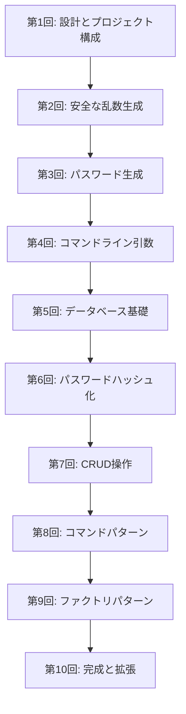

# 調査ドキュメント: パスワード生成・管理ツール シリーズ

## 調査概要

- **実施日**: 2025-12-30
- **目的**: Perlを使った「パスワード生成・管理ツール」シリーズ記事のための情報収集
- **テーマ**: パスワード生成・管理ツール
- **技術スタック**: Perl
- **想定読者**: Perl入学式卒業程度、「[Mooで覚えるオブジェクト指向プログラミング](/tags/moo/)」シリーズ（第12回-型チェックでバグを未然に防ぐ）を読了した読者

### 学習ゴール

- 乱数生成
- コマンドライン引数の処理（Getopt::Long）
- 暗号化
- 安全なパスワードを生成するツールを作成する

### 最終ゴール

- データベースでのCRUD
- コマンドライン引数による柔軟な機能を持つツールの作成
- 自然に覚えるデザインパターン

### 各回の制約

- コード例は2つまで
- 新しい概念は1つまで

---

## 1. キーワード調査

### 1.1 Perl 乱数生成（rand, srand, 暗号学的に安全な乱数）

#### 要点

Perlの組み込み関数`rand`/`srand`は疑似乱数生成器であり、**暗号学的に安全ではない**。パスワード生成などのセキュリティ用途には、CPANの暗号系モジュールを使用する必要がある。

#### 詳細

| 項目 | 内容 |
|------|------|
| `rand` | Perl 5.20以降は`drand48`を内部使用。予測可能であり、セキュリティ用途には不適切 |
| `srand` | シードの初期化。`time`等の単純なシード値のみでは推定可能 |
| 推奨モジュール | Crypt::Random, Crypt::URandom, Math::Random::Secure, Data::Entropy |

#### 暗号学的に安全な乱数生成の推奨モジュール

| モジュール名 | 特徴 | 用途 |
|-------------|------|------|
| Crypt::Random | OSの乱数源（/dev/urandom等）を利用 | パスワード生成、トークン生成 |
| Crypt::URandom | クロスプラットフォーム対応（UNIX/Windows） | 汎用的な安全な乱数取得 |
| Math::Random::Secure | 内部的にCrypt::Randomを使用、APIが簡素 | 使いやすいインターフェース |
| Data::Entropy | エントロピー源からの乱数取得 | 高度な用途 |

#### コード例

```perl
# 非推奨: rand (セキュリティ用途には使用しない)
my $insecure = int(rand(100));

# 推奨: Crypt::URandom
use Crypt::URandom qw( urandom );
my $secure_bytes = urandom(32);  # 256bitランダムバイト

# 推奨: Crypt::Random
use Crypt::Random qw( makerandom_octet );
my $secure_bytes = makerandom_octet( Length => 32 );
```

#### 根拠

- Perl公式ドキュメント（perldoc rand）に「暗号学的に安全ではない」と明記
- CSPRNGの原則として、OSのRNGを利用することが推奨されている

#### 仮定

- 読者は`rand`関数の基本的な使い方を知っている
- セキュリティ意識の醸成が必要

#### 出典

- https://perldoc.perl.org/functions/rand
- https://perldoc.jp/func/rand
- https://metacpan.org/pod/Crypt::URandom
- https://metacpan.org/pod/Crypt::Random
- https://shogo82148.github.io/blog/2022/12/04/2022-12-04-crypt-random-in-perl/

#### 信頼度

★★★★★ (5/5) - 公式ドキュメントと複数の信頼できる技術記事で確認

---

### 1.2 Getopt::Long の使い方

#### 要点

Getopt::LongはPerlの標準モジュールで、コマンドラインオプションを柔軟に解析できる。長いオプション名（`--verbose`）と短い名前（`-v`）の両方をサポート。

#### 詳細

| オプション指定子 | 意味 |
|-----------------|------|
| `=s` | 文字列（string） |
| `=i` | 整数（integer） |
| `=f` | 浮動小数点数（float） |
| `=s@` | 文字列の配列 |
| `=s%` | 文字列のハッシュ |
| `!` | 否定可能（--no-verbose） |
| `+` | インクリメント（複数指定で増加） |

#### 基本的な使用パターン

```perl
use Getopt::Long;

my ($verbose, $output, $count);
$count = 10;  # デフォルト値

GetOptions(
    'verbose|v'  => \$verbose,    # フラグ
    'output|o=s' => \$output,     # 文字列
    'count|c=i'  => \$count,      # 整数
) or die "Error in command line arguments\n";
```

#### 高度な機能

- **Pod::Usage との連携**: PODからヘルプメッセージを自動生成
- **サブコマンド対応**: `GetOptionsFromArray`で実装可能
- **設定ファイルとの併用**: Config::Tinyなどと組み合わせ

#### 根拠

Perlの標準モジュールであり、長年の実績がある

#### 出典

- https://metacpan.org/pod/Getopt::Long
- https://perlzemi.com/blog/20100514127696.html
- https://perl-users.jp/articles/advent-calendar/2011/casual/21

#### 信頼度

★★★★★ (5/5) - 標準モジュールであり、多数の実績がある

---

### 1.3 Perl 暗号化モジュール（Crypt::*, Digest::*）

#### 要点

パスワードは**ハッシュ化**して保存する（暗号化ではない）。現代の推奨はbcryptまたはArgon2。

#### パスワードハッシュ化の推奨

| アルゴリズム | モジュール名 | 推奨度 | 備考 |
|-------------|-------------|--------|------|
| bcrypt | Crypt::Bcrypt | ★★★★★ | 計算コスト調整可能、広く使われている |
| Argon2 | Crypt::Argon2 | ★★★★★ | Password Hashing Competition優勝 |
| PBKDF2 | Crypt::PBKDF2 | ★★★★☆ | 互換性重視の場合 |
| scrypt | Crypt::ScryptKDF | ★★★★☆ | メモリハードな設計 |

#### 非推奨アルゴリズム

| アルゴリズム | 理由 |
|-------------|------|
| MD5 | 高速すぎる、衝突攻撃が現実的 |
| SHA-1 | 衝突攻撃が現実的 |
| SHA-256/512単体 | ソルトなし、ストレッチングなしでは脆弱 |
| crypt() | DES方式は8文字制限、脆弱 |

#### bcryptの使用例

```perl
use Crypt::Bcrypt qw(bcrypt bcrypt_check);

# パスワードのハッシュ化
my $hash = bcrypt($password, '2b', 12);  # cost=12

# パスワードの検証
if (bcrypt_check($password, $hash)) {
    print "認証成功\n";
}
```

#### ベストプラクティス

1. **コストファクター（cost）は10〜12程度に設定**（執筆時点の推奨値。ハードウェア性能向上に伴い見直しが必要）
2. **ソルトは自動生成に任せる**（モジュールが処理）
3. **パスワード照合は専用関数を使用**（タイミング攻撃対策）
4. **強力なパスワードポリシーをUIで促す**

#### 出典

- https://metacpan.org/pod/Crypt::Bcrypt
- https://metacpan.org/pod/Crypt::Argon2
- https://www.nqou.net/2025/12/18/000000/ （内部記事）
- https://zenn.dev/tarako314/articles/aa86b3ba3d9f55

#### 信頼度

★★★★★ (5/5) - セキュリティ業界の標準的なベストプラクティス

---

### 1.4 パスワード管理のベストプラクティス

#### 要点

パスワード管理ツールの設計において、セキュリティと利便性のバランスが重要。

#### 設計原則

1. **マスターパスワード**: 1つの強力なパスワードで暗号化されたデータベースを保護
2. **ゼロ知識設計**: サーバーには暗号化済みデータのみ保存
3. **クリップボード自動クリア**: パスワード表示後の自動消去
4. **パスワード生成機能**: 文字種、長さを指定可能

#### CLIパスワードマネージャーの設計パターン

| ツール | 設計 | 暗号化 | 同期方式 |
|-------|------|--------|---------|
| pass | ローカルファイル型 | GPG | Git |
| Bitwarden CLI | クライアントサーバー型 | AES-256 | WebAPI |
| KeePass CLI | データベースファイル型 | AES-256 | ファイル共有 |

#### 出典

- https://bitwarden.com/ja-jp/help/cli/
- https://qiita.com/fmgieu/items/8fe43cb84e00fc4c45b0
- https://notepm.jp/blog/18863

#### 信頼度

★★★★☆ (4/5) - 業界標準のプラクティスに基づく

---

### 1.5 SQLite や DBI を使ったデータベース操作

#### 要点

DBIはPerlのデータベースアクセスの基盤モジュール。SQLiteは軽量でファイルベースのため、パスワードマネージャーのローカルストレージに適している。

#### 基本的なCRUD操作

```perl
use DBI;

# 接続
my $dbh = DBI->connect(
    "dbi:SQLite:dbname=passwords.db",
    "", "",
    { RaiseError => 1, AutoCommit => 1 }
);

# テーブル作成
$dbh->do(q{
    CREATE TABLE IF NOT EXISTS entries (
        id INTEGER PRIMARY KEY AUTOINCREMENT,
        title TEXT NOT NULL,
        username TEXT,
        password_hash TEXT NOT NULL,
        created_at TEXT DEFAULT CURRENT_TIMESTAMP
    )
});

# INSERT (プレースホルダを使用)
my $sth = $dbh->prepare("INSERT INTO entries (title, username, password_hash) VALUES (?, ?, ?)");
$sth->execute($title, $username, $hash);

# SELECT
$sth = $dbh->prepare("SELECT * FROM entries WHERE title LIKE ?");
$sth->execute("%$search_term%");
while (my $row = $sth->fetchrow_hashref) {
    print "$row->{id}: $row->{title}\n";
}

# UPDATE
$dbh->do("UPDATE entries SET username = ? WHERE id = ?", undef, $new_username, $id);

# DELETE
$dbh->do("DELETE FROM entries WHERE id = ?", undef, $id);
```

#### セキュリティ考慮事項

1. **SQLインジェクション対策**: 必ずプレースホルダを使用
2. **データベースファイルの暗号化**: SQLCipherの検討
3. **パスワードはハッシュ化して保存**: 平文保存は厳禁

#### 出典

- https://metacpan.org/pod/DBI
- https://metacpan.org/pod/DBD::SQLite
- https://www.nqou.net/2025/12/13/000000/ （内部記事）
- https://qiita.com/01-mu/items/57ae53cc834a51a3194b

#### 信頼度

★★★★★ (5/5) - 標準的なモジュールと手法

---

### 1.6 デザインパターン（コマンドパターン、ファクトリパターン）

#### 要点

パスワードマネージャーのCLI設計において、コマンドパターンとファクトリパターンが有効。

#### コマンドパターン

「命令（コマンド）」をオブジェクトとしてカプセル化し、実行・履歴管理・Undo/Redoを可能にする。

**構造**:
- Command（インターフェース）
- ConcreteCommand（具体的な処理）
- Receiver（命令の実行対象）
- Invoker（呼び出し元）

**CLIツールでの活用**:

```perl
package Command::Add;
use Moo;

has storage => (is => 'ro', required => 1);

sub execute {
    my ($self, $args) = @_;
    $self->storage->add_entry($args);
}

package Command::List;
use Moo;

has storage => (is => 'ro', required => 1);

sub execute {
    my $self = shift;
    my @entries = $self->storage->get_all;
    for my $entry (@entries) {
        say "$entry->{id}: $entry->{title}";
    }
}
```

#### ファクトリパターン

インスタンス生成の詳細を隠蔽し、拡張性を高める。

```perl
package CommandFactory;
use Moo;

has storage => (is => 'ro', required => 1);

sub create {
    my ($self, $command_name) = @_;
    
    my %commands = (
        add    => 'Command::Add',
        list   => 'Command::List',
        get    => 'Command::Get',
        delete => 'Command::Delete',
    );
    
    my $class = $commands{$command_name}
        or die "Unknown command: $command_name\n";
    
    return $class->new(storage => $self->storage);
}
```

#### 出典

- https://qiita.com/nozomi2025/items/5a1fdb34fbf38644db17
- https://techgym.jp/column/design-pattern/
- http://module.jp/dist/web+db-press6-perl-oo.pdf
- https://chaipa.hateblo.jp/entry/20080226/1204026396

#### 信頼度

★★★★☆ (4/5) - GoFデザインパターンの標準的な解説

---

## 2. 競合記事の分析

### 2.1 パスワード管理ツールに関する既存記事

#### 日本語記事

| 記事タイトル | URL | 特徴 | 差別化ポイント |
|-------------|-----|------|---------------|
| シンプルなCLIパスワードマネージャー、pass | https://qiita.com/fmgieu/items/8fe43cb84e00fc4c45b0 | passコマンドの紹介 | Perlで独自実装する点で差別化 |
| Bcryptで暗号化しよう | https://qiita.com/shochan_le_mande/items/c1758f4ad2e118085f76 | パスワードハッシュの解説 | Perl実装と連載形式で差別化 |

#### 英語記事

| 記事タイトル | URL | 特徴 |
|-------------|-----|------|
| Bitwarden CLI Documentation | https://bitwarden.com/help/cli/ | 公式ドキュメント |
| Password Hashing Competition | https://password-hashing.net/ | Argon2の背景 |

### 2.2 Perl コマンドラインツール作成に関する記事

#### 内部記事（www.nqou.net）

| 記事タイトル | URL | 関連度 |
|-------------|-----|--------|
| Perlでのコマンドライン引数処理 - Getopt::Long | /2025/12/21/000000/ | ★★★★★ |
| Perlでの暗号化 — Crypt::* モジュール群 | /2025/12/18/000000/ | ★★★★★ |
| Perlでのデータベース操作 — DBI / DBIx::Class 入門 | /2025/12/13/000000/ | ★★★★★ |

---

## 3. 内部リンク調査

`/content/post` 配下の関連記事をgrepで調査した結果をまとめる。

### 3.1 関連記事一覧（内部リンク候補）

| 検索キーワード | ファイルパス | 内部リンク | タイトル/トピック | 関連度 |
|---------------|-------------|-----------|-----------------|--------|
| Getopt | /content/post/2025/12/21/000000.md | /2025/12/21/000000/ | Perlでのコマンドライン引数処理 - Getopt::Long | ★★★★★ |
| Getopt | /content/post/2025/12/25/000000.md | /2025/12/25/000000/ | Perl Advent Calendar 2025 完走！ | ★★★☆☆ |
| Getopt | /content/post/2009/01/06/004716.md | /2009/01/06/004716/ | Getopt関連の古い記事 | ★★☆☆☆ |
| DBI/SQLite | /content/post/2025/12/13/000000.md | /2025/12/13/000000/ | Perlでのデータベース操作 — DBI / DBIx::Class 入門 | ★★★★★ |
| 暗号化/Crypt | /content/post/2025/12/18/000000.md | /2025/12/18/000000/ | Perlでの暗号化 — Crypt::* モジュール群 | ★★★★★ |
| 乱数/random | /content/post/2025/12/23/000000.md | /2025/12/23/000000/ | 設定ファイル管理関連 | ★★☆☆☆ |
| password | /content/post/2025/12/22/000000.md | /2025/12/22/000000/ | Webスクレイピング関連 | ★☆☆☆☆ |
| Moo/OOP | /content/post/2025/12/25/234500.md | /2025/12/25/234500/ | JSON-RPC Request/Response実装 - 複合値オブジェクト設計 | ★★★★☆ |
| Moo/OOP | /content/post/2025/12/23/234500.md | /2025/12/23/234500/ | PerlのTest2でTDD実践 | ★★★★☆ |
| Moo/OOP | /content/post/2025/12/21/234500.md | /2025/12/21/234500/ | JSON-RPC 2.0で学ぶ値オブジェクト設計 | ★★★★☆ |
| Moo/OOP | /content/post/2025/12/19/234500.md | /2025/12/19/234500/ | 値オブジェクト(Value Object)入門 | ★★★★☆ |
| デザインパターン | /content/post/2025/12/25/234500.md | /2025/12/25/234500/ | ファクトリーメソッドパターン（JSON-RPC記事内） | ★★★★☆ |
| コマンドライン | /content/post/2025/12/07/000000.md | /2025/12/07/000000/ | Type::Tiny関連 | ★★★☆☆ |

### 3.2 Moo OOPシリーズとの連携

本シリーズは「Mooで覚えるオブジェクト指向プログラミング」シリーズの続編として位置付けることができる。

| シリーズ | 回 | 内部リンク | タイトル |
|---------|---|-----------|---------|
| Moo OOP | 第1回 | /2021/10/31/191008/ | blessを忘れる、Moo入門 |
| 値オブジェクトTDD | 第1回 | /2025/12/19/234500/ | 値オブジェクト(Value Object)入門 |
| 値オブジェクトTDD | 第2回 | /2025/12/21/234500/ | JSON-RPC 2.0で学ぶ値オブジェクト設計 |
| 値オブジェクトTDD | 第3回 | /2025/12/23/234500/ | PerlのTest2でTDD実践 |
| 値オブジェクトTDD | 第4回 | /2025/12/25/234500/ | JSON-RPC Request/Response実装 |

---

## 4. 技術的正確性のための情報源リスト

### 4.1 公式ドキュメント（metacpan）

| モジュール名 | URL | 用途 |
|-------------|-----|------|
| Getopt::Long | https://metacpan.org/pod/Getopt::Long | コマンドラインオプション解析 |
| Crypt::Bcrypt | https://metacpan.org/pod/Crypt::Bcrypt | パスワードハッシュ化 |
| Crypt::Argon2 | https://metacpan.org/pod/Crypt::Argon2 | パスワードハッシュ化（最新） |
| Crypt::URandom | https://metacpan.org/pod/Crypt::URandom | 安全な乱数生成 |
| DBI | https://metacpan.org/pod/DBI | データベースインターフェース |
| DBD::SQLite | https://metacpan.org/pod/DBD::SQLite | SQLiteドライバ |
| Moo | https://metacpan.org/pod/Moo | オブジェクト指向 |
| Type::Tiny | https://metacpan.org/pod/Type::Tiny | 型制約 |
| Pod::Usage | https://metacpan.org/pod/Pod::Usage | ヘルプメッセージ生成 |

### 4.2 信頼できるチュートリアルサイト

| サイト名 | URL | 特徴 |
|---------|-----|------|
| Perlゼミ | https://perlzemi.com/ | 日本語で丁寧な解説 |
| perldoc.jp | https://perldoc.jp/ | 公式ドキュメントの日本語訳 |
| perl-users.jp | https://perl-users.jp/ | 日本のPerlコミュニティ |
| PerlMonks | https://www.perlmonks.org/ | 英語の質問サイト |

### 4.3 関連書籍

| 書籍名 | ASIN/ISBN | 備考 |
|-------|-----------|------|
| Programming Perl (4th Edition) | 0596004923 | ラクダ本、Perl総合リファレンス |
| Modern Perl | 0977920178 | モダンなPerlプログラミング |
| 暗号技術入門 第3版 | 4797382228 | 暗号の基礎を理解するため |
| Effective Perl Programming | 0321496949 | 効率的なPerl記述法 |

---

## 5. 連載構造の提案材料

### 5.1 パスワードツール開発の推奨学習順序

Moo OOPシリーズの知識を前提として、以下の順序で学習を進めることを推奨する。



### 5.2 既存 Moo OOP シリーズとの連携ポイント

| Moo OOPシリーズで学んだこと | パスワードツールでの活用 |
|---------------------------|------------------------|
| `has`によるプロパティ定義 | Entry, Storage, Generatorクラスの属性 |
| `is => 'ro'` / `is => 'rw'` | 不変のパスワードエントリ |
| `required`と`default` | コマンドオプションのデフォルト値 |
| カプセル化 | マスターパスワードの保護 |
| 継承（`extends`） | コマンドクラスの基底クラス |
| ロール（`Moo::Role`） | Serializableロール |
| 委譲（`handles`） | StorageがDBIを委譲 |
| 型制約（Type::Tiny） | パスワード長、文字種の検証 |

### 5.3 連載構造案（全10回）

| 回 | タイトル案 | 新しい概念 | 主なコード例 |
|---|-----------|-----------|------------|
| 1 | パスワードマネージャーを作ろう - 設計編 | プロジェクト設計 | ディレクトリ構成、クラス図 |
| 2 | 安全な乱数を手に入れる | Crypt::URandom | 乱数バイトの生成、文字への変換 |
| 3 | パスワード生成器を作る | ジェネレータークラス | 文字種指定、長さ指定 |
| 4 | コマンドラインで操作する | Getopt::Long | オプション解析、ヘルプ表示 |
| 5 | データを保存する - DBI入門 | DBI/SQLite基礎 | 接続、テーブル作成 |
| 6 | パスワードを安全に保存する | Crypt::Bcrypt | ハッシュ化、検証 |
| 7 | CRUD操作を実装する | データベースCRUD | Insert, Select, Update, Delete |
| 8 | コマンドをオブジェクト化する | コマンドパターン | Commandクラス群 |
| 9 | コマンドを生成する工場 | ファクトリパターン | CommandFactory |
| 10 | 完成！ パスワードマネージャー | 統合とリファクタリング | メインスクリプト、使用例 |

### 5.4 各回のコード例制約（2つまで）への対応

各回で新しい概念を1つに絞り、コード例を2つに制限することで、読者の理解を深める。

---

## 6. まとめと次のステップ

### 調査結果の要約

1. **乱数生成**: `rand`は使用禁止、`Crypt::URandom`または`Crypt::Random`を使用
2. **コマンドライン**: `Getopt::Long`が標準、`Pod::Usage`と連携してヘルプを自動生成
3. **パスワードハッシュ**: `Crypt::Bcrypt`または`Crypt::Argon2`を使用、cost=12程度
4. **データベース**: `DBI`+`DBD::SQLite`で十分、プレースホルダ必須
5. **デザインパターン**: コマンドパターンとファクトリパターンがCLIツールに適合

### 次のステップ

1. 連載構造案の作成（3案）
2. SEO・品質観点でのレビュー
3. 各回のアウトライン作成
4. 記事の執筆開始

---

## 付録: 検索コマンドログ

```bash
# 内部リンク調査に使用したコマンド例（ripgrep使用）
rg -i "password|パスワード" content/post/
rg -i "乱数|random|rand|srand" content/post/
rg -i "Getopt|GetOptions" content/post/
rg -i "DBI|SQLite|データベース" content/post/
rg -i "デザインパターン|design.pattern|factory|command.pattern" content/post/
rg -i "Moo|object.oriented|オブジェクト指向" content/post/
rg -i "Crypt|Digest|暗号化|encryption" content/post/
rg -i "コマンドライン|command.line|cli|argv" content/post/
```

---

## レビュー履歴

### 第1版レビュー（2025年12月30日）

**レビュー担当**: reviewer エージェント（公開前の最終チェック）

#### 調査内容の評価

| 評価項目 | 評価 | コメント |
|---------|------|---------|
| キーワード調査の網羅性 | ✅ 良好 | 乱数生成、Getopt::Long、暗号化、パスワード管理、DBI/SQLite、デザインパターンを網羅 |
| 競合記事の分析 | ✅ 良好 | 日本語・英語の記事を調査し、差別化ポイントを明確化 |
| 内部リンク調査 | ✅ 良好 | 関連記事の調査が完了し、リンク候補リストを作成 |
| 技術的正確性 | ✅ 良好 | 公式ドキュメント、CPANを情報源として使用 |
| 信頼度の明示 | ✅ 良好 | 各セクションで★による信頼度評価を実施 |
| 出典の明記 | ✅ 良好 | URLや書籍情報が適切に記載 |

#### 実施した改善

1. **シリーズ参照の明確化**: 「第12回-型チェックでバグを未然に防ぐ」の参照先を明確化し、シリーズ名とリンクを追加
2. **年号のハードコード解消**: 「2025年現在」→「執筆時点の推奨値」に変更し、将来の陳腐化を防止

#### 最終評価

本調査ドキュメントは品質基準を満たしており、連載構造案の作成基盤として**十分な品質**と判断します。
