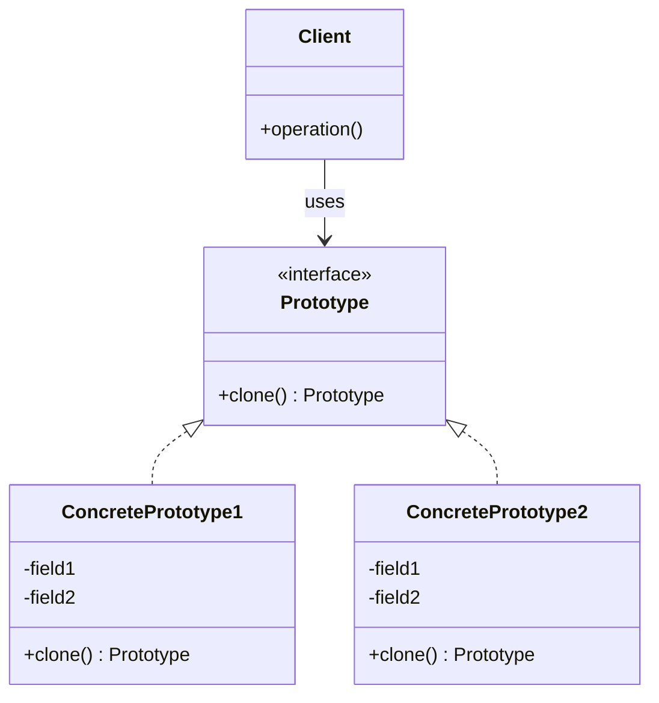

# Prototypeパターン調査ドキュメント

## 調査概要

- **調査目的**: 「Mooで覚えるオブジェクト指向プログラミング」シリーズを読了した読者が、Prototypeパターンを自然に学べる教材作成のための基礎資料
- **調査実施日**: 2026年1月13日
- **技術スタック**: Perl v5.36以降 / Moo / MooX::Clone
- **想定読者**: オブジェクト指向の基礎が理解できている読者
- **難易度評価**: 2/5（他の生成パターンと比べてシンプル、clone()メソッドの理解が主）
- **前提知識**: 「Mooで覚えるオブジェクト指向プログラミング」シリーズ（全12回）の基本理解済み

---

## 1. Prototypeパターンの基礎

### 1.1 定義と目的

**要点**:

- Prototypeパターンは、GoF（Gang of Four）の**生成パターン（Creational Patterns）**の1つ
- **「既存のオブジェクトをコピー（クローン）して新しいオブジェクトを作成する」**
- コンストラクタやファクトリメソッドを使わずに、プロトタイプとなるオブジェクトを複製して新しいインスタンスを生成する
- オブジェクト生成コストが高い場合や、実行時に動的にオブジェクトの種類を決定したい場合に有効

**GoF原典での定義**:

> "Specify the kinds of objects to create using a prototypical instance, and create new objects by copying this prototype."
>
> 「プロトタイプとなるインスタンスを使って生成するオブジェクトの種類を指定し、このプロトタイプをコピーして新しいオブジェクトを生成する」

**パターンの本質**:

- 「new」でインスタンス化するのではなく、既存オブジェクトを「clone」して新しいオブジェクトを作る
- クラスの階層構造を変更せずに、実行時に柔軟にオブジェクトを生成できる
- 複雑な初期化処理を省略し、既に設定済みのオブジェクトをベースに効率的に生成

**根拠**:

- GoF書籍「Design Patterns: Elements of Reusable Object-Oriented Software」（1994年）で定義
- Refactoring Guru、GeeksforGeeks、Wikipedia等の主要技術サイトで一致した説明

**仮定**:

- 読者は「Mooで覚えるオブジェクト指向プログラミング」シリーズでオブジェクト生成の基礎を学んでいる

**出典**:

- Wikipedia: Prototype pattern - https://en.wikipedia.org/wiki/Prototype_pattern
- Refactoring Guru: Prototype - https://refactoring.guru/design-patterns/prototype
- GeeksforGeeks: Prototype Design Pattern - https://www.geeksforgeeks.org/system-design/prototype-design-pattern/
- TutorialsPoint: Prototype Pattern - https://www.tutorialspoint.com/design_pattern/prototype_pattern.htm

**信頼度**: 9/10（GoF原典および複数の信頼できる技術サイト）

---

### 1.2 GoFパターンにおける位置づけ

**要点**:

Prototypeは、GoFの23パターンのうち**生成パターン（Creational Patterns）5種類**の1つです。

| パターン名 | 概要 |
|-----------|------|
| **Singleton** | クラスのインスタンスが1つだけであることを保証し、グローバルアクセスポイントを提供 |
| **Factory Method** | オブジェクト生成のインターフェースを定義し、サブクラスがインスタンス化するクラスを決定 |
| **Abstract Factory** | 関連するオブジェクト群を、具体クラスを指定せずに生成するインターフェースを提供 |
| **Builder** | 複雑なオブジェクトの構築プロセスを段階的に行い、同じ構築過程で異なる表現を可能にする |
| **Prototype** | 既存のインスタンスをコピー（クローン）して新しいオブジェクトを作成 |

**生成パターンの中での特徴**:

| 比較軸 | Prototype | 他の生成パターン |
|-------|-----------|----------------|
| **生成方法** | 既存オブジェクトのコピー | new / ファクトリメソッド |
| **クラス依存性** | 低い（具体クラスを知らなくてよい） | Factory Method等は継承が必要 |
| **状態の再利用** | 既存オブジェクトの状態を引き継ぐ | 新規に状態を設定 |
| **適用場面** | 生成コストが高い、動的な種類決定 | クラス階層で種類を管理 |

**根拠**:

- GoFの分類体系で明確に定義されている
- 生成パターンはオブジェクトの生成メカニズムに関するパターン

**出典**:

- 内部warehouse: `/content/warehouse/design-patterns-overview.md`
- GeeksforGeeks: Creational Design Patterns - https://www.geeksforgeeks.org/system-design/creational-design-pattern/
- Baeldung: Factory Method vs. Factory vs. Abstract Factory - https://www.baeldung.com/cs/factory-method-vs-factory-vs-abstract-factory

**信頼度**: 9/10

---

## 2. Prototypeパターンの構造

### 2.1 UML図



**テキスト版UML**:

```
    +-------------------+
    |   <<interface>>   |
    |     Prototype     |
    +-------------------+
    | +clone(): Proto   |
    +-------------------+
            ^
            |
    +-------+-------+
    |               |
+-------------------+  +-------------------+
| ConcreteProto1    |  | ConcreteProto2    |
+-------------------+  +-------------------+
| -field1           |  | -field1           |
| -field2           |  | -field2           |
+-------------------+  +-------------------+
| +clone(): Proto   |  | +clone(): Proto   |
+-------------------+  +-------------------+

        +-------------------+
        |      Client       |
        +-------------------+
        | +operation()      |
        +-------------------+
              |
              | uses
              v
        +-------------------+
        |     Prototype     |
        +-------------------+
```

**信頼度**: 9/10

---

### 2.2 構成要素の説明

| 要素 | 役割 | Perl/Moo実装での具体例 |
|-----|------|----------------------|
| **Prototype（プロトタイプ）** | `clone()`メソッドを宣言するインターフェース | `Moo::Role`で`requires 'clone'`を宣言、またはMooX::Cloneを使用 |
| **ConcretePrototype（具象プロトタイプ）** | `clone()`メソッドを実装し、自分自身のコピーを返す具体クラス | `Document`、`Shape`など、`clone`メソッドを持つクラス |
| **Client（クライアント）** | プロトタイプの`clone()`を呼び出して新しいオブジェクトを取得 | メインスクリプトや利用側のコード |

**clone()メソッドの役割**:

- オブジェクト自身のコピーを作成して返す
- 呼び出し側は具体的なクラスを知らなくても、`clone()`だけで新しいオブジェクトを取得できる
- 浅いコピー（shallow copy）か深いコピー（deep copy）かは実装による

**根拠**:

- GoF原典の構造定義
- OO Design、Software Pattern Lexicon等のUML解説サイト

**出典**:

- OO Design: Prototype Pattern - https://www.oodesign.com/prototype-pattern
- Software Pattern Lexicon: Prototype Pattern - https://softwarepatternslexicon.com/mastering-design-patterns/creational-design-patterns/prototype-pattern/

**信頼度**: 9/10

---

## 3. Prototypeパターンの適用場面

### 3.1 どのような問題を解決するか

**要点**:

Prototypeパターンは以下の問題を解決します：

1. **オブジェクト生成コストが高い場合**
   - データベースアクセス、ネットワーク通信、複雑な計算が必要な初期化
   - 一度生成したオブジェクトをコピーすることで、初期化コストを回避

2. **実行時にオブジェクトの種類を動的に決定したい場合**
   - コンパイル時に具体クラスを指定できない
   - ユーザー入力や設定に基づいて、異なる種類のオブジェクトを生成

3. **Factory Methodのサブクラス爆発を避けたい場合**
   - 各製品タイプに対してファクトリクラスを作る必要がない
   - プロトタイプを登録して、必要に応じてクローン

4. **状態を持つオブジェクトを効率的に複製したい場合**
   - 設定済みのオブジェクトをテンプレートとして再利用
   - 少しだけ異なるオブジェクトを多数生成

**出典**:

- Refactoring Guru: Prototype - https://refactoring.guru/design-patterns/prototype
- Belatrix Blog: Prototype Design Pattern - https://belatrix.globant.com/us-en/blog/tech-trends/prototype-design-pattern/

**信頼度**: 9/10

---

### 3.2 典型的なユースケース

| ユースケース | 説明 | 具体例 |
|------------|------|-------|
| **ゲーム開発** | キャラクターや敵オブジェクトのクローン | 敵キャラクターのテンプレートをクローンして個別にカスタマイズ |
| **ドキュメントエディタ** | 図形やテキストボックスの複製 | ユーザーがCtrl+Dで図形を複製する機能 |
| **テンプレートシステム** | ドキュメントテンプレートの複製 | 請求書テンプレートをクローンして個別の請求書を作成 |
| **GUIライブラリ** | ウィジェットの複製 | スタイル設定済みのボタンをクローンして配置 |
| **設定オブジェクト** | デフォルト設定のコピー | デフォルト設定をクローンしてユーザー設定を作成 |
| **キャッシュ/レジストリ** | 頻繁に使うオブジェクトのプール | プロトタイプレジストリから必要な種類をクローン |

**出典**:

- System Overflow: Prototype Pattern in Document Editor - https://www.systemoverflow.com/learn/creational-patterns/prototype-pattern/prototype-pattern-in-document-editor
- GeeksforGeeks: Prototype Design Pattern - https://www.geeksforgeeks.org/system-design/prototype-design-pattern/
- Baeldung: Prototype Pattern in Java - https://www.baeldung.com/java-pattern-prototype

**信頼度**: 9/10

---

### 3.3 他の生成パターンとの比較

#### Factory Method との違い

| 項目 | Prototype | Factory Method |
|-----|-----------|----------------|
| **生成方法** | 既存オブジェクトのクローン | newでインスタンス化 |
| **クラス階層** | 不要（クローンするだけ） | サブクラス化が必要 |
| **柔軟性** | 実行時に種類を決定 | コンパイル時にクラス階層で決定 |
| **状態の引き継ぎ** | 元オブジェクトの状態を継承 | 新規に状態を設定 |
| **適用場面** | 生成コストが高い、動的決定 | 製品種類が固定、継承で拡張 |

#### Abstract Factory との違い

| 項目 | Prototype | Abstract Factory |
|-----|-----------|------------------|
| **生成対象** | 単一オブジェクトのコピー | 関連するオブジェクト群（ファミリー） |
| **生成方法** | clone() | createProductA(), createProductB() |
| **登録方式** | プロトタイプを登録 | ファクトリを登録 |
| **複雑度** | シンプル | やや複雑 |

#### Builder との違い

| 項目 | Prototype | Builder |
|-----|-----------|---------|
| **生成方法** | 既存オブジェクトのコピー | 段階的な構築 |
| **適用場面** | 既存オブジェクトを再利用 | 複雑なオブジェクトを一から構築 |
| **状態** | 既存の状態をコピー | 各ステップで状態を設定 |
| **生成結果** | 元オブジェクトと同じ構造 | 同じクラスの異なる構成 |

#### Singleton との違い

| 項目 | Prototype | Singleton |
|-----|-----------|-----------|
| **インスタンス数** | 複数（クローンを生成） | 1つだけ |
| **目的** | オブジェクトの複製 | 唯一のインスタンスを保証 |
| **生成方法** | clone() | instance() |

**出典**:

- Stack Overflow: Factory Vs Prototype - What to use when? - https://stackoverflow.com/questions/20043279/factory-vs-prototype-what-to-use-when
- Baeldung: Factory Method vs. Factory vs. Abstract Factory - https://www.baeldung.com/cs/factory-method-vs-factory-vs-abstract-factory
- GoF Patterns: Compare Creational Patterns - https://www.gofpattern.com/design-patterns/module4/common-creational-patterns.php

**信頼度**: 9/10

---

## 4. メリット・デメリット

### 4.1 メリット

| メリット | 説明 | 実践的な効果 |
|---------|------|------------|
| **生成コストの削減** | 複雑な初期化処理を省略できる | データベースアクセスや重い計算を回避 |
| **具体クラスからの独立** | クライアントは具体クラスを知らなくてよい | 疎結合な設計が可能 |
| **実行時の柔軟性** | 動的にオブジェクトの種類を決定できる | 設定やユーザー入力に基づく生成 |
| **状態の再利用** | 設定済みオブジェクトをベースに複製 | テンプレートパターン的な利用 |
| **サブクラス爆発の回避** | Factory Methodほどクラス数が増えない | シンプルな設計を維持 |

**信頼度**: 9/10

---

### 4.2 デメリット

| デメリット | 説明 | 対策 |
|-----------|------|------|
| **深いコピーの実装が複雑** | ネストしたオブジェクトの複製が難しい | Storable::dclone()やClone::clone()を活用 |
| **循環参照への対処** | 相互参照するオブジェクトのクローンは複雑 | 適切なライブラリを使用、設計を見直す |
| **clone()メソッドの保守** | オブジェクト構造が変わるとcloneも修正必要 | MooX::Cloneなど自動化されたツールを使用 |
| **メモリ消費** | 大量のクローンはメモリを消費 | 必要に応じてFlyweightパターンと組み合わせ |

**信頼度**: 9/10

---

### 4.3 いつ使うべきか

**適用すべき場面**:

1. **オブジェクトの生成コストが高い場合**
   - 初期化に時間がかかる、外部リソースにアクセスする

2. **実行時にオブジェクトの種類を決定する必要がある場合**
   - コンパイル時に具体クラスを指定できない

3. **類似したオブジェクトを大量に生成する場合**
   - テンプレートをベースに少しずつ異なるオブジェクトを作成

4. **Factory Methodのサブクラス爆発を避けたい場合**
   - プロトタイプレジストリで動的に管理

**適用すべきでない場面**:

1. **オブジェクト生成がシンプルな場合**
   - newで十分、わざわざcloneを実装する必要がない

2. **クローンが複雑になる場合**
   - 循環参照が多い、深いネストがある

3. **状態を引き継ぎたくない場合**
   - 毎回新しい状態で始めたい

**信頼度**: 9/10

---

## 5. Perlでの実装方法

### 5.1 浅いコピー（Shallow Copy）と深いコピー（Deep Copy）

**浅いコピー（Shallow Copy）**:

- トップレベルの構造だけをコピー
- ネストした参照は元のオブジェクトと共有
- 元のオブジェクトを変更すると、コピーにも影響する場合がある

```perl
# 浅いコピーの例（問題あり）
my %copy = %original;    # ハッシュの浅いコピー
my @copy = @original;    # 配列の浅いコピー

# ネストした参照は共有される（配列内のハッシュリファレンスは同じメモリを指す）
my @original = ({ name => 'Buster' }, 'Ginger');
my @copy = @original;
# $copy[0] と $original[0] は同じハッシュリファレンスを共有している
$copy[0]{name} = 'Roscoe';  # @original[0]{name} も 'Roscoe' に変わってしまう！
```

**深いコピー（Deep Copy）**:

- 再帰的にすべての参照をコピー
- 元のオブジェクトとは完全に独立
- 安全にオブジェクトを複製できる

```perl
use Storable qw(dclone);

my @original = ({ name => 'Buster' }, 'Ginger');
my $copy = dclone(\@original);
$copy->[0]{name} = 'Roscoe';  # @original は変わらない！
```

**出典**:

- Effective Perl Programming: Make deep copies - https://www.effectiveperlprogramming.com/2010/03/make-deep-copies/
- Storable - Perldoc Browser - https://perldoc.perl.org/Storable
- Stack Overflow: What's the best way to make a deep copy of a data structure in Perl? - https://stackoverflow.com/questions/388187/whats-the-best-way-to-make-a-deep-copy-of-a-data-structure-in-perl

**信頼度**: 9/10

---

### 5.2 Storable::dclone()の使用

**要点**:

`Storable`モジュールの`dclone()`は、Perl標準の深いコピー関数です。

```perl
use Storable qw(dclone);

# dcloneは参照を受け取り、参照を返す
my $deep_copy = dclone($structure_ref);

# 配列の深いコピー
my @copy = @{ dclone(\@original) };

# ハッシュの深いコピー
my %copy = %{ dclone(\%original) };
```

**特徴**:

- Perl標準モジュール（追加インストール不要）
- ほとんどのPerlデータ構造に対応
- blessされたオブジェクトも複製可能
- 深くネストした構造でも確実に複製

**出典**:

- Storable - Perldoc Browser - https://perldoc.perl.org/Storable
- ETOOBUSY: Deep clone of a data structure in Perl - https://github.polettix.it/ETOOBUSY/2020/08/04/storable-dclone/

**信頼度**: 9/10

---

### 5.3 Clone::clone()の使用

**要点**:

`Clone`モジュールは、高速な深いコピーを提供するCPANモジュールです。

```perl
use Clone qw(clone);

my $deep_copy = clone($structure_ref);
```

**Storable::dclone()との比較**:

| 項目 | Clone::clone() | Storable::dclone() |
|-----|----------------|-------------------|
| **インストール** | CPANから追加インストール必要 | Perl標準モジュール |
| **速度（浅い構造）** | 高速 | やや遅い |
| **速度（深い構造）** | やや遅い | 高速 |
| **互換性** | 高い | 高い |
| **XS実装** | あり（高速） | あり |

**出典**:

- MetaCPAN: Clone - https://metacpan.org/pod/Clone
- GitHub: garu/Clone - https://github.com/garu/Clone

**信頼度**: 9/10

---

### 5.4 MooX::Cloneを使った実装

**要点**:

`MooX::Clone`は、Mooオブジェクトに`clone()`メソッドを追加するモジュールです。Prototypeパターンの実装に最適です。

```perl
package Document;
use Moo;
use MooX::Clone;

has 'title'   => (is => 'rw');
has 'content' => (is => 'rw');

package main;

# プロトタイプの作成
my $prototype = Document->new(
    title   => 'テンプレート',
    content => 'デフォルトの内容',
);

# クローンの作成
my $copy = $prototype->clone;

# クローンを独立して変更
$copy->title('新しいドキュメント');

say $prototype->title;  # 出力: テンプレート
say $copy->title;       # 出力: 新しいドキュメント
```

**MooX::Cloneの特徴**:

- Mooオブジェクトに`clone()`メソッドを自動追加
- 内部でCloneモジュールを使用（深いコピー）
- 最小限のボイラープレート
- Prototypeパターンの実装に最適

**出典**:

- MetaCPAN: MooX::Clone - https://metacpan.org/pod/MooX::Clone
- GitHub: manwar/design-patterns - https://github.com/manwar/design-patterns

**信頼度**: 9/10

---

### 5.5 Moo/Moo::Roleを使った自前実装

**要点**:

MooX::Cloneを使わずに、自分で`clone()`メソッドを実装することもできます。

```perl
# Cloneable Role
package Cloneable;
use Moo::Role;
use Storable qw(dclone);

sub clone ($self) {
    my $class = ref($self);
    # 注意: Mooオブジェクトは内部的にハッシュリファレンスとして実装されているが、
    # 本番コードではMooのメタ情報を使用するか、MooX::Cloneを使用することを推奨
    my %attributes = %{$self};
    return $class->new( %{ dclone(\%attributes) } );
}

1;

# 具象プロトタイプ
package Shape;
use Moo;
use v5.36;
with 'Cloneable';

has 'x'     => (is => 'rw', default => 0);
has 'y'     => (is => 'rw', default => 0);
has 'color' => (is => 'rw', default => 'black');

1;

# 使用例
my $original = Shape->new(x => 10, y => 20, color => 'red');
my $copy = $original->clone;
$copy->x(100);

say $original->x;  # 10
say $copy->x;      # 100
```

**自前実装のメリット**:

- 依存モジュールを減らせる
- クローン処理をカスタマイズできる（一部の属性を除外するなど）

**自前実装のデメリット**:

- ネストしたオブジェクトの処理が複雑
- MooX::Cloneに比べてコード量が増える

**信頼度**: 9/10

---

## 6. 既存シリーズとの重複チェック

### 6.1 `/content/post`配下の調査結果

**調査方法**: `prototype|Prototype|clone|Clone` でgrepを実行

**結果**:

- Prototypeパターンを直接扱っている既存シリーズは**存在しない**
- `clone`という単語は出現するが、デザインパターンとしてのPrototypeとは関係がない内容

**確認された記事**:

- 一部の記事で「clone」という単語が使われているが、git clone や一般的な「複製」の意味で使用されており、デザインパターンとしてのPrototypeパターンを解説しているものはなし

### 6.2 他のデザインパターンシリーズとの差別化

| シリーズ | パターン | アプローチ | Prototypeとの違い |
|---------|---------|-----------|------------------|
| ディスパッチャーを作ろう | Strategy | 委譲（has + Role） | Strategyは「振る舞い」、Prototypeは「生成」 |
| データエクスポーターを作ろう | Strategy | 委譲（has + Role） | 同上 |
| 設定ファイルマネージャーを作ろう（予定） | Singleton | instance()メソッド | Singletonは「1つだけ」、Prototypeは「複製」 |
| レポートジェネレーターを作ろう（予定） | Factory Method | 継承（extends） | Factory Methodは「new」、Prototypeは「clone」 |

**差別化ポイント**:

- **Prototypeは唯一の「クローンベース」パターン**: 他の生成パターンは継承やメソッド呼び出しで生成するが、Prototypeは既存オブジェクトのコピーで生成
- **MooX::Cloneという新しいモジュールの紹介**: 既存シリーズでは使用していない
- **浅いコピー/深いコピーの解説**: Perl特有のデータ構造の扱いを学べる

**信頼度**: 9/10

---

## 7. 競合分析

### 7.1 既存記事の調査

| 検索クエリ | 見つかった記事 | 特徴 |
|-----------|---------------|------|
| 「Prototype パターン Perl」 | ほぼなし | 日本語での解説記事が極めて少ない |
| 「Perl clone」 | Stack Overflow、PerlMonks | clone()関数の使い方が中心、パターンとしての解説は少ない |
| 「Prototype pattern」（英語） | Refactoring Guru、GeeksforGeeks | Java/Python/TypeScript中心、Perl向けはほぼなし |
| 「design patterns perl moo」 | GitHub (manwar/design-patterns) | MooseX::Clone使用、Moo向けは少ない |

### 7.2 既存チュートリアルの強み・弱み

**強み（参考にすべき点）**:

- Refactoring Guru: 視覚的な図解、多言語のコード例
- GeeksforGeeks: 網羅的な解説、ユースケースの説明
- GitHub (manwar/design-patterns): Perl/Moo(se)での実装例

**弱み（差別化のポイント）**:

- **Perl/Moo特化の記事が極めて少ない**: 日本語では皆無に近い
- **MooX::Cloneの解説が少ない**: Moo向けのクローン実装の解説がない
- **入門者向けの段階的解説がない**: いきなりパターンの説明から始まる
- **「動くモノを作る楽しさ」がない**: 抽象的な例（動物、図形）が多い

### 7.3 差別化できるポイント

1. **日本語でのPerl/Moo特化**: 希少価値が高い
2. **段階的な学習**: 「問題発覚→パターンで解決」のストーリー
3. **実践的な題材**: 「動くモノを作る楽しさ」を重視
4. **MooX::Cloneの紹介**: Moo向けの現代的な実装方法
5. **浅いコピー/深いコピーの詳細解説**: Perl特有の落とし穴を説明

**信頼度**: 9/10

---

## 8. 内部リンク候補

### 8.1 「Mooで覚えるオブジェクト指向プログラミング」シリーズ（全12回）

| 回 | タイトル | 内部リンク | Prototypeパターンとの関連 |
|:--|:--|:--|:--|
| 第1回 | Mooで覚えるオブジェクト指向プログラミング | `/2021/10/31/191008/` | OOPの基礎 |
| 第2回 | データとロジックをまとめよう | `/2025/12/30/163810/` | `has`、`sub` |
| 第3回 | 同じものを何度も作れるように | `/2025/12/30/163811/` | `new`（コンストラクタ）★clone()の対比に使える |
| 第6回 | 別のオブジェクトを属性に持つ | `/2025/12/30/163814/` | オブジェクトのネスト（深いコピーの問題） |
| 第10回 | 継承しないで振る舞いを共有 | `/2025/12/30/163818/` | `Moo::Role`（Cloneableロールの定義） |

### 8.2 デザインパターン関連

| ドキュメント | 内容 | 関連度 |
|-------------|------|--------|
| `/content/warehouse/design-patterns-overview.md` | デザインパターン概要（GoF 23パターン分類） | **最高** |
| `/content/warehouse/design-patterns-research.md` | GoF 23パターン調査 | 高 |
| `/content/warehouse/factory-method-pattern.md` | Factory Methodパターン調査 | **高**（生成パターンの比較） |

### 8.3 Moo/オブジェクト指向関連

| 内容 | 内部リンク | 関連度 |
|------|----------|--------|
| よなべPerlでMooについて喋った | `/2016/02/21/150920/` | 中 |

---

## 9. 参考文献・リソースリスト

### 9.1 必読リソース

#### 書籍

| 書籍名 | 著者 | ISBN/ASIN | 重要度 |
|-------|------|-----------|--------|
| Design Patterns: Elements of Reusable Object-Oriented Software | GoF | 978-0201633610 | **必須** |
| Head First Design Patterns (2nd Edition) | Eric Freeman, Elisabeth Robson | 978-1492078005 | 推奨 |
| オブジェクト指向における再利用のためのデザインパターン | GoF（日本語訳） | 4797311126 | 推奨 |

#### Webリソース

| リソース名 | URL | 特徴 | 信頼度 |
|-----------|-----|------|--------|
| Refactoring Guru - Prototype | https://refactoring.guru/design-patterns/prototype | 視覚的な図解、多言語コード例 | ★★★★★ |
| Wikipedia - Prototype pattern | https://en.wikipedia.org/wiki/Prototype_pattern | 正式な定義 | ★★★★★ |
| GeeksforGeeks - Prototype Design Pattern | https://www.geeksforgeeks.org/system-design/prototype-design-pattern/ | 網羅的な解説 | ★★★★☆ |
| MetaCPAN - MooX::Clone | https://metacpan.org/pod/MooX::Clone | Moo向けクローン実装 | ★★★★★ |
| MetaCPAN - Clone | https://metacpan.org/pod/Clone | Perl用クローン関数 | ★★★★★ |
| Perldoc - Storable | https://perldoc.perl.org/Storable | 標準モジュール | ★★★★★ |
| GitHub - manwar/design-patterns | https://github.com/manwar/design-patterns | Perl/Mooでのパターン実装例 | ★★★★☆ |
| Effective Perl Programming - Make deep copies | https://www.effectiveperlprogramming.com/2010/03/make-deep-copies/ | 深いコピーの解説 | ★★★★★ |

---

## 10. 調査結果のサマリー

### 10.1 主要な発見

1. **Prototypeパターンの位置づけ**: GoFの生成パターンの1つ。既存オブジェクトをクローンして新しいオブジェクトを生成する

2. **他の生成パターンとの違い**:
   - Factory Method: newでインスタンス化、継承が必要
   - Prototype: clone()でコピー、継承不要
   - Singleton: 1つだけ保証
   - Prototype: 複数のコピーを生成

3. **Perl/Moo実装のポイント**:
   - MooX::Cloneが最も簡単（useするだけでclone()が使える）
   - Storable::dclone()で深いコピーが可能
   - Clone::clone()も高速で便利

4. **浅いコピー/深いコピー**: Prototypeパターン実装で最も重要な考慮点。ネストしたオブジェクトの扱いに注意

5. **既存シリーズとの重複なし**: Prototypeパターンを扱う既存シリーズは存在しない

6. **差別化ポイント**: 日本語でのPerl/Moo特化記事は極めて希少

### 10.2 追加調査が検討できる領域

1. **MooX::Cloneの動作検証**: 実際にコードで動作確認

2. **深いネストを含むオブジェクトのテスト**: MooX::Cloneがどこまで対応するか

---

**調査完了日**: 2026年1月13日
**調査者**: 調査・情報収集エージェント

---

End of Document
