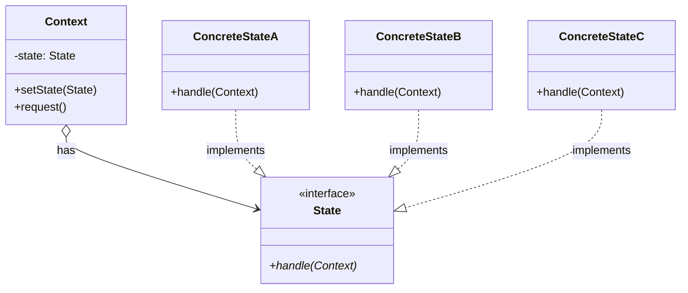
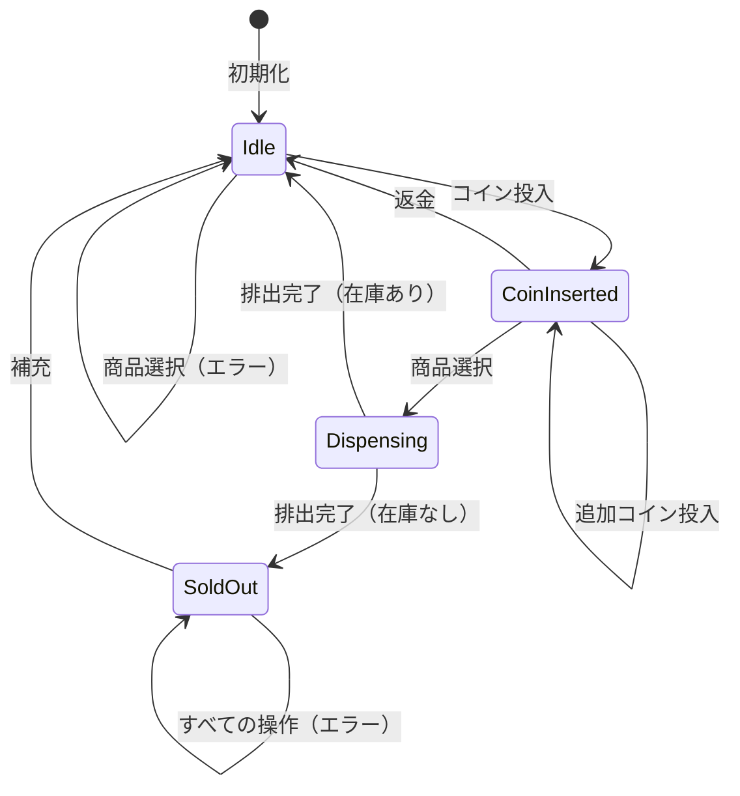

# Stateパターン調査ドキュメント

## 調査概要

- **調査目的**: 「Perl入学式卒業程度」の読者が、実際にプログラムを作りながら「自然に」Stateパターンを学べるような教材シリーズを作成するための基礎資料
- **調査実施日**: 2026年1月8日
- **技術スタック**: Perl / Moo
- **想定読者**: Perl入学式卒業程度、「Mooで覚えるオブジェクト指向プログラミング」シリーズ（全12回）を読了した読者

---

## 1. Stateパターンの基本概念

### 1.1 定義と目的

**要点**:

- Stateパターンは、GoF（Gang of Four）の**振る舞いパターン（Behavioral Patterns）**の1つ
- **「オブジェクトの内部状態が変化したとき、その振る舞いを変えられるようにする。オブジェクトはあたかもそのクラスが変わったかのように見える」**（GoF原典の定義）
- 状態に依存する振る舞いを個別の状態クラスにカプセル化し、Contextオブジェクトが現在の状態オブジェクトに処理を委譲する
- 複雑な条件分岐（if/else、switch-case）を削減し、状態ごとのロジックを分離する

**根拠**:

- GoF書籍「Design Patterns: Elements of Reusable Object-Oriented Software」（1994年）で定義
- Wikipedia、Refactoring Guru、GeeksforGeeks、Baeldung等の主要技術サイトで一致した説明

**仮定**:

- 読者はデザインパターンという言葉に馴染みがない可能性が高い
- 「状態遷移」という概念は初めて学ぶ可能性がある
- Strategyパターンを学習済みの読者には、その違いを明確にする必要がある

**出典**:

- Wikipedia: State pattern - https://en.wikipedia.org/wiki/State_pattern
- Refactoring Guru: State - https://refactoring.guru/design-patterns/state
- GeeksforGeeks: State Design Pattern - https://www.geeksforgeeks.org/system-design/state-design-pattern/
- Baeldung: State Design Pattern in Java - https://www.baeldung.com/java-state-design-pattern
- SourceMaking: State Design Pattern - https://sourcemaking.com/design_patterns/state

**信頼度**: ★★★★★（GoF原典および複数の信頼できる技術サイト）

---

### 1.2 GoFデザインパターンにおける位置づけ

**要点**:

Stateパターンは、GoFパターンの3分類のうち「振る舞いパターン（Behavioral Patterns）」に属する。

| カテゴリ | 英語名 | パターン数 | 主な目的 |
|---------|--------|-----------|---------|
| 生成パターン | Creational | 5 | オブジェクトの生成に関する柔軟性を提供 |
| 構造パターン | Structural | 7 | クラスやオブジェクトを組み合わせてより大きな構造を形成 |
| **振る舞いパターン** | **Behavioral** | **11** | **オブジェクト間の責任分担とコミュニケーションを定義** |

**振る舞いパターン11種類**:

1. Chain of Responsibility
2. Command
3. Interpreter
4. Iterator
5. Mediator
6. Memento
7. Observer
8. **State** ← 今回の調査対象
9. Strategy
10. Template Method
11. Visitor

**根拠**:

- GoF書籍の分類体系
- 既存の調査資料（`/content/warehouse/design-patterns-overview.md`）との整合性

**出典**:

- 内部リンク: `/content/warehouse/design-patterns-overview.md`
- 内部リンク: `/content/warehouse/design-patterns-research.md`

**信頼度**: ★★★★★

---

### 1.3 構成要素（Context, State, ConcreteState）

Stateパターンは、以下の3つの主要コンポーネントで構成される。



| 要素 | 役割 | Perl/Moo実装での具体例 |
|-----|------|----------------------|
| **State（状態インターフェース）** | すべての状態に共通のインターフェースを定義 | `VendingMachineState`（Moo::Role、`requires 'insert_coin', 'select_item', 'dispense'`） |
| **ConcreteState（具象状態）** | Stateインターフェースを実装し、その状態固有の振る舞いと遷移ルールを提供 | `IdleState`, `CoinInsertedState`, `DispensingState` |
| **Context（文脈）** | 現在の状態オブジェクトへの参照を保持し、クライアントに状態非依存のインターフェースを提供 | `VendingMachine`（has state => ...） |

**重要な特徴**:

- **Contextは状態オブジェクトを保持**し、処理を委譲する
- **各ConcreteStateはContextへの参照を持つ**ことが多い（状態遷移のため）
- **状態遷移はConcreteState内で発生**することが多い（「次の状態」を知っているのは現在の状態自身）

**UMLクラス図（テキスト形式）**:

```
+-------------------+
|      Client       |
+-------------------+
         |
         v uses
+-------------------+         +-------------------+
|     Context       |-------->|    <<interface>>  |
+-------------------+  has    |       State       |
| -state: State     |         +-------------------+
+-------------------+         | +handle(Context)  |
| +setState(State)  |         +-------------------+
| +request()        |                  ^
+-------------------+                  | implements
                              +--------+--------+--------+
                              |        |        |        |
                     +--------+  +-----+----+  +--------+
                     |Concrete|  |Concrete  |  |Concrete|
                     |StateA  |  |StateB    |  |StateC  |
                     +--------+  +----------+  +--------+
```

**根拠**:

- GoF書籍の構造定義
- Refactoring Guru、SourceMaking等の信頼できる解説サイト

**出典**:

- Refactoring Guru: State - https://refactoring.guru/design-patterns/state
- SourceMaking: State - https://sourcemaking.com/design_patterns/state

**信頼度**: ★★★★★

---

### 1.4 状態遷移の概念

**要点**:

- **状態遷移（State Transition）**とは、オブジェクトの状態が1つの状態から別の状態に移行すること
- Stateパターンでは、状態遷移は「現在の状態オブジェクトがContextの状態を変更する」形で実現される
- **有限状態機械（Finite State Machine, FSM）**の概念と密接に関連

**状態遷移のパターン**:

1. **状態クラス内で遷移**（一般的）:
   - 各ConcreteStateが「次の状態」を知っている
   - 遷移ルールがカプセル化される

2. **Contextが遷移を管理**:
   - Contextがすべての遷移ルールを持つ
   - 遷移テーブルを使用することも

**例: 信号機の状態遷移**

```
    ┌─────────────────────────────────┐
    │                                 │
    v                                 │
┌───────┐ timer  ┌───────┐ timer  ┌───────┐
│  赤   │───────>│  青   │───────>│  黄   │
│ State │        │ State │        │ State │
└───────┘        └───────┘        └───────┘
    ^                                 │
    │                                 │
    └─────────────────────────────────┘
              timer
```

**根拠**:

- Stateパターンは有限状態機械のオブジェクト指向実装と見なせる
- 組み込みシステムやゲーム開発で広く使われるパターン

**出典**:

- Wikipedia: Finite-state machine - https://en.wikipedia.org/wiki/Finite-state_machine
- University of Waterloo: State Pattern - https://cs.uwaterloo.ca/~m2nagapp/courses/CS446/1181/Arch_Design_Activity/State.pdf

**信頼度**: ★★★★★

---

## 2. Stateパターンの特徴

### 2.1 if/else や switch による状態管理との比較

**要点**:

従来のif/elseやswitchによる状態管理と、Stateパターンを比較する。

| 観点 | if/else / switch | Stateパターン |
|-----|------------------|--------------|
| **状態追加時** | if/elseの条件追加が必要 | 新しいStateクラスを追加するだけ |
| **既存コードへの影響** | 既存のif/elseを修正する必要あり | 既存Stateクラスは変更不要 |
| **状態ごとのロジック** | 1つの関数/メソッドに集約 | 状態ごとにクラスに分離 |
| **テスト** | 全体をテスト | 状態ごとに個別テスト可能 |
| **コードの見通し** | 状態が増えると複雑化 | 各状態が独立してスッキリ |
| **状態遷移の把握** | 条件分岐を追わないと不明 | 各Stateクラスを見れば明確 |

**if/elseによる実装例（問題のあるコード）**:

```perl
sub handle_request ($self, $action) {
    if ($self->state eq 'idle') {
        if ($action eq 'insert_coin') {
            $self->state('coin_inserted');
            say "コインが投入されました";
        }
        elsif ($action eq 'select_item') {
            say "先にコインを入れてください";
        }
        # ... 他のアクション
    }
    elsif ($self->state eq 'coin_inserted') {
        if ($action eq 'select_item') {
            $self->state('dispensing');
            say "商品を選択しました";
        }
        elsif ($action eq 'insert_coin') {
            say "追加のコインを受け付けました";
        }
        # ... 他のアクション
    }
    elsif ($self->state eq 'dispensing') {
        # ... さらに分岐
    }
    # 状態が増えるとどんどん複雑に...
}
```

**Stateパターンによる実装例（改善されたコード）**:

```perl
# Context（自動販売機）
sub handle_request ($self, $action) {
    $self->state->$action($self);  # 現在の状態に委譲
}

# 各Stateクラスで処理を定義
package IdleState {
    sub insert_coin ($self, $machine) {
        say "コインが投入されました";
        $machine->state(CoinInsertedState->new);
    }
    sub select_item ($self, $machine) {
        say "先にコインを入れてください";
        # 状態遷移なし
    }
}
```

**根拠**:

- 「Mooを使ってデータエクスポーターを作ってみよう」シリーズでif/elseの問題を体験済み
- Strategyパターンでも同様の問題と解決策を学習済み

**信頼度**: ★★★★★

---

### 2.2 開放閉鎖原則（OCP）との関連

**要点**:

- Stateパターンは**「拡張に開かれ、修正に閉じた」**設計を実現する
- 新しい状態（ConcreteState）を追加しても、既存のContextや他のStateクラスを修正する必要がない

**具体例**:

```perl
# 既存コードを修正せずに新しい状態を追加
package MaintenanceState {
    use Moo;
    use v5.36;
    with 'VendingMachineState';

    sub insert_coin ($self, $machine) {
        say "メンテナンス中です。コインをお返しします。";
        # 状態遷移なし
    }
    
    sub select_item ($self, $machine) {
        say "メンテナンス中です。しばらくお待ちください。";
        # 状態遷移なし
    }
    
    sub dispense ($self, $machine) {
        say "メンテナンス中です。";
    }
}
1;

# VendingMachineのコードは変更不要！
# 新しいMaintenanceStateを使うだけ
$machine->state(MaintenanceState->new);
```

**根拠**:

- Bertrand Meyerが1988年に提唱した原則
- Stateパターンの主要な設計動機の一つ
- 内部リンク: `/content/warehouse/solid-principles.md`

**出典**:

- 内部リンク: `/content/warehouse/solid-principles.md`
- Baeldung: Open-Closed Principle - https://www.baeldung.com/cs/open-closed-principle

**信頼度**: ★★★★★

---

### 2.3 単一責任原則（SRP）との関連

**要点**:

- Stateパターンでは、各ConcreteStateが**1つの状態のロジックのみ**を担当
- 状態固有の変更理由と、Contextのビジネスロジックの変更理由が分離される

**具体例**:

```perl
# 良い例：各Stateは1つの状態のみを担当
package IdleState { ... }         # 待機状態のロジックのみ
package CoinInsertedState { ... } # コイン投入済み状態のロジックのみ
package DispensingState { ... }   # 排出中状態のロジックのみ

# 悪い例：1つのクラスに複数の状態ロジック
package VendingMachine {
    sub handle_idle { ... }
    sub handle_coin_inserted { ... }
    sub handle_dispensing { ... }
    # 変更理由が3つある → SRP違反
}
```

**根拠**:

- Robert C. Martinの定義「変更理由は1つであるべき」
- 状態の分離により、各クラスの変更理由が明確化

**信頼度**: ★★★★★

---

### 2.4 Strategyパターンとの違い

**最重要ポイント**: StateパターンとStrategyパターンは構造が非常に似ているが、**意図と責任が異なる**。

| 項目 | Strategyパターン | Stateパターン |
|-----|-----------------|--------------|
| **目的** | アルゴリズムを切り替える | オブジェクトの状態に応じて振る舞いを変える |
| **変更の主体** | クライアント（外部）が選択 | オブジェクト自身が内部状態に応じて変更 |
| **状態遷移** | なし（独立したアルゴリズム選択） | あり（状態間の遷移ルールが存在） |
| **Contextへの参照** | Strategyは通常Contextを知らない | StateはContextへの参照を持つことが多い |
| **ConcreteXXX間の関係** | 互いに独立、関係なし | 互いの存在を知り、遷移し合う |
| **典型例** | ソートアルゴリズム、支払い方法、データ出力形式 | 自動販売機の状態、TCP接続の状態、ワークフロー |

**選択指針**:

- **「どう処理するか」を外部から選んで切り替えたい** → **Strategy**
- **「オブジェクトの内部状態によって振る舞いを自動的に変えたい」** → **State**

**コード構造の比較**:

```perl
# Strategyパターン: クライアントがStrategyを選択
my $exporter = DataExporter->new(
    exporter => CsvExporter->new  # クライアントが選ぶ
);
$exporter->export($data);

# Stateパターン: オブジェクト自身が状態を遷移
my $machine = VendingMachine->new;  # 内部で状態を持つ
$machine->insert_coin;  # 状態が自動的に IdleState → CoinInsertedState に遷移
$machine->select_item;  # 状態が CoinInsertedState → DispensingState に遷移
```

**根拠**:

- GoF書籍での定義
- 両パターンの構造は似ているが、意図と責任が異なる
- 内部リンク: `/content/warehouse/strategy-pattern.md`

**出典**:

- Baeldung: State vs Strategy Pattern - https://www.baeldung.com/cs/design-state-pattern-vs-strategy-pattern
- GeeksforGeeks: Difference Between State and Strategy - https://www.geeksforgeeks.org/java/difference-between-state-and-strategy-design-pattern-in-java/
- bugfree.ai: Strategy vs State Pattern - https://bugfree.ai/knowledge-hub/strategy-vs-state-pattern-ood-design-patterns
- Stack Overflow: State vs Strategy - https://stackoverflow.com/questions/1658192/what-is-the-difference-between-strategy-design-pattern-and-state-design-pattern

**信頼度**: ★★★★★

---

## 3. Stateパターンの適用シナリオ

### 3.1 典型的なユースケース

**要点**:

Stateパターンは、**オブジェクトの振る舞いが内部状態に依存し、状態間の遷移ルールが存在する**場面で有効。

| ユースケース | 状態例 | 遷移トリガー | 説明 |
|-------------|-------|-------------|------|
| **自動販売機** | Idle, CoinInserted, Dispensing, SoldOut | コイン投入、商品選択、商品排出完了 | 定番の例題、初心者に理解しやすい |
| **ワークフロー・承認フロー** | Draft, Review, Approved, Rejected | 提出、承認、却下、差し戻し | ビジネスシステムでよくあるパターン |
| **ゲームのキャラクター状態** | Idle, Walking, Running, Attacking, Dead | ユーザー入力、ダメージ受け | ゲーム開発での典型例 |
| **メディアプレイヤー** | Playing, Paused, Stopped | 再生、一時停止、停止ボタン | UI状態管理の例 |
| **TCP接続** | Listening, Established, Closed | 接続要求、データ送受信、切断 | ネットワークプロトコル |
| **電子レンジ** | Idle, Cooking, Paused, Done | 開始、一時停止、完了 | 家電製品の状態管理 |
| **信号機** | Red, Yellow, Green | タイマー経過 | シンプルな周期的遷移 |
| **ドキュメントライフサイクル** | Draft, UnderReview, Published, Archived | 編集完了、レビュー完了、アーカイブ | CMS・文書管理システム |

**根拠**:

- 各技術サイトで共通して挙げられる例
- 組み込みシステム、ゲーム開発、Webアプリケーションで広く使用

**出典**:

- Refactoring Guru: State Pattern - https://refactoring.guru/design-patterns/state
- GeeksforGeeks: State Design Pattern - https://www.geeksforgeeks.org/system-design/state-design-pattern/
- Cloudaffle: Use Cases For The State Design Pattern - https://cloudaffle.com/series/behavioral-design-patterns/state-application/

**信頼度**: ★★★★★

---

### 3.2 Perl入門者が理解しやすい具体例

**推奨題材**: **自動販売機（Vending Machine）**

**選定理由**:

1. **身近な存在**: 日常生活で誰もが使う機械
2. **状態が明確**: 「待機中」「コイン投入済み」「商品排出中」「売り切れ」など
3. **遷移ルールが直感的**: コインを入れたら次の状態へ、という流れが理解しやすい
4. **段階的に拡張可能**: 最初は2状態から始めて、徐々に増やせる
5. **他言語での実装例が豊富**: 参照しやすい資料が多い

**状態遷移図**:



**代替題材候補**:

| 題材 | 利点 | 欠点 | 優先度 |
|-----|------|------|--------|
| 自動販売機 | 身近、直感的、実装例豊富 | ややありふれた題材 | **★★★★★** |
| ブログ記事のライフサイクル | Hugoとの関連性、読者に馴染み | 状態遷移がシンプルすぎる可能性 | ★★★★☆ |
| ToDoタスクの状態 | シンプル、Webアプリと関連 | 実装がシンプルすぎる可能性 | ★★★☆☆ |
| 信号機 | 非常にシンプル、周期的 | シンプルすぎて応用が見えにくい | ★★★☆☆ |

**根拠**:

- 自動販売機は多くのStateパターン解説で使われる定番題材
- 段階的に複雑さを増やせる

**出典**:

- GitHub: SoftEng2 State-Pattern Vending Machine - https://github.com/PiaMacalanda/SoftEng2_State-Pattern-Vending-Machine
- Educative: Class Diagram for Vending Machine - https://www.educative.io/courses/grokking-the-low-level-design-interview-using-ood-principles/class-diagram-for-the-vending-machine

**信頼度**: ★★★★★

---

### 3.3 段階的に機能を追加していける題材

**自動販売機シリーズの段階的展開案**:

| 回 | 内容 | 状態数 | 学習ポイント |
|----|------|--------|-------------|
| 第1-2回 | if/elseで2状態（Idle, CoinInserted）を実装 | 2 | 問題の体験 |
| 第3-4回 | 状態をクラスに分離 | 2 | 責務分離 |
| 第5回 | Moo::Roleでインターフェース定義 | 2 | Role、requires |
| 第6回 | Dispensing状態を追加 | 3 | 状態の追加が簡単なことを体験 |
| 第7回 | SoldOut状態を追加 | 4 | OCPの実証 |
| 第8回 | 状態遷移の管理（Contextクラス） | 4 | Context-State関係 |
| 第9回 | does制約で型チェック | 4 | 堅牢な設計 |
| 第10回 | 完成！自動販売機 | 4 | 機能統合 |
| 第11回 | これがStateパターンだ！ | 4 | パターンの命名 |
| 第12回 | Strategyパターンとの比較 | - | パターン間の関係 |

**信頼度**: ★★★★☆（既存シリーズの構成を参考にした提案）

---

## 4. 実装のポイント

### 4.1 Perl + Moo での実装パターン

**要点**:

MooでのStateパターン実装には以下の利点がある：

| 機能 | Mooでの実現方法 | メリット |
|-----|----------------|---------|
| State Interface | `Moo::Role`と`requires` | 必須メソッドの強制 |
| ConcreteState | `with 'RoleName'`でRole消費 | インターフェースの実装保証 |
| Context | `has state => (...)`で属性定義 | 柔軟なState保持 |
| 状態遷移 | Stateクラス内で`$context->state(...)`を呼び出し | 遷移ロジックのカプセル化 |
| 型制約 | `does => 'RoleName'`またはType::Tiny | 不正な状態オブジェクト防止 |

**コード例（自動販売機）**:

```perl
# ========================================
# State Role（状態インターフェース）
# ========================================
package VendingMachineState {
    use Moo::Role;
    requires 'insert_coin';
    requires 'select_item';
    requires 'dispense';
}

# ========================================
# ConcreteState: IdleState（待機状態）
# ========================================
package IdleState {
    use Moo;
    use v5.36;
    with 'VendingMachineState';

    sub insert_coin ($self, $machine) {
        say "コインが投入されました";
        $machine->state(CoinInsertedState->new);
    }

    sub select_item ($self, $machine) {
        say "先にコインを入れてください";
        # 状態遷移なし
    }

    sub dispense ($self, $machine) {
        say "まだ商品を選択していません";
        # 状態遷移なし
    }
}

# ========================================
# ConcreteState: CoinInsertedState（コイン投入済み）
# ========================================
package CoinInsertedState {
    use Moo;
    use v5.36;
    with 'VendingMachineState';

    sub insert_coin ($self, $machine) {
        say "追加のコインを受け付けました";
        # 状態遷移なし（同じ状態に留まる）
    }

    sub select_item ($self, $machine) {
        say "商品を選択しました。排出中...";
        $machine->state(DispensingState->new);
    }

    sub dispense ($self, $machine) {
        say "まだ商品を選択していません";
        # 状態遷移なし
    }
}

# ========================================
# ConcreteState: DispensingState（排出中）
# ========================================
package DispensingState {
    use Moo;
    use v5.36;
    with 'VendingMachineState';

    sub insert_coin ($self, $machine) {
        say "排出中です。お待ちください";
        # 状態遷移なし
    }

    sub select_item ($self, $machine) {
        say "排出中です。お待ちください";
        # 状態遷移なし
    }

    sub dispense ($self, $machine) {
        say "商品が排出されました。ありがとうございました！";
        $machine->state(IdleState->new);  # 待機状態に戻る
    }
}

# ========================================
# Context: VendingMachine（自動販売機）
# ========================================
package VendingMachine {
    use Moo;
    use v5.36;

    has state => (
        is      => 'rw',
        does    => 'VendingMachineState',  # Roleを実装していることを強制
        default => sub { IdleState->new },
    );

    sub insert_coin ($self) {
        $self->state->insert_coin($self);
    }

    sub select_item ($self) {
        $self->state->select_item($self);
    }

    sub dispense ($self) {
        $self->state->dispense($self);
    }
}

# ========================================
# 使用例
# ========================================
package main;
use v5.36;

my $machine = VendingMachine->new;

$machine->select_item;   # 先にコインを入れてください
$machine->insert_coin;   # コインが投入されました
$machine->select_item;   # 商品を選択しました。排出中...
$machine->dispense;      # 商品が排出されました。ありがとうございました！
$machine->select_item;   # 先にコインを入れてください（待機状態に戻っている）
```

**根拠**:

- Moo::Roleの`requires`でインターフェースを定義し、実装漏れを防げる
- 「Mooで覚えるオブジェクト指向プログラミング」第10回で学習済みの概念

**出典**:

- MetaCPAN: Moo::Role - https://metacpan.org/pod/Moo::Role
- MetaCPAN: Moo - https://metacpan.org/pod/Moo

**信頼度**: ★★★★★

---

### 4.2 Moo::Role を使った状態インターフェースの定義

**要点**:

- `Moo::Role`を「State インターフェース」として使用
- `requires`で必須メソッドを定義し、各ConcreteStateクラスがRoleを消費（with）

**コード例**:

```perl
package VendingMachineState {
    use Moo::Role;
    
    # すべての状態が実装すべきメソッドを宣言
    requires 'insert_coin';   # コイン投入時の振る舞い
    requires 'select_item';   # 商品選択時の振る舞い
    requires 'dispense';      # 商品排出時の振る舞い
    
    # オプション: 共通の振る舞いをRoleで提供
    sub state_name ($self) {
        my $class = ref $self;
        $class =~ s/State$//;
        return $class;
    }
}
1;
```

**注意点**:

- `requires`で宣言されたメソッドは、Roleを消費するクラスで必ず実装が必要
- 実装が漏れた場合、Mooがエラーを出力する
- Roleは単体でインスタンス化できない（クラスに消費されて初めて使える）

**根拠**:

- 「Mooで覚えるオブジェクト指向プログラミング」第10回で学習済み

**出典**:

- 内部リンク: `/2025/12/30/163818/` （第10回-継承しないで振る舞いを共有）

**信頼度**: ★★★★★

---

### 4.3 状態遷移の実装方法

**方法1: ConcreteState内で遷移（推奨）**

```perl
package CoinInsertedState {
    sub select_item ($self, $machine) {
        say "商品を選択しました";
        $machine->state(DispensingState->new);  # 状態を変更
    }
}
```

**方法2: Context内で遷移（シンプルなケース向け）**

```perl
package VendingMachine {
    sub select_item ($self) {
        if ($self->state->isa('CoinInsertedState')) {
            say "商品を選択しました";
            $self->state(DispensingState->new);
        }
        # ... 他のケース
    }
}
```

**推奨: 方法1**

- 各状態が遷移ルールを知っている
- 遷移ロジックがカプセル化される
- OCPに準拠（新しい状態の追加が容易）

**信頼度**: ★★★★★

---

## 5. 競合記事の分析

### 5.1 日本語で読めるStateパターン解説記事

| 記事タイトル | URL | 特徴 | 差別化ポイント |
|-------------|-----|------|---------------|
| ステートパターン解説（Flutter/Android実例付き） | https://qiita.com/nozomi2025/items/f05fb0219da0451d6ddb | Flutter/Android向け、事例豊富 | Java/Dart特化、Perl非対応 |
| 「State」パターンとは？（tamotech.blog） | https://tamotech.blog/2025/05/13/state/ | Java中心、信号機サンプル | Java特化、Perl非対応 |
| デザインパターンを学ぶ #17 ステート（Zenn） | https://zenn.dev/tajicode/articles/aa18feba9a570f | PHP/会員ランク例 | PHP特化、Perl非対応 |
| Java : Stateパターン（プログラミングTIPS!） | https://programming-tips.jp/archives/a3/44/index.html | Java図解、サンプル充実 | Java特化、Perl非対応 |
| デザインパターン: State（note） | https://note.com/sktudr_1590/n/n5d0005503f10 | ゲーム例、C++実装 | C++特化、Perl非対応 |

### 5.2 他言語での実装例

| 言語 | 主要リソース | URL |
|-----|------------|-----|
| Java | Baeldung: State Design Pattern in Java | https://www.baeldung.com/java-state-design-pattern |
| Python | Refactoring Guru: State in Python | https://refactoring.guru/design-patterns/state/python/example |
| TypeScript | Refactoring Guru: State in TypeScript | https://refactoring.guru/design-patterns/state/typescript/example |
| C# | Refactoring Guru: State in C# | https://refactoring.guru/design-patterns/state/csharp/example |

### 5.3 差別化ポイントの抽出

**既存記事の問題点**:

1. **Perl/Moo特化の記事がほぼ存在しない**: 日本語でPerl向けのState解説は極めて希少
2. **抽象的な例が多い**: 信号機、自動販売機など、継続性のない例
3. **ストーリー性の欠如**: 「なぜパターンが必要か」の動機付けが弱い
4. **Strategyパターンとの比較が不十分**: 構造の類似性から混同されがち

**本教材シリーズの強み**:

1. **前シリーズとの継続性**: 「Mooを使ってデータエクスポーターを作ってみよう」でStrategyパターンを学んだ読者への発展
2. **問題発見→解決の流れ**: if/elseの問題を体験してからパターンを学ぶ
3. **段階的な難易度**: 1記事1概念、コード例2つまでの制約
4. **「気づき」の演出**: パターンを学んだ後に「これがStateパターンだったのか！」と気づく構成
5. **Strategyとの比較**: 両パターンを学んだ読者だからこそできる深い比較
6. **Perl/Moo特化**: v5.36対応のモダンPerl記法

**信頼度**: ★★★★★

---

## 6. 既存シリーズとの重複チェック

### 6.1 リポジトリ内の関連コンテンツ

**Stateパターン直接言及**:

| ファイル | 内容 | 重複リスク |
|---------|------|----------|
| `/content/post/2026/01/09/005327.md` | 第10回-これがStrategyパターンだ！ | **関連あり（Stateへの言及あり）**、差別化は可能 |

**デザインパターン関連シリーズ**:

| シリーズ | ファイル例 | 内容 | 差別化方法 |
|---------|----------|------|-----------|
| Mooで覚えるオブジェクト指向プログラミング | `/content/post/2025/12/30/163810.md` 〜 | OOPの基礎（全12回） | 前提知識として活用 |
| Mooを使ってディスパッチャーを作ってみよう | `/content/post/2026/01/03/001530.md` 〜 | Strategyパターン的アプローチ（全12回） | 関連シリーズとして参照 |
| Mooを使ってデータエクスポーターを作ってみよう | `/content/post/2026/01/09/003500.md` 〜 | Strategyパターン（全10回） | 続編として位置づけ |

**デザインパターン調査資料**:

| 資料 | ファイル | Stateパターンへの言及 |
|-----|---------|---------------------|
| デザインパターン概要 | `/content/warehouse/design-patterns-overview.md` | 一覧に記載あり |
| デザインパターン調査 | `/content/warehouse/design-patterns-research.md` | 振る舞いパターンとして記載 |
| Strategyパターン調査 | `/content/warehouse/strategy-pattern.md` | 比較対象として詳細記載 |
| SOLID原則調査 | `/content/warehouse/solid-principles.md` | 関連原則として参照可能 |

### 6.2 重複回避と差別化の方針

**差別化ポイント**:

1. **題材の違い**: データエクスポーターシリーズはStrategy（出力形式の選択）、本シリーズはState（オブジェクトの状態遷移）
2. **学習目標の違い**: Strategyは「アルゴリズムの切り替え」、Stateは「状態に応じた振る舞いと遷移」
3. **Strategyとの比較記事**: 両パターンを学んだ読者向けに、違いを明確にする記事を含める
4. **新しい題材**: 自動販売機を使用（データエクスポーターとは異なる）

**シリーズ間の関係**:

```
Mooで覚えるオブジェクト指向プログラミング（全12回）
        ↓ 基礎知識
Mooを使ってディスパッチャーを作ってみよう（全12回）
        ↓ 発展
Mooを使ってデータエクスポーターを作ってみよう（全10回）→ Strategyパターン
        ↓ 関連パターン
[新シリーズ] Mooを使って自動販売機を作ってみよう（全10-12回予定）→ Stateパターン
```

**信頼度**: ★★★★★

---

## 7. 内部リンク調査

### 7.1 「Mooで覚えるオブジェクト指向プログラミング」シリーズ（全12回）

本シリーズ記事の前提知識となる既存記事。

| 回 | タイトル | 内部リンク | Stateパターンとの関連 |
|:--|:--|:--|:--|
| 第1回 | Mooで覚えるオブジェクト指向プログラミング | `/2021/10/31/191008/` | OOPの基礎 |
| 第2回 | データとロジックをまとめよう | `/2025/12/30/163810/` | `has`、`sub` |
| 第3回 | 同じものを何度も作れるように | `/2025/12/30/163811/` | `new`（コンストラクタ） |
| 第4回 | 勝手に書き換えられないようにする | `/2025/12/30/163812/` | `is => 'ro'`、`is => 'rw'` |
| 第5回 | 初期化忘れを防ぐ | `/2025/12/30/163813/` | `required`、`default` |
| 第6回 | 内部実装を外から触らせない | `/2025/12/30/163814/` | カプセル化 |
| 第7回 | 関連するデータを別のクラスに | `/2025/12/30/163815/` | オブジェクトの関連（ContextがStateを持つ） |
| 第8回 | 似ているクラスの重複をなくす | `/2025/12/30/163816/` | `extends`（継承） |
| 第9回 | 同じ名前で違う動作を | `/2025/12/30/163817/` | オーバーライド |
| 第10回 | 継承しないで振る舞いを共有 | `/2025/12/30/163818/` | **`Moo::Role`、`with`（State Roleの基礎）** |
| 第11回 | 「持っている」ものに仕事を任せる | `/2025/12/30/163819/` | `handles`（委譲） |
| 第12回 | 型チェックでバグを未然に防ぐ | `/2025/12/30/163820/` | `isa`、`does`（型制約） |

**特に重要な関連**:

- **第10回（Moo::Role）**: State RoleをMoo::Roleで定義する際に必須の知識
- **第7回（オブジェクトの関連）**: ContextクラスがStateを持つ関係
- **第4回・第5回（ro/rw、required）**: Stateクラスの属性定義

### 7.2 「Mooを使ってデータエクスポーターを作ってみよう」シリーズ（全10回）

**Strategyパターンを学んだシリーズ**：Stateパターンとの比較に活用。

| 回 | タイトル | 内部リンク | 関連度 |
|:--|:--|:--|:--|
| 第1回 | CSVとJSONでデータを保存しよう | `/2026/01/09/003500/` | 中（if/elseの問題） |
| 第4回 | Moo::Roleで共通の約束を決めよう | `/2026/01/09/004109/` | 高（Roleによるインターフェース） |
| 第10回 | これがStrategyパターンだ！ | `/2026/01/09/005327/` | **最高**（Strategyとの比較） |

### 7.3 デザインパターン・SOLID原則関連warehouse

| ドキュメント | 内容 | 関連度 |
|-------------|------|--------|
| `/content/warehouse/design-patterns-research.md` | GoF 23パターン概要調査 | 高 |
| `/content/warehouse/design-patterns-overview.md` | デザインパターン概要 | 高 |
| `/content/warehouse/strategy-pattern.md` | Strategyパターン調査 | **最高**（比較対象） |
| `/content/warehouse/solid-principles.md` | SOLID原則詳細調査 | 高（OCP、SRP） |
| `/content/warehouse/command-pattern.md` | Commandパターン調査 | 中（関連パターン） |

---

## 8. 参考文献・リソースリスト

### 8.1 必読リソース

#### 書籍

| 書籍名 | 著者 | ISBN/ASIN | 重要度 |
|-------|------|-----------|--------|
| Design Patterns: Elements of Reusable Object-Oriented Software | GoF | 978-0201633610 | **必須** |
| Head First Design Patterns (2nd Edition) | Eric Freeman, Elisabeth Robson | 978-1492078005 | 推奨 |
| Dive Into Design Patterns | Alexander Shvets | - | 推奨（Refactoring Guru著者） |

#### Webリソース

| リソース名 | URL | 特徴 | 信頼度 |
|-----------|-----|------|--------|
| Refactoring Guru - State | https://refactoring.guru/design-patterns/state | 視覚的な図解、多言語コード例 | ★★★★★ |
| Refactoring Guru - State（日本語） | https://refactoring.guru/ja/design-patterns/state | 日本語訳版 | ★★★★★ |
| Wikipedia - State pattern | https://en.wikipedia.org/wiki/State_pattern | 正式な定義 | ★★★★★ |
| GeeksforGeeks - State Design Pattern | https://www.geeksforgeeks.org/system-design/state-design-pattern/ | 網羅的な解説 | ★★★★☆ |
| Baeldung - State Design Pattern in Java | https://www.baeldung.com/java-state-design-pattern | Java実装例詳細 | ★★★★☆ |
| SourceMaking - State | https://sourcemaking.com/design_patterns/state | 詳細な解説と図解 | ★★★★★ |
| MetaCPAN - Moo | https://metacpan.org/pod/Moo | Perl Moo公式 | ★★★★★ |
| MetaCPAN - Moo::Role | https://metacpan.org/pod/Moo::Role | Perl Moo::Role公式 | ★★★★★ |

---

## 9. 調査結果のサマリー

### 9.1 主要な発見

1. **Stateパターンの適用性**: オブジェクトの振る舞いが内部状態に依存し、状態間の遷移ルールが存在する場面で有効。Moo::Roleを使ってインターフェースを定義し、各ConcreteStateクラスでwithで消費する

2. **SOLID原則との親和性**: Stateパターンは、OCP（新しいState追加が容易）、SRP（各Stateが1つの責任）を自然に満たす

3. **Strategyパターンとの違い**:
   - **Strategy**: クライアントがアルゴリズムを選択、状態遷移なし
   - **State**: オブジェクト自身が状態を遷移、遷移ルールがカプセル化

4. **Perl/Moo実装の容易さ**: Moo::Roleの`requires`でインターフェースを定義し、`with`でRole消費、`has`でState属性を持つ設計が可能

5. **推奨題材**: 自動販売機（身近、状態が明確、遷移が直感的、段階的に拡張可能）

6. **既存シリーズとの連携**: 「Mooを使ってデータエクスポーターを作ってみよう」（Strategyパターン）の続編として位置づけ可能

### 9.2 教材シリーズへの示唆

1. **ストーリー駆動**: 自動販売機の機能追加でif/elseが増えて困る → クラス分離 → Role導入 → Stateパターンの流れ

2. **段階的な導入**:
   - 最初は2状態（Idle, CoinInserted）から始める
   - 徐々に状態を追加（Dispensing, SoldOut）
   - 最後に「これがStateパターンだった！」と気づく

3. **Strategyとの比較**: 両パターンを学んだ読者だからこそできる深い比較記事

4. **差別化ポイント**: Perl/Moo特化、日本語、段階的学習、Strategyパターンからの発展

---

## 10. 不明点・追加調査が必要な領域

1. **Perlでの実装例の検証**: 実際にコードを動作確認して、記事執筆前にテスト

2. **読者レベルの確認**: Perl入学式卒業程度の読者がどこまで理解しているか

3. **シリーズ回数の最適化**: 10回か12回か、読者の理解度に応じて調整

4. **自動販売機以外の題材検討**: ブログ記事のライフサイクルなど、Hugoとの関連性がある題材

---

**調査完了日**: 2026年1月8日
**調査者**: 調査・情報収集エージェント
**次のステップ**: 連載構造案の作成

---

End of Document
