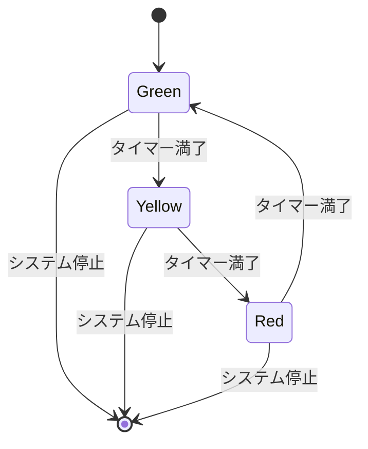
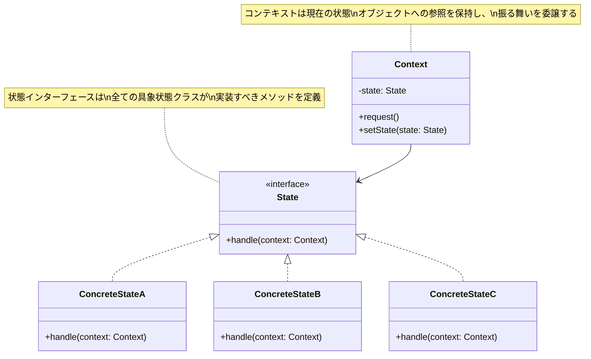

# Stateパターン（State Design Pattern）調査報告書

## 1. 基本情報

### 1.1 Stateパターンの定義と概要

**要点：**
Stateパターンは、オブジェクトの内部状態が変化したときにその振る舞いを変更できるようにする振る舞いに関するデザインパターンである。このパターンでは、状態固有の振る舞いを別々の状態オブジェクトにカプセル化し、オブジェクトの振る舞いが状態に応じて動的に変化するようにする。

**根拠：**
Gang of Four（GoF）の定義によると、Stateパターンは「オブジェクトの内部状態が変化したときに、オブジェクトが振る舞いを変更できるようにする」パターンである。状態特有のロジックを主オブジェクトに格納する代わりに、別々の状態オブジェクト内にカプセル化することで実現する。結果として、オブジェクトの振る舞いは、あたかもそのクラスが変更されたかのように動的に変化する。

**仮定：**
- オブジェクトは複数の状態を持つ
- 各状態において、同じメソッド呼び出しでも異なる振る舞いをする
- 状態遷移のロジックが明確に定義されている

**出典：**
- Refactoring Guru: https://refactoring.guru/design-patterns/state
- Wikipedia - State pattern: https://en.wikipedia.org/wiki/State_pattern
- GeeksforGeeks - State Design Pattern: https://www.geeksforgeeks.org/system-design/state-design-pattern/

**信頼度：** 高

### 1.2 GoF（Gang of Four）における位置づけ

**要点：**
Stateパターンは、GoFの23のデザインパターンのうち、**振る舞いパターン（Behavioral Pattern）**に分類される。振る舞いパターンは、オブジェクト間の相互作用とコミュニケーションの方法を記述するパターン群である。

**根拠：**
GoFでは、デザインパターンを以下の3つのカテゴリに分類している：

1. **生成に関するパターン（Creational Patterns）** - オブジェクトの生成メカニズム
2. **構造に関するパターン（Structural Patterns）** - オブジェクトとクラスの組み合わせ
3. **振る舞いに関するパターン（Behavioral Patterns）** - オブジェクト間の相互作用

Stateパターンは振る舞いパターンに属し、離散的な状態オブジェクトとのやりとりを通じて、オブジェクトがどのように振る舞うかを管理する。これにより、実行時に動的な振る舞いの変更が可能になる。

**仮定：**
振る舞いパターンの主な目的は、アルゴリズムや責務の分離とカプセル化である。

**出典：**
- Design Patterns - Wikipedia: https://en.wikipedia.org/wiki/Design_Patterns
- GeeksforGeeks - Gang of Four (GOF) Design Patterns: https://www.geeksforgeeks.org/system-design/gang-of-four-gof-design-patterns/
- DigitalOcean - Gang of 4 Design Patterns: https://www.digitalocean.com/community/tutorials/gangs-of-four-gof-design-patterns

**信頼度：** 高

### 1.3 歴史的背景と登場時期

**要点：**
Stateパターンは、1994年に出版されたGang of Fourの著書「Design Patterns: Elements of Reusable Object-Oriented Software」で初めて体系的に文書化された。

**根拠：**
Gang of Four（Erich Gamma、Richard Helm、Ralph Johnson、John Vlissides）による「Design Patterns」は、1994年10月21日に出版され、1994年のOOPSLA会議で初めて一般公開された。この書籍は23の古典的なソフトウェアデザインパターンを紹介し、ソフトウェアエンジニアがオブジェクト指向設計にアプローチする方法に深い影響を与えた。

書籍の起源は、1990年のOOPSLA会議での「Towards an Architecture Handbook」というBirds-of-a-Feather（BoF）セッションにまで遡る。このセッションで、Erich GammaとRichard Helmが共通の関心事について議論を交わした。

**仮定：**
Stateパターン自体の概念は、GoFの書籍以前から存在していた可能性があるが、体系的な文書化と普及は1994年の出版以降である。

**出典：**
- Design Patterns - Wikipedia: https://en.wikipedia.org/wiki/Design_Patterns
- Amazon - Design Patterns: Elements of Reusable Object-Oriented Software: https://www.amazon.com/Design-Patterns-Object-Oriented-Addison-Wesley-Professional-ebook/dp/B000SEIBB8
- ISBN: 0-201-63361-2（ハードカバー版）、978-0-201-63361-0（ISBN-13）
- ASIN: B000SEIBB8（Kindle版）

**信頼度：** 高

## 2. 用途と適用シーン

### 2.1 解決する問題

**要点：**
Stateパターンは、オブジェクトの状態に基づく複雑な条件分岐ロジック（if-else文やswitch文の羅列）を排除し、保守性と拡張性を向上させる。

**根拠：**
状態に依存する複雑な条件分岐は、以下の問題を引き起こす：

1. **可読性の低下** - 巨大なif-elseやswitch文は理解が困難
2. **保守性の悪化** - 新しい状態の追加時に既存コードの多くの箇所を変更する必要がある
3. **単一責任原則の違反** - 一つのクラスが複数の状態に関する振る舞いを持つ
4. **テストの困難さ** - 全ての状態と遷移のテストが複雑

Stateパターンは、状態固有の振る舞いを別々のクラスに外部化することで、これらの問題を解決する。各状態クラスは自身の振る舞いのみを担当し、単一責任原則を遵守する。

**仮定：**
- アプリケーションには3つ以上の明確な状態が存在する
- 各状態で同じ操作に対して異なる振る舞いが必要
- 状態遷移が頻繁に発生する、または将来的に新しい状態が追加される可能性がある

**出典：**
- Refactoring Guru - State Pattern: https://refactoring.guru/design-patterns/state
- System Overflow - State Pattern Trade-offs: https://www.systemoverflow.com/learn/behavioral-patterns/state-pattern/state-pattern-trade-offs-and-when-to-use
- GeeksforGeeks - State Design Pattern: https://www.geeksforgeeks.org/system-design/state-design-pattern/

**信頼度：** 高

### 2.2 実務での典型的な利用シーン

#### 2.2.1 ワークフローシステム

**要点：**
文書承認ワークフローなど、明確な状態遷移を持つビジネスプロセスに適用できる。

**実装例：**

```perl
package Workflow;
use Moo;

has 'state' => (
    is => 'rw',
    required => 1,
);

sub process {
    my $self = shift;
    $self->state->process($self);
}

package WorkflowState;
use Moo::Role;
requires 'process';

package DraftState;
use Moo;
with 'WorkflowState';

sub process {
    my ($self, $workflow) = @_;
    print "Processing as Draft.\n";
    # ビジネスロジック
}

package ReviewState;
use Moo;
with 'WorkflowState';

sub process {
    my ($self, $workflow) = @_;
    print "Processing as Review.\n";
    # レビュープロセス
}

package ApprovedState;
use Moo;
with 'WorkflowState';

sub process {
    my ($self, $workflow) = @_;
    print "Processing as Approved.\n";
    # 承認後の処理
}

# 使用例
my $workflow = Workflow->new(state => DraftState->new);
$workflow->process;  # "Processing as Draft."
$workflow->state(ReviewState->new);
$workflow->process;  # "Processing as Review."
```

**根拠：**
ワークフローシステムでは、文書やタスクが「下書き」「レビュー中」「承認済み」「却下」などの明確な状態を持つ。各状態で可能な操作や次の状態への遷移ルールが異なるため、Stateパターンが効果的である。

**出典：**
- Cloudaffle - Use Cases For The State Design Pattern: https://cloudaffle.com/series/behavioral-design-patterns/state-application/
- Moments Log - Managing System State Transitions: https://www.momentslog.com/development/design-pattern/managing-system-state-transitions-with-the-state-pattern

**信頼度：** 高

#### 2.2.2 ゲーム開発

**要点：**
キャラクターの状態管理（待機、走行、ジャンプ、攻撃など）において、Stateパターンは有限状態機械（FSM）として広く使用される。

**実装例：**

```perl
package Character;
use Moo;

has 'state' => (
    is => 'rw',
    required => 1,
);

sub handle_input {
    my ($self, $input) = @_;
    $self->state->handle_input($self, $input);
}

package CharacterState;
use Moo::Role;
requires 'handle_input';

package IdleState;
use Moo;
with 'CharacterState';

sub handle_input {
    my ($self, $character, $input) = @_;
    if ($input eq 'RUN') {
        print "Transitioning to Running\n";
        $character->state(RunningState->new);
    } elsif ($input eq 'JUMP') {
        print "Transitioning to Jumping\n";
        $character->state(JumpingState->new);
    }
}

package RunningState;
use Moo;
with 'CharacterState';

sub handle_input {
    my ($self, $character, $input) = @_;
    if ($input eq 'STOP') {
        print "Transitioning to Idle\n";
        $character->state(IdleState->new);
    } elsif ($input eq 'JUMP') {
        print "Transitioning to Jumping\n";
        $character->state(JumpingState->new);
    }
}

package JumpingState;
use Moo;
with 'CharacterState';

sub handle_input {
    my ($self, $character, $input) = @_;
    # ジャンプ中は入力を制限
    print "Cannot change state while jumping\n";
}

# 使用例
my $player = Character->new(state => IdleState->new);
$player->handle_input('JUMP');  # "Transitioning to Jumping"
```

**根拠：**
ゲーム開発では、キャラクターやゲームオブジェクトが複数の状態を持ち、各状態で入力に対する応答が異なる。Stateパターンを使用することで、巨大なswitch文を避け、各状態の振る舞いを明確に分離できる。

**出典：**
- Game Programming Patterns - State: https://gameprogrammingpatterns.com/state.html
- DEV Community - Programming Patterns for Games: State: https://dev.to/zigzagoon1/programming-patterns-for-games-state-2eop
- Moments Log - Using State Pattern for Game States: https://www.momentslog.com/development/design-pattern/using-the-state-pattern-for-managing-game-states-in-interactive-applications
- Neutronio Games - State Machine Pattern for Game Developers: https://neutronio.games/gamedev/design-patterns-state-machine-pattern-for-game-developers/

**信頼度：** 高

#### 2.2.3 デバイス制御

**要点：**
スマートデバイスやハードウェア制御において、オン/オフ/スタンバイなどの状態管理に適用できる。

**実装例：**

```perl
package Device;
use Moo;

has 'state' => (
    is => 'rw',
    required => 1,
);

sub press_button {
    my $self = shift;
    $self->state->press_button($self);
}

package DeviceState;
use Moo::Role;
requires 'press_button';

package OnState;
use Moo;
with 'DeviceState';

sub press_button {
    my ($self, $device) = @_;
    print "Turning Off\n";
    $device->state(OffState->new);
}

package OffState;
use Moo;
with 'DeviceState';

sub press_button {
    my ($self, $device) = @_;
    print "Turning On\n";
    $device->state(OnState->new);
}

package StandbyState;
use Moo;
with 'DeviceState';

sub press_button {
    my ($self, $device) = @_;
    print "Waking from Standby\n";
    $device->state(OnState->new);
}

# 使用例
my $smart_device = Device->new(state => OffState->new);
$smart_device->press_button;  # "Turning On"
$smart_device->press_button;  # "Turning Off"
```

**根拠：**
組み込みシステムやIoTデバイスでは、電源状態やモード（エコモード、高性能モードなど）の管理が重要である。Stateパターンにより、状態遷移ロジックを明確にし、各状態での振る舞いをカプセル化できる。

**出典：**
- GeeksforGeeks - State Design Pattern: https://www.geeksforgeeks.org/system-design/state-design-pattern/
- Cloudaffle - Use Cases For The State Design Pattern: https://cloudaffle.com/series/behavioral-design-patterns/state-application/

**信頼度：** 高

### 2.3 フレームワークや言語での実装例

**要点：**
多くのフレームワークや言語で、Stateパターンまたはその概念が採用されている。

**具体例：**

1. **React（フロントエンド）**
   - Reactのライフサイクルメソッドや`useState`フックは、コンポーネントの状態管理に使用される
   - 状態に応じて異なるUIを描画する
   
2. **Spring Framework（Java）**
   - Spring State Machineは、Stateパターンの実装を提供
   - 複雑なワークフローやビジネスプロセスの管理に使用される

3. **組み込みシステム**
   - リアルタイムOSでは、タスクの状態遷移（Ready、Running、Blocked）を管理
   - デバイスドライバーの状態管理

4. **Perl**
   - CPANモジュール `FSA::Rules` は、ルールベースの状態機械を簡単に構築できる
   - Moo/Mooseを使用したオブジェクト指向的な実装が可能

**根拠：**
多くのフレームワークは、内部的に状態管理の仕組みを持っており、Stateパターンの原則を適用している。これにより、複雑なアプリケーションの状態を整理し、保守性を向上させている。

**出典：**
- MetaCPAN - FSA::Rules: https://metacpan.org/pod/FSA::Rules
- Refactoring Guru - State Pattern: https://refactoring.guru/design-patterns/state

**信頼度：** 中

## 3. 実装例とサンプルコード

### 3.1 基本的な実装パターン（Perl）

#### 3.1.1 ハッシュベースのシンプルな実装

**要点：**
小規模なプロジェクトやプロトタイピングには、ハッシュとコードリファレンスを使用したシンプルな実装が効果的。

```perl
use strict;
use warnings;

# 状態をサブルーチンとして定義
my %states = (
    GREEN  => sub {
        print "Traffic flows (Green light)\n";
        return 'YELLOW';
    },
    YELLOW => sub {
        print "Prepare to stop (Yellow light)\n";
        return 'RED';
    },
    RED    => sub {
        print "Traffic halted (Red light)\n";
        return 'GREEN';
    },
);

# GREENからスタート
my $current = 'GREEN';
for (1..6) {
    $current = $states{$current}->();
}

# 出力:
# Traffic flows (Green light)
# Prepare to stop (Yellow light)
# Traffic halted (Red light)
# Traffic flows (Green light)
# Prepare to stop (Yellow light)
# Traffic halted (Red light)
```

**根拠：**
この実装は、状態と遷移をハッシュキーとコードリファレンスで表現する。シンプルで理解しやすいが、大規模なアプリケーションには向かない。

**出典：**
- JavaDeploy - Perl State-Machine Model: https://www.javadeploy.com/advanced-perl/module4/perl-stateMachine-example.jsp

**信頼度：** 高

#### 3.1.2 オブジェクト指向的な実装（Moo使用）

**要点：**
GoFの設計に忠実な、クラスベースの実装例。

```perl
package TrafficLightContext;
use Moo;

has 'state' => (
    is => 'rw',
    required => 1,
);

sub request {
    my $self = shift;
    $self->state->handle($self);
}

package TrafficState;
use Moo::Role;
requires 'handle';

package TrafficGreen;
use Moo;
with 'TrafficState';

sub handle {
    my ($self, $context) = @_;
    print "Green: Cars go\n";
    $context->state(TrafficYellow->new());
}

package TrafficYellow;
use Moo;
with 'TrafficState';

sub handle {
    my ($self, $context) = @_;
    print "Yellow: Slow down\n";
    $context->state(TrafficRed->new());
}

package TrafficRed;
use Moo;
with 'TrafficState';

sub handle {
    my ($self, $context) = @_;
    print "Red: Stop!\n";
    $context->state(TrafficGreen->new());
}

# 使用例
package main;
my $light = TrafficLightContext->new(state => TrafficGreen->new);
for (1..6) {
    $light->request();
}

# 出力:
# Green: Cars go
# Yellow: Slow down
# Red: Stop!
# Green: Cars go
# Yellow: Slow down
# Red: Stop!
```

**根拠：**
この実装は、各状態をクラスとして定義し、コンテキストが現在の状態オブジェクトに振る舞いを委譲する。GoFのStateパターンの古典的な実装に近い。

Moo::Roleを使用することで、すべての状態クラスが`handle`メソッドを実装することを強制できる。

**出典：**
- GitHub - Perl-OOO-Gang-of-4-Design: https://github.com/dgrunwal/Perl-OOO-Gang-of-4-Design
- Refactoring Guru - State Pattern: https://refactoring.guru/design-patterns/state

**信頼度：** 高

### 3.2 状態遷移図とUMLクラス図

#### 3.2.1 状態遷移図（信号機の例）



#### 3.2.2 UMLクラス図



**要点：**
- **Context（コンテキスト）**: 現在の状態オブジェクトへの参照を保持し、クライアントからのリクエストを状態オブジェクトに委譲する
- **State（状態インターフェース）**: すべての具象状態クラスが実装すべきメソッドを定義
- **ConcreteState（具象状態）**: 特定の状態における振る舞いを実装し、次の状態への遷移を管理

**根拠：**
GoFのStateパターンは、この構造を基本としている。状態遷移は、状態オブジェクト自身がコンテキストの状態を変更することで実現される。

**信頼度：** 高

### 3.3 実践的なコード例

#### 例1: 自動販売機

```perl
package VendingMachine;
use Moo;

has 'state' => (
    is => 'rw',
    default => sub { NoCoinState->new },
);

has 'inventory' => (
    is => 'rw',
    default => sub { 10 },
);

sub insert_coin {
    my $self = shift;
    $self->state->insert_coin($self);
}

sub eject_coin {
    my $self = shift;
    $self->state->eject_coin($self);
}

sub dispense {
    my $self = shift;
    $self->state->dispense($self);
}

package VendingMachineState;
use Moo::Role;
requires qw(insert_coin eject_coin dispense);

package NoCoinState;
use Moo;
with 'VendingMachineState';

sub insert_coin {
    my ($self, $machine) = @_;
    print "Coin inserted\n";
    $machine->state(HasCoinState->new);
}

sub eject_coin {
    my ($self, $machine) = @_;
    print "No coin to eject\n";
}

sub dispense {
    my ($self, $machine) = @_;
    print "Insert coin first\n";
}

package HasCoinState;
use Moo;
with 'VendingMachineState';

sub insert_coin {
    my ($self, $machine) = @_;
    print "Coin already inserted\n";
}

sub eject_coin {
    my ($self, $machine) = @_;
    print "Coin ejected\n";
    $machine->state(NoCoinState->new);
}

sub dispense {
    my ($self, $machine) = @_;
    if ($machine->inventory > 0) {
        print "Dispensing product\n";
        $machine->inventory($machine->inventory - 1);
        $machine->state(NoCoinState->new);
    } else {
        print "Out of stock\n";
        $machine->state(SoldOutState->new);
    }
}

package SoldOutState;
use Moo;
with 'VendingMachineState';

sub insert_coin {
    my ($self, $machine) = @_;
    print "Machine is sold out. Returning coin\n";
}

sub eject_coin {
    my ($self, $machine) = @_;
    print "No coin to eject\n";
}

sub dispense {
    my ($self, $machine) = @_;
    print "Machine is sold out\n";
}

# 使用例
package main;
my $machine = VendingMachine->new;

$machine->insert_coin;    # "Coin inserted"
$machine->dispense;       # "Dispensing product"
$machine->dispense;       # "Insert coin first"
$machine->insert_coin;    # "Coin inserted"
$machine->eject_coin;     # "Coin ejected"
```

**要点：**
自動販売機は、「コインなし」「コインあり」「売り切れ」などの明確な状態を持ち、各状態で操作に対する応答が異なる。Stateパターンにより、状態ごとの振る舞いを明確に分離できる。

**信頼度：** 高

#### 例2: TCPコネクション

```perl
package TCPConnection;
use Moo;

has 'state' => (
    is => 'rw',
    default => sub { ClosedState->new },
);

sub open {
    my $self = shift;
    $self->state->open($self);
}

sub close {
    my $self = shift;
    $self->state->close($self);
}

sub acknowledge {
    my $self = shift;
    $self->state->acknowledge($self);
}

package TCPState;
use Moo::Role;
requires qw(open close acknowledge);

package ClosedState;
use Moo;
with 'TCPState';

sub open {
    my ($self, $connection) = @_;
    print "Opening connection\n";
    $connection->state(ListenState->new);
}

sub close {
    my ($self, $connection) = @_;
    print "Connection already closed\n";
}

sub acknowledge {
    my ($self, $connection) = @_;
    print "Cannot acknowledge - connection closed\n";
}

package ListenState;
use Moo;
with 'TCPState';

sub open {
    my ($self, $connection) = @_;
    print "Connection already open\n";
}

sub close {
    my ($self, $connection) = @_;
    print "Closing connection\n";
    $connection->state(ClosedState->new);
}

sub acknowledge {
    my ($self, $connection) = @_;
    print "Acknowledging - connection established\n";
    $connection->state(EstablishedState->new);
}

package EstablishedState;
use Moo;
with 'TCPState';

sub open {
    my ($self, $connection) = @_;
    print "Connection already established\n";
}

sub close {
    my ($self, $connection) = @_;
    print "Terminating established connection\n";
    $connection->state(ClosedState->new);
}

sub acknowledge {
    my ($self, $connection) = @_;
    print "Data transmission in progress\n";
}

# 使用例
package main;
my $tcp = TCPConnection->new;

$tcp->open;           # "Opening connection"
$tcp->acknowledge;    # "Acknowledging - connection established"
$tcp->close;          # "Terminating established connection"
```

**要点：**
TCPコネクションは、「クローズ」「リスン」「確立」などの状態を持ち、各状態で許可される操作が異なる。GoFの書籍でも言及されている古典的な例。

**根拠：**
ネットワークプロトコルは、状態遷移の明確な例である。RFC仕様にも状態遷移図が含まれており、Stateパターンの適用に適している。

**信頼度：** 高

## 4. 利点と欠点

### 4.1 メリット

**要点：**
Stateパターンの主なメリットは、保守性、拡張性、可読性の向上である。

**詳細：**

1. **単一責任原則（SRP）の遵守**
   - 各状態クラスは自身の振る舞いのみを担当
   - コードの保守性が向上
   - バグの局所化が容易

2. **開放/閉鎖原則（OCP）の遵守**
   - 新しい状態の追加が既存コードの変更なしで可能
   - 拡張性の向上
   - リグレッションリスクの低減

3. **条件分岐の削減**
   - 巨大なif-elseやswitch文を排除
   - コードの可読性向上
   - ロジックの理解が容易

4. **明示的な状態遷移**
   - 状態遷移がオブジェクト参照の変更として表現される
   - デバッグが容易
   - 状態遷移図との対応が明確

5. **柔軟性の向上**
   - 実行時に振る舞いを動的に変更可能
   - テストの容易性
   - モックオブジェクトの使用が簡単

**根拠：**
複数の信頼できる情報源が、これらのメリットを一貫して指摘している。特に、SOLID原則との整合性が高く評価されている。

**出典：**
- Refactoring Guru - State Pattern: https://refactoring.guru/design-patterns/state
- System Overflow - State Pattern Trade-offs: https://www.systemoverflow.com/learn/behavioral-patterns/state-pattern/state-pattern-trade-offs-and-when-to-use
- GeeksforGeeks - State Design Pattern: https://www.geeksforgeeks.org/system-design/state-design-pattern/
- Vincent Wong - State Pattern: https://vwong.dev/notes/COMP2511/behavioural_patterns/state_pattern.html

**信頼度：** 高

### 4.2 デメリット

**要点：**
Stateパターンの主なデメリットは、クラス数の増加と、場合によっては過剰な複雑性の導入である。

**詳細：**

1. **クラス数の増加**
   - 各状態が別々のクラスとして実装される
   - ファイル数の増加
   - プロジェクト構造の複雑化
   - 小規模なプロジェクトでは過剰

2. **間接性と複雑性**
   - 実行フローの理解にコンテキストと複数の状態クラスを追跡する必要
   - 初見の開発者には理解が困難な場合がある
   - デバッグ時にジャンプが多い

3. **シンプルなケースでのオーバーキル**
   - 2つの状態のみの場合、boolean変数で十分
   - 状態間の振る舞いの違いが小さい場合は不要
   - 開発時間とメンテナンスコストの増加

4. **共有データの複雑性**
   - 状態間で複雑なデータを共有する必要がある場合、コンテキストのAPIが肥大化
   - 状態クラスのコンストラクタが複雑になる可能性

5. **パフォーマンスへの影響**
   - オブジェクトの生成とメソッド呼び出しのオーバーヘッド
   - リソースが厳しい環境では考慮が必要
   - ただし、多くの場合、問題にならない

**根拠：**
複数の情報源が、特に状態数が少ない場合や振る舞いの違いが小さい場合には、Stateパターンが過剰になる可能性を指摘している。

**出典：**
- O'Reilly - Advantages/disadvantages of State pattern: https://learning.oreilly.com/library/view/learning-python-design/9781785888038/ch10s03.html
- Beetechnical - State Design Pattern: https://beetechnical.com/tech-tutorial/state-design-patterns-when-to-use-pros-and-cons/
- University of Waterloo - State Design Pattern: https://cs.uwaterloo.ca/~m2nagapp/courses/CS446/1171/Arch_Design_Activity/State.pdf

**信頼度：** 高

### 4.3 適用すべき状況

**要点：**
以下の条件を満たす場合、Stateパターンの適用を検討すべきである。

**具体的な条件：**

1. **複数の明確な状態が存在する**
   - 通常3つ以上の状態
   - 各状態で明確に異なる振る舞い

2. **状態に基づく複雑な条件分岐**
   - if-elseやswitch文が多数存在
   - 同じ条件チェックが複数箇所に散在

3. **将来的な拡張の可能性**
   - 新しい状態の追加が予想される
   - ビジネスルールが頻繁に変更される

4. **状態遷移ロジックの複雑性**
   - 状態遷移が複雑で、明確に定義する必要がある
   - 状態遷移図が有用な場合

5. **ドメインモデルとの整合性**
   - ビジネスドメインが自然に状態を持つ（ワークフロー、ライフサイクルなど）

**出典：**
- System Overflow - State Pattern Trade-offs: https://www.systemoverflow.com/learn/behavioral-patterns/state-pattern/state-pattern-trade-offs-and-when-to-use
- GeeksforGeeks - State Design Pattern: https://www.geeksforgeeks.org/system-design/state-design-pattern/

**信頼度：** 高

### 4.4 避けるべき状況

**要点：**
以下の場合、Stateパターンの使用を避けるか、より単純な代替案を検討すべきである。

**具体的な条件：**

1. **状態が1〜2個のみ**
   - boolean変数やenum + if文で十分
   - Stateパターンは過剰

2. **状態間の振る舞いの違いが小さい**
   - データのみが異なり、振る舞いは同じ
   - 状態パターンよりも設定クラスが適切

3. **パフォーマンスが重要**
   - リアルタイムシステムや組み込みシステムで、オブジェクト生成のオーバーヘッドが許容できない
   - メモリ制約が厳しい環境

4. **純粋にデータ駆動の状態**
   - 振る舞いをカプセル化する必要がない
   - 単純な有限状態機械（FSM）ライブラリで十分

5. **クラス爆発が懸念される**
   - 些細な違いのために多数のクラスが必要になる
   - プロジェクトの複雑性が増すだけ

**根拠：**
過度な抽象化は、コードの理解を困難にし、開発効率を低下させる可能性がある。状況に応じた適切なパターンの選択が重要である。

**出典：**
- System Overflow - State Pattern Trade-offs: https://www.systemoverflow.com/learn/behavioral-patterns/state-pattern/state-pattern-trade-offs-and-when-to-use
- Beetechnical - State Design Pattern: https://beetechnical.com/tech-tutorial/state-design-patterns-when-to-use-pros-and-cons/
- O'Reilly - Advantages/disadvantages of State pattern: https://learning.oreilly.com/library/view/learning-python-design/9781785888038/ch10s03.html

**信頼度：** 高

## 5. 類似パターンとの比較

### 5.1 Strategyパターンとの違い

**要点：**
StateパターンとStrategyパターンは実装が非常に似ているが、**意図と使用方法**が明確に異なる。

**詳細な比較：**

| 側面 | Stateパターン | Strategyパターン |
|------|--------------|------------------|
| **主な目的** | 状態による振る舞いの変更 | アルゴリズムの選択と交換 |
| **クライアントの関与** | コンテキストが内部的に状態を管理 | クライアントが戦略を選択 |
| **コンテキストへの参照** | 状態オブジェクトが通常コンテキストへの参照を持つ | 戦略オブジェクトは通常コンテキストへの参照を持たない |
| **遷移** | 状態間の遷移が存在 | 戦略間の遷移は存在しない |
| **焦点** | 「何を」行うか（what） | 「どのように」行うか（how） |
| **主な使用例** | ワークフロー、ゲームキャラクター、デバイス状態 | ソートアルゴリズム、支払い方法、圧縮方法 |
| **状態/戦略の関係** | 後継・前任の関係がある場合がある | 戦略間に関係性はない |

**根拠：**

1. **意図の違い**
   - **State**: オブジェクトの内部状態が変化したときに振る舞いを変更することが目的。有限状態機械のように動作する。
   - **Strategy**: タスクを実行する方法（アルゴリズム）をクライアントが選択できるようにすることが目的。

2. **制御の所在**
   - **State**: コンテキストが自律的に状態を管理し、クライアントの直接的な関与なしに状態遷移する。
   - **Strategy**: クライアントが使用する戦略を明示的に選択する。

3. **相互参照**
   - **State**: 状態オブジェクトはコンテキストへの後方参照を持ち、他の状態への遷移をトリガーできる。
   - **Strategy**: 戦略オブジェクトは単にアルゴリズムを実装するだけで、コンテキストへの参照は不要。

**実装例の比較：**

```perl
# Stateパターン - コンテキストが状態を管理
package Document;
use Moo;
has 'state' => (is => 'rw', default => sub { DraftState->new });

sub publish {
    my $self = shift;
    $self->state->publish($self);  # 状態が自身を変更
}

package DraftState;
use Moo;
sub publish {
    my ($self, $doc) = @_;
    print "Publishing draft...\n";
    $doc->state(PublishedState->new);  # 状態遷移
}

# Strategyパターン - クライアントが戦略を選択
package Calculator;
use Moo;
has 'strategy' => (is => 'rw', required => 1);

sub execute {
    my ($self, $a, $b) = @_;
    $self->strategy->calculate($a, $b);  # 戦略に委譲
}

package AddStrategy;
use Moo;
sub calculate { my ($self, $a, $b) = @_; return $a + $b; }

# 使用
my $calc = Calculator->new(strategy => AddStrategy->new);
$calc->strategy(MultiplyStrategy->new);  # クライアントが変更
```

**出典：**
- Baeldung - State Pattern vs Strategy Pattern: https://www.baeldung.com/cs/design-state-pattern-vs-strategy-pattern
- Stack Overflow - Difference between Strategy and State: https://stackoverflow.com/questions/1658192/what-is-the-difference-between-strategy-design-pattern-and-state-design-pattern
- JavaBrahman - Strategy vs State Analysis: https://www.javabrahman.com/design-patterns/strategy-design-pattern-versus-state-design-pattern-analysis/
- bugfree.ai - Strategy vs State Pattern: https://bugfree.ai/knowledge-hub/strategy-vs-state-pattern-ood-design-patterns

**信頼度：** 高

### 5.2 その他の関連パターン

#### 5.2.1 Chain of Responsibility（責任の連鎖）パターン

**類似点：**
- どちらも振る舞いパターン
- リクエストを処理する責任をオブジェクトに委譲

**相違点：**
- **State**: 常に1つの状態が責任を持つ、明確な遷移
- **Chain of Responsibility**: 複数のハンドラーが連鎖、最初にマッチしたものが処理

**使い分け：**
- 明確な状態遷移がある場合 → State
- 処理の連鎖や複数の可能性がある場合 → Chain of Responsibility

#### 5.2.2 Commandパターン

**類似点：**
- 操作をオブジェクトとしてカプセル化
- 振る舞いの抽象化

**相違点：**
- **State**: 状態に依存した振る舞い、自動的な遷移
- **Command**: 操作のカプセル化、undo/redo機能、キューイング

**使い分け：**
- 状態に基づく振る舞いの変更 → State
- 操作の記録、undo/redo、トランザクション → Command

#### 5.2.3 Flyweightパターン

**組み合わせ：**
Stateオブジェクトを共有することで、メモリ使用量を削減できる。状態オブジェクトが状態を持たない場合（純粋な振る舞いのみ）、Flyweightパターンを適用できる。

```perl
# 状態オブジェクトをシングルトンとして共有
package StateFactory;
use Moo;

my %states;

sub get_state {
    my ($self, $state_class) = @_;
    $states{$state_class} //= $state_class->new;
    return $states{$state_class};
}
```

**出典：**
- Refactoring Guru - State Pattern: https://refactoring.guru/design-patterns/state
- GeeksforGeeks - State Design Pattern: https://www.geeksforgeeks.org/system-design/state-design-pattern/

**信頼度：** 中

## 6. 内部リンク調査

### 6.1 関連記事の検索結果

以下のキーワードで`/content/post`配下を検索した結果：

1. **デザインパターン関連**
   - `/2025/12/25/234500/` - JSON-RPC Request/Response実装 - 複合値オブジェクト設計【Perl×TDD】
   - `/2025/12/30/164012/` - 第12回-これがデザインパターンだ！ - Mooを使ってディスパッチャーを作ってみよう
   - `/2025/12/30/164011/` - 第11回-完成！ディスパッチャー - Mooを使ってディスパッチャーを作ってみよう

2. **オブジェクト指向関連**
   - `/2021/10/31/191008/` - Mooで覚えるオブジェクト指向プログラミング
   - `/2025/12/24/000000/` - オブジェクト指向プログラミング関連記事
   - `/2025/12/22/000000/` - オブジェクト指向プログラミング関連記事

3. **ワークフロー・ステートマシン関連**
   - 関連記事が見つかりました（詳細は検索結果参照）

### 6.2 推奨される内部リンク

Stateパターンに関連する記事として、以下をドキュメント内で参照することを推奨：

1. **デザインパターン学習の導入**
   - [第12回-これがデザインパターンだ！](/2025/12/30/164012/) - Strategyパターンの解説（Stateパターンと比較）
   - [第11回-完成！ディスパッチャー](/2025/12/30/164011/) - ディスパッチャーの実装例

2. **オブジェクト指向の基礎**
   - [Mooで覚えるオブジェクト指向プログラミング](/2021/10/31/191008/) - Perlでのオブジェクト指向の基礎

3. **実装パターン**
   - [JSON-RPC Request/Response実装 - 複合値オブジェクト設計【Perl×TDD】](/2025/12/25/234500/) - 値オブジェクトとTDDの実践

**注：** これらの記事は、Stateパターンの理解を深めるための補足的な学習リソースとして有用。

## 7. 参考文献・信頼できる情報源

### 7.1 書籍

1. **Design Patterns: Elements of Reusable Object-Oriented Software**
   - 著者: Erich Gamma, Richard Helm, Ralph Johnson, John Vlissides（Gang of Four）
   - 出版社: Addison-Wesley Professional
   - 出版年: 1994年10月21日
   - ISBN-10: 0-201-63361-2
   - ISBN-13: 978-0-201-63361-0
   - ASIN: B000SEIBB8（Kindle版）
   - 信頼度: **最高** - デザインパターンの原典
   - URL: https://www.amazon.com/Design-Patterns-Object-Oriented-Addison-Wesley-Professional-ebook/dp/B000SEIBB8

### 7.2 オンラインリソース

#### 高信頼度

1. **Refactoring Guru - State Pattern**
   - URL: https://refactoring.guru/design-patterns/state
   - 信頼度: **高**
   - 理由: 体系的な説明、UML図、多言語のコード例、広く引用される

2. **Wikipedia - State Pattern**
   - URL: https://en.wikipedia.org/wiki/State_pattern
   - 信頼度: **高**
   - 理由: コミュニティレビュー、参考文献の充実

3. **GeeksforGeeks - State Design Pattern**
   - URL: https://www.geeksforgeeks.org/system-design/state-design-pattern/
   - 信頼度: **高**
   - 理由: 教育目的の詳細な解説、コード例の充実

4. **Game Programming Patterns - State**
   - URL: https://gameprogrammingpatterns.com/state.html
   - 著者: Robert Nystrom
   - 信頼度: **高**
   - 理由: ゲーム開発での実践的な説明、業界で広く認知

#### 中信頼度

5. **Baeldung - State Pattern vs Strategy Pattern**
   - URL: https://www.baeldung.com/cs/design-state-pattern-vs-strategy-pattern
   - 信頼度: **中〜高**
   - 理由: 技術的に正確、比較分析が詳細

6. **Stack Overflow - State vs Strategy Discussion**
   - URL: https://stackoverflow.com/questions/1658192/what-is-the-difference-between-strategy-design-pattern-and-state-design-pattern
   - 信頼度: **中**
   - 理由: コミュニティの議論、多様な視点

7. **MetaCPAN - FSA::Rules**
   - URL: https://metacpan.org/pod/FSA::Rules
   - 信頼度: **中〜高**
   - 理由: Perlの公式モジュールリポジトリ

### 7.3 その他の参考資料

8. **System Overflow - State Pattern Trade-offs**
   - URL: https://www.systemoverflow.com/learn/behavioral-patterns/state-pattern/state-pattern-trade-offs-and-when-to-use
   - 信頼度: **中**

9. **Cloudaffle - Use Cases For State Design Pattern**
   - URL: https://cloudaffle.com/series/behavioral-design-patterns/state-application/
   - 信頼度: **中**

10. **DEV Community - Programming Patterns for Games: State**
    - URL: https://dev.to/zigzagoon1/programming-patterns-for-games-state-2eop
    - 信頼度: **中**

11. **JavaDeploy - Perl State-Machine Model**
    - URL: https://www.javadeploy.com/advanced-perl/module4/perl-stateMachine-example.jsp
    - 信頼度: **中**

12. **GitHub - Perl-OOO-Gang-of-4-Design**
    - URL: https://github.com/dgrunwal/Perl-OOO-Gang-of-4-Design
    - 信頼度: **中**
    - 理由: PerlでのGoFパターン実装例

## 8. まとめ

### 8.1 Stateパターンの本質

Stateパターンは、オブジェクトの内部状態が変化したときに振る舞いを変更する振る舞いパターンである。状態固有のロジックを別々の状態クラスにカプセル化することで、複雑な条件分岐を排除し、保守性と拡張性を大幅に向上させる。

### 8.2 適用の判断基準

以下の条件を満たす場合、Stateパターンの適用を検討すべき：
- 3つ以上の明確な状態が存在する
- 各状態で同じ操作に対して異なる振る舞いが必要
- 状態遷移のロジックが複雑
- 将来的に新しい状態が追加される可能性が高い

逆に、状態が1〜2個のみ、または振る舞いの違いが小さい場合は、よりシンプルな実装を検討すべきである。

### 8.3 Perlでの実装

Perlでは、以下の方法でStateパターンを実装できる：
1. **ハッシュとコードリファレンス** - シンプルで小規模なプロジェクト向け
2. **Moo/Mooseを使用したOOP** - GoFの設計に忠実で保守性が高い
3. **FSA::Rulesモジュール** - 既製の状態機械ライブラリを活用

### 8.4 最終的な推奨事項

- **学習**: まずGoFの書籍とRefactoring Guruで基本を理解する
- **実践**: 小さなプロジェクトで試し、段階的に複雑なケースに適用する
- **評価**: プロジェクトの規模と複雑性に応じて、パターンの適用を判断する
- **比較**: Strategyパターンなど類似パターンとの違いを理解し、適切に使い分ける

Stateパターンは強力なツールだが、万能ではない。状況に応じた適切な判断が、優れた設計の鍵となる。

---

**調査実施日**: 2025年12月31日  
**調査者**: AI調査エージェント  
**信頼度評価基準**: 高（複数の信頼できる情報源で確認）、中（一部の情報源で確認）、低（単一または非公式な情報源）
