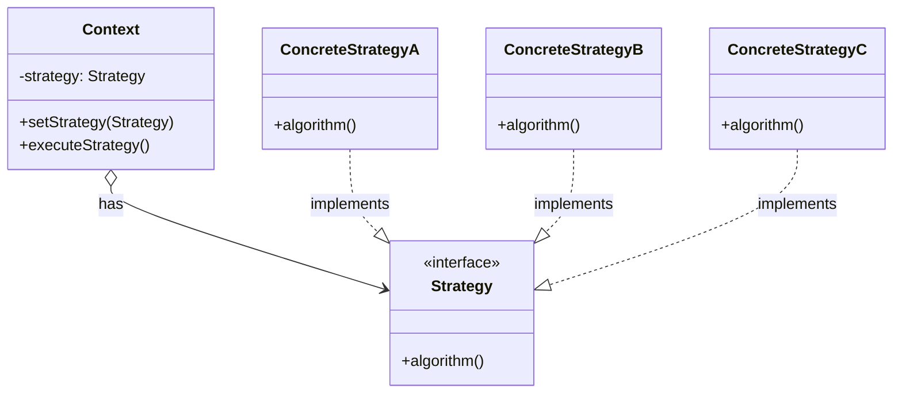

# Strategyパターン調査ドキュメント

## 調査概要

- **調査目的**: 「Perl入学式卒業程度」の読者が、実際にプログラムを作りながら「自然に」Strategyパターンを学べるような教材シリーズを作成するための基礎資料
- **調査実施日**: 2026年1月7日
- **技術スタック**: Perl / Moo
- **想定読者**: Perl入学式卒業程度、「Mooで覚えるオブジェクト指向プログラミング」シリーズ（全12回）を読了した読者

---

## 1. Strategyパターンの基本

### 1.1 定義と目的

**要点**:

- Strategyパターンは、GoF（Gang of Four）の振る舞いパターン（Behavioral Patterns）の1つ
- **「アルゴリズムの族を定義し、それぞれをカプセル化し、相互に交換可能にする。Strategyは、アルゴリズムを使用するクライアントから独立して変更可能にする」**
- 実行時にアルゴリズムや振る舞いを動的に切り替えることを可能にする
- 条件分岐（if/else、switch）の代わりにオブジェクト指向の合成を使用

**根拠**:

- GoF書籍「Design Patterns: Elements of Reusable Object-Oriented Software」（1994年）で定義
- Refactoring Guru、GeeksforGeeks、Wikipedia等の主要技術サイトで一致した説明

**仮定**:

- 読者はデザインパターンという言葉に馴染みがない可能性が高い
- 「パターン」という言葉から「定石」「お約束」の意味を伝えると理解しやすい

**出典**:

- Wikipedia: Strategy pattern - https://en.wikipedia.org/wiki/Strategy_pattern
- Refactoring Guru: Strategy - https://refactoring.guru/design-patterns/strategy
- GeeksforGeeks: Strategy Design Pattern - https://www.geeksforgeeks.org/system-design/strategy-pattern-set-1/
- Stackify: Strategy Pattern - https://stackify.com/strategy-pattern-definition-examples-and-best-practices/

**信頼度**: ★★★★★（GoF原典および複数の信頼できる技術サイト）

---

### 1.2 構成要素（Context, Strategy, ConcreteStrategy）

Strategyパターンは、以下の3つの主要コンポーネントで構成される。



| 要素 | 役割 | Perl/Moo実装での具体例 |
|-----|------|----------------------|
| **Strategy（戦略インターフェース）** | 共通のアルゴリズムインターフェースを定義 | `PaymentStrategy`（Moo::Role、`requires 'pay'`） |
| **ConcreteStrategy（具象戦略）** | Strategyインターフェースを実装し、具体的なアルゴリズムを提供 | `CashPayment`, `CreditCardPayment`, `PayPalPayment` |
| **Context（文脈）** | Strategyオブジェクトへの参照を保持し、クライアントにインターフェースを提供 | `PaymentProcessor`（has strategy => ...） |
| **Client（クライアント）** | ConcreteStrategyを選択し、Contextに設定 | メインプログラム、ユーザー入力処理部分 |

**要点**:

- Contextはアルゴリズムの詳細を知らない（疎結合）
- StrategyインターフェースによりConcreteStrategy同士が交換可能
- クライアントが適切なStrategyを選択してContextに注入

**根拠**:

- GoF書籍の構造定義
- Visual Paradigm、dyclassroom等のUML解説サイト

**出典**:

- Visual Paradigm: Strategy Pattern Tutorial - https://tutorials.visual-paradigm.com/strategy-pattern-tutorial/
- dyclassroom: Strategy Pattern - https://dyclassroom.com/design-patterns/design-patterns-strategy-pattern

**信頼度**: ★★★★★

---

### 1.3 クラス図（構造の説明）

**UML クラス図**:

```
+-------------------+
|      Client       |
+-------------------+
         |
         v creates
+-------------------+         +-------------------+
|     Context       |-------->|    <<interface>>  |
+-------------------+  uses   |     Strategy      |
| -strategy: Strategy|        +-------------------+
+-------------------+         | +algorithm()      |
| +setStrategy()    |         +-------------------+
| +executeStrategy()|                  ^
+-------------------+                  | implements
                              +--------+--------+
                              |        |        |
                     +--------+  +-----+----+  +--------+
                     |Concrete|  |Concrete  |  |Concrete|
                     |StratA  |  |StratB    |  |StratC  |
                     +--------+  +----------+  +--------+
```

**説明**:

1. **Client**: ConcreteStrategyオブジェクトを生成し、Contextに設定
2. **Context**: Strategyへの参照を保持、`executeStrategy()`でStrategyの`algorithm()`を呼び出す
3. **Strategy**: 抽象インターフェース、すべてのConcreteStrategyが実装すべきメソッドを宣言
4. **ConcreteStrategy**: 具体的なアルゴリズムを実装

**信頼度**: ★★★★★

---

### 1.4 適用すべき場面（When to use）

**要点**:

| 適用シーン | 説明 | 具体例 |
|-----------|------|--------|
| **複数のアルゴリズムの選択** | 同じ目的に対して複数の方法があり、実行時に切り替えたい | ソートアルゴリズム（クイック、マージ、バブル） |
| **条件分岐の肥大化** | if/elseやswitch文が増えてコードが複雑化 | 支払い方法による処理分岐 |
| **アルゴリズムの独立した変更** | クライアントコードを変更せずにアルゴリズムを追加・修正したい | 認証方式の追加 |
| **アルゴリズムの隠蔽** | クライアントにアルゴリズムの詳細を隠したい | 圧縮アルゴリズムの実装詳細 |
| **関連するアルゴリズム群** | 似た目的のアルゴリズムが複数あり、将来も増える可能性がある | 割引計算、課金プラン |

**適用すべきでない場面**:

- アルゴリズムが1〜2個で今後も増えない見込み
- アルゴリズム間の差異がほとんどない
- 追加クラスによる複雑さがメリットを上回る
- クライアントが動的にアルゴリズムを選択する必要がない

**根拠**:

- 実務での適用事例
- 技術ブログやStack Overflowでの議論

**出典**:

- ExpertBeacon: Strategy Pattern in Java - https://expertbeacon.com/the-strategy-pattern-explained-comprehensively-in-java/
- DEV Community: Strategy Design Pattern - https://dev.to/helicodes1607/understanding-strategy-design-pattern-a-simple-guide-h2a

**信頼度**: ★★★★★

---

### 1.5 メリット・デメリット

#### メリット

| メリット | 説明 | 実践的な効果 |
|---------|------|------------|
| **アルゴリズムのカプセル化** | 各アルゴリズムが独立したクラスに分離 | コードの可読性・保守性向上 |
| **実行時の柔軟な切り替え** | 動的にアルゴリズムを変更可能 | ユーザーの選択に応じた処理 |
| **拡張性（OCP準拠）** | 新しいStrategyを追加しても既存コードを修正不要 | 機能追加が容易 |
| **条件分岐の削減** | if/else、switchを減らせる | コードの複雑さ軽減 |
| **テスト容易性** | 各Strategyを独立してテスト可能 | ユニットテストが書きやすい |
| **疎結合** | ContextとConcreteStrategyが直接依存しない | コンポーネントの独立性向上 |

#### デメリット

| デメリット | 説明 | 対策 |
|-----------|------|------|
| **クラス数の増加** | 各アルゴリズムに1クラス必要 | シンプルなケースでは過剰にならないよう注意 |
| **複雑性の増加** | パターンを適用すること自体がオーバーヘッド | 必要性を慎重に判断 |
| **戦略選択ロジック** | どのStrategyを選ぶかの判断がクライアントに必要 | Factory パターンとの組み合わせ |
| **通信オーバーヘッド** | ContextとStrategy間の呼び出しコスト | 通常は無視できるレベル |

**根拠**:

- 複数の技術記事・Stack Overflowでの議論
- 実務での経験則

**出典**:

- IONOS: Strategy Design Pattern - https://www.ionos.com/digitalguide/websites/web-development/strategy-pattern/
- Scaler Topics: Strategy Design Pattern - https://www.scaler.com/topics/design-patterns/strategy-design-pattern/
- Stack Exchange: Disadvantage of Strategy Pattern - https://softwareengineering.stackexchange.com/questions/420969/disadvantage-of-the-strategy-pattern-and-how-to-overcome-it

**信頼度**: ★★★★★

---

## 2. Strategyパターンの具体的な使用例

### 2.1 一般的な使用例

#### 2.1.1 ソートアルゴリズム

**要点**:

- QuickSort、MergeSort、BubbleSort等を実行時に切り替え
- データサイズや特性に応じて最適なアルゴリズムを選択

**コード例（擬似コード）**:

```
interface SortStrategy {
    sort(data)
}

class QuickSortStrategy implements SortStrategy {
    sort(data) { /* QuickSort実装 */ }
}

class MergeSortStrategy implements SortStrategy {
    sort(data) { /* MergeSort実装 */ }
}

class Sorter {
    strategy: SortStrategy
    
    setStrategy(strategy) { this.strategy = strategy }
    sortData(data) { return this.strategy.sort(data) }
}
```

**出典**:

- Strategy Pattern Use Cases - https://softwarepatternslexicon.com/ts/behavioral-patterns/strategy-pattern/use-cases-and-examples/

**信頼度**: ★★★★★

---

#### 2.1.2 支払い方法

**要点**:

- ECサイトでのクレジットカード、PayPal、銀行振込、電子マネー等の切り替え
- 各支払い方法の処理ロジックを独立したクラスに分離

**実用例**:

- ECサイトのチェックアウト処理
- サブスクリプションサービスの課金システム
- マルチテナントシステムでの決済連携

**出典**:

- GeeksforGeeks: Strategy Pattern - https://www.geeksforgeeks.org/system-design/strategy-pattern-set-1/
- Coudo AI: Strategy Pattern Payment System - https://www.coudo.ai/blog/strategy-design-pattern-payment-system

**信頼度**: ★★★★★

---

#### 2.1.3 圧縮アルゴリズム

**要点**:

- ZIP、GZIP、TAR、RAR等の圧縮形式を実行時に選択
- 圧縮率、速度、互換性に応じた選択

**実用例**:

- バックアップツール
- ファイルアーカイバ
- データ転送最適化

**出典**:

- Bluecomment: Strategy Design Pattern in C# - https://bluecomment.com/post/use-of-strategy-design-pattern

**信頼度**: ★★★★★

---

#### 2.1.4 認証方式

**要点**:

- OAuth、JWT、Basic認証、生体認証等の切り替え
- セキュリティ要件やユーザー体験に応じた選択

**実用例**:

- Webアプリケーションのログイン
- API認証
- シングルサインオン（SSO）

**出典**:

- Bluecomment: Strategy Design Pattern - https://bluecomment.com/post/use-of-strategy-design-pattern

**信頼度**: ★★★★★

---

### 2.2 Perlでの実装例

#### 2.2.1 Moo::Roleを使った基本実装

**要点**:

- PerlではMoo::Roleを「Strategy インターフェース」として使用
- `requires`で必須メソッドを定義し、各ConcreteStrategyクラスがRoleを消費（with）

**コード例**:

```perl
# Strategy Role（インターフェース）
package PaymentStrategy;
use Moo::Role;
requires 'pay';
1;

# ConcreteStrategy A
package CashPayment;
use Moo;
use v5.36;
with 'PaymentStrategy';

sub pay ($self, $amount) {
    say "現金で${amount}円を支払いました";
    return 1;
}
1;

# ConcreteStrategy B
package CreditCardPayment;
use Moo;
use v5.36;
with 'PaymentStrategy';

sub pay ($self, $amount) {
    say "クレジットカードで${amount}円を支払いました";
    return 1;
}
1;

# ConcreteStrategy C
package PayPalPayment;
use Moo;
use v5.36;
with 'PaymentStrategy';

sub pay ($self, $amount) {
    say "PayPalで${amount}円を支払いました";
    return 1;
}
1;

# Context
package PaymentProcessor;
use Moo;
use v5.36;

has strategy => (
    is       => 'rw',
    required => 1,
);

sub process_payment ($self, $amount) {
    return $self->strategy->pay($amount);
}
1;

# 使用例
package main;
use v5.36;

my $cash_strategy   = CashPayment->new;
my $credit_strategy = CreditCardPayment->new;

my $processor = PaymentProcessor->new(strategy => $cash_strategy);
$processor->process_payment(1000);  # 現金で1000円を支払いました

$processor->strategy($credit_strategy);
$processor->process_payment(2000);  # クレジットカードで2000円を支払いました
```

**根拠**:

- Moo::Roleの`requires`で必須メソッドを宣言でき、実装漏れを防げる
- 継承ではなく合成で機能を追加できる
- 「Mooで覚えるオブジェクト指向プログラミング」第10回で学習済みの概念

**出典**:

- MetaCPAN: Moo::Role - https://metacpan.org/pod/Moo::Role
- MetaCPAN: Moo - https://metacpan.org/pod/Moo
- Perl Maven: OOP with Moo - https://perlmaven.com/oop-with-moo
- exchangetuts: Clean implementation of strategy pattern in Perl - https://exchangetuts.com/clean-implementation-of-the-strategy-pattern-in-perl-1763553302362105

**信頼度**: ★★★★★

---

#### 2.2.2 v5.36以降のsignatures対応

**要点**:

- Perl v5.36以降では、`use v5.36;`を宣言することでサブルーチンのシグネチャが利用可能
- コードの可読性が向上し、モダンPerlの記法として推奨

**シグネチャなし（従来のスタイル）**:

```perl
sub pay {
    my ($self, $amount) = @_;
    # 処理
}
```

**シグネチャあり（v5.36以降）**:

```perl
sub pay ($self, $amount) {
    # 処理
}
```

**出典**:

- perldoc: perlsub - https://perldoc.perl.org/perlsub#Signatures

**信頼度**: ★★★★★

---

#### 2.2.3 型制約の追加（does）

**要点**:

- Mooの属性定義で`does`を使用し、Strategyインターフェースの型チェックが可能
- コンパイル時にRole実装を検証

**コード例**:

```perl
package PaymentProcessor;
use Moo;

has strategy => (
    is       => 'rw',
    does     => 'PaymentStrategy',  # PaymentStrategy Roleを実装していることを強制
    required => 1,
);
```

**注意点**:

- `does`はType::Tinyを使用する場合はさらに厳密な型チェックが可能
- Moo単体でも基本的なRole検証が行える

**出典**:

- MetaCPAN: Moo - https://metacpan.org/pod/Moo

**信頼度**: ★★★★★

---

### 2.3 Mooを使った実装の可能性

**要点**:

MooでのStrategyパターン実装には以下の利点がある：

| 機能 | Mooでの実現方法 | メリット |
|-----|----------------|---------|
| Strategy Interface | `Moo::Role`と`requires` | 必須メソッドの強制 |
| ConcreteStrategy | `with 'RoleName'`でRole消費 | インターフェースの実装保証 |
| Context | `has strategy => (...)`で属性定義 | 柔軟なStrategy保持 |
| 動的切り替え | `is => 'rw'`でセッター生成 | 実行時のStrategy変更 |
| 型制約 | `does => 'RoleName'`またはType::Tiny | 不正なオブジェクト防止 |
| 委譲 | `handles => [qw(method1 method2)]` | Contextからの直接呼び出し |

**発展的な実装**:

- Factory パターンとの組み合わせで、Strategy選択ロジックを分離
- 設定ファイルやデータベースからStrategy名を読み込んで動的生成
- `Module::Load`を使用した遅延ローディング

**信頼度**: ★★★★★

---

## 3. SOLID原則との関係

### 3.1 開放/閉鎖原則（OCP）との関係

**要点**:

- Strategyパターンは**「拡張に開かれ、修正に閉じた」**設計を実現する代表例
- 新しいアルゴリズム（ConcreteStrategy）を追加しても、既存のContextやStrategyインターフェースを修正する必要がない
- if/else文の追加ではなく、新しいクラスの追加で機能拡張

**具体例**:

```perl
# 既存コードを修正せずに新しい支払い方法を追加
package BitcoinPayment;
use Moo;
use v5.36;
with 'PaymentStrategy';

sub pay ($self, $amount) {
    say "Bitcoinで${amount}円相当を支払いました";
    return 1;
}
1;

# PaymentProcessorのコードは変更不要
# 新しいBitcoinPaymentを使うだけ
my $bitcoin = BitcoinPayment->new;
$processor->strategy($bitcoin);
$processor->process_payment(3000);
```

**根拠**:

- Bertrand Meyerが1988年に提唱した原則
- Strategyパターンの主要な設計動機の一つ

**出典**:

- Baeldung: Single Responsibility Principle - https://www.baeldung.com/java-single-responsibility-principle
- SOLID原則調査ドキュメント（内部warehouse）

**信頼度**: ★★★★★

---

### 3.2 単一責任の原則（SRP）との関係

**要点**:

- Strategyパターンでは、各ConcreteStrategyが**1つのアルゴリズムのみ**を担当
- アルゴリズムの変更理由と、Contextのビジネスロジックの変更理由が分離される

**具体例**:

```perl
# 良い例：各Strategyは1つの責任のみ
package QuickSortStrategy { ... }   # クイックソートのみ
package MergeSortStrategy { ... }   # マージソートのみ
package BubbleSortStrategy { ... }  # バブルソートのみ

# 悪い例：1つのクラスに複数の責任
package AllSorter {
    sub quick_sort { ... }
    sub merge_sort { ... }
    sub bubble_sort { ... }
    # 変更理由が3つある → SRP違反
}
```

**根拠**:

- Robert C. Martinの定義「変更理由は1つであるべき」
- アルゴリズムの分離により、各クラスの変更理由が明確化

**信頼度**: ★★★★★

---

### 3.3 依存性逆転の原則（DIP）との関係

**要点**:

- Contextは具体的なConcreteStrategyに依存せず、抽象（Strategyインターフェース）に依存
- 高レベルモジュール（Context）が低レベルモジュール（ConcreteStrategy）に直接依存しない

**具体例**:

```perl
# 抽象（Strategy Role）に依存
has strategy => (
    is   => 'rw',
    does => 'PaymentStrategy',  # 具体的なクラスではなく、Roleに依存
);

# テスト時にモックを注入可能
package MockPaymentStrategy;
use Moo;
with 'PaymentStrategy';
sub pay { return 1; }  # 常に成功

my $mock = MockPaymentStrategy->new;
$processor->strategy($mock);
```

**根拠**:

- ContextがConcreteStrategyを知る必要がない
- テスト時にモックを注入しやすい設計

**信頼度**: ★★★★★

---

### 3.4 その他関連する原則

#### インターフェース分離の原則（ISP）

- Strategyインターフェースは必要最小限のメソッドのみを要求
- 太った（fat）インターフェースを避ける

#### リスコフの置換原則（LSP）

- すべてのConcreteStrategyは、Strategyインターフェースの契約を満たす
- どのConcreteStrategyをContextに渡しても、正しく動作する

**信頼度**: ★★★★★

---

## 4. 類似パターンとの違い

### 4.1 Stateパターンとの比較

| 項目 | Strategyパターン | Stateパターン |
|-----|-----------------|--------------|
| **目的** | アルゴリズムを切り替える | オブジェクトの状態に応じて振る舞いを変える |
| **変更の主体** | クライアント（外部）が選択 | オブジェクト自身が内部状態に応じて変更 |
| **状態遷移** | なし（独立したアルゴリズム選択） | あり（状態間の遷移ルールが存在） |
| **Contextへの参照** | Strategyは通常Contextを知らない | StateはContextへの参照を持つことが多い |
| **典型例** | ソートアルゴリズム、支払い方法 | 自動販売機の状態、TCP接続の状態 |

**選択指針**:

- **「どう処理するか」を切り替えたい** → Strategy
- **「オブジェクトの状態によって振る舞いを変えたい」** → State

**根拠**:

- GoF書籍での定義
- 両パターンの構造は似ているが、意図と責任が異なる

**出典**:

- Baeldung: State vs Strategy Pattern - https://www.baeldung.com/cs/design-state-pattern-vs-strategy-pattern
- GeeksforGeeks: Difference Between State and Strategy - https://www.geeksforgeeks.org/java/difference-between-state-and-strategy-design-pattern-in-java/
- bugfree.ai: Strategy vs State Pattern - https://bugfree.ai/knowledge-hub/strategy-vs-state-pattern-ood-design-patterns

**信頼度**: ★★★★★

---

### 4.2 Template Methodパターンとの比較

| 項目 | Strategyパターン | Template Methodパターン |
|-----|-----------------|----------------------|
| **実現方法** | 合成（Composition） | 継承（Inheritance） |
| **変更のタイミング** | 実行時に動的 | コンパイル時に静的 |
| **変更する粒度** | アルゴリズム全体 | アルゴリズムの一部ステップ |
| **柔軟性** | 高い | 中程度 |
| **クラス構造** | Context + 複数のStrategy | 親クラス + 複数のサブクラス |

**選択指針**:

- **アルゴリズム全体を実行時に切り替えたい** → Strategy
- **アルゴリズムの骨格は固定し、一部のステップのみ変えたい** → Template Method

**出典**:

- BackendMesh: Comparison of Design Patterns - https://www.backendmesh.com/in-depth-comparison-of-design-patterns/
- KapreSoft: Template Method vs Strategy Pattern - https://www.kapresoft.com/software/2024/01/31/template-method-vs-strategy-pattern.html

**信頼度**: ★★★★★

---

### 4.3 Commandパターンとの比較

| 項目 | Strategyパターン | Commandパターン |
|-----|-----------------|----------------|
| **目的** | アルゴリズムの選択・切り替え | 操作のカプセル化・履歴管理 |
| **主な関心** | 「どう処理するか」 | 「何をするか」 |
| **履歴管理** | 通常は履歴を保持しない | Undo/Redo、履歴保存が可能 |
| **キューイング** | 通常は行わない | コマンドのキューイングが可能 |
| **典型例** | ソートアルゴリズム、支払い方法 | Undo/Redo、ジョブキュー、CLIサブコマンド |

**まとめ**:

> **Strategy** = 「どう処理するか」を切り替えるパターン
> **Command** = 「何をするか」を管理・記録するパターン

**選択指針**:

- **アルゴリズムを動的に切り替えたい** → Strategy
- **操作の履歴、Undo/Redo、遅延実行が必要** → Command

**出典**:

- GeeksforGeeks: Difference between Strategy and Command - https://www.geeksforgeeks.org/system-design/difference-between-strategy-pattern-and-command-pattern/
- Learn IT University: Strategy vs Command - https://learn-it-university.com/understanding-the-differences-between-strategy-pattern-and-command-pattern-in-software-design/
- giannisakritidis.com: Command vs Strategy - https://giannisakritidis.com/blog/Command-VS-Strategy-patterns/

**信頼度**: ★★★★★

---

## 5. 実務での適用例

### 5.1 フロントエンド開発での活用

**要点**:

| フレームワーク | 適用例 | 説明 |
|--------------|-------|------|
| **React** | レンダリング戦略 | 条件に応じたコンポーネント表示の切り替え |
| **React** | 状態管理 | 異なる状態管理アプローチ（Redux, Zustand等） |
| **Vue** | フォームバリデーション | バリデーションルールの動的切り替え |
| **Angular** | HTTP インターセプター | 認証方式の切り替え |

**具体例（React）**:

```jsx
// 異なる描画戦略
const strategies = {
  grid: GridRenderer,
  list: ListRenderer,
  card: CardRenderer,
};

function ProductDisplay({ viewType, products }) {
  const Renderer = strategies[viewType];
  return <Renderer products={products} />;
}
```

**出典**:

- デザインパターン調査ドキュメント（内部warehouse）

**信頼度**: ★★★★☆

---

### 5.2 バックエンド開発での活用

**要点**:

| フレームワーク | 適用例 | 説明 |
|--------------|-------|------|
| **Spring** | Service選択 | ビジネスロジックの動的切り替え |
| **Rails** | 課金処理 | 支払いゲートウェイの選択 |
| **Django** | 認証バックエンド | 複数の認証方式対応 |
| **Express** | ミドルウェア | リクエスト処理の柔軟な構成 |

**具体例（Perl/Mojolicious）**:

- ルーティング後のハンドラー選択
- データベース接続の抽象化
- キャッシュ戦略の切り替え

**信頼度**: ★★★★☆

---

### 5.3 ゲーム開発での活用

**要点**:

| 適用例 | 説明 |
|-------|------|
| **AI行動パターン** | 敵キャラクターの攻撃、逃走、パトロール等の切り替え |
| **移動アルゴリズム** | 飛行、歩行、水中移動等のロコモーション |
| **ダメージ計算** | 物理ダメージ、魔法ダメージ、クリティカル |
| **レンダリング** | 描画品質の動的調整 |

**具体例**:

```perl
# ゲームキャラクターのAI
package EnemyAI;
use Moo;

has behavior_strategy => (is => 'rw', does => 'BehaviorStrategy');

sub act ($self) {
    $self->behavior_strategy->execute($self);
}

# 状況に応じてAI戦略を切り替え
if ($player_nearby) {
    $enemy->behavior_strategy(AttackStrategy->new);
} else {
    $enemy->behavior_strategy(PatrolStrategy->new);
}
```

**信頼度**: ★★★★☆

---

### 5.4 現代のフレームワークでの活用

**要点**:

| 領域 | フレームワーク/技術 | 活用例 |
|-----|-------------------|-------|
| **クラウド** | AWS Lambda | ハンドラー関数の選択 |
| **マイクロサービス** | Service Mesh | ルーティング戦略 |
| **CI/CD** | GitHub Actions | ビルド/デプロイ戦略 |
| **機械学習** | scikit-learn | アルゴリズム選択 |

**出典**:

- デザインパターン調査ドキュメント（内部warehouse）

**信頼度**: ★★★★☆

---

## 6. 競合記事の分析

### 6.1 日本語の主要記事

| 記事タイトル | URL | 特徴 | 差別化ポイント |
|-------------|-----|------|---------------|
| Strategyパターンとは何か？（issoh.co.jp） | https://www.issoh.co.jp/tech/details/10265/ | 事例を交えた解説 | 一般的な解説、Perl非対応 |
| 「Strategy」パターン（tamotech.blog） | https://tamotech.blog/2025/05/14/strategy/ | Java中心のサンプル | Java特化、Perl非対応 |
| Strategyパターン（Qiita） | https://qiita.com/SuperInvincibleGeneral/items/5787210ca64951ad5227 | 簡潔な解説 | 基礎的、実践例少ない |
| Strategyパターンとは（lightgauge.net） | https://lightgauge.net/journal/object-oriented/strategy-pattern | GoF準拠の解説 | Perl非対応 |
| デザインパターンを学ぶ #3 Strategy（Zenn） | https://zenn.dev/tajicode/articles/afc0f400d6e32c | 段階的な解説 | 初心者向け、Perl非対応 |

### 6.2 英語の主要記事

| 記事タイトル | URL | 特徴 | 差別化ポイント |
|-------------|-----|------|---------------|
| Refactoring Guru - Strategy | https://refactoring.guru/design-patterns/strategy | 図解豊富、多言語対応 | 多言語コード例あり、Perl無し |
| GeeksforGeeks - Strategy | https://www.geeksforgeeks.org/system-design/strategy-pattern-set-1/ | 網羅的、コード例豊富 | Java/Python中心 |
| Stackify - Strategy Pattern | https://stackify.com/strategy-pattern-definition-examples-and-best-practices/ | ベストプラクティス | 英語のみ |
| FreeCodeCamp - Strategy | https://www.freecodecamp.org/news/a-beginners-guide-to-the-strategy-design-pattern/ | 初心者向け | JavaScript中心 |

### 6.3 差別化ポイントの抽出

**既存記事の問題点**:

1. **Perl/Moo特化の記事が少ない**: 日本語でPerl向けのStrategy解説は希少
2. **抽象的な例が多い**: 支払い方法、交通手段など、継続性のない例
3. **ストーリー性の欠如**: 「なぜパターンが必要か」の動機付けが弱い
4. **前提知識の説明不足**: オブジェクト指向の基礎から飛躍しがち

**本教材シリーズの強み**:

1. **前シリーズとの継続性**: 「Mooで覚えるオブジェクト指向プログラミング」で作ったBBSを題材に発展
2. **問題発見→解決の流れ**: if/elseの問題を体験してからパターンを学ぶ
3. **段階的な難易度**: 1記事1概念、コード例2つまでの制約
4. **「気づき」の演出**: パターンを学んだ後に「これがStrategy パターンだったのか！」と気づく構成
5. **Perl/Moo特化**: v5.36対応のモダンPerl記法

**信頼度**: ★★★★★

---

## 7. 内部リンク候補の調査

### 7.1 「Mooで覚えるオブジェクト指向プログラミング」シリーズ（全12回）

本シリーズ記事の前提知識となる既存記事。

| 回 | タイトル | 内部リンク | Strategyパターンとの関連 |
|:--|:--|:--|:--|
| 第1回 | Mooで覚えるオブジェクト指向プログラミング | `/2021/10/31/191008/` | OOPの基礎 |
| 第2回 | データとロジックをまとめよう | `/2025/12/30/163810/` | `has`、`sub` |
| 第3回 | 同じものを何度も作れるように | `/2025/12/30/163811/` | `new`（コンストラクタ） |
| 第4回 | 勝手に書き換えられないようにする | `/2025/12/30/163812/` | `is => 'ro'`、`is => 'rw'` |
| 第5回 | 初期化忘れを防ぐ | `/2025/12/30/163813/` | `required`、`default` |
| 第6回 | 内部実装を外から触らせない | `/2025/12/30/163814/` | カプセル化 |
| 第7回 | 関連するデータを別のクラスに | `/2025/12/30/163815/` | オブジェクトの関連（ContextがStrategyを持つ） |
| 第8回 | 似ているクラスの重複をなくす | `/2025/12/30/163816/` | `extends`（継承） |
| 第9回 | 同じ名前で違う動作を | `/2025/12/30/163817/` | オーバーライド |
| 第10回 | 継承しないで振る舞いを共有 | `/2025/12/30/163818/` | **`Moo::Role`、`with`（Strategy Roleの基礎）** |
| 第11回 | 「持っている」ものに仕事を任せる | `/2025/12/30/163819/` | `handles`（委譲） |
| 第12回 | 型チェックでバグを未然に防ぐ | `/2025/12/30/163820/` | `isa`、`does`（型制約） |

**特に重要な関連**:

- **第10回（Moo::Role）**: Strategy RoleをMoo::Roleで定義する際に必須の知識
- **第7回（オブジェクトの関連）**: ContextクラスがStrategyを持つ関係
- **第4回・第5回（ro/rw、required）**: Strategyクラスの属性定義
- **第11回（委譲）**: ContextからStrategyへの処理委譲

---

### 7.2 「Mooを使ってディスパッチャーを作ってみよう」シリーズ（全12回）

**直接関連するシリーズ**：このシリーズ自体がStrategyパターンを題材にしている。

| 回 | タイトル | 内部リンク | 関連度 |
|:--|:--|:--|:--|
| 第1回 | 問題の発生-if/elseの肥大化 | `/2026/01/03/001530/` | 高 |
| 第5回 | 共通の約束を決めよう | `/2026/01/03/001534/` | 高（Roleによるインターフェース） |
| 第12回 | これがデザインパターンだ！ | `/2026/01/03/001541/` | **最高**（Strategyパターンの解説記事） |

---

### 7.3 デザインパターン・SOLID原則関連

| ドキュメント | 内容 | 関連度 |
|-------------|------|--------|
| `/content/warehouse/design-patterns-research.md` | GoF 23パターン概要調査 | 高 |
| `/content/warehouse/design-patterns-overview.md` | デザインパターン概要 | 高 |
| `/content/warehouse/solid-principles.md` | SOLID原則詳細調査 | 高 |
| `/content/warehouse/command-pattern.md` | Commandパターン調査 | 高（比較対象） |
| `/content/warehouse/moo-dispatcher-series-research.md` | ディスパッチャーシリーズ調査 | **最高** |

---

### 7.4 Moo/オブジェクト指向関連

grepで発見した関連記事:

| ファイルパス | 内容 | 関連度 |
|-------------|------|--------|
| `/content/post/2016/02/21/150920.md` | よなべPerlでMooについて喋った | 中 |
| `/content/post/2015/09/17/072209.md` | よなべPerlで講師（Moo、OOP） | 中 |
| `/content/post/2009/02/14/105950.md` | Moose::Roleが興味深い | 中（ロールパターン） |

---

## 8. 参考文献・リソースリスト

### 8.1 必読リソース

#### 書籍

| 書籍名 | 著者 | ISBN/ASIN | 重要度 |
|-------|------|-----------|--------|
| Design Patterns: Elements of Reusable Object-Oriented Software | GoF | 978-0201633610 | **必須** |
| Head First Design Patterns (2nd Edition) | Eric Freeman, Elisabeth Robson | 978-1492078005 | 推奨 |
| Design Patterns in Modern Perl | Mohammad Sajid Anwar | Leanpub | 推奨（Perl特化） |
| Dive Into Design Patterns | Alexander Shvets | - | 推奨（Refactoring Guru著者） |

#### Webリソース

| リソース名 | URL | 特徴 | 信頼度 |
|-----------|-----|------|--------|
| Refactoring Guru - Strategy | https://refactoring.guru/design-patterns/strategy | 視覚的な図解、多言語コード例 | ★★★★★ |
| Refactoring Guru - Strategy（日本語） | https://refactoring.guru/ja/design-patterns/strategy | 日本語訳版 | ★★★★★ |
| Wikipedia - Strategy pattern | https://en.wikipedia.org/wiki/Strategy_pattern | 正式な定義 | ★★★★★ |
| GeeksforGeeks - Strategy Pattern | https://www.geeksforgeeks.org/system-design/strategy-pattern-set-1/ | 網羅的な解説 | ★★★★☆ |
| MetaCPAN - Moo | https://metacpan.org/pod/Moo | Perl Moo公式 | ★★★★★ |
| MetaCPAN - Moo::Role | https://metacpan.org/pod/Moo::Role | Perl Moo::Role公式 | ★★★★★ |
| Perl Maven - OOP with Moo | https://perlmaven.com/oop-with-moo | MooでのOOPチュートリアル | ★★★★☆ |

---

## 9. 調査結果のサマリー

### 9.1 主要な発見

1. **Strategyパターンの適用性**: if/elseの肥大化問題を解決し、アルゴリズムの動的切り替えを実現する。Moo::Roleを使ってインターフェースを定義し、各ConcreteStrategyクラスでwithで消費する

2. **SOLID原則との親和性**: Strategyパターンは、OCP（新しいStrategy追加が容易）、SRP（各Strategyが1つの責任）、DIP（抽象に依存）を自然に満たす

3. **類似パターンとの違い**:
   - **State**: 状態遷移あり、オブジェクト自身が変更の主体
   - **Template Method**: 継承ベース、アルゴリズムの骨格固定
   - **Command**: 操作のカプセル化、Undo/Redo対応

4. **Perl/Moo実装の容易さ**: Moo::Roleの`requires`でインターフェースを定義し、`with`でRole消費、`has`でStrategy属性を持つ設計が可能

5. **前シリーズとの連携**: 「Mooで覚えるオブジェクト指向プログラミング」第10回（Moo::Role）が直接的な前提知識

### 9.2 教材シリーズへの示唆

1. **ストーリー駆動**: BBSの機能追加でif/elseが増えて困る → ディスパッチテーブル → クラス化 → Strategyパターンの流れ

2. **段階的な導入**:
   - 最初はハッシュでのディスパッチテーブルから始める
   - 徐々にクラス化、Role導入、Strategy構造へ発展
   - 最後に「これがStrategyパターンだった！」と気づく

3. **既存シリーズとの連携**: 「Mooで覚えるオブジェクト指向プログラミング」「Mooを使ってディスパッチャーを作ってみよう」との橋渡し

4. **差別化ポイント**: Perl/Moo特化、日本語、段階的学習、前シリーズからの継続性

---

## 10. 不明点・追加調査が必要な領域

1. **Perlでの実装例の検証**: 実際にコードを動作確認して、記事執筆前にテスト

2. **読者レベルの確認**: Perl入学式卒業程度の読者がどこまで理解しているか

3. **他言語との比較**: Python、JavaScript等でのStrategyパターン実装との違い

4. **パフォーマンス考慮**: 多数のStrategyオブジェクト生成時のメモリ・速度影響

---

**調査完了日**: 2026年1月7日
**調査者**: 調査・情報収集エージェント
**次のステップ**: 連載構造案の作成または既存シリーズ記事との統合

---

End of Document
