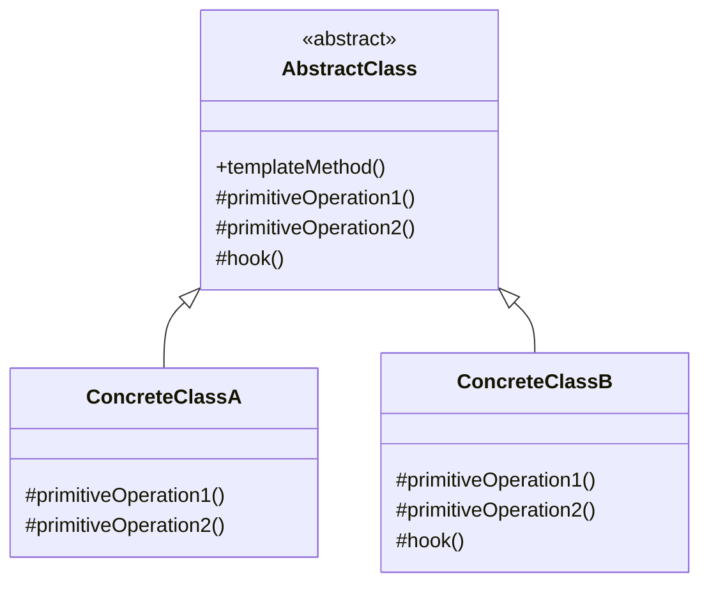

# Template Methodパターン調査ドキュメント

## 調査概要

- **調査目的**: 「Mooで覚えるオブジェクト指向プログラミング」シリーズを読了した読者が、Template Methodパターンを学べる教材作成のための基礎資料
- **調査実施日**: 2026年1月14日
- **技術スタック**: Perl v5.36以降 / Moo
- **想定読者**: Perl入学式卒業したばかりの入門者、「Mooで覚えるオブジェクト指向プログラミング」シリーズを読了した人
- **難易度評価**: 3/5（継承、メソッドオーバーライドの理解が必要）
- **前提知識**: 「Mooで覚えるオブジェクト指向プログラミング」シリーズ（全12回）を読了済み

---

## 1. Template Methodパターンの基礎

### 1.1 定義と目的

**要点**:

- Template Methodパターンは、GoF（Gang of Four）の**振る舞いパターン（Behavioral Patterns）**の1つ
- **「アルゴリズムの骨格をスーパークラスで定義し、その一部のステップをサブクラスに委ねる」**
- 処理全体の流れ（テンプレート）は固定しつつ、一部の具体的な処理だけをサブクラスでカスタマイズ可能にする
- 「流れは固定、中身は可変」という枠組みにより、共通部分と差異部分を明確に分離できる

**根拠**:

- GoF書籍「Design Patterns: Elements of Reusable Object-Oriented Software」（1994年）で定義
- Refactoring Guru、GeeksforGeeks、Wikipedia等の主要技術サイトで一致した説明

**仮定**:

- 読者は「Mooで覚えるオブジェクト指向プログラミング」シリーズで継承（`extends`）とオーバーライドを学んでいる
- 「Mooを使ってディスパッチャーを作ってみよう」シリーズでStrategyパターンを学んでいる可能性が高い

**出典**:

- Wikipedia: Template method pattern - https://en.wikipedia.org/wiki/Template_method_pattern
- Refactoring Guru: Template Method - https://refactoring.guru/design-patterns/template-method
- GeeksforGeeks: Template Method Design Pattern - https://www.geeksforgeeks.org/system-design/template-method-design-pattern/
- Qiita: Template Methodパターン - https://qiita.com/katsuya_tanaka/items/b02b7cec12d0b2396c80

**信頼度**: ★★★★★（GoF原典および複数の信頼できる技術サイト）

---

### 1.2 GoFパターンにおける位置づけ

**要点**:

Template Methodは、GoFの23パターンのうち**振る舞いパターン（Behavioral Patterns）11種類**の1つです。

| パターン分類 | 含まれるパターン例 |
|------------|----------------|
| **生成パターン（Creational）** | Singleton, Factory Method, Abstract Factory, Builder, Prototype |
| **構造パターン（Structural）** | Adapter, Bridge, Composite, Decorator, Facade, Flyweight, Proxy |
| **振る舞いパターン（Behavioral）** | Strategy, Template Method, Observer, Command, State, Iterator, Mediator, Memento, Visitor, Chain of Responsibility, Interpreter |

**根拠**:

- GoFの分類体系で明確に定義されている
- 振る舞いパターンはオブジェクト間の責任分担と通信に関するパターン

**出典**:

- 内部warehouse: `/content/warehouse/design-patterns-overview.md`
- GeeksforGeeks: Behavioral Design Patterns - https://www.geeksforgeeks.org/system-design/behavioral-design-patterns/

**信頼度**: ★★★★★

---

### 1.3 構成要素の説明

**UML クラス図**:



**テキスト版UML**:

```
+----------------------------+
|   <<abstract>>             |
|     AbstractClass          |
+----------------------------+
| +templateMethod()          | ← テンプレートメソッド（流れを統制）
| #primitiveOperation1()     | ← 抽象メソッド（サブクラスで実装必須）
| #primitiveOperation2()     | ← 抽象メソッド（サブクラスで実装必須）
| #hook()                    | ← フックメソッド（オプション）
+----------------------------+
            ^
            |
    +-------+-------+
    |               |
+----------------+  +----------------+
| ConcreteClassA |  | ConcreteClassB |
+----------------+  +----------------+
| #primitiveOp1()|  | #primitiveOp1()|
| #primitiveOp2()|  | #primitiveOp2()|
+----------------+  | #hook()        |
                    +----------------+
```

| 要素 | 役割 | Perl/Moo実装での具体例 |
|-----|------|----------------------|
| **AbstractClass（抽象クラス）** | テンプレートメソッドを定義し、アルゴリズムの骨格を提供 | `DataProcessor`（基底クラス、`process`メソッドを定義） |
| **templateMethod** | アルゴリズム全体の流れを定義。各ステップを呼び出す | `process()` メソッド |
| **primitiveOperation（抽象メソッド）** | サブクラスで必ず実装すべきステップ | `_extract()`, `_transform()` |
| **hook（フックメソッド）** | デフォルト実装を持ち、必要に応じてサブクラスでオーバーライド可能 | `_validate()` |
| **ConcreteClass（具象クラス）** | 抽象メソッドを実装し、具体的な処理を提供 | `CsvDataProcessor`, `JsonDataProcessor` |

**要点**:

- AbstractClassはテンプレートメソッド（`templateMethod`）でアルゴリズムの流れを定義
- テンプレートメソッドは「final」（オーバーライド不可）にするのが一般的
- primitiveOperationは抽象メソッドで、サブクラスで必ず実装
- hookはデフォルト実装を持つオプションのステップ
- ConcreteClassは必要なステップだけをオーバーライドして実装

**根拠**:

- GoF原典の構造定義
- Refactoring Guru、GeeksforGeeks等のUML解説

**出典**:

- Refactoring Guru: Template Method Structure - https://refactoring.guru/design-patterns/template-method
- GeeksforGeeks: Template Method Design Pattern - https://www.geeksforgeeks.org/system-design/template-method-design-pattern/

**信頼度**: ★★★★★

---

## 2. メリット・デメリット

### 2.1 メリット

| メリット | 説明 | 実践的な効果 |
|---------|------|------------|
| **コードの再利用性** | 共通のアルゴリズム骨格を1箇所にまとめられる | 重複コードの削減 |
| **一貫性の確保** | 処理全体の流れが統一される | 予測可能な振る舞い |
| **拡張性（OCP準拠）** | 新しい具象クラスを追加しても既存コードを修正不要 | 機能追加が容易 |
| **保守性の向上** | 共通ロジックの変更が1箇所で済む | バグ修正が容易 |
| **フレームワーク構築に最適** | 骨格を提供し、ユーザーがカスタマイズ | 拡張ポイントの明確化 |
| **テスト容易性** | 個々のステップを独立してテスト可能 | ユニットテストが書きやすい |

**根拠**:

- SOLID原則（特にOCP、DRY）との親和性
- 実務での拡張性・保守性の向上

**出典**:

- GeeksforGeeks: Template Method Design Pattern - https://www.geeksforgeeks.org/system-design/template-method-design-pattern/
- Zenn: デザインパターンを学ぶ #18 テンプレートメソッド - https://zenn.dev/tajicode/articles/2191428078f73d

**信頼度**: ★★★★★

---

### 2.2 デメリット

| デメリット | 説明 | 対策 |
|-----------|------|------|
| **継承の乱用リスク** | サブクラスが増えすぎると管理が困難 | 継承階層は2レベル以内に抑える |
| **柔軟性の制限** | アルゴリズムの流れ自体は変更できない | Strategyパターンとの使い分け検討 |
| **理解の難しさ** | サブクラスでどのメソッドが呼ばれるかを追跡する必要 | ドキュメント化、命名規則の統一 |
| **脆弱な基底クラス問題** | 親クラスの変更が全サブクラスに影響 | 基底クラスの設計を慎重に |
| **テスト困難性（複雑な場合）** | 親子クラス間の結合度が高い | 適切な責任分離 |

**根拠**:

- 過剰設計（オーバーエンジニアリング）のリスク
- 実務での経験則

**出典**:

- System Overflow: Template Method in Interviews: Common Questions and Pitfalls - https://www.systemoverflow.com/learn/behavioral-patterns/template-method-pattern/template-method-in-interviews-common-questions-and-pitfalls
- JavaNexus: Common Pitfalls When Implementing the Template Method Pattern - https://javanexus.com/blog/common-pitfalls-template-method-pattern

**信頼度**: ★★★★★

---

### 2.3 いつ使うべきか

**適用すべき場面**:

1. **アルゴリズムの骨格は共通だが、一部のステップが異なる場合**
   - データ処理パイプライン（読み込み → 変換 → 出力）
   - ドキュメント生成（データ取得 → フォーマット → 出力）

2. **処理の順序を固定したい場合**
   - テスト実行（setup → test → teardown）
   - ゲームのライフサイクル（initialize → play → end）

3. **フレームワークやライブラリを設計する場合**
   - 共通の骨格を提供し、ユーザーがカスタマイズ

4. **コードの重複を継承で解決したい場合**
   - 複数のクラスで同じ処理順序があるが、詳細が異なる

**根拠**:

- GoF原典での適用条件
- 実務でのユースケース

**出典**:

- GeeksforGeeks: Template Method Design Pattern - https://www.geeksforgeeks.org/system-design/template-method-design-pattern/

**信頼度**: ★★★★★

---

### 2.4 いつ使うべきでないか

**適用すべきでない場面**:

1. **アルゴリズムの流れ自体を実行時に変更したい場合**
   - → Strategyパターンを検討

2. **継承を避けたい設計方針の場合**
   - → 合成ベースのパターン（Strategy）を検討

3. **ステップの順序が固定できない場合**
   - → より柔軟なパターンを検討

4. **クラス階層が深くなりすぎる場合**
   - → Roleやmixin、合成を検討

**信頼度**: ★★★★★

---

## 3. アンチパターン・よくある間違い

### 3.1 継承の乱用・階層の肥大化

**問題**: サブクラスが無限に増えたり、「どのクラスを修正すればいいか分かりづらくなる」

**対策**:
- 継承階層は2レベル以内に抑える
- さらなる特殊化が必要な場合は、合成（Strategy）を検討

### 3.2 テンプレートメソッドをオーバーライド可能にしてしまう

**問題**: テンプレートメソッド自体がオーバーライドされると、アルゴリズムの流れが崩れる

**対策**:
- テンプレートメソッドは「final」にして、オーバーライドを防ぐ
- Perlでは命名規則（例: `_` プレフィックス無し）で意図を示す

### 3.3 抽象メソッドとフックメソッドの区別がない

**問題**: すべてを抽象メソッドにすると、サブクラスでボイラープレートが増える

**対策**:
- 必須のステップは抽象メソッド（`die` でオーバーライド強制）
- オプションのステップはフックメソッド（デフォルト実装を提供）

### 3.4 過剰な状態の公開

**問題**: protectedフィールドを多用すると、親子クラス間の結合度が高くなる

**対策**:
- アクセサメソッド経由でデータにアクセス
- 必要最小限のデータのみをサブクラスに公開

### 3.5 不適切なパターン選択

**問題**: アルゴリズムの流れ自体を変更したいのにTemplate Methodを使う

**対策**:
- 「流れは固定、中身だけ変更」→ Template Method
- 「アルゴリズム全体を切り替え」→ Strategy

**出典**:

- System Overflow: Template Method in Interviews: Common Questions and Pitfalls - https://www.systemoverflow.com/learn/behavioral-patterns/template-method-pattern/template-method-in-interviews-common-questions-and-pitfalls
- Qiita: Template Methodパターン アンチパターン - https://qiita.com/katsuya_tanaka/items/b02b7cec12d0b2396c80
- Zenn: デザインパターンを学ぶ #18 テンプレートメソッド - https://zenn.dev/tajicode/articles/2191428078f73d

**信頼度**: ★★★★★

---

## 4. 他のパターンとの関係

### 4.1 Strategyパターンとの比較

| 項目 | Template Methodパターン | Strategyパターン |
|-----|----------------------|-----------------|
| **分類** | 振る舞いパターン | 振る舞いパターン |
| **実現方法** | 継承（Inheritance） | 合成（Composition） |
| **変更のタイミング** | コンパイル時に静的 | 実行時に動的 |
| **変更する粒度** | アルゴリズムの一部ステップ | アルゴリズム全体 |
| **柔軟性** | 中程度 | 高い |
| **クラス構造** | 親クラス + 複数のサブクラス | Context + 複数のStrategy |
| **典型例** | データ処理パイプライン、テストフレームワーク | 支払い方法、ソートアルゴリズム |

**選択指針**:

- **アルゴリズムの骨格は固定し、一部のステップのみ変えたい** → Template Method
- **アルゴリズム全体を実行時に切り替えたい** → Strategy

**根拠**:

- GoF書籍での定義
- 継承 vs 合成のトレードオフ

**出典**:

- KapreSoft: Template Method vs Strategy Pattern - https://www.kapresoft.com/software/2024/01/31/template-method-vs-strategy-pattern.html
- Zenn: Template Method Pattern と Strategy Pattern を図解して説明 - https://zenn.dev/sakaki_web/articles/dc36efb28fa138

**信頼度**: ★★★★★

---

### 4.2 Factory Methodパターンとの関係

**要点**:

- Factory Methodは**Template Methodの特殊化**と見なすことができる
- Template Methodは「アルゴリズムのステップ」をサブクラスに委ねる
- Factory Methodは「オブジェクト生成」という特定のステップをサブクラスに委ねる

| 項目 | Template Method | Factory Method |
|-----|-----------------|----------------|
| **分類** | 振る舞いパターン（Behavioral） | 生成パターン（Creational） |
| **カスタマイズ対象** | アルゴリズムのステップ | オブジェクトの生成 |
| **スーパークラスの役割** | アルゴリズムの骨格を定義 | ファクトリメソッドを宣言 |
| **サブクラスの役割** | 特定のステップを実装 | 具体的なオブジェクトを生成 |
| **関係** | より一般的なパターン | Template Methodの特殊化（生成に特化） |

**根拠**:

- GoF書籍での定義
- 両パターンとも継承を活用してカスタマイズポイントを提供

**出典**:

- Stack Exchange: "Factory Method is a specialization of Template Method" - https://softwareengineering.stackexchange.com/questions/340099/factory-method-is-a-specialization-of-template-method-how

**信頼度**: ★★★★★

---

### 4.3 Stateパターンとの比較

| 項目 | Template Methodパターン | Stateパターン |
|-----|----------------------|--------------|
| **目的** | アルゴリズムの骨格を定義、ステップをカスタマイズ | 状態に応じて振る舞いを変更 |
| **変更の主体** | サブクラス化による静的なカスタマイズ | オブジェクト自身が内部状態に応じて変更 |
| **状態遷移** | なし | あり（状態間の遷移ルールが存在） |
| **典型例** | データ処理パイプライン | 自動販売機の状態、TCP接続の状態 |

**信頼度**: ★★★★★

---

## 5. 実世界での活用例

### 5.1 フレームワークでの活用

#### JUnit（Java）/ Test2（Perl）

**要点**:

- テストフレームワークはTemplate Methodパターンの代表例
- テストのライフサイクル: `setup()` → `test()` → `teardown()`
- フレームワークがライフサイクルを制御し、ユーザーは各ステップを実装

**出典**:

- Refactoring Guru: Template Method - https://refactoring.guru/design-patterns/template-method

**信頼度**: ★★★★★

---

#### Java Servlets

**要点**:

- `HttpServlet`クラスの`service()`メソッドがテンプレートメソッド
- リクエストタイプに応じて`doGet()`、`doPost()`等を呼び出し
- 開発者は`doGet()`、`doPost()`をオーバーライドして実装

**出典**:

- GeeksforGeeks: Template Method Design Pattern - https://www.geeksforgeeks.org/system-design/template-method-design-pattern/

**信頼度**: ★★★★★

---

#### UIフレームワーク（Swing、Qt）

**要点**:

- コンポーネントの描画ライフサイクル
- `paintComponent()`、`paintBorder()`、`paintChildren()`の順で呼び出し
- 開発者は描画ステップをオーバーライドしてカスタマイズ

**信頼度**: ★★★★★

---

### 5.2 データ処理パイプライン

**要点**:

- ETL（Extract, Transform, Load）処理に最適
- 共通の流れ: `extract()` → `transform()` → `load()`
- 各データソース（CSV、JSON、XML、データベース）ごとに具象クラスを作成

**実装例**:

```
AbstractDataProcessor
    - process()        # テンプレートメソッド
    - extract()        # 抽象メソッド
    - transform()      # 抽象メソッド
    - load()           # 抽象メソッド
    - validate()       # フックメソッド（オプション）

CsvDataProcessor extends AbstractDataProcessor
    - extract()        # CSVファイルから読み込み
    - transform()      # CSV固有の変換
    - load()           # データベースに保存

JsonDataProcessor extends AbstractDataProcessor
    - extract()        # JSONファイルから読み込み
    - transform()      # JSON固有の変換
    - load()           # データベースに保存
```

**出典**:

- Moments Log: Applying the Template Method Pattern in Data Transformation Pipelines - https://www.momentslog.com/development/design-pattern/applying-the-template-method-pattern-in-data-transformation-pipelines

**信頼度**: ★★★★★

---

### 5.3 ドキュメント生成

**要点**:

- レポート、請求書、契約書等の生成
- 共通の流れ: `gatherData()` → `format()` → `output()`
- 各出力形式（PDF、HTML、Word）ごとに具象クラスを作成

**信頼度**: ★★★★★

---

### 5.4 ゲーム開発

**要点**:

- ゲームエンティティのライフサイクル
- 共通の流れ: `initialize()` → `update()` → `render()` → `destroy()`
- 各エンティティ（プレイヤー、敵、アイテム）ごとに具象クラスを作成

**コード例**:

```java
abstract class GameEntity {
    // テンプレートメソッド
    public final void processFrame() {
        update();
        render();
    }
    
    abstract void update();  // 抽象メソッド
    abstract void render();  // 抽象メソッド
}

class Player extends GameEntity {
    void update() { /* プレイヤーの移動処理 */ }
    void render() { /* プレイヤーの描画 */ }
}

class Enemy extends GameEntity {
    void update() { /* 敵AIの処理 */ }
    void render() { /* 敵の描画 */ }
}
```

**出典**:

- Cloudaffle: Use Cases Of The Template Method Pattern - https://cloudaffle.com/series/behavioral-design-patterns/template-method-application/

**信頼度**: ★★★★★

---

### 5.5 飲料準備（教科書的な例）

**要点**:

- 紅茶とコーヒーの準備手順
- 共通の流れ: `boilWater()` → `brew()` → `pourInCup()` → `addCondiments()`
- `brew()`と`addCondiments()`は飲料ごとに異なる

**信頼度**: ★★★★★

---

## 6. Perl/Moo での実装例

### 6.1 基本実装

#### AbstractClass（基底クラス）

```perl
# DataProcessor.pm
package DataProcessor;
use Moo;
use v5.36;

# テンプレートメソッド - アルゴリズムの骨格を定義
sub process ($self) {
    say "=== データ処理開始 ===";
    $self->_extract();
    $self->_validate();      # フックメソッド
    $self->_transform();
    $self->_load();
    say "=== データ処理完了 ===";
}

# 抽象メソッド - サブクラスで実装必須
sub _extract ($self) {
    die "_extract() must be implemented by subclass";
}

sub _transform ($self) {
    die "_transform() must be implemented by subclass";
}

sub _load ($self) {
    die "_load() must be implemented by subclass";
}

# フックメソッド - デフォルト実装あり、オーバーライド可能
sub _validate ($self) {
    say "  [検証] デフォルトの検証をスキップ";
}

1;
```

#### ConcreteClass（具象クラス）

```perl
# CsvDataProcessor.pm
package CsvDataProcessor;
use Moo;
use v5.36;
extends 'DataProcessor';

has file_path => (
    is       => 'ro',
    required => 1,
);

sub _extract ($self) {
    say "  [抽出] CSVファイル " . $self->file_path . " を読み込み";
}

sub _transform ($self) {
    say "  [変換] CSVデータをハッシュに変換";
}

sub _load ($self) {
    say "  [保存] データベースに保存";
}

# フックメソッドをオーバーライド
sub _validate ($self) {
    say "  [検証] CSVフォーマットを検証";
}

1;

# JsonDataProcessor.pm
package JsonDataProcessor;
use Moo;
use v5.36;
extends 'DataProcessor';

has file_path => (
    is       => 'ro',
    required => 1,
);

sub _extract ($self) {
    say "  [抽出] JSONファイル " . $self->file_path . " を読み込み";
}

sub _transform ($self) {
    say "  [変換] JSONをPerlデータ構造にデコード";
}

sub _load ($self) {
    say "  [保存] データベースに保存";
}

# フックメソッドはデフォルト実装を使用（オーバーライドしない）

1;
```

#### 使用例

```perl
# main.pl
use v5.36;
use CsvDataProcessor;
use JsonDataProcessor;

# CSVデータ処理
my $csv_processor = CsvDataProcessor->new(file_path => 'data.csv');
$csv_processor->process();
# 出力:
# === データ処理開始 ===
#   [抽出] CSVファイル data.csv を読み込み
#   [検証] CSVフォーマットを検証
#   [変換] CSVデータをハッシュに変換
#   [保存] データベースに保存
# === データ処理完了 ===

say "";

# JSONデータ処理
my $json_processor = JsonDataProcessor->new(file_path => 'data.json');
$json_processor->process();
# 出力:
# === データ処理開始 ===
#   [抽出] JSONファイル data.json を読み込み
#   [検証] デフォルトの検証をスキップ
#   [変換] JSONをPerlデータ構造にデコード
#   [保存] データベースに保存
# === データ処理完了 ===
```

**根拠**:

- Mooの`extends`で継承を実現
- 抽象メソッドは`die`で「実装必須」を表現
- フックメソッドはデフォルト実装を提供
- v5.36のシグネチャでモダンPerlの記法

**出典**:

- MetaCPAN: Moo - https://metacpan.org/pod/Moo
- Perl Maven: Inheritance and Method Modifiers in Moo - https://perlmaven.com/inheritance-and-method-modifiers-in-moo
- GitHub: manwar/Design-Patterns - https://github.com/manwar/design-patterns

**信頼度**: ★★★★★

---

### 6.2 他言語との比較

#### Java での実装

```java
abstract class DataProcessor {
    // テンプレートメソッド（final で オーバーライド禁止）
    public final void process() {
        extract();
        validate();
        transform();
        load();
    }
    
    // 抽象メソッド
    abstract void extract();
    abstract void transform();
    abstract void load();
    
    // フックメソッド（デフォルト実装）
    void validate() {
        System.out.println("デフォルト検証");
    }
}

class CsvDataProcessor extends DataProcessor {
    void extract() { /* CSV読み込み */ }
    void transform() { /* CSV変換 */ }
    void load() { /* 保存 */ }
    
    @Override
    void validate() { /* CSV検証 */ }
}
```

#### Python での実装

```python
from abc import ABC, abstractmethod

class DataProcessor(ABC):
    def process(self):  # テンプレートメソッド
        self._extract()
        self._validate()
        self._transform()
        self._load()
    
    @abstractmethod
    def _extract(self):
        pass
    
    @abstractmethod
    def _transform(self):
        pass
    
    @abstractmethod
    def _load(self):
        pass
    
    def _validate(self):  # フックメソッド
        print("デフォルト検証")

class CsvDataProcessor(DataProcessor):
    def _extract(self): ...
    def _transform(self): ...
    def _load(self): ...
    def _validate(self): ...  # オーバーライド
```

#### 言語間比較表

| 言語 | 抽象クラス定義 | 抽象メソッド宣言 | final（オーバーライド禁止） |
|-----|--------------|-----------------|-------------------------|
| **Perl/Moo** | 基底クラス + 例外スロー | `die "must implement"` | 規約のみ（言語レベルでは不可） |
| **Java** | `abstract class` | `abstract` キーワード | `final` キーワード |
| **Python** | `ABC`を継承 | `@abstractmethod` | 規約のみ（言語レベルでは不可） |

**信頼度**: ★★★★★

---

## 7. 競合記事の分析

### 7.1 日本語の主要記事

| 記事タイトル | URL | 特徴 | 差別化ポイント |
|-------------|-----|------|---------------|
| Refactoring Guru（日本語） | https://refactoring.guru/ja/design-patterns/template-method | 図解豊富、多言語コード例 | Perl非対応 |
| GeeksforGeeks | https://www.geeksforgeeks.org/system-design/template-method-design-pattern/ | 網羅的、実装例豊富 | Java/Python中心 |
| Qiita - Template Methodパターン | https://qiita.com/katsuya_tanaka/items/b02b7cec12d0b2396c80 | 日本語解説、基本的 | Java中心、Perl非対応 |
| tamotech blog | https://tamotech.blog/2025/05/16/template-method/ | ECサイト例、実務目線 | Java中心 |
| Zenn - デザインパターンを学ぶ #18 | https://zenn.dev/tajicode/articles/2191428078f73d | 図解、メリット・デメリット詳細 | Perl非対応 |
| プログラミングTIPS! | https://programming-tips.jp/archives/a1/20/index.html | Javaコード中心、図解あり | Perl非対応 |
| 株式会社一創 | https://www.issoh.co.jp/tech/details/3420/ | パターンの歴史、他パターン比較 | Java/Python中心 |

### 7.2 英語の主要記事

| 記事タイトル | URL | 特徴 | 差別化ポイント |
|-------------|-----|------|---------------|
| Refactoring Guru - Template Method | https://refactoring.guru/design-patterns/template-method | 視覚的な図解、多言語コード例 | Perl無し |
| GeeksforGeeks - Template Method | https://www.geeksforgeeks.org/system-design/template-method-design-pattern/ | 網羅的な解説 | Java/Python中心 |
| DEV Community | https://dev.to/mspilari/template-method-pattern-in-java-5f27 | 飲料例、実践的 | Java中心 |

### 7.3 差別化ポイントの抽出

**既存記事の問題点**:

1. **Perl/Moo特化の記事が少ない**: 日本語でPerl向けのTemplate Method解説は希少
2. **抽象的な例が多い**: 飲料準備、ゲーム等、実務から離れた例
3. **前提知識の説明不足**: いきなりパターンの説明から始まる
4. **StrategyやFactory Methodとの違いが曖昧**: 読者が使い分けに困る

**本教材シリーズの強み**:

1. **前シリーズとの継続性**: 「Mooで覚えるオブジェクト指向プログラミング」で学んだ概念を活用
2. **Strategyパターンとの対比**: 「Mooを使ってディスパッチャーを作ってみよう」で学んだパターンとの違いを明確化
3. **Factory Methodとの関係**: 既存調査ドキュメントとの連携
4. **段階的な難易度**: 1記事1概念、コード例2つまでの制約
5. **Perl/Moo特化**: v5.36対応のモダンPerl記法
6. **「動くモノを作る楽しさ」**: 教科書的な例ではなく、実践的で少し生意気なテーマ

**信頼度**: ★★★★★

---

## 8. 内部リンク候補の調査

### 8.1 「Mooで覚えるオブジェクト指向プログラミング」シリーズ（全12回）

本シリーズ記事の前提知識となる既存記事。

| 回 | タイトル | 内部リンク | Template Methodとの関連 |
|:--|:--|:--|:--|
| 第1回 | Mooで覚えるオブジェクト指向プログラミング | `/2021/10/31/191008/` | OOPの基礎 |
| 第2回 | データとロジックをまとめよう | `/2025/12/30/163810/` | `has`、`sub` |
| 第3回 | 同じものを何度も作れるように | `/2025/12/30/163811/` | `new`（コンストラクタ） |
| 第8回 | 似ているクラスの重複をなくす | `/2025/12/30/163816/` | **`extends`（継承）★最重要** |
| 第9回 | 同じ名前で違う動作を | `/2025/12/30/163817/` | **オーバーライド ★最重要** |
| 第10回 | 継承しないで振る舞いを共有 | `/2025/12/30/163818/` | `Moo::Role`、`with`（代替手法との比較） |
| 第12回 | 型チェックでバグを未然に防ぐ | `/2025/12/30/163820/` | `isa`、`does`（型制約） |

**特に重要な関連**:

- **第8回（継承）**: Template Methodは継承を中心に据えたパターン
- **第9回（オーバーライド）**: サブクラスで親クラスのメソッドを上書きする仕組み

---

### 8.2 「Mooを使ってディスパッチャーを作ってみよう」シリーズ（全12回）

**Strategy パターンを扱うシリーズ**：Template Methodとの違いを理解する上で参考になる。

| 回 | タイトル | 内部リンク | 関連度 |
|:--|:--|:--|:--|
| 第12回 | これがデザインパターンだ！ | `/2026/01/03/001541/` | **最高**（Strategyパターンの解説、Template Methodへの言及あり） |

---

### 8.3 デザインパターン関連

| ドキュメント | 内容 | 関連度 |
|-------------|------|--------|
| `/content/warehouse/design-patterns-overview.md` | デザインパターン概要（GoF 23パターン分類） | **最高** |
| `/content/warehouse/design-patterns-research.md` | GoF 23パターン調査 | 高 |
| `/content/warehouse/strategy-pattern.md` | Strategyパターン詳細調査 | **最高**（比較対象） |
| `/content/warehouse/factory-method-pattern.md` | Factory Methodパターン詳細調査 | **高**（関連パターン） |
| `/content/warehouse/command-pattern.md` | Commandパターン調査 | 中 |
| `/content/warehouse/state-pattern.md` | Stateパターン調査 | 中 |

---

### 8.4 grep調査で発見した関連記事

以下のキーワードでリポジトリを検索し、関連記事を特定しました：

#### extends（継承）に言及する記事

| ファイルパス | 内部リンク |
|-------------|----------|
| `/content/post/2025/12/30/163816.md` | `/2025/12/30/163816/` |
| `/content/post/2025/12/30/163817.md` | `/2025/12/30/163817/` |
| `/content/post/2025/12/30/163820.md` | `/2025/12/30/163820/` |
| `/content/post/2026/01/10/221229.md` | `/2026/01/10/221229/` |
| `/content/post/2026/01/12/230256.md` | `/2026/01/12/230256/` |
| `/content/post/2026/01/12/230459.md` | `/2026/01/12/230459/` |
| `/content/post/2026/01/09/100200.md` | `/2026/01/09/100200/` |

#### Moo::Roleに言及する記事

| ファイルパス | 内部リンク |
|-------------|----------|
| `/content/post/2025/12/11/000000.md` | `/2025/12/11/000000/` |
| `/content/post/2025/12/30/163818.md` | `/2025/12/30/163818/` |
| `/content/post/2025/12/30/163819.md` | `/2025/12/30/163819/` |
| `/content/post/2025/12/30/163820.md` | `/2025/12/30/163820/` |

#### オーバーライドに言及する記事

| ファイルパス | 内部リンク |
|-------------|----------|
| `/content/post/2025/12/30/163818.md` | `/2025/12/30/163818/` |
| `/content/post/2025/12/30/163816.md` | `/2025/12/30/163816/` |
| `/content/post/2025/12/30/163817.md` | `/2025/12/30/163817/` |
| `/content/post/2025/12/30/163820.md` | `/2025/12/30/163820/` |

---

## 9. 既存シリーズとの差別化

### 9.1 使用禁止の題材（既存シリーズで使用済み）

以下の題材は既存シリーズで使用されているため、Template Methodシリーズでは**使用しないこと**：

| 題材 | 使用済みシリーズ/パターン |
|-----|----------------------|
| URLルーティング/ディスパッチャー | Strategyパターン |
| データエクスポート（CSV/JSON/YAML出力） | Strategyパターン |
| 通知システム | Strategyパターン |
| レポートジェネレーター | Factory Methodパターン |
| データベース接続管理 | Factory Methodパターン |
| ゲームキャラクター生成 | Factory Methodパターン |
| ToDoアプリ | 既存 |
| パスワードツール | 既存 |
| URLショートナー | 既存 |
| クレジットカード決済検証 | 既存 |
| フォームバリデーション | 既存 |

### 9.2 Template Methodに適したテーマ提案

#### テーマ選定基準

1. **「処理の骨格を定義し、一部のステップをサブクラスで実装させる」シナリオ**
2. **教科書的な「文法解説」ではなく、動くモノを作る楽しさを優先**
3. **友人に自慢したくなるような「少し生意気でハッキング的なテーマ」**

#### 推奨テーマ案

| テーマ | 概要 | Template Methodとの適合性 | 楽しさ・ハッキング感 |
|-------|------|-------------------------|-------------------|
| **スクレイピングツール** | Webページを取得 → パース → 保存。サイトごとにパース方法が異なる | ★★★★★ | ★★★★★ |
| **ログアナライザー** | ログを読み込み → パース → 分析 → レポート出力。ログ形式ごとにパース方法が異なる | ★★★★★ | ★★★★☆ |
| **ファイルコンバーター** | ファイルを読み込み → 変換 → 出力。形式ごとに変換方法が異なる | ★★★★★ | ★★★★☆ |
| **ビルドツール** | 初期化 → コンパイル → テスト → パッケージ。言語/プロジェクトごとにステップが異なる | ★★★★★ | ★★★★★ |
| **チャットボット応答生成** | 入力解析 → 意図判定 → 応答生成 → 出力。ボットタイプごとに応答生成が異なる | ★★★★☆ | ★★★★★ |
| **画像処理パイプライン** | 読み込み → フィルタ適用 → 保存。フィルタ種類ごとに処理が異なる | ★★★★★ | ★★★★☆ |
| **Markdown変換ツール** | Markdownを読み込み → パース → HTML/PDF/etc.に変換。出力形式ごとに変換方法が異なる | ★★★★★ | ★★★★☆ |
| **コマンドラインツールフレームワーク** | 引数解析 → 検証 → 実行 → 出力。サブコマンドごとに実行内容が異なる | ★★★★★ | ★★★★★ |

#### 最推奨テーマ：Webスクレイピングツール

**理由**:

1. **Template Methodに最適**: 「URL取得 → HTML解析 → データ抽出 → 保存」という明確な流れ
2. **ハッキング感**: 「Webサイトからデータを自動収集できる」という達成感
3. **実用性**: 実際に使えるツールが作れる
4. **拡張性**: 複数のサイトに対応することで継承の価値を実感
5. **差別化**: 既存シリーズで使用されていない

**実装イメージ**:

```perl
package WebScraper;
# テンプレートメソッド
sub scrape {
    my $self = shift;
    my $html = $self->_fetch_html();
    my $data = $self->_parse_html($html);
    $self->_validate($data);  # フック
    $self->_save($data);
}

# サブクラスで実装
sub _fetch_html { ... }  # 共通（親クラスでデフォルト実装可能）
sub _parse_html { ... }  # サイトごとに異なる（抽象メソッド）
sub _save { ... }        # 共通（親クラスでデフォルト実装可能）

package QiitaScraper;
extends 'WebScraper';
# Qiita固有のパース処理を実装

package ZennScraper;
extends 'WebScraper';
# Zenn固有のパース処理を実装
```

---

## 10. 参考文献・リソースリスト

### 10.1 必読リソース

#### 書籍

| 書籍名 | 著者 | ISBN/ASIN | 重要度 |
|-------|------|-----------|--------|
| Design Patterns: Elements of Reusable Object-Oriented Software | GoF | 978-0201633610 | **必須** |
| Head First Design Patterns (2nd Edition) | Eric Freeman, Elisabeth Robson | 978-1492078005 | 推奨 |
| Design Patterns in Modern Perl | Mohammad Sajid Anwar | Leanpub | 推奨（Perl特化） |
| オブジェクト指向における再利用のためのデザインパターン | GoF（日本語訳） | 4797311126 | 推奨 |

#### Webリソース

| リソース名 | URL | 特徴 | 信頼度 |
|-----------|-----|------|--------|
| Refactoring Guru - Template Method | https://refactoring.guru/design-patterns/template-method | 視覚的な図解、多言語コード例 | ★★★★★ |
| Refactoring Guru - Template Method（日本語） | https://refactoring.guru/ja/design-patterns/template-method | 日本語訳版 | ★★★★★ |
| Wikipedia - Template method pattern | https://en.wikipedia.org/wiki/Template_method_pattern | 正式な定義 | ★★★★★ |
| GeeksforGeeks - Template Method Design Pattern | https://www.geeksforgeeks.org/system-design/template-method-design-pattern/ | 網羅的な解説 | ★★★★☆ |
| MetaCPAN - Moo | https://metacpan.org/pod/Moo | Perl Moo公式 | ★★★★★ |
| MetaCPAN - Moo::Role | https://metacpan.org/pod/Moo::Role | Perl Moo::Role公式 | ★★★★★ |
| Perl Maven - Inheritance and Method Modifiers in Moo | https://perlmaven.com/inheritance-and-method-modifiers-in-moo | MooでのOOPチュートリアル | ★★★★☆ |
| GitHub - manwar/Design-Patterns | https://github.com/manwar/design-patterns | Perl/Mooでのデザインパターン実装例 | ★★★★★ |
| Leanpub - Design Patterns in Modern Perl | https://leanpub.com/design-patterns-in-modern-perl | Mohammad Sajid Anwar著 | ★★★★★ |

---

## 11. 調査結果のサマリー

### 11.1 主要な発見

1. **Template Methodの位置づけ**: GoFの振る舞いパターンの1つ。継承を活用してアルゴリズムの骨格を定義し、一部のステップをサブクラスに委ねる

2. **Strategyパターンとの違い**: Template Methodは継承ベースで「一部のステップ」を変更、Strategyは合成ベースで「アルゴリズム全体」を変更

3. **Factory Methodとの関係**: Factory MethodはTemplate Methodの特殊化（オブジェクト生成に特化したTemplate Method）

4. **Perl/Moo実装の容易さ**: `extends`で継承、抽象メソッドは`die`で強制、フックメソッドはデフォルト実装を提供

5. **既存シリーズとの連携**: 「Mooで覚えるオブジェクト指向プログラミング」第8回（継承）、第9回（オーバーライド）が直接的な前提知識

### 11.2 教材シリーズへの示唆

1. **Strategyパターンとの対比**: 「Mooを使ってディスパッチャーを作ってみよう」で学んだStrategyパターン（合成）との違いを明確化

2. **継承の活用**: 既存シリーズで学んだ`extends`とオーバーライドを実践的に活用

3. **段階的な導入**:
   - 最初はコードの重複問題を体験
   - 継承で共通部分を抽出
   - テンプレートメソッドのパターン化
   - 「これがTemplate Methodだった！」と気づく

4. **題材の提案**: Webスクレイピングツールが最適（実用的、ハッキング感、Template Methodに最適）

5. **差別化ポイント**: Perl/Moo特化、日本語、段階的学習、前シリーズからの継続性

---

## 12. 不明点・追加調査が必要な領域

| 優先度 | 項目 | 内容 | 推奨完了時期 |
|-------|------|------|------------|
| 高 | Perlでの実装例の検証 | 実際にコードを動作確認して、記事執筆前にテスト | 連載開始前 |
| 高 | 題材の最終決定 | Webスクレイピング、ログアナライザー、ファイルコンバーターのどれが最適か | 連載構造案作成時 |
| 中 | シリーズ構成の検討 | 単体記事かシリーズ記事か、回数の決定 | 連載構造案作成時 |
| 中 | 法的考慮事項 | スクレイピングを題材にする場合の注意点（robots.txt、利用規約等） | 題材決定後 |

---

**調査完了日**: 2026年1月14日
**URL検証日**: 2026年1月14日（競合記事分析のURLは定期的な検証が推奨されます）
**調査者**: 調査・情報収集エージェント
**次のステップ**: 連載構造案の作成または単体記事のアウトライン作成

---

End of Document
