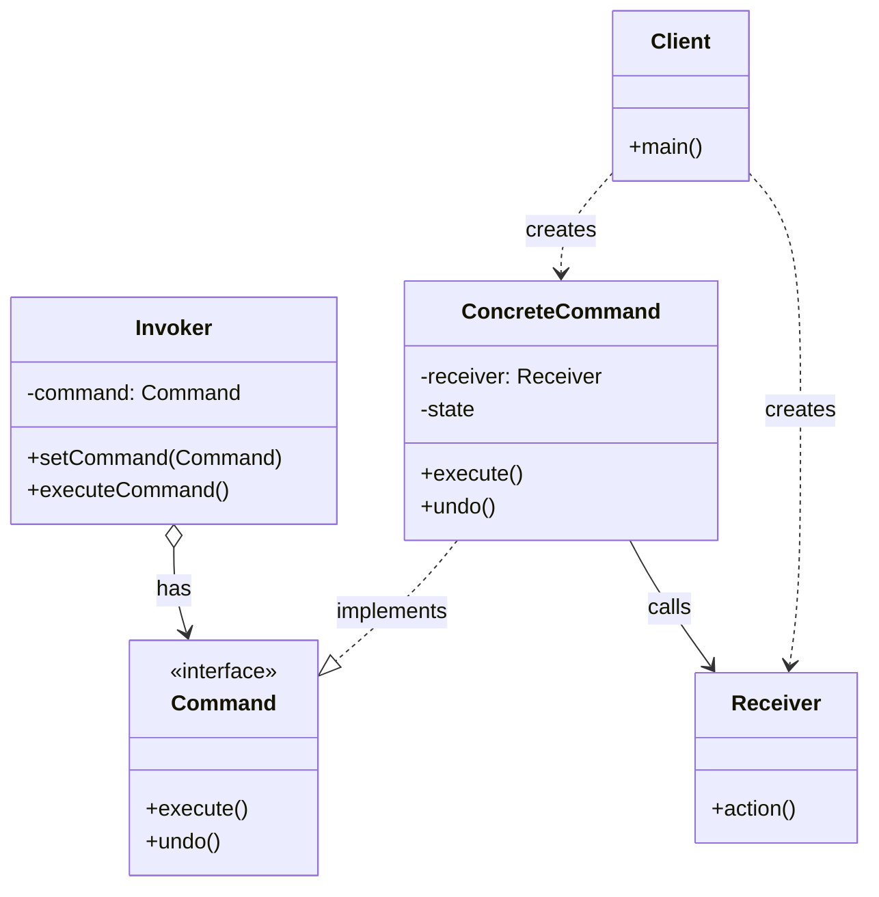
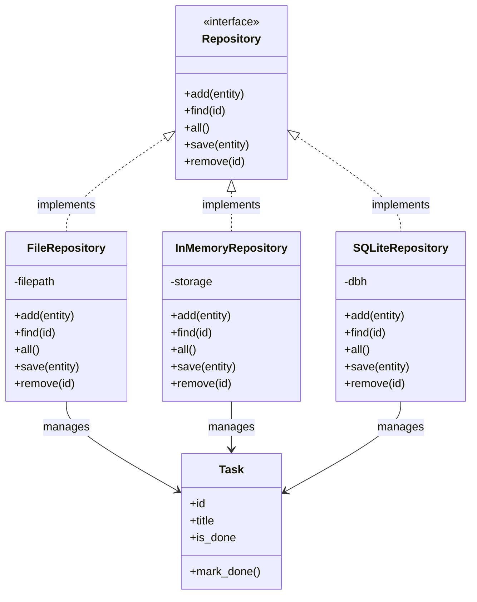
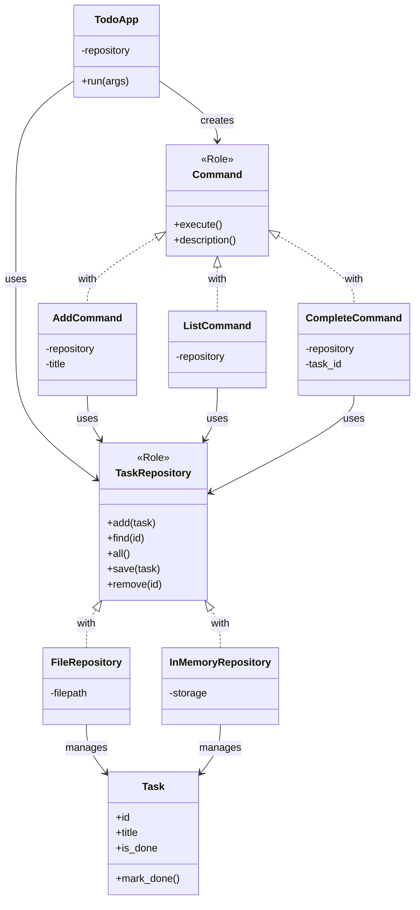

# シンプルなTodo CLIアプリ - 調査ドキュメント

## 調査概要

- **調査目的**: シリーズ記事「シンプルなTodo CLIアプリ」の作成に向けた調査・情報収集
- **調査実施日**: 2026年1月1日
- **テーマ**: シンプルなTodo CLIアプリ
- **技術スタック**: Perl
- **想定読者**: Perl入学式卒業程度、「Mooで覚えるオブジェクト指向プログラミング」シリーズ（全12回）を読了した方

---

## 1. Commandパターンの調査

### 1.1 定義と概要

**要点**:

- Commandパターンは、リクエスト（操作や命令）をオブジェクトとしてカプセル化する振る舞いパターンである
- リクエストの送信者（Invoker）と受信者（Receiver）を分離し、疎結合な設計を実現する
- コマンドをオブジェクト化することで、パラメータ化、キューイング、ログ記録、Undo/Redo機能などが実現可能になる

**根拠**:

- GoF「Design Patterns」書籍において、Commandパターンは「リクエストをオブジェクトとして扱い、異なるリクエストでクライアントをパラメータ化し、リクエストをキューに入れたり、ログに記録したり、操作の取り消しをサポートする」と定義されている

**出典**:

- Refactoring Guru: Command - https://refactoring.guru/design-patterns/command
- GeeksforGeeks: Command Design Pattern - https://www.geeksforgeeks.org/system-design/command-pattern/
- Wikipedia: Command pattern - https://en.wikipedia.org/wiki/Command_pattern

**信頼度**: 高（GoF原典および複数の信頼できる技術サイト）

---

### 1.2 構成要素

Commandパターンは、以下の5つの主要コンポーネントで構成される。



| 要素 | 役割 | Todo CLIでの具体例 |
|-----|------|------------------|
| **Command (インターフェース)** | コマンドの実行メソッド（execute）を宣言 | `Command::Role`（Moo::Role） |
| **ConcreteCommand** | Commandインターフェースを実装し、Receiverとアクションを結びつける | `Command::Add`, `Command::List`, `Command::Complete` |
| **Receiver** | 実際の処理を知っているオブジェクト | `TaskRepository` |
| **Invoker** | コマンドの実行を依頼するオブジェクト | CLIアプリのメインルーチン |
| **Client** | ConcreteCommandオブジェクトを生成し、設定 | コマンドライン引数の解析部分 |

**信頼度**: 高

---

### 1.3 メリット・デメリット

#### メリット

| 利点 | 説明 | Todo CLIでの効果 |
|-----|------|-----------------|
| **疎結合** | 送信者と受信者を分離 | CLIの引数解析とタスク操作ロジックを分離できる |
| **拡張性** | 新しいコマンドを追加しても既存コードへの影響が少ない | `Command::Delete`などを後から追加しやすい |
| **Undo/Redo** | 操作履歴を保存し元に戻すことが可能 | コマンド履歴の実装演習に適用可能 |
| **ログ記録** | 実行したコマンドを記録できる | 操作ログの実装が容易 |

#### デメリット

| 欠点 | 説明 | 対策 |
|-----|------|------|
| **クラス数の増加** | 各コマンドごとにクラスが必要 | 小規模アプリでは過剰にならないよう注意 |
| **複雑性の増加** | 単純な処理でも複数のクラスが関与 | 初心者向け記事では段階的に導入 |

**出典**:

- SourceMaking: Command Design Pattern - https://sourcemaking.com/design_patterns/command
- Alchemists: Command Pattern - https://www.alchemists.io/articles/command_pattern/

**信頼度**: 高

---

### 1.4 CLIツールでのCommandパターン活用例

**要点**:

CLIツールでのCommandパターンは、各サブコマンド（add, list, complete等）を独立したコマンドオブジェクトとして実装することで効果を発揮する。

**一般的な構造**:

1. コマンドライン引数を解析
2. 対応するConcreteCommandオブジェクトを生成
3. Invokerがexecute()を呼び出し

**典型的なCLIツールのサブコマンド構造**:

```
todo add "タスク名"     -> Command::Add->execute()
todo list              -> Command::List->execute()
todo complete 1        -> Command::Complete->execute()
```

**出典**:

- Moments Log: Using the Command Pattern in CLI - https://www.momentslog.com/development/design-pattern/using-the-command-pattern-in-command-line-interfaces-for-task-execution
- Optique Cookbook: CLI patterns - https://optique.dev/cookbook

**信頼度**: 高

---

### 1.5 Perlでの実装方法

**要点**:

PerlでCommandパターンを実装する場合、Moo::Roleを使ってCommandインターフェースを定義し、各ConcreteCommandクラスでロールを消費（`with`）する方法が推奨される。

**実装例**:

```perl
# Command Role（インターフェース相当）
package Command::Role {
    use Moo::Role;
    requires 'execute';
    requires 'description';
}

# ConcreteCommand: タスク追加
package Command::Add {
    use Moo;
    with 'Command::Role';

    has repository => (is => 'ro', required => 1);
    has title      => (is => 'ro', required => 1);

    sub execute {
        my $self = shift;
        my $task = Task->new(title => $self->title);
        $self->repository->add($task);
        print "タスクを追加しました: " . $self->title . "\n";
    }

    sub description { 'タスクを追加する' }
}

# ConcreteCommand: タスク一覧
package Command::List {
    use Moo;
    with 'Command::Role';

    has repository => (is => 'ro', required => 1);

    sub execute {
        my $self = shift;
        my @tasks = $self->repository->all;
        for my $task (@tasks) {
            my $status = $task->is_done ? '[x]' : '[ ]';
            printf "%d. %s %s\n", $task->id, $status, $task->title;
        }
    }

    sub description { 'タスク一覧を表示する' }
}

# ConcreteCommand: タスク完了
package Command::Complete {
    use Moo;
    with 'Command::Role';

    has repository => (is => 'ro', required => 1);
    has task_id    => (is => 'ro', required => 1);

    sub execute {
        my $self = shift;
        my $task = $self->repository->find($self->task_id);
        if ($task) {
            $task->mark_done;
            $self->repository->save($task);
            print "タスクを完了しました: " . $task->title . "\n";
        } else {
            print "タスクが見つかりません: ID " . $self->task_id . "\n";
        }
    }

    sub description { 'タスクを完了にする' }
}
```

**Perl Moo + Roleの利点**:

- `requires`で必須メソッドを宣言でき、実装漏れを防げる
- 継承ではなく合成で機能を追加できる（「Mooで覚えるオブジェクト指向プログラミング」第10回で学習済み）

**信頼度**: 高

---

## 2. Repositoryパターンの調査

### 2.1 定義と概要

**要点**:

- Repositoryパターンは、ドメインオブジェクト（ビジネスロジックを持つオブジェクト）とデータストレージ層の間に抽象層を設けるパターンである
- コレクションのようなインターフェースでドメインオブジェクトにアクセスできる
- データの取得・保存・削除のロジックを一箇所にカプセル化する

**根拠**:

- Martin Fowlerの「Patterns of Enterprise Application Architecture」で定義されたパターン
- ドメイン駆動設計（DDD）で重要な役割を果たす

**出典**:

- GeeksforGeeks: Repository Design Pattern - https://www.geeksforgeeks.org/system-design/repository-design-pattern/
- DeepWiki: Repository Pattern - https://deepwiki.com/domain-driven-design/ddd-microservices/5.1-repository-pattern

**信頼度**: 高

---

### 2.2 構成要素と構造



| 要素 | 役割 | Todo CLIでの具体例 |
|-----|------|------------------|
| **Repository (インターフェース)** | データアクセスの共通メソッドを宣言 | `TaskRepository::Role` |
| **ConcreteRepository** | 具体的なストレージへのアクセスを実装 | `FileRepository`, `InMemoryRepository`, `SQLiteRepository` |
| **Entity** | 管理対象のドメインオブジェクト | `Task` |

**信頼度**: 高

---

### 2.3 メリット・デメリット

#### メリット

| 利点 | 説明 | Todo CLIでの効果 |
|-----|------|-----------------|
| **永続化層の抽象化** | ストレージの詳細を隠蔽 | JSON→SQLiteへの切り替えがCommandクラスに影響しない |
| **テスト容易性** | InMemoryRepositoryでテスト可能 | 実際のファイルI/Oなしでテスト可能 |
| **単一責任の原則** | データアクセスロジックを分離 | Taskクラスはビジネスロジックに集中できる |
| **交換可能性** | 実装を切り替え可能 | 演習でJSON→SQLiteへの切り替えが容易 |

#### デメリット

| 欠点 | 説明 | 対策 |
|-----|------|------|
| **複雑性の増加** | 追加の抽象層が必要 | 小規模アプリでは過剰にならないよう注意 |
| **学習コスト** | パターンの理解が必要 | 段階的に導入し、利点を体感させる |

**出典**:

- GeeksforGeeks: Repository Design Pattern - https://www.geeksforgeeks.org/system-design/repository-design-pattern/

**信頼度**: 高

---

### 2.4 Perlでの実装方法

**要点**:

PerlでRepositoryパターンを実装する場合、Moo::Roleでインターフェースを定義し、各具象クラスで実装する。

**実装例**:

```perl
# Repository Role（インターフェース相当）
package TaskRepository::Role {
    use Moo::Role;
    requires 'add';
    requires 'find';
    requires 'all';
    requires 'save';
    requires 'remove';
}

# InMemory実装（テスト用）
package TaskRepository::InMemory {
    use Moo;
    with 'TaskRepository::Role';

    has storage => (is => 'rw', default => sub { {} });
    has next_id => (is => 'rw', default => 1);

    sub add {
        my ($self, $task) = @_;
        my $id = $self->next_id;
        $task->id($id);
        $self->storage->{$id} = $task;
        $self->next_id($id + 1);
        return $task;
    }

    sub find {
        my ($self, $id) = @_;
        return $self->storage->{$id};
    }

    sub all {
        my $self = shift;
        return values %{$self->storage};
    }

    sub save {
        my ($self, $task) = @_;
        $self->storage->{$task->id} = $task;
    }

    sub remove {
        my ($self, $id) = @_;
        delete $self->storage->{$id};
    }
}

# JSON File実装
package TaskRepository::File {
    use Moo;
    use JSON;
    with 'TaskRepository::Role';

    has filepath => (is => 'ro', default => 'tasks.json');

    sub _load {
        my $self = shift;
        return [] unless -f $self->filepath;
        open my $fh, '<:encoding(UTF-8)', $self->filepath or die $!;
        local $/;
        my $json = <$fh>;
        close $fh;
        return decode_json($json);
    }

    sub _save_all {
        my ($self, $data) = @_;
        open my $fh, '>:encoding(UTF-8)', $self->filepath or die $!;
        print $fh encode_json($data);
        close $fh;
    }

    sub add {
        my ($self, $task) = @_;
        my $data = $self->_load;
        my $max_id = 0;
        for my $item (@$data) {
            $max_id = $item->{id} if $item->{id} > $max_id;
        }
        $task->id($max_id + 1);
        push @$data, {
            id      => $task->id,
            title   => $task->title,
            is_done => $task->is_done ? 1 : 0,
        };
        $self->_save_all($data);
        return $task;
    }

    sub find {
        my ($self, $id) = @_;
        my $data = $self->_load;
        for my $item (@$data) {
            if ($item->{id} == $id) {
                return Task->new(%$item);
            }
        }
        return;
    }

    sub all {
        my $self = shift;
        my $data = $self->_load;
        return map { Task->new(%$_) } @$data;
    }

    sub save {
        my ($self, $task) = @_;
        my $data = $self->_load;
        for my $item (@$data) {
            if ($item->{id} == $task->id) {
                $item->{title}   = $task->title;
                $item->{is_done} = $task->is_done ? 1 : 0;
                last;
            }
        }
        $self->_save_all($data);
    }

    sub remove {
        my ($self, $id) = @_;
        my $data = $self->_load;
        @$data = grep { $_->{id} != $id } @$data;
        $self->_save_all($data);
    }
}
```

**信頼度**: 高

---

## 3. Todo CLIアプリの設計調査

### 3.1 典型的なTodo CLIアプリの機能

**要点**:

典型的なTodo CLIアプリは以下の機能を持つ。

| 機能 | コマンド例 | 説明 |
|-----|----------|------|
| タスク追加 | `todo add "買い物に行く"` | 新しいタスクを作成 |
| タスク一覧 | `todo list` | 全タスクを表示 |
| タスク完了 | `todo complete 1` | 指定IDのタスクを完了済みにする |
| タスク削除 | `todo delete 1` | 指定IDのタスクを削除（オプション） |
| ヘルプ表示 | `todo help` | 使用方法を表示 |

**Todo CLIアプリのクラス構成案**:



**信頼度**: 高

---

### 3.2 PerlでのCLI引数解析（Getopt::Long）

**要点**:

PerlでCLI引数を解析する標準的な方法は`Getopt::Long`モジュールを使用すること。

**基本的な使い方**:

```perl
use Getopt::Long;
use Pod::Usage;

my %opts = (
    verbose => 0,
);

GetOptions(
    'verbose|v' => \$opts{verbose},
    'help|h'    => sub { pod2usage(-verbose => 1) },
) or pod2usage(-verbose => 1);

# 残りの引数は @ARGV に残る
my $command = shift @ARGV // 'help';
my @args    = @ARGV;
```

**Todo CLIでの引数解析例**:

```perl
#!/usr/bin/env perl
use strict;
use warnings;
use Getopt::Long;

# サブコマンドを取得
my $command = shift @ARGV // 'help';

# サブコマンドに応じて処理を分岐
if ($command eq 'add') {
    my $title = shift @ARGV;
    die "タスク名を指定してください\n" unless $title;
    # Command::Add->new(title => $title, repository => $repo)->execute;
}
elsif ($command eq 'list') {
    # Command::List->new(repository => $repo)->execute;
}
elsif ($command eq 'complete') {
    my $id = shift @ARGV;
    die "タスクIDを指定してください\n" unless $id;
    # Command::Complete->new(task_id => $id, repository => $repo)->execute;
}
else {
    print "使い方: todo <command> [args]\n";
    print "  add <title>     タスクを追加\n";
    print "  list            タスク一覧を表示\n";
    print "  complete <id>   タスクを完了にする\n";
}
```

**ベストプラクティス**:

- 長いオプション名を使用し、自己文書化する（例: `--verbose` vs `-v`）
- ヘルプメッセージを必ず用意する
- エラーメッセージはSTDERRに出力する
- 入力値の検証を早期に行う

**出典**:

- perldoc: Getopt::Long - https://perldoc.perl.org/Getopt::Long
- Stack Overflow: What are the best-practices for implementing a CLI tool in Perl? - https://stackoverflow.com/questions/1183876/what-are-the-best-practices-for-implementing-a-cli-tool-in-perl
- Perl Maven: Advanced usage of Getopt::Long - https://perlmaven.com/advanced-usage-of-getopt-long-accepting-command-line-arguments

**信頼度**: 高

---

### 3.3 JSONファイルでのデータ永続化方法

**要点**:

PerlでJSONファイルを使ってデータを永続化する方法。

**使用モジュール**:

- `JSON` - 汎用的なJSONモジュール
- `JSON::MaybeXS` - 環境に応じて最速のJSONモジュールを選択
- `JSON::PP` - Pure Perl実装（Perl 5.14以降は標準搭載）

**基本的な読み書き**:

```perl
use JSON;

# 書き込み
sub save_to_json {
    my ($filepath, $data) = @_;
    open my $fh, '>:encoding(UTF-8)', $filepath or die $!;
    print $fh encode_json($data);
    close $fh;
}

# 読み込み
sub load_from_json {
    my ($filepath) = @_;
    return [] unless -f $filepath;
    open my $fh, '<:encoding(UTF-8)', $filepath or die $!;
    local $/;  # スラープモード
    my $json = <$fh>;
    close $fh;
    return decode_json($json);
}
```

**JSON形式のタスクデータ例**:

```json
[
  { "id": 1, "title": "買い物に行く", "is_done": false },
  { "id": 2, "title": "レポートを書く", "is_done": true },
  { "id": 3, "title": "Perlの勉強", "is_done": false }
]
```

**出典**:

- Perl Maven: JSON in Perl - https://perlmaven.com/json
- TheLinuxCode: Using JSON for Effective Data Interchange in Perl - https://thelinuxcode.com/json-with-perl/

**信頼度**: 高

---

### 3.4 SQLiteでのデータ永続化（演習用）

**要点**:

JSON→SQLiteへの切り替え演習のための情報。

**使用モジュール**:

- `DBI` - Perlのデータベースインターフェース
- `DBD::SQLite` - SQLite用ドライバ

**基本的なCRUD操作**:

```perl
use DBI;

# 接続
my $dbh = DBI->connect("dbi:SQLite:dbname=tasks.db", "", "", {
    PrintError => 0,
    RaiseError => 1,
    AutoCommit => 1,
}) or die $DBI::errstr;

# テーブル作成
$dbh->do(q{
    CREATE TABLE IF NOT EXISTS tasks (
        id INTEGER PRIMARY KEY AUTOINCREMENT,
        title TEXT NOT NULL,
        is_done INTEGER DEFAULT 0
    )
});

# INSERT
$dbh->do("INSERT INTO tasks (title) VALUES (?)", undef, "新しいタスク");

# SELECT
my $sth = $dbh->prepare("SELECT id, title, is_done FROM tasks");
$sth->execute();
while (my @row = $sth->fetchrow_array) {
    print "ID:$row[0] Title:$row[1] Done:$row[2]\n";
}

# UPDATE
$dbh->do("UPDATE tasks SET is_done = 1 WHERE id = ?", undef, 1);

# DELETE
$dbh->do("DELETE FROM tasks WHERE id = ?", undef, 1);

$dbh->disconnect;
```

**出典**:

- Perl Maven: Simple Database access using Perl DBI and SQL - https://perlmaven.com/simple-database-access-using-perl-dbi-and-sql
- TutorialsPoint: SQLite - Perl - https://www.tutorialspoint.com/sqlite/sqlite_perl.htm
- MetaCPAN: DBD::SQLite - https://metacpan.org/pod/DBD::SQLite

**信頼度**: 高

---

## 4. 内部リンク調査

### 4.1 「Mooで覚えるオブジェクト指向プログラミング」シリーズ（全12回）

本シリーズ記事の前提知識となる既存記事。

| 回 | タイトル | 内部リンク | 関連する概念 |
|:--|:--|:--|:--|
| 第1回 | Mooで覚えるオブジェクト指向プログラミング | `/2021/10/31/191008/` | オブジェクト、クラス、プロパティ、メソッド |
| 第2回 | データとロジックをまとめよう | `/2025/12/30/163810/` | `has`、`sub` |
| 第3回 | 同じものを何度も作れるように | `/2025/12/30/163811/` | `new`（コンストラクタ） |
| 第4回 | 勝手に書き換えられないようにする | `/2025/12/30/163812/` | `is => 'ro'`、`is => 'rw'` |
| 第5回 | 初期化忘れを防ぐ | `/2025/12/30/163813/` | `required`、`default` |
| 第6回 | 内部実装を外から触らせない | `/2025/12/30/163814/` | カプセル化 |
| 第7回 | 関連するデータを別のクラスに | `/2025/12/30/163815/` | オブジェクトの関連 |
| 第8回 | 似ているクラスの重複をなくす | `/2025/12/30/163816/` | `extends`（継承） |
| 第9回 | 同じ名前で違う動作を | `/2025/12/30/163817/` | オーバーライド |
| 第10回 | 継承しないで振る舞いを共有 | `/2025/12/30/163818/` | `Moo::Role`、`with` |
| 第11回 | 「持っている」ものに仕事を任せる | `/2025/12/30/163819/` | `handles`（委譲） |
| 第12回 | 型チェックでバグを未然に防ぐ | `/2025/12/30/163820/` | `isa`（型制約） |

**特に重要な関連**:

- **第10回（Moo::Role）**: Commandパターン・Repositoryパターンのインターフェース定義で使用
- **第7回（オブジェクトの関連）**: CommandクラスがRepositoryを持つ関係
- **第4回・第5回（ro/rw、required）**: Taskクラスの属性定義で使用

---

### 4.2 「Mooを使ってディスパッチャーを作ってみよう」シリーズ

関連するデザインパターン（Strategyパターン）を扱うシリーズ。

| 回 | タイトル | 内部リンク | 関連度 |
|:--|:--|:--|:--|
| 第12回 | これがデザインパターンだ！ | `/2026/01/03/001541/` | 高（Strategyパターン解説） |
| 第5回 | 共通の約束を決めよう | `/2026/01/03/001534/` | 高（Roleによるインターフェース） |

---

### 4.3 デザインパターン関連記事

| ファイルパス | 内部リンク | 内容 | 関連度 |
|-------------|-----------|------|--------|
| デザインパターン概要調査 | `content/warehouse/design-patterns-research.md` | GoF 23パターン概要 | 中 |
| Commandパターン調査 | `content/warehouse/command-pattern.md` | Commandパターン詳細調査 | 高 |

---

## 5. 重要な参考文献・リソースリスト

### 5.1 必読リソース

#### 書籍

| 書籍名 | 著者 | ASIN/ISBN | 重要度 |
|-------|------|-----------|--------|
| Design Patterns: Elements of Reusable Object-Oriented Software | GoF | 978-0201633610 | 必須 |
| Head First Design Patterns (2nd Edition) | Eric Freeman, Elisabeth Robson | 978-1492078005 | 推奨 |

#### Webリソース

| リソース名 | URL | 特徴 | 信頼度 |
|-----------|-----|------|--------|
| Refactoring Guru - Command | https://refactoring.guru/design-patterns/command | 視覚的な図解、多言語コード例 | 高 |
| GeeksforGeeks - Command Pattern | https://www.geeksforgeeks.org/system-design/command-pattern/ | 網羅的な解説 | 高 |
| GeeksforGeeks - Repository Pattern | https://www.geeksforgeeks.org/system-design/repository-design-pattern/ | 永続化パターン解説 | 高 |
| perldoc - Getopt::Long | https://perldoc.perl.org/Getopt::Long | Perl公式ドキュメント | 高 |
| Perl Maven - JSON in Perl | https://perlmaven.com/json | Perl JSON操作ガイド | 高 |
| MetaCPAN - DBI | https://metacpan.org/pod/DBI | Perl DBI公式 | 高 |
| MetaCPAN - DBD::SQLite | https://metacpan.org/pod/DBD::SQLite | SQLiteドライバ公式 | 高 |

---

## 6. 調査結果のサマリー

### 6.1 主要な発見

1. **Commandパターンの適用性**: CLIツールの各サブコマンドをCommandオブジェクトとして実装することで、拡張性と保守性が向上する。「Mooで覚えるオブジェクト指向プログラミング」第10回で学んだMoo::Roleを使ってインターフェースを定義できる

2. **Repositoryパターンの有用性**: 永続化層を抽象化することで、JSON→SQLiteへの切り替えがドメインロジックに影響を与えずに実現できる。これは演習題材として最適

3. **前提知識との連携**: 「Mooで覚えるオブジェクト指向プログラミング」シリーズで学んだ概念（Moo::Role、has、required、isaなど）を実践的に活用できる

4. **Perlでの実装**: Getopt::Longでの引数解析、JSONモジュールでのファイル永続化、DBI+DBD::SQLiteでのDB永続化は、いずれも成熟したエコシステムが存在する

---

**調査完了日**: 2026年1月1日  
**調査者**: 調査・情報収集エージェント
