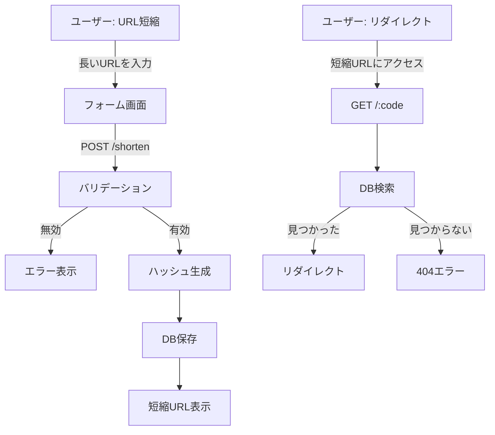

# 調査ドキュメント：URL短縮サポーターを作ってみよう

## 調査目的

シリーズ記事「URL短縮サポーターを作ってみよう」を作成するための情報収集と調査。

- **技術スタック**: Perl、DBI、DBD::SQLite、Mojolicious、Digest::SHA
- **想定読者**: Perl入学式卒業程度、「Mooで覚えるオブジェクト指向プログラミング」シリーズ（全12回）を読了
- **ゴール**:
  - Webアプリケーションのルーティングの仕組みが理解できる
  - データベース操作の理解が深まる
  - 自然に覚えるデザインパターン
- **制約**:
  - コード例は1記事あたり2つまで
  - 新しい概念は1記事あたり1つまで

**調査実施日**: 2025年12月31日

---

## 1. キーワード調査

### 1.1 Perl URL短縮

**要点**:

- PerlでURL短縮サービスを実装するには、Mojolicious（またはCGI）、DBI、DBD::SQLiteを組み合わせる
- 短縮URLの生成方法として、Base62エンコーディングやハッシュ関数（SHA-1/SHA-256）の先頭数文字を使用するのが一般的
- 基本的な処理フロー:
  1. 長いURLを受け取る
  2. 一意の短縮コードを生成する
  3. URLと短縮コードをデータベースに保存する
  4. 短縮URLにアクセスされたら元のURLへリダイレクトする

**根拠**:

- URL短縮サービスの基本的なアーキテクチャは言語に依存しない
- Perlの既存モジュール（DBI、DBD::SQLite、Digest::SHA）で必要な機能がすべて揃う

**出典**:

- https://perlmaven.com/simple-database-access-using-perl-dbi-and-sql (Perl Maven - DBI チュートリアル)
- https://metacpan.org/pod/DBD::SQLite (DBD::SQLite 公式ドキュメント)
- https://www.tutorialspoint.com/sqlite/sqlite_perl.htm (TutorialsPoint - SQLite Perl)

**信頼度**: 高（公式ドキュメントおよび著名なチュートリアルサイト）

---

### 1.2 DBI DBD::SQLite Perl

**要点**:

- DBIはPerlの標準的なデータベースインターフェース
- DBD::SQLiteはSQLiteをPerlから使用するためのドライバ
- SQLiteは単一ファイルで動作するRDBMSで、学習用途に最適
- 基本的なCRUD操作:
  - `connect` でデータベースに接続
  - `prepare` + `execute` でSQL文を実行
  - `fetchrow_array`/`fetchrow_hashref` で結果を取得
  - プレースホルダ（`?`）でSQLインジェクション対策

**根拠**:

- DBI/DBD::SQLiteはCPANの中でも最も安定したモジュール群の一つ
- SQLiteは設定不要で初心者にも扱いやすい

**仮定**:

- 想定読者はデータベースの基本概念（テーブル、行、列）は知っている可能性がある
- SQL文の基本（SELECT, INSERT）は解説が必要

**出典**:

- https://metacpan.org/pod/DBI (DBI 公式ドキュメント)
- https://metacpan.org/pod/DBD::SQLite (DBD::SQLite 公式ドキュメント)
- https://dbi.perl.org/docs/ (DBI公式サイト)
- https://www.geeksforgeeks.org/perl/perl-database-management-using-dbi/ (GeeksforGeeks - Perl DBI)
- https://github.com/DBD-SQLite/DBD-SQLite (DBD::SQLite GitHubリポジトリ)

**信頼度**: 高

---

### 1.3 ハッシュ関数 短縮URL

**要点**:

- 短縮URLのコード生成には主に2つのアプローチがある:
  1. **ハッシュ関数**: SHA-1/SHA-256でハッシュを生成し、先頭の数文字を使用
  2. **Base62エンコーディング**: データベースの連番IDをBase62（0-9, A-Z, a-z）に変換
- ハッシュ関数を使う場合、衝突（collision）のチェックが必要
- Base62は62種類の文字を使用するため、短い文字列で大量のURLを表現可能

**根拠**:

- ハッシュ関数は固定長の出力を生成するため、予測可能な長さのコードになる
- Base62は6文字で約568億（62^6）の組み合わせが可能

**仮定**:

- 学習用途では衝突の可能性は低いが、対策方法は説明が必要
- 初心者にはBase62変換のロジックは新しい概念

**出典**:

- https://perldoc.perl.org/Digest::SHA (Digest::SHA 公式ドキュメント)
- https://perldoc.perl.org/Digest (Digest モジュール 公式ドキュメント)
- https://stackoverflow.com/questions/9991757/sha256-digest-in-perl (Stack Overflow - PerlでのSHA256)

**信頼度**: 高

---

### 1.4 Mojolicious ルーティング

**要点**:

- Mojoliciousは依存関係ゼロのモダンなPerlフレームワーク
- Mojolicious::Liteで単一ファイルでWebアプリを作成可能
- ルーティングの基本:
  - `get '/' => sub { ... }` でGETリクエストを処理
  - `post '/shorten' => sub { ... }` でPOSTリクエストを処理
  - プレースホルダで動的なURLパスをキャプチャ: `get '/:code' => sub { ... }`
- リダイレクトは `$c->redirect_to($url)` で実装

**根拠**:

- Mojolicious公式ドキュメント
- 2024年5月公開のチュートリアル記事「Mastering Mojolicious Routing for Beginners」（blog.poespas.me）

**仮定**:

- 想定読者は「Mooで覚えるオブジェクト指向プログラミング」を読了しており、Mooの基本は理解している
- HTTPの基本（GET、POST、リダイレクト）は解説が必要

**出典**:

- https://mojolicious.org/perldoc/Mojolicious/Guides/Routing (Mojolicious ルーティングガイド)
- https://docs.mojolicious.org/Mojolicious/Guides/Tutorial (Mojolicious チュートリアル)
- https://metacpan.org/dist/Mojolicious/view/lib/Mojolicious/Guides/Tutorial.pod (MetaCPAN)
- https://blog.poespas.me/posts/2024/05/19/mojolicious-routing-for-beginners/ (2024年の初心者向けチュートリアル)
- https://en.mojolicious.perlzemi.com/ (Perlzemi Mojoliciousチュートリアル)

**信頼度**: 高

---

### 1.5 PerlでのWebアプリケーション開発

**要点**:

- Mojolicious::Liteは学習用途に最適な選択
- 開発サーバー（morbo）でホットリロードが可能
- 本番環境ではhypnotoad（組み込みサーバー）やPlackを使用
- テンプレート（埋め込みPerlテンプレート）でHTMLを生成

**根拠**:

- 想定読者のレベルを考慮し、フルスタックのMojoliciousよりもMojolicious::Liteを推奨

**出典**:

- https://mojolicious.org/ (Mojolicious 公式サイト)
- https://github.com/h4techbuddy/perl_n_mojolicous (GitHubサンプルリポジトリ ※リポジトリ名のスペルは原文のまま)

**信頼度**: 高

---

### 1.6 Digest::SHA Perl

**要点**:

- Digest::SHAはPerl標準ライブラリに含まれるハッシュモジュール
- SHA-1、SHA-224、SHA-256、SHA-384、SHA-512をサポート
- 関数的インターフェースとOOインターフェースの両方を提供
- 出力形式: raw（バイナリ）、hex（16進数）、base64

```perl
use Digest::SHA qw(sha1_hex);
my $hash = sha1_hex($url);  # 40文字の16進数文字列
my $short_code = substr($hash, 0, 6);  # 先頭6文字を使用
```

**根拠**:

- Digest::SHAはPerl 5.9.3以降のコアモジュール
- URL短縮では完全なハッシュ値は必要なく、先頭数文字で十分

**仮定**:

- 想定読者にはハッシュ関数の概念の説明が必要
- 暗号学的ハッシュと一般的なハッシュの違いについては深入りしない

**出典**:

- https://perldoc.perl.org/Digest::SHA (公式ドキュメント)
- https://perlwatch.net/perldocs/Digest/SHA.html (Perl Watch)

**信頼度**: 高

---

### 1.7 URL バリデーション Perl

**要点**:

- URLのバリデーション方法は3つ:
  1. **正規表現**: シンプルだがエッジケースに弱い
  2. **URIモジュール**: 標準的でRFC準拠、URLのパースと構成要素の取得が可能
  3. **Data::Validate::URI**: 実用的なバリデーション専用モジュール

- 推奨は `Data::Validate::URI` または `URI` モジュール:

```perl
use Data::Validate::URI qw(is_http_uri);
if (is_http_uri($url)) {
    # 有効なHTTP URL
}

# または
use URI;
my $uri = URI->new($url);
if ($uri->scheme && $uri->host) {
    # 有効なURL
}
```

**根拠**:

- 正規表現だけではRFCに準拠した厳密なバリデーションが困難
- セキュリティ上、ユーザー入力のURLは必ずバリデーションが必要

**仮定**:

- 学習用途ではシンプルなバリデーションから始め、段階的に厳密にする

**出典**:

- https://metacpan.org/pod/Data::Validate::URI (CPAN)
- https://perldoc.perl.org/URI (URI 公式ドキュメント)
- https://www.perlmonks.org/?node_id=796405 (PerlMonks)
- https://manpages.debian.org/testing/libdata-validate-uri-perl/Data::Validate::URI.3pm.en.html (Debian manpages)

**信頼度**: 高

---

## 2. 競合記事の分析

### 2.1 既存のURL短縮サービスの技術的な実装記事

**日本語記事**:

| タイトル | 技術スタック | 特徴 | URL |
|---------|-------------|------|-----|
| URL短縮ってあれどうやってるの？ | Python | Base62変換の解説 | https://qiita.com/ouQVZUDx/items/ede7e054d6e1477b00d0 |
| Fiber + Redis で URL Shortenerを実装 | Go | Redis使用、実践的 | https://zenn.dev/fuuji/articles/5e148160d40698 |
| URL短縮サービスの仕組みをわかりやすく解説 | 概念解説 | 仕組みの説明中心 | https://ourl.jp/how-does-it-work/ |

**英語記事（システム設計）**:

| タイトル | 特徴 | URL |
|---------|------|-----|
| Designing URL Shortener Systems | アーキテクチャ全般 | https://dev.to/sgchris/designing-url-shortener-systems-from-tinyurl-to-bitly-scale-1ip5 |
| URL Shortener System Design | 面接対策向け | https://grokkingthesystemdesign.com/guides/url-shortener-system-design/ |
| GeeksforGeeks System Design | 図解あり | https://www.geeksforgeeks.org/system-design/system-design-url-shortening-service/ |

**分析結果**:

- 日本語のPerl向けURL短縮チュートリアルは見当たらない（差別化ポイント）
- 多くの記事がシステム設計の観点で書かれており、初心者向けではない
- Go、Python、Node.jsの記事は多いがPerlは少ない

**信頼度**: 中〜高（複数の情報源から確認）

---

### 2.2 差別化ポイント

| 観点 | 既存記事 | 本シリーズ |
|------|---------|-----------|
| 対象読者 | 中〜上級者 | 初心者（Perl入学式卒業程度） |
| 言語 | Python, Go, Node.js | Perl |
| フレームワーク | Flask, Fiber, Express | Mojolicious::Lite |
| 学習スタイル | 完成品を見せる | 段階的に概念を積み上げる |
| 前提知識 | OOP理解者 | Mooシリーズ読了者 |
| コード量 | 一気に大量のコード | 1記事2つまで |

**本シリーズの独自性**:

1. **日本語でPerlのURL短縮チュートリアル**: 競合がほぼ存在しない
2. **段階的学習**: 1記事1概念の原則で無理なく学べる
3. **Mooシリーズとの連携**: オブジェクト指向の知識を実践で活用
4. **デザインパターンの自然な導入**: 意識せずにパターンを学ぶ

---

## 3. 内部リンク調査

`/content/post` 配下の関連記事を `grep` で調査した結果:

### 3.1 Mojolicious関連記事

| ファイルパス | 内部リンク | 概要 |
|-------------|-----------|------|
| `/content/post/2025/12/04/000000.md` | `/2025/12/04/000000/` | Mojolicious入門 — Mojolicious::Liteで始めるPerlのWeb開発 |
| `/content/post/2015/02/03/073828.md` | `/2015/02/03/073828/` | Mojolicious::Liteでルーティングしてみる |
| `/content/post/2015/02/04/075756.md` | `/2015/02/04/075756/` | Mojolicious::Liteでパラメータを読み取る |
| `/content/post/2015/02/02/075435.md` | `/2015/02/02/075435/` | Perl入学式補講（Mojolicious関連） |
| `/content/post/2015/02/05/085040.md` | `/2015/02/05/085040/` | Perl入学式補講 |
| `/content/post/2015/02/12/081257.md` | `/2015/02/12/081257/` | Perl入学式補講 |
| `/content/post/2011/01/02/205559.md` | `/2011/01/02/205559/` | 初期のMojolicious記事 |
| `/content/post/2011/01/03/041042.md` | `/2011/01/03/041042/` | 初期のMojolicious記事 |
| `/content/post/2011/01/04/232046.md` | `/2011/01/04/232046/` | 初期のMojolicious記事 |
| `/content/post/2011/01/10/014314.md` | `/2011/01/10/014314/` | 初期のMojolicious記事 |

**推奨リンク**: `/2025/12/04/000000/`（最新のMojolicious入門記事）

---

### 3.2 DBI/DBIx/SQLite関連記事

| ファイルパス | 内部リンク | 概要 |
|-------------|-----------|------|
| `/content/post/2009/02/22/001127.md` | `/2009/02/22/001127/` | DBI関連 |
| `/content/post/2009/01/15/234943.md` | `/2009/01/15/234943/` | DBI関連 |
| `/content/post/2010/02/14/213041.md` | `/2010/02/14/213041/` | SQLite関連 |
| `/content/post/2010/02/24/093546.md` | `/2010/02/24/093546/` | SQLite関連 |
| `/content/post/2025/12/14/000000.md` | `/2025/12/14/000000/` | 最新のSQLite関連記事 |
| `/content/post/2025/12/22/000000.md` | `/2025/12/22/000000/` | 最新のDBI/SQLite関連記事 |

---

### 3.3 Moo関連記事（前提シリーズ）

| ファイルパス | 内部リンク | 概要 |
|-------------|-----------|------|
| `/content/post/2021/10/31/191008.md` | `/2021/10/31/191008/` | 第1回-Mooで覚えるオブジェクト指向プログラミング |
| `/content/post/2025/12/30/163810.md` | `/2025/12/30/163810/` | 第2回-データとロジックをまとめよう |
| `/content/post/2025/12/30/163811.md` | `/2025/12/30/163811/` | Mooシリーズ |
| `/content/post/2025/12/30/163812.md` | `/2025/12/30/163812/` | Mooシリーズ |
| `/content/post/2025/12/30/163813.md` | `/2025/12/30/163813/` | Mooシリーズ |
| `/content/post/2025/12/30/163814.md` | `/2025/12/30/163814/` | Mooシリーズ |
| `/content/post/2025/12/30/163815.md` | `/2025/12/30/163815/` | Mooシリーズ |
| ... | ... | 全12回 |

**推奨リンク**: `/2021/10/31/191008/`（Mooシリーズ第1回）

---

### 3.4 Perl入学式関連記事

| ファイルパス | 内部リンク | 概要 |
|-------------|-----------|------|
| `/content/post/2015/02/02/075435.md` | `/2015/02/02/075435/` | Perl入学式補講 |
| `/content/post/2014/12/14/145155.md` | `/2014/12/14/145155/` | Perl入学式 |
| `/content/post/2013/06/17/083000.md` | `/2013/06/17/083000/` | Perl入学式 |

---

### 3.5 ハッシュ/Digest関連記事

| ファイルパス | 内部リンク | 概要 |
|-------------|-----------|------|
| `/content/post/2000/10/07/134340.md` | `/2000/10/07/134340/` | ハッシュ関連 |
| `/content/post/2010/02/24/093546.md` | `/2010/02/24/093546/` | ハッシュ/Digest関連 |
| `/content/post/2025/12/12/214754.md` | `/2025/12/12/214754/` | Digest::SHA関連 |

---

### 3.6 ルーティング関連記事

| ファイルパス | 内部リンク | 概要 |
|-------------|-----------|------|
| `/content/post/2015/02/03/073828.md` | `/2015/02/03/073828/` | Mojolicious::Liteでルーティングしてみる |
| `/content/post/2015/02/04/075756.md` | `/2015/02/04/075756/` | パラメータ読み取り |
| `/content/post/2025/12/04/000000.md` | `/2025/12/04/000000/` | Mojolicious入門（ルーティング含む） |
| `/content/post/2025/12/30/164009.md` | `/2025/12/30/164009/` | ディスパッチャー（ルーティング類似概念） |
| `/content/post/2025/12/30/164010.md` | `/2025/12/30/164010/` | ディスパッチャー |
| `/content/post/2025/12/30/164011.md` | `/2025/12/30/164011/` | ディスパッチャー |
| `/content/post/2025/12/30/164012.md` | `/2025/12/30/164012/` | ディスパッチャー |

---

## 4. 技術的正確性を担保するための情報源リスト

### 4.1 公式ドキュメント（最優先）

| モジュール/技術 | URL | 用途 |
|----------------|-----|------|
| DBI | https://metacpan.org/pod/DBI | データベース操作 |
| DBD::SQLite | https://metacpan.org/pod/DBD::SQLite | SQLite接続 |
| Mojolicious | https://mojolicious.org/ | Webフレームワーク |
| Mojolicious::Guides::Routing | https://mojolicious.org/perldoc/Mojolicious/Guides/Routing | ルーティング |
| Mojolicious::Guides::Tutorial | https://docs.mojolicious.org/Mojolicious/Guides/Tutorial | チュートリアル |
| Digest::SHA | https://perldoc.perl.org/Digest::SHA | ハッシュ関数 |
| URI | https://perldoc.perl.org/URI | URLパース |
| Data::Validate::URI | https://metacpan.org/pod/Data::Validate::URI | URLバリデーション |
| Moo | https://metacpan.org/pod/Moo | オブジェクト指向 |

### 4.2 信頼性の高いチュートリアルサイト

| サイト名 | URL | 特徴 |
|---------|-----|------|
| Perl Maven | https://perlmaven.com/ | 実践的なチュートリアル |
| Perlzemi | https://en.mojolicious.perlzemi.com/ | Mojolicious専門 |
| Perl.org Documentation | https://perldoc.perl.org/ | 公式ドキュメント |
| DBI Official | https://dbi.perl.org/docs/ | DBI公式 |

### 4.3 書籍（ASIN付き）

| 書籍名 | ASIN | 用途 |
|-------|------|------|
| Perl入門 | B075LHVV1X | 基礎復習 |
| Learning Perl (7th Edition) | 1491954329 | 英語だがPerl全般 |
| Modern Perl | B007Y42MB2 | モダンPerl |

### 4.4 GitHubリポジトリ

| リポジトリ | URL | 用途 |
|-----------|-----|------|
| DBD-SQLite | https://github.com/DBD-SQLite/DBD-SQLite | SQLiteドライバ |
| Mojolicious | https://github.com/mojolicious/mojo | フレームワーク |
| perl_n_mojolicous | https://github.com/h4techbuddy/perl_n_mojolicous | サンプル集（※リポジトリ名のスペルは原文のまま） |

---

## 5. 連載構造の提案材料

### 5.1 URL短縮サービスの構成要素



### 5.2 段階的な学習パス

| フェーズ | 内容 | 学ぶ概念 |
|---------|------|---------|
| 1. 環境構築 | Mojolicious::Lite、SQLite | 開発環境 |
| 2. 基本ルーティング | GET/POSTの処理 | ルーティング |
| 3. データベース接続 | DBI/DBD::SQLite | DB接続 |
| 4. テーブル設計 | CREATE TABLE | データモデル |
| 5. ハッシュ生成 | Digest::SHA | ハッシュ関数 |
| 6. URL保存 | INSERT文 | DB書き込み |
| 7. URL取得 | SELECT文 | DB読み取り |
| 8. リダイレクト | redirect_to | HTTPリダイレクト |
| 9. バリデーション | Data::Validate::URI | 入力検証 |
| 10. エラー処理 | 404、500 | 例外処理 |
| 11. テンプレート | EPテンプレート | 表示 |
| 12. 仕上げ | リファクタリング | 設計改善 |

### 5.3 各回で扱うべき概念の整理

| 回 | 新しい概念 | 前提知識 |
|----|-----------|---------|
| 1 | Mojolicious::Lite導入 | Perl基礎、Moo |
| 2 | ルーティング（GET） | 回1 |
| 3 | ルーティング（POST） | 回2 |
| 4 | DBI接続 | 回3 |
| 5 | CREATE TABLE | 回4 |
| 6 | ハッシュ関数（Digest::SHA） | 回5 |
| 7 | INSERT文 | 回6 |
| 8 | SELECT文 | 回7 |
| 9 | リダイレクト | 回8 |
| 10 | バリデーション | 回9 |
| 11 | エラーハンドリング | 回10 |
| 12 | テンプレートと仕上げ | 回11 |

### 5.4 デザインパターンとの関連

| 回 | 自然に学べるパターン | 説明 |
|----|---------------------|------|
| 1-3 | Router/Dispatcher | URLパスとハンドラのマッピング |
| 4-5 | Repository | データアクセスの抽象化 |
| 6 | Strategy | ハッシュ生成アルゴリズムの切り替え |
| 7-8 | DAO (Data Access Object) | DB操作の分離 |
| 10 | Validator | 入力検証の分離 |
| 11 | Template Method | テンプレート処理 |

---

## 6. 調査結果サマリー

### 6.1 本シリーズの特徴

- **唯一のPerl日本語URL短縮チュートリアル**: 競合がほぼ存在しない
- **段階的学習**: 1記事1概念で無理なく学べる
- **実践的**: 動くアプリケーションを作りながら学ぶ
- **Mooシリーズとの連携**: オブジェクト指向の知識を活用

### 6.2 技術スタックの妥当性

| 技術 | 選定理由 | 代替案 |
|------|---------|-------|
| Mojolicious::Lite | 依存関係ゼロ、学習コスト低 | Dancer2 |
| DBD::SQLite | 設定不要、単一ファイル | MySQL, PostgreSQL |
| Digest::SHA | コアモジュール | Digest::MD5 |
| Data::Validate::URI | 実用的なバリデーション | URI + 正規表現 |

### 6.3 推奨する連載回数

- **全12回**（Mooシリーズと同じ構成）
- 各回15分程度で読める分量
- 1つの完成したWebアプリケーションが完成

### 6.4 今後のアクション

1. 連載構造案の作成（3案）
2. SEOレビュー
3. 各回のアウトライン作成
4. 記事執筆開始

---

## 付録: 参考にした検索キーワードと結果

| 検索キーワード | 検索エンジン | 主な発見 |
|--------------|-------------|---------|
| Perl URL shortener implementation tutorial DBI SQLite | Bing (web_search) | DBI/SQLiteの基本的な使い方、CGI/Mojoliciousでの実装例を確認。PerlでのURL短縮チュートリアルは少ない |
| Mojolicious routing tutorial Perl web application 2024 | Bing (web_search) | 2024年時点でも活発な開発継続中、公式ドキュメントが充実、日本語チュートリアルも存在 |
| Digest::SHA Perl hash function short URL generation base62 | Bing (web_search) | Base62エンコーディングの実装例、SHA-1の先頭数バイトを使う手法を確認 |
| URL validation Perl regex URI module Data::Validate::URI | Bing (web_search) | 3つのアプローチ（正規表現、URI、Data::Validate::URI）の比較情報を取得 |
| 短縮URL サービス 実装 仕組み 技術解説 | Bing (web_search) | 日本語の技術解説記事を発見。Base62変換、Redis連携の実装例 |
| URL shortener design patterns architecture strategy factory pattern | Bing (web_search) | システム設計の観点からの記事が多数。Strategy/Factoryパターンの適用例 |

**注**: リポジトリ内部リンク調査は `grep` コマンドで実施
